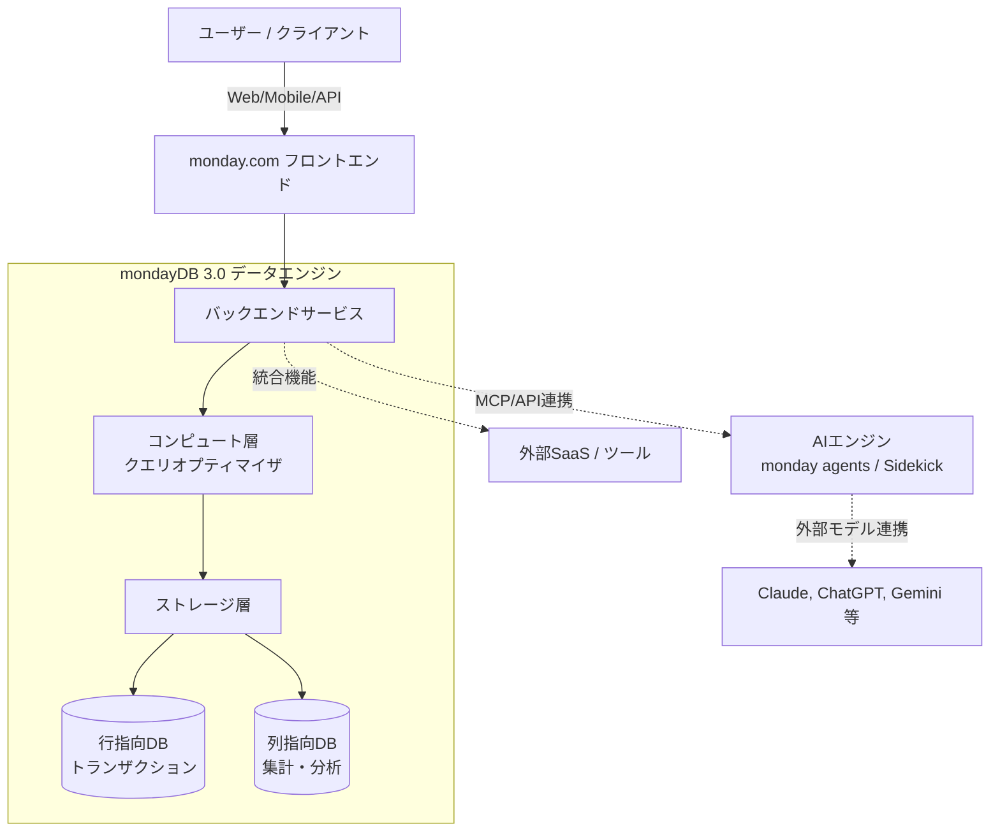

# **monday.com 調査レポート**

## **1. 基本情報**

* **ツール名**: monday.com
* **ツールの読み方**: マンデードットコム
* **開発元**: monday.com Ltd.
* **公式サイト**: [https://monday.com/](https://monday.com/)
* **関連リンク**:
  * ドキュメント: [https://support.monday.com/hc/en-us](https://support.monday.com/hc/en-us)
  * レビューサイト: [ITreview](https://www.itreview.jp/products/monday-com/reviews)
* **カテゴリ**: プロジェクト管理
* **概要**: 人とAIエージェントが共に働き、あらゆる業務（プロジェクト管理、CRM、ソフトウェア開発など）を一つのプラットフォームで一元管理できる柔軟なワークプラットフォーム。mondayDBを基盤とした高いパフォーマンスとカスタマイズ性を誇る。

## **2. 目的と主な利用シーン**

* **解決する課題**: チーム間のサイロ化、非効率な手作業、データ分散、ツール乱立による生産性低下。
* **想定利用者**: プロジェクトマネージャー、マーケティング、営業、IT/運用、人事、プロダクト開発などすべての部門。
* **利用シーン**:
  * 全社のプロジェクトやタスクの進捗、リソースの可視化と管理。
  * AIエージェントを用いたリードのスコアリング、顧客対応、チケット管理の自動化。
  * CRMやソフトウェア開発など、特定業務に特化した専用ソリューションとしての利用。

## **3. 主要機能**

* **フレキシブルなワークスペース**: ボード、ビュー（カンバン、ガント、ダッシュボード等）、カラムを自由に組み合わせて業務プロセスを構築。
* **AIエージェント (monday agents)**: チケット管理、リードのスコアリング、競合調査など、特定のタスクを自律的に処理する専門的なAIエージェント。独自のAIエージェントも作成可能。
* **AIアシスタント (monday sidekick)**: 作業のコンテキストを理解し、作業の自動化や情報検索、要約などを支援するパーソナルアシスタント。
* **Vibe App Builder**: コーディングの知識がなくても、AIを使ってカスタムビジネスアプリを迅速に構築。
* **自動化と連携**: 250以上のアクションを用いたノーコードでのワークフロー自動化と、多数の外部ツールとのシームレスな統合。
* **mondayDB 3.0**: 数百万件のアイテムや数十万件のクエリを高速に処理する独自データエンジン。
* **ビジネスアプリケーション**: CRM（monday CRM）、ソフトウェア開発（monday dev）、ITサービス（monday service）など、特定のユースケースに特化した製品も提供。

## **4. 動作原理・システム構成**

* **アーキテクチャ**: クラウド完結型SaaSプラットフォーム
* **主要コンポーネントとデータフロー**:
  * mondayDB 3.0を基盤とし、ストレージ層とコンピューティング層を分離したアーキテクチャを採用している。
  * 行指向データベースと列指向データベースの両方を採用し、クエリの種類に応じて動的に使い分けることで、大規模データの高速な検索・集計（ダッシュボード等）を実現している。
  * スキーマレスアーキテクチャにより、テーブルやカラムの動的な追加・変更に柔軟に対応できる。
* **特筆すべき要素技術**:
  * **monday MCP (Model Context Protocol)**: 様々なAIモデル（Claude, ChatGPT, Copilot, Gemini等）や外部ツールと連携するためのオープンなプラットフォーム基盤として機能している。
  * AI機能はデータのプライバシーとセキュリティを担保し、顧客データがAIの学習に利用されない（No data training）設計となっている。

## **5. 開始手順・セットアップ**

* **前提条件**:
  * 最新のWebブラウザ（Chrome, Firefox, Safari等）、またはiOS/Androidアプリ
  * アカウント作成（クレジットカード登録なしで無料プランや無料トライアルの開始が可能）
* **インストール/導入**:
  * SaaSのためインストールは不要。公式サイトから「Get Started」をクリックしてアカウントを作成するのみで開始可能。
* **初期設定**:
  * アカウント作成後、チームの規模、業界、使用目的（プロジェクト管理、CRM、ソフトウェア開発など）を選択する。
  * 目的に合ったテンプレート（200種類以上）を選択し、最初のボードを作成する。
* **クイックスタート**:
  * ボードにアイテム（タスクやプロジェクト）を追加し、カラム（ステータス、担当者、日付など）をカスタマイズする。
  * チームメンバーを招待し、タスクの割り当てと進捗の共有を開始する。

## **6. 特徴・強み (Pros)**

* 非常に高いカスタマイズ性により、タスク管理だけでなくCRMや開発管理などあらゆる業務フローに適合可能である。
* monday agentsによる高度な自動化。人が設定したルールに基づき、AIが自律的にチケットのトリアージやリードの調査、データクレンジング等を24時間実行できる。
* 大企業向けの強力なセキュリティ（SOC 2, ISO 27001, HIPAA対応等）とガバナンス機能が提供されている。
* 直感的でカラフルなUIと豊富な可視化機能（カンバン、ガント、タイムライン、ダッシュボード等）を備えている。
* 多様なAIモデル（OpenAI, Anthropic, Google等）を柔軟に組み合わせて利用できるオープンなアーキテクチャ（MCP）を採用している。

## **7. 弱み・注意点 (Cons)**

* 非常に柔軟で機能が多岐にわたるため、チーム全体への導入や最適なワークフローの設計に初期の学習コストがかかる場合がある。
* 高度な機能（自動化の大規模な実行、高度なダッシュボード、AI機能など）は、上位プラン（Pro以上）の契約や追加のAIクレジット購入が必要となり、コストが膨らむ可能性がある。
* 無料プランは2ユーザーまで、ボード数や機能も限定的なため、本格的なチーム利用には有料プランへのアップグレードが必須となる。
* 機能の名称や一部のドキュメントにおいて、完全に日本語化されていない箇所が存在する場合がある。

## **8. 料金プラン**

※主な料金プラン（monday work managementの場合）。他製品（CRM, dev, service）は価格体系が異なる。AI機能の利用にはプランに応じたクレジットが付与される。

| プラン名 | 料金 | 主な特徴 |
|---------|------|---------|
| **Free** | 無料 | 最大2シート。3ボード、3ドキュメント、基本機能。AI機能は利用不可。 |
| **Basic** | $9/月/シート | 月間1,000 AIクレジット。無制限の無料ビューアー、無制限のアイテム。 |
| **Standard** | $12/月/シート | 月間2,000 AIクレジット。タイムライン/ガントビュー、月間250件の自動化/連携。 |
| **Pro** | $19/月/シート | 月間3,000 AIクレジット。高度なボードビュー、タイムトラッキング、月間25,000件の自動化/連携。 |
| **Enterprise** | カスタム価格 | カスタムAIクレジット。エンタープライズ規模のセキュリティ、ガバナンス、高度なレポート。 |

* **課金体系**: ユーザー（シート）単位、月額または年額払い（年額払いの場合は約18%の割引あり）。
* **無料トライアル**: Proプラン相当の機能が試せる14日間の無料トライアルあり。

## **9. 導入実績・事例**

* **導入企業**: Canva, Coca-Cola, Lionsgate, Universal Music Group, Carrefour, Motorola 等、Fortune 500企業の60%以上で導入実績あり。
* **導入事例**:
  * **Motorola**: Forresterの調査によると、monday.comの導入により346%のROIを達成。
  * **Universal Music Group**: 年間アカウント成長率517%を記録。
  * **VML (広告)**: 自動化により年間25万ドルのコストを削減し、再投資に活用。
* **対象業界**: ソフトウェア、小売・CPG、メディア・エンターテイメント、広告、製造など、業種・企業規模を問わず幅広く利用されている。

## **10. サポート体制**

* **ドキュメント**: ヘルプセンターにて豊富な記事やチュートリアル、動画を提供。また「monday academy」での学習コースも用意されている。
* **コミュニティ**: アクティブなユーザーフォーラム（community.monday.com）があり、ベストプラクティスやトラブルシューティングの情報交換が活発に行われている。
* **公式サポート**: 全ての有料プランで24時間365日のサポートを提供。Enterpriseプランでは優先キュー付きのサポートや専任のカスタマーサクセスマネージャーが対応する。

## **11. エコシステムと連携**

### **11.1 API・外部サービス連携**

* **API**: GraphQL APIを提供しており、ボードデータの読み書き、アイテムの更新、ワークスペースの管理などが可能。Webhookのサポートもある。
* **外部サービス連携**: Slack, Google Workspace, Microsoft 365, GitHub, GitLab, Jira, Salesforce, Zendesk, Zoom など、250以上の主要なツールと標準で連携可能。ZapierやMakeを介した連携も可能。

### **11.2 技術スタックとの相性**

| 技術スタック | 相性 | メリット・推奨理由 | 懸念点・注意点 |
|:---|:---:|:---|:---|
| **GraphQL** | ◎ | 公式APIがGraphQLベースであり、柔軟なデータクエリと操作が可能。 | GraphQLの知識が必要。 |
| **Node.js** | ◎ | 公式のJavaScript SDK (`monday-sdk-js`) が提供されており、統合が容易。 | 特になし。 |
| **Python** | ◯ | 公式API Python SDK (`monday-api-python-sdk`) が提供されている。 | 特になし。 |
| **React** | ◎ | カスタムアプリ(Vibe)開発用に公式UIコンポーネント(`monday-ui-style`)が提供されている。 | 特になし。 |

## **12. セキュリティとコンプライアンス**

* **認証**: SSO (SAML)、Googleアカウント連携、2段階認証(2FA)に対応。アクセス権限やIP制限（Enterpriseプラン）が可能。
* **データ管理**: エンタープライズグレードの暗号化。AI機能においても、ユーザーのデータはAIモデルの学習には使用されない（No data training）ポリシーを明記している。
* **準拠規格**: ISO/IEC 27001, ISO/IEC 27018, SOC 2 Type II, GDPR, HIPAA など、多数の国際的なセキュリティおよびプライバシー基準に準拠。

## **13. 操作性 (UI/UX) と学習コスト**

* **UI/UX**: モダンで非常に視覚的なインターフェース。ドラッグ＆ドロップによる直感的な操作や、ステータスの色分けにより、タスクの進捗状況が一目で把握しやすい設計となっている。
* **学習コスト**: 基本的なボードの作成やタスク管理は直感的に行えるため学習コストは低い。ただし、複雑なワークフローの構築、自動化ルールの設定、複数ボードをまたいだ連携（ダッシュボード構築）などを使いこなすには、一定の学習や設計のベストプラクティスを理解する必要がある。

## **14. ベストプラクティス**

* **効果的な活用法 (Modern Practices)**:
  * 業務目的（タスク管理、CRM、ITヘルプデスクなど）に合わせて、monday.comが用意しているテンプレートから始めることで、迅速にベストプラクティスを導入する。
  * 「monday agents」を活用して、会議の要約、リードのエンリッチメント、チケットの初期トリアージなど、定型的または時間のかかる作業をAIに委譲し、人間は戦略的な意思決定に集中する構成を取る。
* **陥りやすい罠 (Antipatterns)**:
  * 最初から複雑すぎるワークフローや過剰な自動化ルールを構築してしまうこと。まずはシンプルなボード構成で運用を開始し、チームの習熟度やボトルネックの発見に合わせて段階的に自動化を組み込むことが推奨される。
  * ワークスペースやボードの権限設定を放置すると、情報過多や意図しないデータ変更を招くため、適切なフォルダ・権限管理（特にEnterprise機能）を導入すること。

## **15. ユーザーの声（レビュー分析）**

* **調査対象**: ITreview 等
* **総合評価**: 4.0〜4.5/5.0 前後の高い評価を獲得。
* **ポジティブな評価**:
  * 「UIが視覚的で直感的であり、エクセル等からの移行がスムーズに行えた。」
  * 「カスタマイズ性が非常に高く、自社の特殊な業務フローにも柔軟に合わせることができる。」
  * 「自動化機能が強力で、ステータス変更に伴う通知や担当者割り当てにより、確認漏れや作業の遅れが激減した。」
* **ネガティブな評価 / 改善要望**:
  * 「機能が多すぎて、最初はどこから手をつけて良いか戸惑うことがある。」
  * 「上位プランにならないと使えない機能（高度な自動化やガントチャート、ダッシュボードの連携数など）があり、コストパフォーマンスに懸念を感じる場合がある。」
* **特徴的なユースケース**:
  * IT部門におけるインシデント管理や、マーケティング部門における複数キャンペーンの並行管理、営業のパイプライン管理など、単なるタスク管理を超えて「各部門の基幹システム（ミニCRMやミニERP）」として幅広く活用されている。

## **16. 直近半年のアップデート情報**

* **2026-08-15**: AIプラットフォーム化の推進。「monday agents」（自律型AIエージェント）の展開を強化し、各部門向けの専用エージェント（Lead Scorer, Ticket Assignment等）を多数追加。
* **2026-08-15**: 新しいデータエンジン「mondayDB 3.0」の稼働。最大1,000万アイテムのデータセットや、従来比100倍のデータ処理能力、大規模ボードのロード時間25%削減を実現。
* **2026-08-15**: AIアシスタント「monday sidekick」の強化および、Vibe app builderによるAI主導のアプリ構築機能の拡充。
* **2026-08-15**: Model Context Protocol (MCP) のサポートを明記し、Claude, ChatGPT, Copilot, Geminiなどの多様なAIモデルやツールとの連携を強化。

(出典: [What's new | monday.com](https://monday.com/whats-new))

## **17. 類似ツールとの比較**

### **17.1 機能比較表 (星取表)**

| 機能カテゴリ | 機能項目 | 本ツール | Asana | Trello | Notion |
|:---:|:---|:---:|:---:|:---:|:---:|
| **基本機能** | プロジェクト管理 | ◎ <small>極めて柔軟なボードと多様なビュー</small> | ◎ <small>堅牢な階層構造と多様なビュー</small> | ◯ <small>直感的なカンバン特化</small> | ◯ <small>ドキュメントベースのDB管理</small> |
| **自動化・AI** | ワークフロー自動化 | ◎ <small>GUIベースの強力な自動化とAIエージェント</small> | ◯ <small>ルールベースの自動化</small> | ◯ <small>Butlerによる自動化</small> | △ <small>AI機能は強力だが複雑な自動化は外部依存</small> |
| **拡張性** | カスタマイズ性 | ◎ <small>CRMや開発管理など多様な用途に対応</small> | ◯ <small>プロジェクト管理・タスク管理に特化</small> | △ <small>カンバンの枠組みに依存</small> | ◎ <small>何でも作れるブロック構造</small> |
| **非機能要件** | 大規模データの処理 | ◎ <small>mondayDB 3.0による高速処理</small> | ◯ <small>大規模組織でも安定</small> | △ <small>大規模データには不向き</small> | ◯ <small>データ量増加で重くなる場合あり</small> |

### **17.2 詳細比較**

| ツール名 | 特徴 | 強み | 弱み | 選択肢となるケース |
|---------|------|------|------|------------------|
| **本ツール** | 柔軟性の高い統合ワークマネジメントプラットフォーム | 高度なカスタマイズ性、AIエージェントによる自動化、視覚的なUI | 多機能ゆえの初期学習コスト、上位プランのコスト | 複数部門で統一した基盤を持ちたい、高度な自動化とAIを活用したい場合 |
| **Asana** | タスクと目標の連携に優れたプロジェクト管理ツール | 階層的で構造化されたタスク管理、ポートフォリオ管理 | カスタマイズの柔軟性はmondayに一歩譲る | 全社的な目標管理や、構造化されたプロジェクト管理を重視する場合 |
| **Trello** | シンプルなカンバンボードツール | 極めて直感的で導入が簡単、小規模チームに最適 | 複雑な依存関係や大規模なプロジェクト管理には限界がある | 個人のタスク管理や、小規模でシンプルなプロセスを管理する場合 |
| **Notion** | ドキュメントベースのオールインワンワークスペース | ドキュメントとデータベースの強力な統合、極めて高い自由度 | 自由度が高すぎて運用ルールが定まりにくい、高度な自動化は苦手 | ナレッジ管理とタスク管理を一つのドキュメントベースで完結させたい場合 |

## **18. 総評**

* **総合的な評価**:
  monday.comは、単なるプロジェクト管理ツールを脱却し、「AIと人間が協働するワークマネジメントプラットフォーム」へと大きく進化している。特に「monday agents」による自律的な業務処理と、それを支える高性能なデータエンジン「mondayDB 3.0」の組み合わせは、エンタープライズ規模の複雑な業務フローを劇的に効率化するポテンシャルを秘めている。直感的なUIを維持しつつ、CRMやソフトウェア開発など専門的なユースケースにも対応できる極めて高い柔軟性が最大の魅力である。
* **推奨されるチームやプロジェクト**:
  部署の垣根を超えて全社の業務プロセスを一元管理したい企業に推奨できる。マーケティング、営業、IT、人事など、異なる業務フローを持つチームが同じプラットフォームで連携したい場合に最適である。また、定型業務をAIエージェントに任せ、生産性を飛躍的に高めたい先進的なチームにも強く推奨できる。
* **選択時のポイント**:
  導入の手軽さだけを求める場合はTrello、ドキュメント中心の管理をしたい場合はNotionなどと比較検討することになる。monday.comを選択する最大のポイントは、「データの可視化と高度な自動化（AI含む）の組み合わせ」に価値を見出すかどうかである。導入にあたっては、自社の要件に必要な機能がどの料金プラン（およびAIクレジット）に含まれているかを事前に確認することが重要である。
