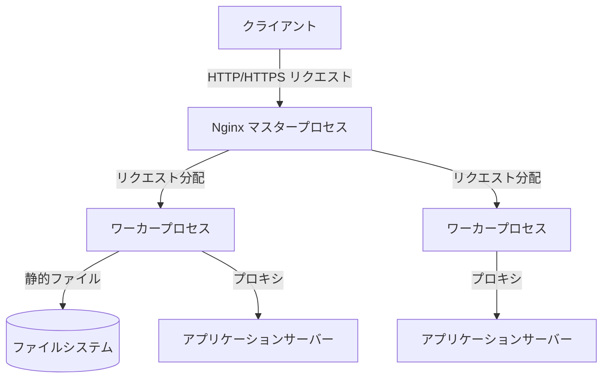

# **Nginx 調査レポート**

## **1. 基本情報**

* **ツール名**: Nginx
* **ツールの読み方**: エンジンエックス
* **開発元**: F5, Inc.
* **公式サイト**: [https://nginx.org/](https://nginx.org/)
* **関連リンク**:
  * GitHub: [https://github.com/nginx/nginx](https://github.com/nginx/nginx)
  * ドキュメント: [https://nginx.org/en/docs/](https://nginx.org/en/docs/)
* **カテゴリ**: インフラ/クラウド
* **概要**: Nginxは、HTTP Webサーバー、リバースプロキシ、ロードバランサー、TCP/UDPプロキシサーバーとして機能するオープンソースのソフトウェアです。高パフォーマンスと低メモリ消費を特徴としています。

## **2. 目的と主な利用シーン**

* **解決する課題**: C10k問題（多数のクライアントの同時接続）の解決、Webサイトの高速化と安定稼働。
* **想定利用者**: インフラエンジニア、バックエンドエンジニア、システム管理者。
* **利用シーン**:
  * トラフィックの多いWebサイトのフロントエンドサーバーとしての利用。
  * 複数台のアプリケーションサーバー（Node.js, Python, Rubyなど）へのリクエストを振り分けるロードバランサー。
  * 静的コンテンツ（画像、CSS、JavaScriptファイルなど）の高速配信。

## **3. 主要機能**

* **HTTP Webサーバー**: 静的ファイル、インデックスファイル、オートインデックスの高速処理。
* **リバースプロキシ**: バックエンドサーバーへのリクエスト転送と、レスポンスのキャッシング。
* **ロードバランシングとセッション維持**: インバンドのヘルスチェックを伴うトラフィック分散。近年追加されたsticky sessionsによるセッションアフィニティもサポート。
* **TLS/SSL終端**: SNIやOCSPステープリングをサポートするSSL/TLS暗号化・復号処理。
* **WebSockets / HTTP/2 / HTTP/3対応**: モダンなプロトコルのサポート。HTTP/3にも継続的に改良・セキュリティパッチが適用されている。
* **トンネリング機能**: `ngx_http_tunnel_module` を用いたプロキシや他のバックエンドへのトンネリング通信の確立。
* **URLの書き換えとリダイレクト**: 柔軟なルールの設定によるリクエストの制御。

## **4. 動作原理・システム構成**

* **アーキテクチャ**: Nginxはイベント駆動アーキテクチャを採用しており、1つのマスタープロセスと複数のワーカープロセスで構成される。これにより、1つのプロセスで数万の同時接続（C10k問題）を効率的に処理できる。
* **主要コンポーネントとデータフロー**:
  * クライアントからのリクエストはマスタープロセスで受け付けられ、イベント駆動のワーカープロセスに割り当てられる。
  * ワーカープロセスはノンブロッキングI/Oを用いて非同期にリクエストを処理し、バックエンドサーバーへ転送したり静的ファイルを返したりする。
* **特筆すべき要素技術**:
  * **イベント駆動・ノンブロッキングI/O**: epoll（Linux）やkqueue（FreeBSD）などの効率的なイベント通知メカニズムを利用。
  * **モジュールアーキテクチャ**: コア機能を最小限に抑え、HTTP処理、リバースプロキシ、ストリーム処理などをモジュールとして追加・拡張する設計。



## **5. 開始手順・セットアップ**

* **前提条件**:
  * Linux、macOS、Windowsなど主要なOSで動作可能。
  * アカウント作成は不要（オープンソース版の場合）。
* **インストール/導入**:

  ```bash
  # Ubuntu/Debianの場合
  sudo apt update
  sudo apt install nginx
  ```

* **初期設定**:
  * 主な設定ファイルは `/etc/nginx/nginx.conf` に配置される。
  * 各サイトの設定は `/etc/nginx/conf.d/` や `/etc/nginx/sites-available/` に記述する。
* **クイックスタート**:
  * インストール後、以下のコマンドで起動・状態確認ができる。

  ```bash
  sudo systemctl start nginx
  sudo systemctl status nginx
  ```

## **6. 特徴・強み (Pros)**

* **圧倒的な処理能力**: イベント駆動アーキテクチャを採用しており、1万以上の同時接続をわずかなメモリ消費（10k接続あたり約2.5MB）で処理できる。
* **柔軟性と拡張性**: モジュールベースの設計になっており、必要な機能のみを組み込んで軽量に運用できる。
* **高い汎用性**: Webサーバーとしてだけでなく、リバースプロキシやロードバランサーとしても第一線で活躍するオールインワンな機能。

## **7. 弱み・注意点 (Cons)**

* **動的な設定変更の制約**: Apacheの `.htaccess` のようにディレクトリごとの動的な設定上書きができないため、設定変更にはサーバーの再起動（またはreload）が必要。日本語の公式リソースは一部限られている。
* **高度な機能は有料**: 高度なロードバランシング機能や、詳細なモニタリング指標の取得などは、有料版のNGINX Plusでのみ提供される。
* **Windows環境での制限**: Windowsにも対応しているが、元々UNIX系OS向けに最適化されているため、一部の機能制限やパフォーマンスの違いがある。

## **8. 料金プラン**

| プラン名 | 料金 | 主な特徴 |
|---------|------|---------|
| **Nginx Open Source** | 無料 | コア機能（Webサーバー、リバースプロキシ、ロードバランサーなど）がフルに利用可能。コミュニティサポート。 |
| **NGINX Plus** | 有料 | 商用版。動的モジュール、高度なロードバランシング、JWT認証、WAF、F5によるプロフェッショナルサポート付き。料金は要問い合わせ。 |

* **課金体系**: NGINX Plusはサブスクリプションベース。
* **無料トライアル**: NGINX Plusには無料トライアル版が用意されている場合がある。

## **9. 導入実績・事例**

* **導入企業**: Cloudflare、Netflix、Airbnb、Dropboxなど、世界トップクラスのトラフィックを誇る数多くの企業。
* **導入事例**: 全世界のWebサイトの30%以上で採用されており、特にトラフィックの多い上位サイトでは圧倒的なシェアを占める。
* **対象業界**: スタートアップからエンタープライズ、テクノロジー企業からメディアまで、あらゆる業界。

## **10. サポート体制**

* **ドキュメント**: 公式サイトに詳細なドキュメントとビギナーズガイドが完備されている（英語主体）。
* **コミュニティ**: ユーザーフォーラム、メーリングリストが非常に活発で、Stack Overflow等でも多数の知見が共有されている。
* **公式サポート**: F5, Inc.によるNGINX Plusの商用サポート（24時間365日のサポート、セキュリティパッチの提供など）が利用可能。

## **11. エコシステムと連携**

### **11.1 API・外部サービス連携**

* **API**: NGINX Plusには動的再設定とメトリクス取得のためのREST APIが提供されている。
* **外部サービス連携**: Datadog、Prometheus、New Relicなどの主要なモニタリングツールとの連携が標準的。また、新しい `ngx_http_tunnel_module` を活用することで、外部の認証プロキシや他のバックエンドサービスへの安全なトンネリング接続が可能になっている。

### **11.2 技術スタックとの相性**

| 技術スタック | 相性 | メリット・推奨理由 | 懸念点・注意点 |
|:---|:---:|:---|:---|
| **Node.js / React (SPA)** | ◎ | 静的ファイルの高速配信と、Node.jsアプリへのリバースプロキシとして最適。 | 特になし。 |
| **Python (Django/FastAPI)** | ◎ | uWSGIやGunicornと組み合わせて、安定した本番環境を構築可能。 | 設定ファイルにプロキシの記述が必要。 |
| **Docker / Kubernetes** | ◎ | コンテナに内包しやすく、KubernetesのIngress Controllerとしても標準的に利用される。 | 環境変数の注入など、コンテナ向けの設定テクニックが必要な場合がある。 |

## **12. セキュリティとコンプライアンス**

* **認証**: Basic認証、JWT認証（Plus版）などをサポート。外部の認証スクリプトとの連携も可能。
* **データ管理**: Nginx自体はデータの保存を行わないが、通信の暗号化（TLS/SSL）において業界標準の安全な方式をサポートする。
* **準拠規格**: オープンソースソフトウェアとして透過的に監査可能であり、多くの企業がPCI-DSSやSOC2などのコンプライアンス要件を満たすインフラの一部として利用している。

## **13. 操作性 (UI/UX) と学習コスト**

* **UI/UX**: オープンソース版は基本的にCUI（コマンドライン）と設定ファイル（テキスト）による操作。NGINX Plusではモニタリング用のGUIダッシュボードが提供される。
* **学習コスト**: 独自のディレクティブに基づく設定ファイルの文法を学ぶ必要があるが、直感的で構造化されている。豊富なドキュメントとチュートリアルがあるため、基本的な設定であれば学習コストは低い。

## **14. ベストプラクティス**

* **効果的な活用法 (Modern Practices)**:
  * アプリケーションサーバーの前段に配置し、SSLの終端、静的ファイルの配信、圧縮（gzip等）をNginxに任せることで、アプリ側の負荷を下げる。
  * Nginx Ingress Controllerを使用して、Kubernetesクラスター内のトラフィックルーティングを管理する。
* **陥りやすい罠 (Antipatterns)**:
  * `if` ディレクティブの誤用（Nginxの `if` は動作が直感的でない場合があり、「If Is Evil」として公式ドキュメントでも注意喚起されている）。
  * 単一の巨大な `nginx.conf` ファイルを作成してしまうこと。サイトや機能ごとに `conf.d/` などのディレクトリで分割管理することが推奨される。

## **15. ユーザーの声（レビュー分析）**

* **調査対象**: G2、ITreview等の一般的なインフラエンジニアの評判
* **総合評価**: 4.7/5.0 (G2等の平均的評価)
* **ポジティブな評価**:
  * 「非常に軽量で、リソースをほとんど消費しない。」
  * 「一度設定すれば非常に安定して動作し、ダウンタイムが皆無。」
  * 「リバースプロキシとしての設定が分かりやすく、バックエンドの切り替えが容易。」
* **ネガティブな評価 / 改善要望**:
  * 「初心者にとっては設定ファイル（`nginx.conf`）の構文でつまずくことがある。」
  * 「正規表現を用いた複雑なルーティングルールのデバッグが難しい。」
  * 「高度なヘルスチェックなどの機能がOSS版では制限されているのが残念。」
* **特徴的なユースケース**:
  * 古いオンプレミスシステムからモダンなコンテナ環境へ移行する際、間のリバースプロキシとして稼働させ、段階的な移行（カナリアリリース）を実現する用途。

## **16. 直近半年のアップデート情報**

* **2026-06-17**: Nginx 1.31.2 mainline version リリース（HTTP/3のuse-after-free脆弱性CVE-2026-42530等のセキュリティ修正）。
* **2026-06-17**: Nginx 1.30.3 stable version リリース（HTTP/2等のヒープバッファオーバーフロー脆弱性CVE-2026-42055等のセキュリティ修正）。
* **2026-05-22**: Nginx 1.31.1 mainline version および 1.30.2 stable version リリース（ngx_http_rewrite_moduleにおけるヒープバッファオーバーフロー脆弱性CVE-2026-9256の修正）。
* **2026-05-13**: Nginx 1.31.0 mainline version および 1.30.1 stable version リリース（HTTP/2バックエンドへのデータインジェクション脆弱性CVE-2026-42926等の多数のセキュリティ修正、ngx_http_tunnel_moduleの機能追加等）。
* **2026-04-14**: Nginx 1.30.0 stable version リリース（1.30.x stableブランチの開始）。
* **2026-03-10**: Nginx 1.29.6 mainline version リリース（アップストリームへのsticky sessionsサポート追加）。
* **2026-02-04**: Nginx 1.28.2 stable および 1.29.5 mainline リリース（SSL upstream injection脆弱性 CVE-2026-1642 の修正）。
* **2026-01-13**: njs 0.9.5 リリース（qjsエンジンのネイティブモジュールサポート追加など）。

(出典: [公式サイト ニュース](https://nginx.org/news.html) など)

## **17. 類似ツールとの比較**

### **17.1 機能比較表 (星取表)**

| 機能カテゴリ | 機能項目 | 本ツール | Apache HTTP Server | Caddy | Cloudflare |
|:---:|:---|:---:|:---:|:---:|:---:|
| **配信機能** | 静的コンテンツ配信 | ◎<br><small>圧倒的な処理速度</small> | ◯<br><small>安定した配信</small> | ◯<br><small>使いやすい</small> | ◎<br><small>グローバルCDNで強力</small> |
| **アーキテクチャ** | イベント駆動（高並行性） | ◎<br><small>ネイティブ設計</small> | ◯<br><small>Event MPMで対応</small> | ◯<br><small>Go言語ベース</small> | -<br><small>フルマネージドSaaS</small> |
| **運用管理** | ディレクトリ毎の動的設定 | ×<br><small>非対応</small> | ◎<br><small>.htaccess対応</small> | ×<br><small>非対応</small> | ◯<br><small>ダッシュボード/APIで設定</small> |
| **セキュリティ** | HTTPS自動化 | △<br><small>Certbot等の併用が必要</small> | △<br><small>Certbot等の併用が必要</small> | ◎<br><small>標準で自動設定</small> | ◎<br><small>プロキシするだけで完全自動</small> |
| **エッジ/防御** | WAF・DDoS対策 | △<br><small>Plus版(有料)等の追加が必要</small> | △<br><small>ModSecurity等が必要</small> | △<br><small>プラグイン等が必要</small> | ◎<br><small>無料プランから非常に強力</small> |

### **17.2 詳細比較**

| ツール名 | 特徴 | 強み | 弱み | 選択肢となるケース |
|---------|------|------|------|------------------|
| **本ツール** | イベント駆動型の高性能Webサーバー/プロキシ。 | 高い同時接続処理能力、低リソース消費、設定の明確さ。 | `.htaccess`等によるディレクトリごとの動的設定ができない。高度な機能は有料(Plus)。 | 高トラフィックなサイトの自社サーバーでのリバースプロキシやロードバランサーとして使いたい場合。 |
| **Apache HTTP Server** | 歴史があり多機能なWebサーバー。 | `.htaccess`による柔軟なアクセス制御、モジュールの豊富さ。 | 大量の同時接続に対するメモリ消費がNginxより多い傾向がある。 | 共有レンタルサーバーや、ディレクトリ毎の細かい権限制御が必要な場合。 |
| **Caddy** | Go言語製のモダンなWebサーバー。 | HTTPS（SSL証明書）の自動取得・更新がデフォルトで組み込まれている。 | NginxやApacheほどの歴史やエコシステム、エンタープライズ実績はない。 | 手間をかけずにセキュアな（HTTPS）Webサーバーを自社環境で素早く立ち上げたい場合。 |
| **Cloudflare** | CDN/WAFを備えた統合型エッジプラットフォーム(SaaS)。 | グローバルネットワークによる圧倒的な配信性能と強力なDDoS対策・WAF。個人利用なら無料、有料(Pro)でも$20/月と安価。 | SaaSであるため自社サーバー内のみでのクローズドな通信処理には向かず、設定がUI上で複雑になりがち。 | サーバー運用を減らし、エッジでのキャッシングや強固なセキュリティ（DDoS/WAF）を手軽に実現したい場合。 |

## **18. 総評**

* **総合的な評価**:
  * Nginxは、現代のWebインフラストラクチャにおいて不可欠なコンポーネントと言えます。C10k問題を解決するために誕生したその設計思想により、非常に少ないリソースで数万もの同時接続をさばく驚異的なパフォーマンスを誇ります。静的サーバー、リバースプロキシ、ロードバランサーとして、その地位は不動のものです。
* **推奨されるチームやプロジェクト**:
  * スケールを前提としたWebアプリケーションを開発するすべてのチーム。
  * マイクロサービスアーキテクチャやコンテナ（Kubernetes）を活用するプロジェクト。
* **選択時のポイント**:
  * 既存のApacheベースのシステムで`.htaccess`に強く依存している場合を除き、新規のWebシステムや高負荷が予想される環境では、第一選択肢としてNginxを採用することが強く推奨されます。HTTPSの自動化を最優先する場合はCaddyも検討余地がありますが、パフォーマンスと安定性を求めるならNginxが最適です。
