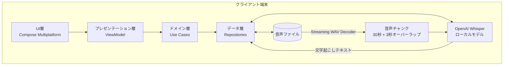

# **Notely Voice 調査レポート**

## **1. 基本情報**

* **ツール名**: Notely Voice
* **ツールの読み方**: ノートリーボイス
* **開発元**: Notely Voice, Inc.
* **公式サイト**: [https://notelyvoice.ai/](https://notelyvoice.ai/)
* **関連リンク**:
  * GitHub: [https://github.com/Notely-Voice/NotelyVoice](https://github.com/Notely-Voice/NotelyVoice)
* **カテゴリ**: ドキュメント/ナレッジ
* **概要**: Compose Multiplatformで構築された、完全プライベートなAI音声文字起こし・メモ作成アプリ。OpenAI Whisperをローカルで実行することで、クラウドへデータをアップロードせずに高精度な文字起こしを実現する。

## **2. 目的と主な利用シーン**

* **解決する課題**: インターネット接続がない環境での音声文字起こし、またはプライバシーの観点からクラウドに音声をアップロードできない課題
* **想定利用者**: 学生、プロフェッショナル、研究者など
* **利用シーン**:
  * 講義やミーティングのオフライン録音・文字起こし
  * 音声メモから構造化されたテキストの作成
  * 複数のデバイスにまたがるハンズフリーのメモ作成

## **3. 主要機能**

* **高度な音声認識 (Advanced Speech-to-Text)**: OpenAI Whisperを使用した高い精度の文字起こし
* **オフライン機能 (Offline Capability)**: インターネット接続なしで音声認識が機能
* **シームレスな統合 (Seamless Integration)**: メモへの直接入力や、音声記録の文字起こし
* **リッチテキスト編集 (Rich Text Editing)**: 見出し、太字、斜体、文字揃えなどの書式設定をサポート
* **無制限の文字起こし (Unlimited Transcriptions)**: 複数言語での無制限の文字起こし機能
* **音声共有 (Share Audio/Texts)**: アプリ内で記録した音声やテキストを他のアプリに共有


## **4. 動作原理・システム構成**

* **アーキテクチャ**: ローカルファーストのクライアントアプリケーション（Android Architecture principlesに準拠）
* **主要コンポーネントとデータフロー**:
  * **UI層 (UI Layer)**: Compose Multiplatformで構築されたユーザーインターフェース。
  * **プレゼンテーション層 (Presentation Layer)**: プラットフォーム非依存のViewModel群。
  * **ドメイン層 (Domain Layer)**: ビジネスロジックとユースケースを処理。
  * **データ層 (Data Layer)**: リポジトリとデータソース（ローカルストレージへのアクセスなど）。
  * データフローとしては、録音された音声データがデバイス内に保存され、ローカルのOpenAI Whisperモデルによってチャンクごとに文字起こしされ、テキストデータとしてUIに返される。すべての処理はデバイス上で完結し、外部サーバーへのデータ送信は行われない。
* **特筆すべき要素技術**:
  * **OpenAI Whisper**: 端末上で動作し、通信不要で高精度な音声認識を実現。
  * **メモリ効率の良い音声処理 (Memory-Efficient Audio Processing)**:
    * **Streaming WAV Decoder**: オーディオファイルをメモリ全体に読み込まず、チャンクごとに処理。
    * **Overlapping Chunk Transcription**: 長い音声ファイルを、文字起こしの欠落を防ぐために3秒のオーバーラップ（重複）を持たせたチャンク（デフォルト30秒）に分割して処理。



## **5. 開始手順・セットアップ**

* **前提条件**:
  * Androidデバイス または iOSデバイス
* **インストール/導入**:

  ```bash
  # Google Playストア、App Store、またはF-Droidからインストール可能
  ```

* **初期設定**:
  * インストール後、文字起こし機能を利用するためのAIモデルのダウンロードが必要
* **クイックスタート**:
  * アプリを開き、右下の録音ボタンをタップして音声を録音後、文字起こしを実行

## **6. 特徴・強み (Pros)**

* クラウドへのアップロードを一切行わない完全なオンデバイス処理による高いプライバシー
* インターネット接続に依存せずに使用可能なオフライン文字起こし機能
* OpenAI Whisperを使用した高精度かつ複数言語に対応した文字起こし

## **7. 弱み・注意点 (Cons)**

* 最初の文字起こし時に、AIモデルをローカルにダウンロードする必要がある（ただし現在は内部ストレージへの保存に対応し再ダウンロード問題は解消）
* デバイスの処理能力に依存するため、古いデバイスではパフォーマンスが低下する可能性がある
* 日本語対応は自動的に英語に翻訳される設定がデフォルトの場合があり、設定変更が必要

## **8. 料金プラン**

| プラン名 | 料金 | 主な特徴 |
|---------|------|---------|
| **無料プラン** | 無料 | オープンソースで広告なし、完全無料で提供 |

* **課金体系**: 買い切りや月額料金などはなく、完全無料
* **無料トライアル**: すべて無料で利用可能

## **9. 導入実績・事例**

* **導入企業**: 個人向けアプリであるため、特定の企業導入事例は公開されていない。
* **導入事例**: 公開事例なし。ただし、学生の講義メモやプロフェッショナルのミーティング記録などでの利用が報告されている。
* **対象業界**: 業界を問わず、プライバシーを重視するすべての個人およびプロフェッショナル

## **10. サポート体制**

* **ドキュメント**: GitHubリポジトリのREADMEが主要なドキュメント
* **コミュニティ**: GitHub Issuesでのバグ報告や機能要望の受付
* **公式サポート**: サポート窓口の種類: メール (<support@notelyvoice.ai>)

## **11. エコシステムと連携**

### **11.1 API・外部サービス連携**

* **API**: 開発者向けの公開APIは提供されていない
* **外部サービス連携**: アプリ内の共有機能を使用して、Messages、WhatsApp、Files、Google Driveなどへの共有が可能

### **11.2 技術スタックとの相性**

| 技術スタック | 相性 | メリット・推奨理由 | 懸念点・注意点 |
|:---|:---:|:---|:---|
| **Kotlin (Android)** | ◎ | Compose Multiplatformで構築されている | 特になし |
| **Swift (iOS)** | ◎ | クロスプラットフォーム対応 | 特になし |

## **12. セキュリティとコンプライアンス**

* **認証**: アプリ単体での動作のため、必須のユーザー認証はなし
* **データ管理**: データの保存場所はローカルデバイス上のみ。クラウドへのアップロードは行われない
* **準拠規格**: 公式サイトで公開されていない。問い合わせが必要。

## **13. 操作性 (UI/UX) と学習コスト**

* **UI/UX**: シンプルで直感的なインターフェース。Material 3デザインシステムを採用している。
* **学習コスト**: 直感的に操作可能で、学習コストは非常に低い

## **14. ベストプラクティス**

* **効果的な活用法 (Modern Practices)**:
  * インターネットがない環境での議事録作成ツールとしての活用
* **陥りやすい罠 (Antipatterns)**:
  * AIモデルの初回ダウンロードを行わずにオフライン環境で使用しようとすること

## **15. ユーザーの声（レビュー分析）**

* **調査対象**: Google Play
* **総合評価**: 4.59/5.0 (Google Play)
* **ポジティブな評価**:
  * 非常に使いやすく、すべてがスマートフォン上で完結する点（プライバシー、無料、広告なし）
  * 文字起こしの精度が高く、バックグラウンドノイズがあっても思考を正確に捉えられる
* **ネガティブな評価 / 改善要望**:
  * (ネガティブな具体的な評価は現在のGoogle Playスニペットからは見つからず)
* **特徴的なユースケース**:
  * 学生の講義記録、医師の患者メモの作成など

## **16. 直近半年のアップデート情報**

* **2026-06-29**: v1.3.4のリリース（Android 17対応）
* **2026-05-19**: v1.3.3のリリース（F-droid互換ビルド追加、アプリ内外部リンクの修正）
* **2026-03-20**: v1.3.2のリリース（F-droid互換ビルド追加、ハンガリー語追加、ダウンロードモデルを内部ストレージへ移動するオプションの追加）
* **2026-03-11**: v1.3.1のリリース（Android 16対応、チェコ語・スロバキア語追加など）

(出典: [GitHub Releases](https://github.com/Notely-Voice/NotelyVoice/releases))

## **17. 類似ツールとの比較**

### **17.1 機能比較表 (星取表)**

| 機能カテゴリ | 機能項目 | 本ツール | Aqua Voice | VibeVoice |
|:---:|:---|:---:|:---:|:---:|
| **基本機能** | 音声文字起こし | ◎<br><small>オフラインで完結</small> | ◎<br><small>技術用語に強い</small> | ◎<br><small>長時間の高精度処理</small> |
| **カテゴリ特定** | ローカル処理 | ◎<br><small>完全オフライン</small> | ×<br><small>オンラインのみ</small> | ◯<br><small>モデルダウンロードで対応可</small> |
| **コンテキスト** | 画面認識 | ×<br><small>非対応</small> | ◎<br><small>カーソル周辺を理解</small> | ×<br><small>非対応</small> |
| **非機能要件** | 日本語対応 | ◯<br><small>モデルダウンロードで対応</small> | ◯<br><small>多言語対応</small> | ◯<br><small>実験的話者など限定的</small> |

### **17.2 詳細比較**

| ツール名 | 特徴 | 強み | 弱み | 選択肢となるケース |
|---------|------|------|------|------------------|
| **本ツール** | モバイル向けの完全ローカル処理アプリ | 高いプライバシーとオフライン動作 | デバイスのスペックに依存 | プライバシーを重視する個人の文字起こし |
| **Aqua Voice** | 技術用語に強い自社モデル搭載の音声入力ツール | 画面コンテキストの理解と高い認識精度 | Androidアプリがない、オンライン必須 | CursorなどのAIツール利用時にプロンプト入力を高速化したい場合 |
| **VibeVoice** | Microsoftによる最先端のOSS音声AI | ASR/TTS両方を提供し長尺処理に極めて強い | 商用利用には検証が必要、実行リソース大 | 音声AIの研究開発や高度な議事録システムを自社構築したい場合 |

## **18. 総評**

* **総合的な評価**:
  * Notely Voiceは、完全なローカル処理によってプライバシーとオフライン機能を兼ね備えた優れた音声文字起こしアプリである。
* **推奨されるチームやプロジェクト**:
  * インターネットに接続できない環境で活動するプロフェッショナルや、機密性の高い音声を扱うユーザー。
* **選択時のポイント**:
  * 完全無料で広告もなく、オフラインで機能する文字起こしアプリを求めている場合に最適な選択肢となる。
