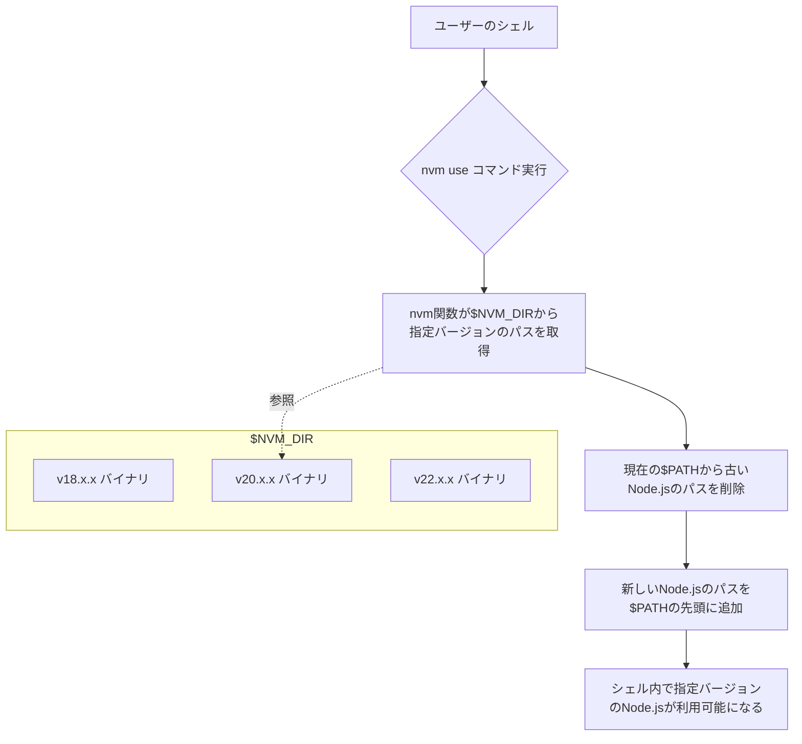

# **nvm 調査レポート**

## **1. 基本情報**

* **ツール名**: nvm
* **開発元**: OpenJS Foundation
* **公式サイト**: [https://github.com/nvm-sh/nvm](https://github.com/nvm-sh/nvm)
* **関連リンク**:
  * GitHub: [https://github.com/nvm-sh/nvm](https://github.com/nvm-sh/nvm)
* **カテゴリ**: パッケージ管理
* **概要**: nvmは、コマンドラインから複数のNode.jsバージョンを素早くインストールして使用するためのツール。ユーザーごとにインストールされ、シェルごとに呼び出されるように設計されている。

## **2. 目的と主な利用シーン**

* **解決する課題**: プロジェクトごとに異なるNode.jsのバージョンが必要となる場合の管理の煩雑さの解消。
* **想定利用者**: 開発者。
* **利用シーン**:
  * 異なるNode.jsバージョンを必要とする複数のプロジェクトの開発。
  * 最新版やLTS版のNode.jsのテストや検証。

## **3. 主要機能**

* **Node.jsのインストール**: 特定のバージョンやエイリアス（`node`、`iojs`、`lts/*`など）を指定したインストール。
* **バージョンの切り替え**: シェル単位での実行バージョンの切り替え。
* **エイリアスの設定**: 特定のバージョンに対するエイリアス設定。
* **.nvmrcファイルサポート**: ディレクトリごとに使用するNode.jsのバージョンを`.nvmrc`ファイルで指定可能。
* **ローカルおよびリモートバージョンのリスト表示**: インストール済みバージョンや、利用可能なバージョンのリスト表示。

## **4. 動作原理・システム構成**

* **アーキテクチャ**: ローカル環境で動作するCLIスクリプト。シェル関数として読み込まれる。
* **主要コンポーネントとデータフロー**:
  * `$NVM_DIR` (通常は `~/.nvm`) 配下に各バージョンのNode.jsのバイナリがダウンロード・配置される。
  * `nvm use` コマンドを実行すると、指定したバージョンの `bin` ディレクトリが環境変数 `$PATH` の先頭に追加され、使用する `node` や `npm` のバージョンが切り替わる。
* **特筆すべき要素技術**:
  * POSIX準拠のシェルスクリプトのみで実装されており、依存関係が少ない。



## **5. 開始手順・セットアップ**

* **前提条件**:
  * POSIX準拠のシェル（sh, bash, zsh等）。
  * C++コンパイラ（ソースコードからインストールする場合）。
* **インストール/導入**:

  ```bash
  # インストールコマンド例（cURL）
  curl -o- https://raw.githubusercontent.com/nvm-sh/nvm/v0.40.4/install.sh | bash
  ```

* **初期設定**:
  * インストールスクリプトによって `~/.bashrc` や `~/.zshrc` 等に nvm をロードするためのスクリプトが追加される。
* **クイックスタート**:
  * 最新のNode.jsをインストールして使用する場合: `nvm install node`

## **6. 特徴・強み (Pros)**

* ユーザーごとにインストールされるため、管理者権限（sudo）が不要。
* POSIX準拠のスクリプトであり、多くのシェル（sh, dash, ksh, zsh, bash）で動作する。
* `.nvmrc` ファイルを使用することで、プロジェクトごとにバージョンを固定化しやすい。

## **7. 弱み・注意点 (Cons)**

* Windows環境（WSLを除く）へのネイティブ対応がない（`nvm-windows` などの代替ツールの利用が必要）。
* Fishシェルにはネイティブ対応していない。
* MacのApple Silicon（arm64）環境で古いバージョンのNode.jsをインストールする際は、Rosetta 2を介したコンパイル設定等が必要な場合がある。

## **8. 料金プラン**

| プラン名 | 料金 | 主な特徴 |
|---------|------|---------|
| **無料プラン** | 無料 | オープンソース（MIT License） |

* **課金体系**: なし
* **無料トライアル**: なし

## **9. 導入実績・事例**

* **導入企業**: Node.js開発者の間で広く利用されている。
* **対象業界**: ソフトウェア開発全般。

## **10. サポート体制**

* **ドキュメント**: GitHubリポジトリのREADMEが公式ドキュメントとなっている。
* **コミュニティ**: GitHub上のIssue、Pull Requestを通じたオープンソースコミュニティ。
* **公式サポート**: OpenJS Foundationによる管理。

## **11. エコシステムと連携**

### **11.1 API・外部サービス連携**

* **API**: CLIツールのため、外部APIは提供されていない。
* **外部サービス連携**: npm、npxなどのNode.jsエコシステムと連携。

### **11.2 技術スタックとの相性**

| 技術スタック | 相性 | メリット・推奨理由 | 懸念点・注意点 |
|:---|:---:|:---|:---|
| **Node.js** | ◎ | バージョン管理に特化 | 特になし |
| **Docker** | ◯ | CI/CDパイプライン等への導入実績あり | Dockerfile内での対話シェル以外のセットアップ（BASH_ENV等の指定）が必要 |

## **12. セキュリティとコンプライアンス**

* **認証**: 特になし（ローカルツール）。
* **データ管理**: ユーザーのローカルディレクトリ（`~/.nvm`）にデータが保存される。
* **準拠規格**: CII Best Practicesバッジを取得。

## **13. 操作性 (UI/UX) と学習コスト**

* **UI/UX**: コマンドラインベースのインターフェース。
* **学習コスト**: シンプルなコマンド構成（`nvm install`, `nvm use`, `nvm ls`など）のため、学習コストは低い。

## **14. ベストプラクティス**

* **効果的な活用法 (Modern Practices)**:
  * プロジェクトのルートディレクトリに `.nvmrc` ファイルを配置し、使用するNode.jsのバージョンを明示的に指定する。
* **陥りやすい罠 (Antipatterns)**:
  * インストールスクリプトの実行パス設定漏れにより、`nvm`コマンドが見つからないエラーになるケース。シェルプロファイル（`.bashrc` 等）の再読み込みが必要。

## **15. ユーザーの声（レビュー分析）**

* **調査対象**: GitHub
* **総合評価**: 92,000以上のスター（Star）を獲得しており、絶大な支持を得ている。
* **ポジティブな評価**:
  * コマンド一つで簡単にNode.jsのバージョンを切り替えられる点。
* **ネガティブな評価 / 改善要望**:
  * シェル起動時の読み込みによるパフォーマンスへの影響。
* **特徴的なユースケース**:
  * 複数のレガシーシステムと最新システムを同時並行で保守する開発環境の構築。

## **16. 直近半年のアップデート情報**

* **2026-08-18**: v0.40.7 のリリース
* **2026-07-15**: v0.40.6 のリリース
* **2026-06-04**: v0.40.5 のリリース
* **2026-01-29**: v0.40.4 のリリース（GitHub Releases等で確認可能）。

(出典: [GitHub Releases](https://github.com/nvm-sh/nvm/releases))

## **17. 類似ツールとの比較**

### **17.1 機能比較表 (星取表)**

| 機能カテゴリ | 機能項目 | 本ツール | pnpm |
|:---:|:---|:---:|:---:|
| **基本機能** | パッケージ管理 | ×<br><small>バージョン管理に特化</small> | ◎<br><small>高速でディスク効率が良い</small> |
| **カテゴリ特定** | バージョン管理 | ◎<br><small>Node.jsバージョン管理特化</small> | ◯<br><small>pnpm envで対応</small> |
| **カテゴリ特定** | .nvmrc対応 | ◎<br><small>標準サポート</small> | △<br><small>.npmrc等を利用</small> |
| **非機能要件** | Windows対応 | ×<br><small>WSL等が必要</small> | ◎<br><small>マルチプラットフォーム対応</small> |

### **17.2 詳細比較**

| ツール名 | 特徴 | 強み | 弱み | 選択肢となるケース |
|---------|------|------|------|------------------|
| **本ツール** | POSIX向けのNode.jsバージョン管理 | シンプルで.nvmrc連携が強力 | パッケージ管理機能は持たない | npmやyarnを使いつつNode.jsバージョンを細かく切り替える場合 |
| **pnpm** | 高速なパッケージマネージャー | ディスクスペース節約、`pnpm env`でNode.js管理も可能 | プロジェクトによっては対応が必要な場合がある | パッケージ管理とNode.jsバージョン管理を1ツールにまとめたい場合 |

## **18. 総評**

* **総合的な評価**:
  * nvmは、Mac/Linux環境におけるNode.jsのバージョン管理のデファクトスタンダードとして機能している、非常に信頼性の高いツールである。
* **推奨されるチームやプロジェクト**:
  * 複数のNode.jsバージョンに依存するプロジェクトを抱える開発チームや、Mac/Linux環境を主とする開発者。
* **選択時のポイント**:
  * 開発環境がPOSIX準拠（Mac、Linux、WSL）であればnvmを第一選択とする。パッケージ管理とNode.jsのバージョン管理を統合したい場合は、pnpmの利用も検討する。
