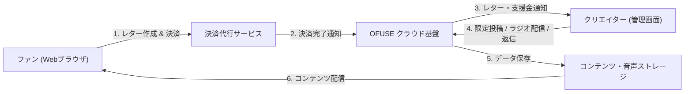

# **OFUSE 調査レポート**

## **1. 基本情報**

* **ツール名**: OFUSE
* **ツールの読み方**: オフセ
* **開発元**: 株式会社Sozi
* **公式サイト**: [https://ofuse.me/](https://ofuse.me/)
* **関連リンク**:
  * ドキュメント: [https://support.ofuse.me/hc](https://support.ofuse.me/hc)
* **カテゴリ**: POS/店舗・EC運営
* **概要**: ファンからクリエイターへ「1文字2円」でファンレターと支援金（投げ銭）を送ることができる応援プラットフォーム。メンバーシップ機能やラジオ機能も備え、多彩なファンコミュニケーションを支援する。

## **2. 目的と主な利用シーン**

* **解決する課題**: コンテンツが無料で消費されがちな時代において、クリエイターに直接かつ気軽に金銭的な支援を届ける仕組みが不足していること。
* **想定利用者**: イラストレーター、ミュージシャン、小説家、VTuberなど、あらゆるジャンルのクリエイターと、そのファン。
* **利用シーン**:
  * SNSや動画共有サイトのプロフィールにリンクを貼り、活動への投げ銭窓口として利用
  * 月額メンバーシップを開設し、コアなファン向けに限定コンテンツ（ブログやラジオ等）を配信
  * オンラインライブ配信中やイベントでの応援手段として利用

## **3. 主要機能**

* **ファンレター (投げ銭)**: 1文字2円から、応援の気持ちと共にメッセージと支援金をクリエイターに送ることができる機能。
* **メンバーシップ**: クリエイターが月額プランを設定し、ファンクラブを開設できる機能。
* **ファンレターへの返信**: 受け取ったファンレターに対し、メッセージだけでなく画像や音声で返信できる機能。
* **メンバー限定ブログ**: メンバーシップ加入者に向けて、限定の記事やコンテンツを公開できる機能。
* **ニュースレター**: フォロワーやメンバーシップ会員に向けてメールマガジンを配信できる機能。
* **ラジオ機能**: 音声によるリアルタイム配信を行い、アーカイブとして公開することもできる機能。

## **4. 動作原理・システム構成**

* **アーキテクチャ**: クラウド完結型SaaS（Webアプリケーション）。ファンからの投げ銭・レター送信処理、クリエイターのコンテンツ配信（ブログ・音声ラジオ・メルマガ）、および決済・売上管理を統合したマルチテナント構成。
* **主要コンポーネントとデータフロー**:
  * **ファン側クライアント（ブラウザ）**: アカウント登録なし（またはログイン済み）でレター作成と決済を実行。決済代行サービスと直接通信してカード情報を安全にトークン化。
  * **OFUSE アプリケーションサーバー**: レターデータ・支援金額の管理、還元率90%の計算とクリエイター残高への反映、通知配信を制御。
  * **クリエイター側クライアント（管理画面）**: レターの閲覧・返信（テキスト・画像・音声）、メンバーシップ管理、限定記事投稿、ラジオ配信（音声ストリーミング）を実施。

* **特筆すべき要素技術**:
  * **1文字2円の課金計算エンジン**: レター本文の文字数と指定金額に応じた柔軟な決済金額算出ロジック。
  * **音声ストリーミング/アーカイブ配信**: ラジオ機能におけるライブ音声配信と、メンバーシップ向けの安全な限定公開制御。

## **5. 開始手順・セットアップ**

* **前提条件**:
  * ブラウザでアクセス可能（アプリのインストールは不要）
  * アカウント作成（メールアドレス、Google、X、Apple連携等）
* **インストール/導入**:
  * 公式サイト（[https://ofuse.me/](https://ofuse.me/)）から「OFUSEをはじめる」または「新規登録」をクリック
* **初期設定**:
  * クリエイターとして利用する場合、プロフィール設定と本人確認（KYC）を行う
* **クイックスタート**:
  * プロフィールURLを発行し、SNSのバイオグラフィ等に記載するだけでファンレターの受付を開始できる

## **6. 特徴・強み (Pros)**

* **高い還元率**: プラットフォーム利用料が10%と低く設定されており、支援金額の90%をクリエイターが受け取ることができる。
* **初期費用・ランニングコストが無料**: 登録や基本機能の利用に固定費はかからない。
* **手軽な導入ハードル**: 支援する側（ファン）はアカウント登録不要で気軽に投げ銭を送ることができる（一部機能を除く）。
* **柔軟な支援形式**: 単発のファンレター（投げ銭）と、継続的な支援（月額メンバーシップ）の両方に対応している。

## **7. 弱み・注意点 (Cons)**

* **出金手数料**: 支援金を引き出す際、都度275円の出金手数料が発生する。
* **機能のシンプルさ**: 高度なグッズ販売やEC機能などは備えていないため、物販をメインとする場合は別のサービスとの併用が必要。
* **課金対象となる**: 販売業者に該当する場合、消費税の課税対象となる点に注意が必要。

## **8. 料金プラン**

| プラン名 | 料金 | 主な特徴 |
|---------|------|---------|
| **基本利用** | 無料 | アカウント登録、ファンレターの受付、メンバーシップの開設など基本的な機能はすべて無料で利用可能 |

* **課金体系**: 決済ごとの手数料モデル（支援金額から10%がプラットフォーム手数料として差し引かれる）
* **無料トライアル**: なし（基本利用が無料のため）
* ※クリエイターへの売上金振り込み時に、別途出金手数料275円/回が発生。

## **9. 導入実績・事例**

* **導入企業**: 個人クリエイターを中心に広く利用されている（株式会社Soziが運営）。
* **導入事例**:
  * 虹走 (漫画家・イラストレーター)
  * 流田Project (バンド)
  * 白浜鴎 (漫画家)
  * みさき千夏Vtuber (VTuber)
* **対象業界**: アニメーション、イラスト、音楽、小説、VTuber、YouTuberなど、幅広いクリエイティブ領域。

## **10. サポート体制**

* **ドキュメント**: [ヘルプセンター](https://support.ofuse.me/hc)にて、クリエイター向け・ファン向けのよくある質問や使い方のガイドを提供。
* **コミュニティ**: 「OFUSE KIT」などを提供し、クリエイターがファンにOFUSEを周知するためのリソースを公開。
* **公式サポート**: [お問い合わせ・ご意見ご要望フォーム](https://docs.google.com/forms/d/e/1FAIpQLSfQZLWK3L3bIiwXfQoQYgNQGRMaxusKqR5Arhb_CvD7emlJ_A/viewform)によるサポート対応。

## **11. エコシステムと連携**

### **11.1 API・外部サービス連携**

* **API**: 公開されたAPIは提供されていない。
* **外部サービス連携**: 同社（株式会社Sozi）が展開する「POTOFU」（プロフィール作成サービス）や「pib」（イラスト投稿アプリ）との連携親和性が高い。また、X(Twitter)やGoogle等の各種アカウントでのログインに対応。

### **11.2 技術スタックとの相性**

| 技術スタック | 相性 | メリット・推奨理由 | 懸念点・注意点 |
|:---|:---:|:---|:---|
| **Webブラウザ** | ◎ | 特別なアプリや環境構築不要で全機能が利用可能 | オフライン環境では利用不可 |
| **SNSリンク連携** | ◎ | URLを貼るだけで各種SNSから導線を作れる | SNS側の仕様変更に影響を受ける可能性あり |

## **12. セキュリティとコンプライアンス**

* **認証**: メールアドレス認証のほか、X（旧Twitter）、Google等のソーシャルログインに対応。
* **データ管理**: 公式サイトにてプライバシーポリシーを公開し、個人情報を適切に管理。
* **準拠規格**: クリエイターの登録時にKYC（本人確認）を徹底することで、偽アカウントや不正利用を防止する対策を実施。特定商取引法に基づく表記を公開。

## **13. 操作性 (UI/UX) と学習コスト**

* **UI/UX**: シンプルで直感的なインターフェース。ファンにとっては、テキストボックスに入力して決済するだけで簡単にレターを送れる設計となっている。
* **学習コスト**: 非常に低い。クリエイター側も複雑な設定なく、すぐに支援の受け口を作成できる。

## **14. ベストプラクティス**

* **効果的な活用法 (Modern Practices)**:
  * 単発の「ファンレター」でライト層からの応援を受け付けつつ、コアファン向けに「メンバーシップ」を設ける二段構えの運用。
  * 「OFUSE KIT」を活用し、自身のSNSや動画概要欄で積極的にOFUSEでの支援を受け付けていることを告知する。
  * ファンレターに対して画像や音声で返信を行い、ファンエンゲージメントを高める。
* **陥りやすい罠 (Antipatterns)**:
  * プロフィールにリンクを貼るだけでファンに告知をしない（導線が機能せず支援が集まらない）。
  * 頻繁な少額出金（都度275円の手数料がかかるため、ある程度まとまった金額での出金が推奨される）。

## **15. ユーザーの声（レビュー分析）**

* **調査対象**: Web上のレビュー記事、SNSの評判
* **総合評価**: 公式のレビューサイト登録はないが、SNS等での評判は概ね良好。
* **ポジティブな評価**:
  * 「ファン側がアカウント登録なしでも投げ銭できる手軽さが良い」
  * 「1文字2円という独自のシステムが、長文を書くモチベーションにもなるし面白い」
  * 「プラットフォーム手数料10%は、他の類似サービスと比べても良心的」
* **ネガティブな評価 / 改善要望**:
  * 「出金手数料が固定でかかるため、少額の支援しか集まっていない時は引き出しにくい」
  * 「グッズ販売などの機能がないため、物販は別のサービスを使う必要がある」
* **特徴的なユースケース**:
  * 誕生日や記念日などのイベント時に、ファンからのお祝いメッセージと支援をまとめて受け取る窓口として利用。

## **16. 直近半年のアップデート情報**

* **2026-02-06**: バレンタイン期間限定のキャンペーン（スタンプ等）を実施。
* **2025-12-26**: 新年のお祝い向けキャンペーンを実施。
* **2025-12-14**: クリスマス限定レター＆スタンプ機能を追加。
* **2025-09-09**: Facebookログイン機能の提供を終了（Google・X・Appleログイン等へ移行）。
* **2025-07-15**: 管理画面の一部リニューアルを実施し、サイドメニューの整理・操作性を向上。
* **2025-02-01**: ラジオ機能（リアルタイムの音声ライブ配信およびアーカイブ公開）を追加リリース。

(出典: [OFUSE お知らせ](https://ofuse.me/news))

## **17. 類似ツールとの比較**

### **17.1 機能比較表 (星取表)**

| 機能カテゴリ | 機能項目 | 本ツール (OFUSE) | codoc | WordPress |
|:---:|:---|:---:|:---:|:---:|
| **基本機能** | 単発投げ銭 (チップ) | ◎ <small>1文字2円のファンレター</small> | ◯ <small>サポート機能あり</small> | △ <small>プラグインが必要</small> |
| **基本機能** | 月額メンバーシップ | ◯ <small>標準対応</small> | ◯ <small>サブスクリプション機能</small> | ◯ <small>プラグイン等で対応可能</small> |
| **拡張機能** | 自社サイト埋込 (ペイウォール) | △ <small>リンク設置のみ</small> | ◎ <small>タグ埋込でコンテンツ保護</small> | ◎ <small>CMS上でコンテンツ制御</small> |
| **拡張機能** | 音声配信 (ラジオ) | ◎ <small>標準搭載</small> | × <small>非対応</small> | △ <small>外部プレイヤー連携等</small> |
| **費用面** | クリエイター還元率 | ◎ <small>90%還元 (手数料10%)</small> | ◯ <small>85%還元 (手数料15%)</small> | ◎ <small>独自決済連携で変動</small> |
| **非機能要件** | 支援者のアカウント不要 | ◎ <small>一部機能は登録不要</small> | ◎ <small>単体購入等は登録不要</small> | △ <small>設定・構成に依存</small> |

### **17.2 詳細比較**

| ツール名 | 特徴 | 強み | 弱み | 選択肢となるケース |
|---------|------|------|------|------------------|
| **本ツール (OFUSE)** | ファンレター形式の投げ銭プラットフォーム | 支援側の登録が不要で気軽、還元率が90%と高い | 高度な物販EC機能などはない | 気軽な投げ銭やメッセージを受け付けたい、ラジオやブログでファンコミュニティを運営したい場合 |
| **codoc** | 既存サイトにタグを貼るだけのペイウォール決済サービス | 自前のブログやWebサイトをそのまま有料化可能 | 販売手数料が15%とやや高め | 既に自前のWebサイト・ブログを持っており、特定の記事や連載を有料販売したい場合 |
| **WordPress** | 世界標準のオープンソースCMS | プラグインで投げ銭・会員制・ECを自由自在に構築可能 | サーバー管理や保守運用の知識が必要 | 外部プラットフォームに依存せず、完全に独自のブランド・デザインでメディアやファンサイトを構築したい場合 |

## **18. 総評**

* **総合的な評価**:
  OFUSEは、1文字2円の「ファンレター」という独自の体験を通じて、クリエイターとファンの心温まるコミュニケーションを実現する優れたプラットフォームである。プラットフォーム手数料10%（還元率90%）という良心的な設定や、支援者側のアカウント登録が不要（単発支援の場合）という手軽さが大きな魅力。最近ではメンバーシップ機能に加えラジオ機能（音声配信）も追加され、単なる投げ銭ツールから総合的なファンコミュニティ構築ツールへと進化している。
* **推奨されるチームやプロジェクト**:
  個人で活動するイラストレーター、VTuber、ミュージシャン、小説家など、ファンからの直接的な応援を活動のモチベーションや資金源としたいすべてのクリエイターに推奨できる。
* **選択時のポイント**:
  自身のWebサイトを持っており記事を有料販売したい場合はcodoc、完全に独立した独自のWebメディアを構築したい場合はWordPressが適しているのに対し、OFUSEは「SNS等のリンク先として手軽にファンレター・投げ銭の受け口を設置したい」「ラジオや限定ブログでファンと交流したい」という用途に最適である。
