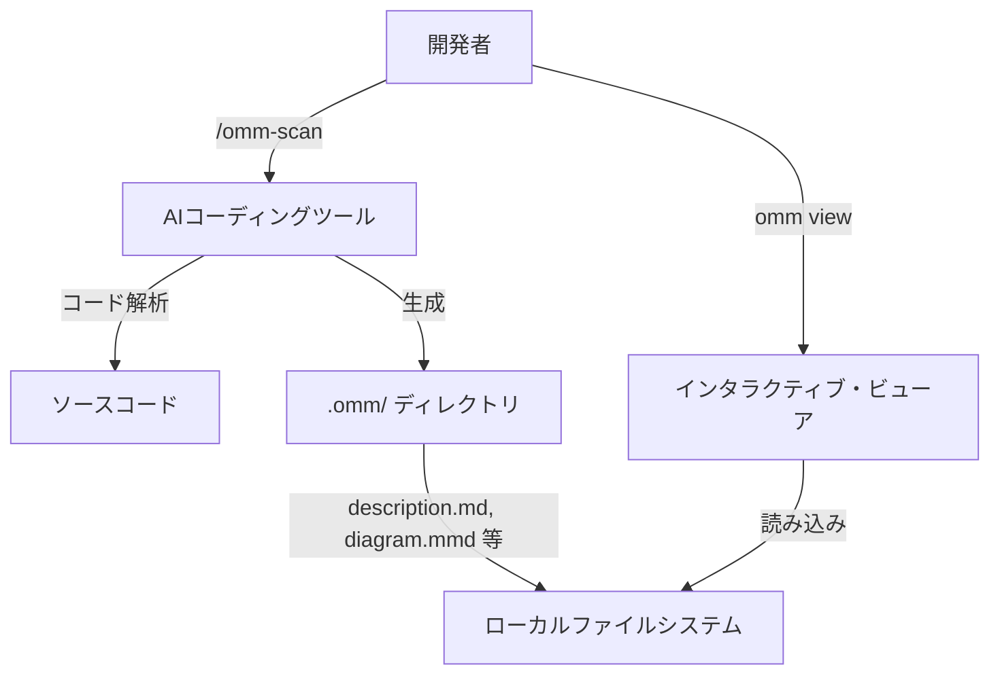

# **Oh-my-mermaid 調査レポート**

## **1. 基本情報**

* **ツール名**: oh-my-mermaid
* **ツールの読み方**: オーマイマーメイド
* **開発元**: oh-my-mermaid コミュニティ
* **公式サイト**: [https://github.com/oh-my-mermaid/oh-my-mermaid](https://github.com/oh-my-mermaid/oh-my-mermaid)
* **関連リンク**:
  * GitHub: [https://github.com/oh-my-mermaid/oh-my-mermaid](https://github.com/oh-my-mermaid/oh-my-mermaid)
  * DeepWiki: [https://deepwiki.com/oh-my-mermaid/oh-my-mermaid](https://deepwiki.com/oh-my-mermaid/oh-my-mermaid)
  * CodeWiki: [https://codewiki.google/github.com/oh-my-mermaid/oh-my-mermaid](https://codewiki.google/github.com/oh-my-mermaid/oh-my-mermaid)
* **カテゴリ**: 開発者ツール
* **概要**: AIエージェントを活用し、コードベースを分析して人間が理解しやすいアーキテクチャドキュメントと図を自動生成するツール。

## **2. 目的と主な利用シーン**

* **解決する課題**: 大規模かつ複雑なコードベースにおいて、全体のアーキテクチャやデータフローを把握するのに膨大な時間がかかるという課題。AIがコードを書く速度に人間が追いつけず、システムがブラックボックス化する問題。
* **想定利用者**: 開発者、ソフトウェアエンジニア、アーキテクト
* **利用シーン**:
  * 新規プロジェクトへの参画時におけるキャッチアップ
  * 既存システムのアーキテクチャ見直しやリファクタリングの検討
  * チーム内でのコードベースの共有とドキュメンテーション

## **3. 主要機能**

* **コードベース分析と可視化**: AIエージェントを用いてコードベースを分析し、システムの構造やデータフロー、外部連携などの「視点（Perspectives）」を自動生成する。
* **再帰的分析と階層化構造**: システム全体から細部へと階層的に分析を進め、複雑なノードはネストされた子要素として独自の図を持つ。
* **インタラクティブ・ビューア**: 生成されたアーキテクチャをブラウザ上で閲覧できるビューアを提供。階層の展開や折りたたみに対応。
* **AIツール統合（Skills）**: Claude Code、Codex、Cursor などのAIコーディングツール内で直接 `/omm-scan` コマンドを実行できる連携機能。
* **多言語対応**: コンテンツの言語を設定可能（`omm config language ko` など）。
* **クラウド連携**: `omm login`, `omm link`, `omm push` を通じて、ohmymermaid.com へアーキテクチャを保存し、チームと共有する機能。

## **4. 動作原理・システム構成**

* **アーキテクチャ**: ローカル環境でAIツールと連携して動作し、必要に応じてクラウドと連携するハイブリッド型。
* **主要コンポーネントとデータフロー**:
  * AIコーディングツール内で `/omm-scan` を実行すると、コードベースが分析される。
  * 分析結果は `.omm/` ディレクトリ内に Markdown や Mermaid ファイルとして階層的に保存される。
  * `omm view` コマンドにより、ローカルサーバーが立ち上がり、保存されたデータをインタラクティブなビューアで表示する。
* **特筆すべき要素技術**:
  * AIエージェント（Claude等）を活用したコードのセマンティック解析
  * Mermaid記法を用いた自動作図



## **5. 開始手順・セットアップ**

* **前提条件**:
  * Node.js (v18以降推奨)
  * npm または pnpm
  * Claude Code などのサポートされているAIコーディングツール
* **インストール/導入**:

  ```bash
  npm install -g oh-my-mermaid
  omm setup
  ```

* **初期設定**:
  * インストール後、AIコーディングツール内で以下を実行：
    ```
    /omm-scan
    ```
* **クイックスタート**:
  * スキャン完了後、ターミナルで以下を実行してビューアを起動：
    ```bash
    omm view
    ```

## **6. 特徴・強み (Pros)**

* 人間が理解しやすい形式（Mermaid図＋Markdownドキュメント）でアーキテクチャを可視化できる。
* AIエージェントのスキルとして統合されているため、通常のコーディングフローを妨げずにドキュメントを生成・更新できる。
* 再帰的な分析により、全体の俯瞰から特定モジュールの詳細までシームレスに把握可能。

## **7. 弱み・注意点 (Cons)**

* AIエージェント（LLM）の出力に依存するため、解析の精度や生成される図の品質がモデルの性能に左右される。
* 巨大なリポジトリの場合、スキャンに時間とコスト（トークン消費）がかかる可能性がある。
* 日本語を含む多言語でのREADMEは提供されているが、日本語特有のサポートやドキュメントが完全に整備されているかは確認が必要。

## **8. 料金プラン**

| プラン名 | 料金 | 主な特徴 |
|---------|------|---------|
| **オープンソース版** | 無料 | ローカルでの基本機能、ビューアの利用、クラウドへのプライベート保存など |

* **課金体系**: ツール自体は無料（オープンソース）。ただし、解析に利用するAIコーディングツール（Claude Code等）側の利用料やAPIトークン費用は別途発生する。
* **無料トライアル**: オープンソースのため常時無料。

## **9. 導入実績・事例**

* **導入企業**: 公開事例なし。ただし、個人開発者や小規模チームでの利用が拡大している。
* **導入事例**: oh-my-mermaid 自身が `/omm-scan` を使用して自己のアーキテクチャを可視化したデモを公開している。
* **対象業界**: ソフトウェア開発全般。

## **10. サポート体制**

* **ドキュメント**: GitHubのREADMEや `docs/` ディレクトリ下のドキュメントが提供されている。
* **コミュニティ**: GitHubのIssueやPull Requestを通じた開発コミュニティが存在する。
* **公式サポート**: オープンソースプロジェクトのため、商用サポートはなし。GitHub Issueベースの対応。

## **11. エコシステムと連携**

### **11.1 API・外部サービス連携**

* **API**: クラウド保存用のプラットフォーム (ohmymermaid.com) との連携。
* **外部サービス連携**: Claude Code, Codex, Cursor, OpenClaw, Antigravity などのAIツール。

### **11.2 技術スタックとの相性**

| 技術スタック | 相性 | メリット・推奨理由 | 懸念点・注意点 |
|:---|:---:|:---|:---|
| **Node.js** | ◎ | npmでのインストールが容易。 | 特になし |
| **Claude Code** | ◎ | ネイティブスキルとしてサポートされている。 | 利用に際しての環境構築が必要 |
| **Cursor** | ◎ | スキルセットアップがサポートされている。 | 特になし |

## **12. セキュリティとコンプライアンス**

* **認証**: クラウド機能 (`omm push`) を利用する際は `omm login` による認証が必要。ローカル利用のみであれば不要。
* **データ管理**: 基本的にデータはローカルの `.omm/` ディレクトリに保存される。クラウドへpushした場合、デフォルトではプライベート扱いとなる。
* **準拠規格**: オープンソースプロジェクトであり、特定のセキュリティ認証等の取得は明言されていない。

## **13. 操作性 (UI/UX) と学習コスト**

* **UI/UX**: ビューアは直感的で、階層化されたアーキテクチャを容易にナビゲートできる。モバイル環境におけるタッチパンやピンチズームにも対応。
* **学習コスト**: インストールコマンドと少数のCLIコマンド、AIツール内での `/omm-scan` コマンドを覚えるだけでよく、学習コストは非常に低い。

## **14. ベストプラクティス**

* **効果的な活用法 (Modern Practices)**:
  * プロジェクトの初期段階から導入し、定期的に `/omm-scan` を実行してアーキテクチャドキュメントを最新に保つ。
  * `omm config language ja` などを活用して、チームの公用語に合わせた出力結果を得る。
* **陥りやすい罠 (Antipatterns)**:
  * 巨大すぎるモノリシックなリポジトリに対して一度にスキャンを実行し、AIのコンテキスト制限に引っかかったり、過大なトークンを消費してしまうこと。

## **15. ユーザーの声（レビュー分析）**

* **調査対象**: GitHubのスター数やX(Twitter)など
* **総合評価**: GitHubで2.7kのスターを獲得しており、注目度が高い。
* **ポジティブな評価**:
  * 「AIが書いたコードの全体像を把握するのに最適」
  * 「セットアップが簡単で、すぐに図が生成されるのが魔法のようだ」
* **ネガティブな評価 / 改善要望**:
  * 「より多くのAIツールに対応してほしい」
* **特徴的なユースケース**:
  * 自分では書いていない、他人が作成した既存コードの全体構造を素早く理解するための「コード・リーディング・アシスタント」としての活用。

## **16. 直近半年のアップデート情報**

* **2026-04-07**: Windows環境におけるバイナリ検出用のクロスプラットフォームコマンドの修正。
* **2026-03-31**: トルコ語のREADME翻訳を追加。
* **2026-03-26**: v0.2.0 のリリース。Perspective Class Treeの導入（入れ子構造のアーキテクチャモデル）、CLIの改善、ビューアのモバイル対応（タッチパン、ピンチズーム）。
* **2026-03-26**: 日本語、韓国語、中国語などの多言語READMEの追加。

(出典: [GitHub Commits](https://github.com/oh-my-mermaid/oh-my-mermaid/commits/main/))

## **17. 類似ツールとの比較**

### **17.1 機能比較表 (星取表)**

| 機能カテゴリ | 機能項目 | 本ツール | Repomix |
|:---:|:---|:---:|:---:|
| **基本機能** | コードベース解析 | ◯<br><small>AIを利用</small> | ◎<br><small>プロンプト用に最適化されたテキスト生成</small> |
| **可視化** | アーキテクチャ図生成 | ◎<br><small>Mermaid図を階層的に自動生成</small> | ×<br><small>図の生成は対象外</small> |
| **操作性** | 専用ビューア | ◎<br><small>インタラクティブなWebビューアを提供</small> | ×<br><small>テキスト出力のみ</small> |
| **統合** | AIツール連携 | ◎<br><small>Claude Code等とスキル連携</small> | ◯<br><small>出力テキストをLLMへ渡す</small> |
| **非機能要件** | 日本語対応 | ◯<br><small>設定で変更可能。多言語READMEあり</small> | ◎<br><small>日本の開発者が作成。日本語ドキュメント充実</small> |

### **17.2 詳細比較**

| ツール名 | 特徴 | 強み | 弱み | 選択肢となるケース |
|---------|------|------|------|------------------|
| **本ツール** | AIでコードベースを解析し、アーキテクチャ図とドキュメントを生成するツール | 人間が直感的に理解できる可視化されたドキュメントの生成 | AIエージェントへの依存 | プロジェクトの全体構造やモジュール間の依存関係を「図」で理解し、チームで共有したい場合 |
| **Repomix** | コードベース全体をAIプロンプト用に1つのテキストファイルにパッケージングするツール | 非常に軽量で高速。プロンプト作成に特化 | 可視化機能は持たない | AIにコード全体を読ませて、リファクタリングの提案や特定の機能実装を依頼したい場合 |

## **18. 総評**

* **総合的な評価**:
  AIによるコーディング支援が普及する中で、「書く」スピードに対して「読む・理解する」スピードが追いつかないという課題に対する非常に優れた解決策。単なるテキスト解析ではなく、再帰的な分析とインタラクティブなビューアを通じて、コードの全体像を直感的に把握できる。
* **推奨されるチームやプロジェクト**:
  * AIコーディングアシスタントを日常的に使用しているチーム。
  * 人の出入りが多い、あるいはレガシーコードを抱えるプロジェクト。
* **選択時のポイント**:
  AIによるプロンプト生成（Repomix等）とは異なり、「人間がシステムを理解するためのドキュメント化と可視化」に重きを置いている点。コードベースの「地図」が必要な場合に強力な選択肢となる。
