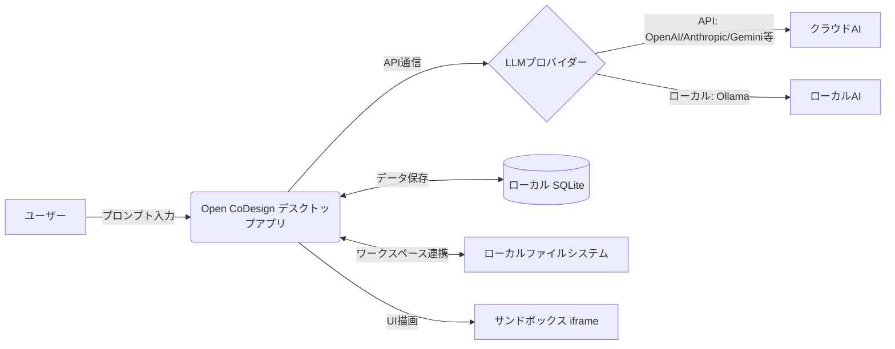

# **Open CoDesign 調査レポート**

## **1. 基本情報**

* **ツール名**: Open CoDesign
* **ツールの読み方**: オープン コーデザイン
* **開発元**: OpenCoworkAI Contributors
* **公式サイト**: [https://opencoworkai.github.io/open-codesign/](https://opencoworkai.github.io/open-codesign/)
* **関連リンク**:
  * GitHub: [https://github.com/OpenCoworkAI/open-codesign](https://github.com/OpenCoworkAI/open-codesign)
* **カテゴリ**: AIコーディング支援
* **概要**: プロンプトから洗練されたUIプロトタイプ、スライドデッキ、マーケティングアセットなどを生成する、オープンソースのデスクトップAIデザインツール。Claude Design、v0、Bolt.newなどのクラウド専用ツールの代替として、Bring Your Own Key (BYOK) モデルを採用し、ローカル環境で動作する。

## **2. 目的と主な利用シーン**

* **解決する課題**: クラウドベースのAIデザインツールにおける特定のモデルやサブスクリプションへのロックイン、データプライバシーの懸念を解消する。
* **想定利用者**: 開発者、デザイナー、プロダクトマネージャー、スタートアップ企業
* **利用シーン**:
  * プロンプトからランディングページやダッシュボードのプロトタイプを即座に作成する
  * スライドデッキやマーケティング用のアセットを生成する
  * コード（HTML, React JSX）として出力し、既存のプロジェクトに素早く組み込む

## **3. 主要機能**

* **マルチモデル対応 (BYOK)**: Anthropic, OpenAI, Gemini, DeepSeek, OpenRouter, SiliconFlow、さらにローカルのOllamaなど、20以上のモデルをサポート。
* **プロンプトからのUI生成**: プロンプトを入力するだけで、HTMLやJSX（React）のコンポーネントプロトタイプを生成し、サンドボックス化されたiframeでレンダリングする。
* **ローカルワークスペースモード**: ユーザーのローカルフォルダを直接デザインワークスペースとして紐づけ、ファイルの読み書きやリアルタイムプレビューが可能。
* **AI画像生成**: ChatGPT PlusのOAuthトークンやOpenRouter経由で、プロンプトに応じた画像を直接アセットとして生成できる。
* **AIスライダーと部分編集**: AIが生成した要素の色、余白、フォントなどをスライダーで調整可能。また、要素をクリックしてピンを置き、その部分だけをAIに再記述させるコメントモードを備える。
* **多様なエクスポート**: 生成した成果物をHTML (インラインCSS)、PDF (ローカルChromeを利用)、PPTX、ZIP、Markdownなどの形式で出力可能。

## **4. 動作原理・システム構成**

* **アーキテクチャ**: ローカルファーストのデスクトップクライアント型アーキテクチャ（Electron/Webスタックベース）。
* **主要コンポーネントとデータフロー**:
  * ユーザーのプロンプトや設定はローカルのSQLiteデータベースに保存される。
  * アプリケーションはLLMプロバイダー（OpenAI, Anthropic等）やローカルLLM（Ollama）のAPIと直接通信し、コード生成を行う。
  * 生成されたUIコンポーネント（HTML/React JSXなど）は、セキュリティを確保したサンドボックス化されたiframe内でレンダリングされる。
  * 「ローカルワークスペースモード」により、ユーザーのローカルファイルシステム上のディレクトリに直接設計ファイルを保存・バインドし、変更をリアルタイムで反映する。



* **特筆すべき要素技術**:
  * **Electron**: デスクトップアプリケーションの実行基盤。
  * **BYOK (Bring Your Own Key)**: アプリケーションに組み込まれた認証ではなく、ユーザー自身のAPIキーを安全に保存し利用する仕組み。
  * **サンドボックス iframe**: AIが生成した未検証のコードを安全に実行・プレビューするための隔離環境。

## **5. 開始手順・セットアップ**

* **前提条件**:
  * macOS 12+ (Monterey以降), Windows 10+, または Linux (glibc ≥ 2.31)
  * 利用したいAIモデルのAPIキー、またはローカルのOllama環境
* **インストール/導入**:

  ```bash
  # macOS (Homebrew)
  brew install --cask opencoworkai/tap/open-codesign

  # Windows (winget)
  winget install OpenCoworkAI.OpenCoDesign
  ```

* **初期設定**:
  * 初回起動時に表示される設定画面で、AnthropicやOpenAIなどのAPIキーを入力する。設定は `~/.config/open-codesign/config.toml` に安全に保存される。
* **クイックスタート**:
  * 内蔵されている15種類のデモ（ランディングページ、ダッシュボードなど）から選択するか、独自のプロンプトを入力してプロトタイプの生成を開始する。

## **6. 特徴・強み (Pros)**

* 完全なローカルアプリとして動作し、クラウドへの強制的なデータ同期がないためプライバシーが確保される。
* 単一のベンダーに依存せず、自分が既に利用している、または安価なAPIプロバイダーのモデルを自由に選択できる。プロキシやTLS検証バイパスも設定可能で、企業内ネットワークにも柔軟に対応。
* 生成の過程（ツールの呼び出しやTODO）がリアルタイムに表示され、途中でキャンセルすることも可能。

## **7. 弱み・注意点 (Cons)**

* インストーラ（macOSのDMGやWindowsのEXE）にコード署名が施されていない（v0.1時点。v0.5で対応予定）ため、インストール時にOSのセキュリティ警告を回避する手順が必要。
* API利用料はユーザー自身が負担する必要がある（BYOK方式の性質上）。
* 大規模なアプリケーション全体ではなく、コンポーネントや単一ページの生成が主なスコープである。

## **8. 料金プラン**

| プラン名 | 料金 | 主な特徴 |
|---------|------|---------|
| **オープンソース (MIT)** | 無料 | ソフトウェア自体は無料。利用するAIモデルのAPIトークンコストのみユーザー負担。 |

* **課金体系**: BYOK (Bring Your Own Key) のため、使用する各AIプロバイダーのAPI料金に従属する。ローカルモデル（Ollamaなど）を利用する場合は完全に無料。
* **無料トライアル**: なし（完全に無料のオープンソースツール）。

## **9. 導入実績・事例**

* **導入企業**: 新規のオープンソースプロジェクトのため、具体的なエンタープライズの導入企業名は公開されていない。
* **導入事例**: GitHub上で5,000以上のスターを獲得しており、LINUX DOなどの開発者コミュニティを中心に、個人開発者やデザイナーによる利用が急速に広がっている。
* **対象業界**: ソフトウェア開発、ウェブデザイン、スタートアップ。

## **10. サポート体制**

* **ドキュメント**: GitHubリポジトリのREADMEが公式ドキュメントとして機能している。
* **コミュニティ**: GitHub Discussions、Issueトラッカー、LINUX DO（中国語圏）などのコミュニティが活発。また、WeChatグループも存在する。
* **公式サポート**: オープンソースのため、商用の専任サポート窓口はない。コミュニティ主導のサポートとなる。

## **11. エコシステムと連携**

### **11.1 API・外部サービス連携**

* **API**: ツール自体がAPIを提供するのではなく、外部のOpenAI互換APIやAnthropic APIを消費するクライアントとして機能する。
* **外部サービス連携**: OpenAI, Anthropic, Google Gemini, OpenRouter, SiliconFlow などの各種LLMプロバイダーとシームレスに連携。

### **11.2 技術スタックとの相性**

| 技術スタック | 相性 | メリット・推奨理由 | 懸念点・注意点 |
|:---|:---:|:---|:---|
| **React (JSX)** | ◎ | ネイティブでReactコンポーネントのプロトタイプを生成可能 | - |
| **HTML/CSS/JS** | ◎ | インラインCSSを含む完全なHTMLファイルとしてエクスポート可能 | 複雑なステート管理は別途実装が必要 |
| **Ollama (ローカルLLM)** | ◯ | 完全なオフライン環境での生成が可能 | モデルの性能によって生成品質が左右される |

## **12. セキュリティとコンプライアンス**

* **認証**: OAuthを用いたChatGPT PlusやCodexのサブスクリプションログインに対応。APIキーはローカルデバイス上にのみ保存される。
* **データ管理**: プロンプトや生成履歴はローカルのSQLiteデータベースに保存され、クラウドへの送信は選択したAIプロバイダーのAPI経由のみに限定される。
* **準拠規格**: オープンソースソフトウェアであり、特定のコンプライアンス認証（SOC2など）は取得していない。ただし、企業内でBYOKとして利用し、セキュアなエンドポイント（Azure OpenAIなど）に向けることで、企業ポリシーに準拠させやすい。

## **13. 操作性 (UI/UX) と学習コスト**

* **UI/UX**: 左側にプロンプト、右側にライブプレビューが配置された直感的なデザイン。レスポンシブなビュー切り替え（モバイル、タブレット、デスクトップ）や、部分的な修正を指示する「コメントモード」など、洗練されたUXを提供する。
* **学習コスト**: APIキーの設定さえ完了すれば、自然言語で指示を出すだけなので学習コストは非常に低い。既存のClaude Codeユーザーなどはワンクリックで設定をインポートできる。

## **14. ベストプラクティス**

* **効果的な活用法 (Modern Practices)**:
  * プロジェクトに `SKILL.md` を追加して、独自のコンポーネントライブラリやデザインシステム（色使い、フォントなどのルール）をAIに学習させる。
  * コメントモードを活用し、全体を作り直すのではなく、微調整が必要なUI要素のみをピンポイントで修正させる。
* **陥りやすい罠 (Antipatterns)**:
  * 複雑すぎるアプリケーションのロジックまで一度に生成させようとすること。本ツールはあくまで「デザイン」と「UIモックアップ」の生成に特化させるのが望ましい。

## **15. ユーザーの声（レビュー分析）**

* **調査対象**: GitHubのStar数・Issue、LINUX DOコミュニティ
* **総合評価**: GitHubで5,100以上のスターを獲得しており、非常に高い注目を集めている。
* **ポジティブな評価**:
  * 「Vercel v0やClaude Designの強力な代替でありながら、ローカル環境で動かせる点が素晴らしい」
  * 「自分の好きなモデル（API）を使えるので、クラウド型のサブスクリプションに縛られない」
  * 「Claude Codeの設定をそのままインポートできるのが非常に便利」
* **ネガティブな評価 / 改善要望**:
  * 「macOSなどでインストール時にセキュリティ警告が出てしまい、ターミナルからのコマンド実行が必要なのが少し手間」
  * 「さらに多くのUIフレームワーク（VueやSvelteなど）の出力にも対応してほしい」
* **特徴的なユースケース**:
  * ローカルのOllamaと組み合わせて、完全にオフラインでセキュアなネットワーク内においてUIプロトタイプを生成する用途。

## **16. 直近半年のアップデート情報**

* **2026-09-19**: v0.2.2 リリース。HTMLスキルにデザインリファレンスを追加し、UIキット分解の検証機能などを実装。
* **2026-05-23**: v0.2.1 リリース。企業向けネットワークでの利用を想定したHTTPプロキシ設定と、プロバイダー別のTLS検証バイパス機能を追加。ローカルワークスペースモードを実装し、ローカルフォルダでの直接設計が可能に。
* **2026-05-09**: v0.2.0 リリース。デザインプロジェクトごとのワークスペース機能、既存ファイル読み取り、プロバイダーの機能プロファイルを明示化する設定の追加など。
* **2026-04-23**: v0.1.4 リリース。AI画像生成（OpenAI/OpenRouter経由）のサポート、ChatGPT Plus/Codexのログイン対応、CLIProxyAPIのインポート機能などを追加。
* **2026-04-21**: v0.1.3 リリース。Geminiモデルのプレフィックス修正、OpenAI互換リレーの最適化。
* **2026-04-21**: v0.1.2 リリース。Homebrew、winget、Scoopなどのパッケージマネージャー用マニフェストを提供。

(出典: [GitHub Releases](https://github.com/OpenCoworkAI/open-codesign/releases))

## **17. 類似ツールとの比較**

### **17.1 機能比較表 (星取表)**

| 機能カテゴリ | 機能項目 | Open CoDesign | Figma | Claude Code |
|:---:|:---|:---:|:---:|:---:|
| **基本機能** | UI/プロトタイプ生成 | ◎<br><small>プロンプトから生成</small> | ◎<br><small>UIデザインの業界標準</small> | ×<br><small>コーディングが主目的</small> |
| **環境** | ローカル動作 | ◎<br><small>デスクトップアプリ</small> | △<br><small>デスクトップアプリはあるがクラウド依存</small> | ◎<br><small>ローカル環境のCLIで動作</small> |
| **モデル選択** | BYOK/モデル選択 | ◎<br><small>任意のAPIやローカルLLMに対応</small> | ×<br><small>独自のAI機能（Figma AI）</small> | ×<br><small>Claudeモデルに特化</small> |
| **非機能要件** | オープンソース | ◎<br><small>MITライセンス</small> | ×<br><small>プロプライエタリ</small> | ×<br><small>プロプライエタリ</small> |

### **17.2 詳細比較**

| ツール名 | 特徴 | 強み | 弱み | 選択肢となるケース |
|---------|------|------|------|------------------|
| **Open CoDesign** | ローカル型のオープンソースAIデザインツール | 任意のモデルを使用可能、データプライバシーが高い、無料 | 手作業による微細なピクセル単位の調整には不向き | 機密性の高いプロジェクトや、特定のAPIを利用してプロトタイプを生成したい場合 |
| **Figma** | クラウドベースの共同デザインツール | 圧倒的なシェア、豊富なプラグインとコラボレーション機能 | サブスクリプションが必要、クラウド依存 | チームでの本格的なUI/UXデザインやデザインシステムの構築を行う場合 |
| **Claude Code** | Anthropic提供の自律型コーディングエージェント | CLIで直接ローカルのコードベースを編集・実行可能 | UIのビジュアル生成やプロトタイピング機能はない | 既存のコードベースの修正やターミナル上での開発支援が必要な場合 |

## **18. 総評**

* **総合的な評価**:
  Open CoDesignは、AIを活用したUIデザイン生成ツールの分野において、クラウド依存のSaaSモデルに対する強力な「オープンソースかつローカル志向」のオルタナティブである。BYOKアプローチにより、ユーザーは好きなAIモデルを選択でき、コストやプライバシーを自らコントロールできる点が非常に高く評価できる。
* **推奨されるチームやプロジェクト**:
  ソースコードや設計指示をクラウド上の第三者サービスに送信したくないエンタープライズのセキュリティ要件を持つチーム、ローカルLLMを活用したい開発者、特定のAPIプロバイダーをすでに契約しているユーザー。
* **選択時のポイント**:
  SaaS型の手軽さを取るか（v0など）、データコントロールと自由度を取るか（Open CoDesign）。本格的なUI/UXデザインをチームで行う場合はFigmaが必須となるが、プロンプトからの迅速なプロトタイピングや、ローカルでの安全なコード出力としてはOpen CoDesignが非常に有用である。また、コーディング支援においてはClaude CodeのようなCLI特化ツールとの使い分けが重要になる。
