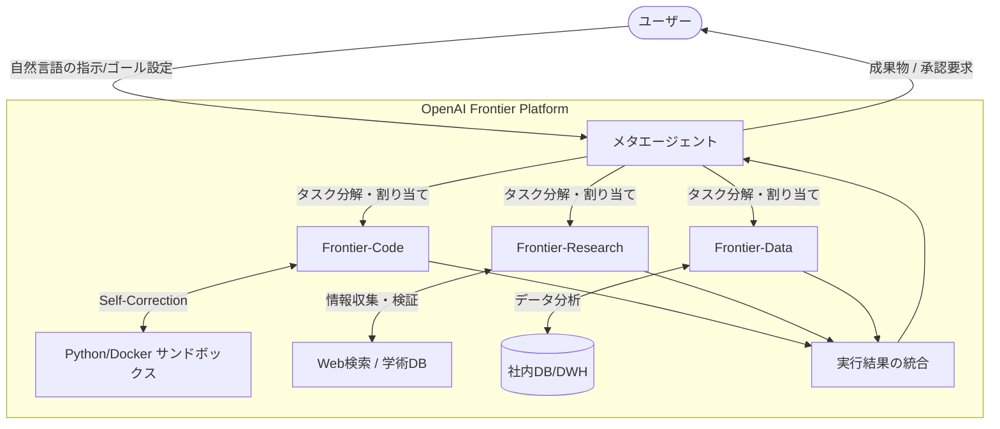

# **OpenAI Frontier 調査レポート**

## **1. 基本情報**

* **ツール名**: OpenAI Frontier
* **ツールの読み方**: オープンエーアイ フロンティア
* **開発元**: OpenAI
* **公式サイト**: [https://openai.com/frontier](https://openai.com/frontier)
* **カテゴリ**: 自律型AIエージェント
* **概要**: OpenAI Frontierは、GPT-5.2および次世代の推論モデル（o-series successor）を基盤とした、自律型エージェントプラットフォームです。従来のチャットボットとは異なり、数時間から数週間にわたる長期的なタスク（科学論文の調査、大規模なコードリファクタリング、市場分析など）を、人間の最小限の監督下で自律的に遂行するように設計されています。

## **2. 目的と主な利用シーン**

* **解決する課題**: 単発の質問応答では解決できない、複雑な推論と試行錯誤、そして外部情報の広範な探索を必要とする「Deep Work」の自動化。
* **想定利用者**: 研究機関の科学者、エンタープライズ企業のR&D部門、シニアソフトウェアエンジニア。
* **利用シーン**:
  * **Frontier-Research**: 特定の病気に関する過去10年分の論文を網羅的に調査し、新たな仮説を立案してレポートを作成する。
  * **Frontier-Code**: レガシーなシステムを解析し、現代的なアーキテクチャへの移行計画を策定・コード変換・テストまでを行う。
  * **Frontier-Data**: 社内の非構造化データを分析し、経営戦略に資するインサイトを発見する。

## **3. 主要機能**

OpenAI Frontierは、以下の3つの特化型エージェント（Persona）を提供しています。

* **Frontier-Research (科学・調査)**:
  * **Deep Research**: ウェブ上の信頼できる情報源や学術データベース（ArXiv, PubMed等）にアクセスし、情報の収集・検証・統合を行う。
  * **仮説検証ループ**: 収集した情報に基づき仮説を立て、さらなる調査やシミュレーション（Pythonサンドボックス利用）を行って検証する。
* **Frontier-Code (エンジニアリング)**:
  * **自律コーディング**: リポジトリ全体を理解し、機能追加やバグ修正だけでなく、大規模なリアーキテクチャを実行可能。
  * **環境認識**: Dockerコンテナやクラウド環境を操作し、デプロイや動作検証まで完結させる。
* **Frontier-Data (データ分析)**:
  * **高度な推論**: 数値データの背後にある因果関係を推論し、単なる可視化を超えた「意味」を抽出する。
  * **マルチモーダル分析**: テキスト、画像、音声、数値データを統合的に分析。

## **4. 動作原理・システム構成**

* **アーキテクチャ**: クラウド完結型のマルチエージェントオーケストレーションシステム
* **主要コンポーネントとデータフロー**:
  * GPT-5.2およびo-seriesの後継推論モデルをコアエンジンとして採用
  * ユーザーのゴール設定に基づき、メタエージェントがタスクを分解し、特化型エージェント（Research, Code, Data）に割り当てる
  * 各エージェントは提供されたサンドボックス環境内でツールを自律的に使用し、結果をメタエージェントにフィードバックする
* **特筆すべき要素技術**:
  * **Self-Correctionループ**: 実行中のエラーを自律検知してアプローチを修正する推論機能
  * **Zero Data Retention**: Enterpriseプラン向けの厳格なデータ隔離環境

## **5. 開始手順・セットアップ**

* **前提条件**:
  * OpenAI Enterprise または Team プランの契約。
  * Frontier Access Programへの参加（ベータ期間中）。
* **初期設定**:
  * OpenAI Dashboardから「Frontier」セクションにアクセス。
  * エージェントがアクセス可能なデータソース（GitHub, Google Drive, OneDrive等）を接続。
  * コンプライアンス設定（自律動作の範囲制限）を行う。
* **クイックスタート**:
  * Dashboard上で「新しいプロジェクト」を作成し、ゴール（例：「競合A社の過去3年の特許戦略を分析せよ」）を自然言語で入力して実行開始。

## **6. 特徴・強み (Pros)**

* **圧倒的な推論能力**: GPT-5.2の能力をフル活用し、複雑な論理的整合性を保ちながら長文のレポートや大規模なコードを生成できる。
* **自己修正能力 (Self-Correction)**: 作業途中でエラーや矛盾に遭遇した場合、自ら原因を分析し、アプローチを変更して再試行する能力が非常に高い。
* **人間との協調**: 重要な意思決定ポイントでは人間に承認を求め、フィードバックを即座に学習して方針を修正するインタラクティブな設計。

## **7. 弱み・注意点 (Cons)**

* **コスト**: 膨大な計算資源を使用するため、1タスクあたりのコストが従来のLLM利用に比べて桁違いに高くなる可能性がある。
* **実行時間**: 「思考」と「試行錯誤」に時間をかけるため、即答性はなく、結果が出るまでに数時間〜数日かかる場合がある。
* **ハルシネーションの複雑化**: 推論が高度化しているため、もっともらしいが誤っている結論（論理的なハルシネーション）を見抜くのが難しくなっている。

## **8. 料金プラン**

| プラン名 | 料金 | 主な特徴 |
|---------|------|---------|
| **Frontier Beta (Team)** | 基本料金 + 従量課金 | コンピュートユニット単位での課金。小規模チーム向け。 |
| **Frontier Enterprise** | カスタム見積もり | セキュリティ強化、専任サポート、SLA付き。 |

* **課金体系**: エージェントが消費した「コンピュート時間」と「トークン数」に基づく複合的な従量課金モデル。
* **無料トライアル**: 原則なし（招待制プレビューのみ）。

## **9. 導入実績・事例**

* **導入企業**: 大手製薬会社、国立研究所、トップティアのテック企業（非公開）。
* **導入事例**:
  * **創薬研究**: 候補化合物の探索プロセスを従来の数ヶ月から数週間に短縮。
  * **金融分析**: グローバル市場の変動要因をリアルタイムで分析し、投資レポートを自動生成。

## **10. サポート体制**

* **ドキュメント**: 技術ドキュメントに加え、「エージェントへの指示（Prompt Engineering for Agents）」に関する詳細なガイドラインを提供。
* **コミュニティ**: 開発者フォーラムおよびDiscordの限定チャンネル。
* **公式サポート**: Enterpriseプランでは24時間365日の優先サポートが提供される。

## **11. エコシステムと連携**

### **11.1 API・外部サービス連携**

* **API**: Assistants APIの上位版として「Frontier API」を提供。外部アプリからエージェントを呼び出し可能。
* **連携ツール**:
  * **コード**: GitHub, GitLab
  * **ドキュメント**: Notion, Google Workspace, Microsoft 365
  * **データ**: Snowflake, Databricks (コネクタ経由)

### **11.2 技術スタックとの相性**

Python SDKが充実しており、LangChainやLlamaIndexなどのフレームワークとも順次対応予定だが、Frontier自体がオーケストレーション機能を持つため、単体での利用が推奨されるケースも多い。

## **12. セキュリティとコンプライアンス**

* **認証**: SAML SSO, MFA対応。
* **データ管理**: Enterpriseプランでは、データは学習に使用されず、厳格なアクセス制御下で処理される（Zero Data Retentionオプションあり）。
* **準拠規格**: SOC2 Type 2, GDPR, HIPAA準拠（オプション）。
* **安全性**: エージェントの行動が安全ガイドラインを逸脱しないよう、独立した監視モデル（Safety Monitor）が常時チェックを行う。

## **13. 操作性 (UI/UX) と学習コスト**

* **UI/UX**: プロジェクト管理ツールのようなダッシュボードで、エージェントの思考プロセス（Chain of Thought）や作業ログを可視化できる。透明性が高く、何をしているかがわかりやすい。
* **学習コスト**: 自然言語で指示できるが、エージェントの能力を最大限引き出すためには、タスクの分解やゴール設定のスキル（エージェントマネジメント）が必要。

## **14. ベストプラクティス**

* **ゴールは明確に、プロセスは柔軟に**: エージェントに「何を達成したいか」を明確に伝え、「どうやるか」はある程度任せるのがコツ。
* **中間チェックポイントの設置**: 数日かかるタスクの場合、定期的に中間報告をさせ、方向性がずれていないか確認する。
* **情報のサンドボックス化**: 機密性の高い情報を扱う場合は、アクセス権限を絞った専用の環境（コンテナ等）を用意する。

## **15. ユーザーの声（レビュー分析）**

* **調査対象**: クローズドベータ参加者のブログ、SNS（X, LinkedIn）
* **総合評価**: (G2、Capterraにレビュー登録なし。SNSの定性評価が中心)
* **ポジティブな評価**:
  * 「自分専用の優秀な研究助手ができたようだ。寝ている間に論文を読み漁ってくれる。」
  * 「リファクタリングのような退屈だが認知負荷の高い作業から解放された。」
  * 「複数ツールの組み合わせによるタスク自動化が、1つのプロンプトで完結するようになった。」
* **ネガティブな評価 / 改善要望**:
  * 「コストが見積もりにくい。気づいたらクレジットを大量に消費していた。」
  * 「時々、同じループに陥って抜け出せなくなることがある。」
  * 「実行プロセスがブラックボックス化しやすく、途中での軌道修正が難しい。」
* **特徴的なユースケース**:
  * 「社内の分散したナレッジベースから特定の条件に合致する情報を抽出し、新規プロジェクトの提案書を自動作成する。」

## **16. 直近半年のアップデート情報**

* **2026-10-02**: 推論能力および外部ツール（Pythonサンドボックス等）とのシームレスな統合を強化したマイナーアップデートを公開。
* **2026-08-15**: Enterpriseプラン向けに「Zero Data Retention」オプションの提供を開始。機密データを扱うタスクでの安全性が向上。
* **2026-05-10**: Frontier APIの呼び出し遅延を改善し、リアルタイム性が求められる一部のタスクに対応可能に。
* **2026-02-01**: **OpenAI Frontier Public Beta** を公開。Teamプラン以上のユーザーが利用可能に。
* **2026-01-15**: スペシャルイベントにて「OpenAI Frontier」を発表。GPT-5.2を統合した初の自律エージェント基盤として紹介。

(出典: [OpenAI Blog - Product Updates](https://openai.com/blog))

## **17. 類似ツールとの比較**

### **17.1 機能比較表 (星取表)**

| 機能カテゴリ | 機能項目 | OpenAI Frontier | AWS Frontier Agents | Devin | GitHub Copilot |
|:---:|:---|:---:|:---:|:---:|:---:|
| **得意領域** | 汎用性 | ◎ <small>研究・開発・分析に特化</small> | ◎ <small>開発・Sec・Opsをカバー</small> | ◯ <small>開発中心</small> | ◯ <small>開発中心</small> |
| **推論能力** | 深い思考 | ◎ <small>GPT-5.2 + o-series後継</small> | ◯ <small>Claude/Bedrock等</small> | ◯ <small>独自モデル</small> | △ <small>コード生成主体</small> |
| **環境統合** | インフラ連携 | ◯ <small>API/SDK主体</small> | ◎ <small>AWS基盤と深く統合</small> | ◎ <small>クラウド上の完結IDE</small> | ◎ <small>各種IDE/CLI等</small> |
| **自律性** | 自律タスク実行 | ◎ <small>数日間の自律実行</small> | ◎ <small>持続的な自律稼働</small> | ◎ <small>完全自律</small> | △ <small>Agent機能はあるが支援寄り</small> |

### **17.2 詳細比較**

| ツール名 | 特徴 | 強み | 弱み | 選択肢となるケース |
|---------|------|------|------|------------------|
| **OpenAI Frontier** | 最高峰の推論モデルを搭載した汎用自律エージェント | 「研究」や「分析」など、答えのない問いに対する探索能力が圧倒的。 | コストが高く、応答速度が遅い。AWSなどの特定インフラへの密結合はAWS Frontier Agentsに劣る。 | 最先端の科学研究、新規事業のリサーチ、大規模かつ複雑な問題解決を行いたい場合。 |
| **AWS Frontier Agents** | 開発・セキュリティ・運用の特化型エージェント群 | AWSエコシステムとの統合、専門性の高さ、持続的な自律稼働。 | AWS環境以外での利用制約（特にDevOps Agent）。 | AWSを全面的に採用しており、セキュリティや運用の負荷軽減を模索しているDevSecOpsチーム。 |
| **Devin** | 自律型AIソフトウェアエンジニア | 計画からデプロイまで一貫して実行可能。独自の統合開発環境を持つ。 | 複雑なエンジニアリング課題の成功率。コストが高め。 | 明確に定義されたプロトタイプ開発や自動化タスクを委任したい場合。 |
| **GitHub Copilot** | 開発者支援AIアシスタント | 圧倒的な普及率、IDEへの統合。Workspaceによるタスク実行。 | 完全な自律性や運用・セキュリティ領域への対応は限定的。 | 既存の開発フローを維持しつつ、生産性を向上させたい場合。 |

## **18. 総評**

* **総合的な評価**: OpenAI Frontierは、生成AIを「ツール」から「パートナー」へと進化させる決定打です。特にFrontier-Researchエージェントの能力は、知識労働のあり方を根本から変えるポテンシャルを秘めています。現時点ではコストと速度の課題がありますが、その成果物の質はそれを補って余りあるものです。
* **推奨されるチームやプロジェクト**: 新規性の高いR&Dプロジェクト、複雑なレガシーシステムの刷新プロジェクト、戦略コンサルティングファーム。
* **選択時のポイント**: 「既存の作業の効率化」ではなく、「人間だけでは時間的に不可能な深さ・広さでの検討」を求める場合に、Frontierは唯一無二の選択肢となります。逆に、定型的なタスクの自動化であれば、より軽量なエージェントや従来の自動化ツールの方がコスト対効果が良いでしょう。
