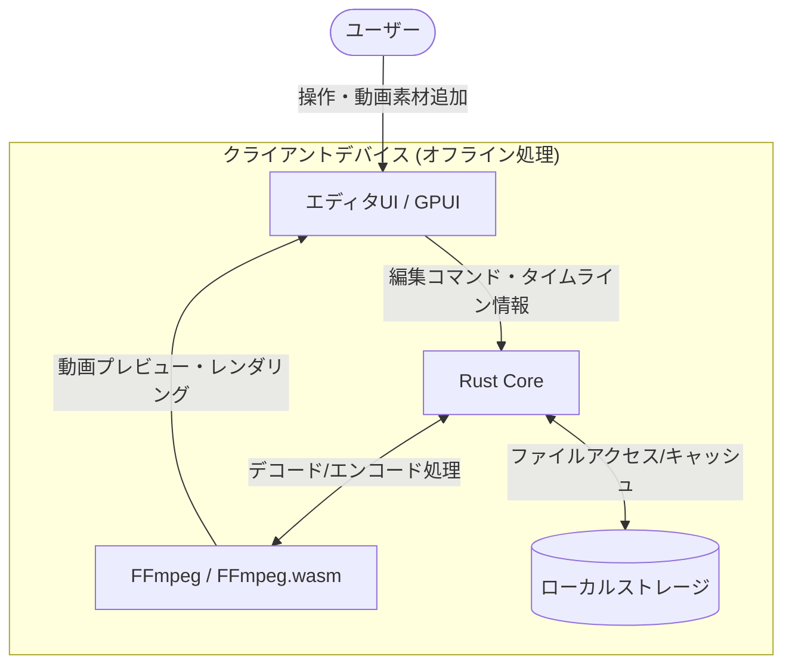

# **OpenCut 調査レポート**

## **1. 基本情報**

* **ツール名**: OpenCut
* **ツールの読み方**: オープンカット
* **開発元**: OpenCut-app (オープンソースコミュニティ)
* **公式サイト**: [https://opencut.app/](https://opencut.app/)
* **関連リンク**:
  * GitHub: [https://github.com/OpenCut-app/OpenCut](https://github.com/OpenCut-app/OpenCut)
  * DeepWiki: [https://deepwiki.com/OpenCut-app/OpenCut](https://deepwiki.com/OpenCut-app/OpenCut)
* **カテゴリ**: 動画編集
* **概要**: OpenCutは、Web、デスクトップ、モバイル向けに設計された無料かつオープンソースの動画編集ソフトウェアです。データがデバイス上に留まるプライバシー重視の設計であり、CapCutにインスパイアされた直感的なUIを備えながら、基本的な動画編集機能を無料で提供します。現在はRustコアベースの新アーキテクチャへの全面書き換えが進行中です。

## **2. 目的と主な利用シーン**

* **解決する課題**: サードパーティサーバーへの動画アップロードによるプライバシーリスクの排除と、主要な動画編集ツールで基本機能が有料化されている問題の解決。
* **想定利用者**: 動画クリエイター、YouTuber、SNS運用担当者、プライバシーを重視する一般ユーザー。
* **利用シーン**:
  * YouTubeやTikTokなどのSNS向けショート動画やVlogの編集
  * プロジェクトのプレゼンテーション用動画の作成
  * 外部サーバーに動画データをアップロードしたくない機密性の高い動画の編集

## **3. 主要機能**

* **タイムライン編集**: 複数トラックをサポートする直感的なタイムライン。リップル編集やクリップの分割、トリミングが可能。
* **キーフレームアニメーション**: プロパティの経時変化をアニメーション化するキーフレーム機能。ベジェ曲線でイージングを調整できるグラフエディタを搭載。
* **マスク機能**: 動画や画像の一部を隠したり表示したりする機能。矩形、楕円、星、ハート、ひし形などの形状が利用可能。
* **エフェクトと合成**: ブラーエフェクトなどのクリップまたはタイムライン上で独立した要素として適用できるエフェクトシステム。合成モード（乗算、スクリーンなど）のサポート。
* **プロパティ・速度制御**: オーディオとビデオの音量制御や、ピッチを維持したままの再生速度変更機能。
* **テキスト・ステッカー追加**: フォントピッカー、絵文字、国旗、図形などの豊富なステッカー要素の追加とカスタマイズ。
* **自動キャプション**: トランスクリプトファイルをインポートして字幕を生成する機能。
* **ローカル・ブラウザベースの処理**: 動画処理とレンダリングは、FFmpeg.wasmとRust/wgpuベースのコンポジタを用いてすべてクライアント側で行われる。

## **4. 動作原理・システム構成**

* **アーキテクチャ**: ローカルファーストのクライアント処理構成。Web、デスクトップ、モバイル版を一つのRustコアベースで統合し、動画処理は完全にクライアント側で実行されるアーキテクチャへ書き換えが進行中。
* **主要コンポーネントとデータフロー**:
  * エディタのUI操作から発行されるコマンドがRustコアへ渡り、ローカル環境のファイルやメモリにアクセスして処理を実行する。
  * プレビューやエンコードではFFmpeg（WASM版・ネイティブ版）と連携し、デバイスの計算リソースを活用する。動画データは一切外部サーバーへアップロードされない。
* **特筆すべき要素技術**:
  * **Rust / GPUI**: 新アーキテクチャの基盤技術。高速で安全なコアと、クロスプラットフォーム向けのネイティブUIを提供するGPUI。
  * **FFmpeg**: メディアのデコード・エンコードの中核。



## **5. 開始手順・セットアップ**

* **前提条件**:
  * 開発・ビルドツールとして proto / Bun をインストール済みであること（Windowsの場合はWSL2等の設定が必要）。
* **インストール/導入**:

  ```bash
  # リポジトリのクローンとセットアップ
  git clone https://github.com/OpenCut-app/OpenCut.git
  cd OpenCut
  bun install
  ```

* **初期設定**:
  * 新しいアーキテクチャ（Rustベース）に対応するため、`crates/media/setup/pin.ts` 等を用いたFFmpeg等の依存バイナリのセットアップが必要。
* **クイックスタート**:
  * Web版の開発サーバー起動：
    ```bash
    bun dev:web
    ```
  * アプリケーションは `http://localhost:3000` で利用可能になる。

## **6. 特徴・強み (Pros)**

* 完全ローカル処理かつプライバシーファーストの設計であり、動画データがデバイス外に送信されないためセキュリティが高い。
* 他のツールでは有料化されているような基本機能（速度調整、マスク、キーフレーム等）が完全無料で利用できる。
* CapCutなどの人気ツールに影響を受けた、シンプルで学習コストの低いUI。
* Next.js、Rust、GPUI、WASMなどを活用したモダンなアーキテクチャにより、クロスプラットフォームで高いパフォーマンスを発揮する。

## **7. 弱み・注意点 (Cons)**

* RustコアやGPUIを用いた次世代アーキテクチャへの全面的な書き換え（Rewrite）プロジェクトが進行中であり、機能の移植・リファクタリングの影響で動作が不安定な場合がある。
* デスクトップアプリなどは現在開発初期段階であり、十分な機能が揃っていない。
* Webブラウザでの動作に依存する部分では、端末のハードウェアスペックやブラウザのGPUアクセラレーション対応状況にパフォーマンスが左右される。
* 日本語対応に関する詳細な情報（UIの日本語化など）が公式で明記されていないため、英語での利用が前提となる場合がある。

## **8. 料金プラン**

| プラン名 | 料金 | 主な特徴 |
|---------|------|---------|
| **無料プラン (OSS)** | 無料 | すべての機能が無料で利用可能、ローカル実行 |

* **課金体系**: 完全無料（オープンソース）
* **無料トライアル**: 全機能無料のため該当なし

## **9. 導入実績・事例**

* **導入企業**: オープンソースプロジェクトのため、特定の企業導入事例は公式サイトやGitHubには明示されていない。
* **導入事例**: Vercelとfal.aiからオープンソースソフトウェアとしてのサポートを受けている。
* **対象業界**: 個人クリエイター、手軽かつ安全に動画編集を行いたいユーザー。

## **10. サポート体制**

* **ドキュメント**: GitHubリポジトリ内にアーキテクチャや開発者向けのドキュメント（DeepWikiや`docs/`ディレクトリ）が整備されている。
* **コミュニティ**: GitHubのIssueやPull Request、DiscussionsやDiscordを通じた活発なコミュニティ活動が行われている。
* **公式サポート**: オープンソースであるため、商用の公式サポート窓口（電話等）は提供されていない。GitHubやDiscord上でのバグ報告や機能要望となる。

## **11. エコシステムと連携**

### **11.1 API・外部サービス連携**

* **API**: 外部から利用するための公開APIは現在提供されていないが、AIエージェント向けのMCPサーバー対応や、自動化用ヘッドレスモードが計画されている。
* **外部サービス連携**: 主にローカルで完結するツールであるが、将来的なクラウドデプロイメント向けにCloudflare Workers（OpenNext経由）などをサポートしている。

### **11.2 技術スタックとの相性**

| 技術スタック | 相性 | メリット・推奨理由 | 懸念点・注意点 |
|:---|:---:|:---|:---|
| **Rust / GPUI** | ◎ | クロスプラットフォーム向けの高パフォーマンスな新コアとして採用 | 拡張や修正には高度なRustの知識が求められる |
| **Next.js (Webアプリ)** | ◎ | フロントエンドの主要フレームワークとして採用されている | 開発に参加する場合、Next.jsの知識が必要 |
| **Docker** | ◎ | セルフホストやデータベース/Redisのローカル実行環境として公式サポート | 特になし |

## **12. セキュリティとコンプライアンス**

* **認証**: Webアプリ版では、Better Authを使用した認証機能が実装されている。
* **データ管理**: 動画データはユーザーのローカルデバイス上で処理され、サーバーにアップロードされない（クライアントサイド処理）。
* **準拠規格**: オープンソースソフトウェアであり、特定のセキュリティ認証（SOC2など）の取得は明記されていない。

## **13. 操作性 (UI/UX) と学習コスト**

* **UI/UX**: CapCutにインスパイアされた直感的なタイムライン、プロパティパネル、プレビュー画面を備える。ドラッグ＆ドロップでの素材追加や、視覚的なキーフレーム編集など、モダンな動画エディタのUIを踏襲している。
* **学習コスト**: 他の動画編集ソフト（CapCutやPremiere Proなど）の経験があれば、ほぼ学習コストなしで使い始めることができる。

## **14. ベストプラクティス**

* **効果的な活用法 (Modern Practices)**:
  * 開発版を試す際は、Protoを利用した推奨ツールの自動インストールを活用して開発環境をクリーンに保つ。
  * リッチブックマーク機能を活用して、タイムライン上でシーンの計画やメモを行う。
* **陥りやすい罠 (Antipatterns)**:
  * ディスクの空き容量が極端に少ない環境でのブラウザベースの編集（プロジェクトデータが失われる可能性があるため、ブラウザの保護機能を利用する）。

## **15. ユーザーの声（レビュー分析）**

* **調査対象**: GitHub Releasesのリアクション、Star履歴、X(Twitter)等
* **総合評価**: GitHubで48,800以上のStarを獲得しており、オープンソースコミュニティから非常に高い注目と支持を集めている。
* **ポジティブな評価**:
  * CapCutの無料代替ツールとして、プライバシーを保護しつつ高度な機能（キーフレーム、マスクなど）を使える点が素晴らしい。
  * アーキテクチャの改善（Rustへの移行）により、デスクトップネイティブとしてのパフォーマンスと将来性が非常に高い。
* **ネガティブな評価 / 改善要望**:
  * 大規模なアーキテクチャの書き換え（Rewrite）に伴い、一時的に既存の機能が不足していたり、不安定になっている。
* **特徴的なユースケース**:
  * 商用エディタのサブスクリプションを避けたいユーザーの日常的な動画編集や、開発者がRust/GPUIを用いたクロスプラットフォーム実装を学ぶためのリファレンスとして。

## **16. 直近半年のアップデート情報**

* **2026-09-24**: 複数プラットフォーム（Windows, macOS, Linux）向けの共有LGPL FFmpeg 8.1.3ビルドの配布ワークフローとリリースを追加。
* **2026-07-24**: デスクトップアプリのシェル（ブラウザ、プレビュー、インスペクター、タイムラインパネル等）およびGPUIの基盤機能を追加。
* **2026-06-21**: RustコアとGPUIベースの次世代デスクトップアプリのアーキテクチャをスキャフォールド（書き換えプロジェクトの本格始動）。
* **2026-04-15**: v0.3.0リリース。マスク機能、キーフレーム曲線のグラフエディタ、音量・速度制御（ピッチ維持機能付き）、プレビューズーム機能、キャンバスのカスタムサイズ設定などを追加。

(出典: [GitHub Releases & Commits](https://github.com/OpenCut-app/OpenCut/releases))

## **17. 類似ツールとの比較**

### **17.1 機能比較表 (星取表)**

| 機能カテゴリ | 機能項目 | 本ツール (OpenCut) | AviUtl | DaVinci Resolve | Apple Creator Studio |
|:---:|:---|:---:|:---:|:---:|:---:|
| **基本機能** | タイムライン編集 | ◯<br><small>複数トラック対応</small> | ◯<br><small>拡張編集必須</small> | ◎<br><small>プロ仕様</small> | ◎<br><small>プロ品質</small> |
| **高度な機能** | プラグイン拡張 | ◯<br><small>将来設計に含む</small> | ◎<br><small>無数に存在</small> | ◯<br><small>OpenFX対応</small> | ◯<br><small>アプリ間連携</small> |
| **環境要件** | クロスプラットフォーム | ◯<br><small>Win/Mac/Linux(構築中)</small> | ×<br><small>Windows専用</small> | ◎<br><small>Win/Mac/Linux</small> | △<br><small>Appleデバイス専用</small> |
| **コスト** | 無料利用 | ◎<br><small>完全無料</small> | ◎<br><small>完全無料</small> | ◯<br><small>高機能無料版</small> | ×<br><small>サブスク必須</small> |
| **使いやすさ**| 直感的なUI | ◎<br><small>CapCutライク</small> | △<br><small>導入が煩雑</small> | △<br><small>学習コスト高</small> | ◎<br><small>非常に容易</small> |

### **17.2 詳細比較**

| ツール名 | 特徴 | 強み | 弱み | 選択肢となるケース |
|---------|------|------|------|------------------|
| **本ツール (OpenCut)** | プライバシーを重視したオープンソースの動画エディタ。 | 直感的な使いやすさで全機能が無料。Rustコアによる将来性とマルチプラットフォーム対応。 | 開発途上（現在全面書き換え中）であり、安定性や機能に制限がある。 | 手軽に動画を編集したいが、サブスクリプションを避け、将来有望なOSSを支持したい場合。 |
| **AviUtl** | 日本で古くから使われている歴史ある無料動画編集ソフト。 | プラグインが豊富で、非常に軽い動作。完全無料。 | 初期設定が難しく、UIが古め。Windows専用。 | 低スペックなWindows PCで、プラグインを駆使してこだわりの編集をしたい場合。 |
| **DaVinci Resolve** | ハリウッド映画等でも使われるプロ向けの動画編集・カラーグレーディングソフト。 | 圧倒的な高機能とカラーコレクション能力。無料版でも商用レベル。 | 学習コストが高く、要求スペック（特にGPU）が非常に高い。 | 映画や高品質なYouTube動画など、プロ品質の編集を行いたい場合。 |
| **Apple Creator Studio** | Appleのプロ向けクリエイティブアプリのバンドルサブスクリプション。 | iPadとMacのシームレスな連携、高いコストパフォーマンス。 | Appleデバイスでしか利用できず、継続的な課金が必要。 | MacやiPadを使って、動画・音楽・画像を統合的に制作したい場合。 |

## **18. 総評**

* **総合的な評価**:
  OpenCutは、ユーザーのプライバシーを最優先に考え、クライアントサイドの強力な処理能力を活かした優れたオープンソースプロジェクトです。現在、RustコアやGPUIを用いたデスクトップアプリなどの次世代アーキテクチャへの全面書き換え（Rewrite）が進行中であり、その開発の活発さとモダンな技術選定は将来性に大きな期待を持たせます。主要な商用動画エディタが基本機能を有料化しつつある中、キーフレームやマスク、速度調整といった高度な機能を完全無料で提供する方針は非常に評価できます。
* **推奨されるチームやプロジェクト**:
  個人クリエイター、YouTuber、オープンソースのソフトウェアを好むユーザー、ブラウザ上やデスクトップでデータを安全に編集したい個人やチームに最適です。
* **選択時のポイント**:
  CapCutの使いやすさを求めつつ、プライバシーや課金の壁に縛られたくない場合、OpenCutは最良の選択肢の一つです。ただし、現在は大規模な書き換えプロジェクトが進行中であるため、業務レベルでの絶対的な安定性や高度なVFXが必要な場合は、DaVinci ResolveやApple Creator Studioなどが依然として有利です。
