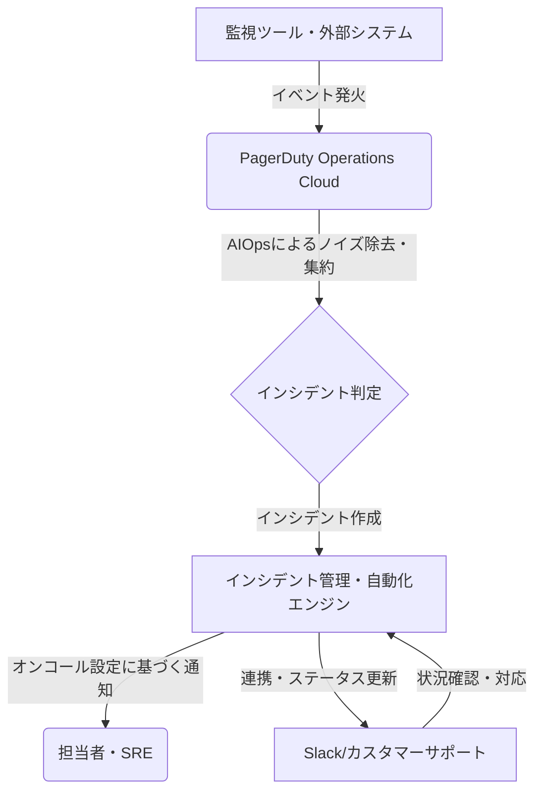

# **PagerDuty 調査レポート**

## **1. 基本情報**

<!--
【ガイドライン】
- 必須: ツール名、開発元、公式サイト、カテゴリ、概要
- 概要は2-3文で簡潔に記述
-->

* **ツール名**: PagerDuty
* **ツールの読み方**: ペイジャーデューティ
* **開発元**: PagerDuty, Inc. / PagerDuty株式会社（日本法人）
* **公式サイト**: [https://www.pagerduty.co.jp/](https://www.pagerduty.co.jp/)
* **関連リンク**:
  * ドキュメント: [https://support.pagerduty.com/](https://support.pagerduty.com/)
* **カテゴリ**: インシデント管理
* **概要**: システムのインシデント対応を一元化するプラットフォーム。AIや自動化を活用し、インシデントの検知から解決までの時間を短縮し、システムのダウンタイムを最小限に抑えることで、運用担当者の負担を軽減する。

## **2. 目的と主な利用シーン**

<!--
【ガイドライン】
- 3-5項目を箇条書きで記述
- 想定利用者を具体的に記載
-->

* **解決する課題**: アラートノイズの多さによる重要なインシデントの見落としや対応の遅れ、手作業による運用負荷の増大。
* **想定利用者**: SRE、DevOpsエンジニア、システム運用担当者、カスタマーサポートチーム。
* **利用シーン**:
  * サービス障害発生時の自動化されたオンコール対応と関係者への一斉通知。
  * 監視ツールからの大量のアラートを集約・精査し、ノイズを削減して真に重要なインシデントのみを抽出。
  * カスタマーサポートとエンジニアチームを連携させ、顧客への迅速な障害状況の共有と対応を実施。

## **3. 主要機能**

<!--
【ガイドライン】
- 5-10項目の主要機能を箇条書きで記述
- 各機能は1-2文で概要を説明
-->

* **Incident Management (インシデント管理)**: オンコールスケジュールの管理や自動化されたインシデント対応により、システムの信頼性を確保し迅速な復旧を支援する。
* **AIOps**: 機械学習（ML）を活用してアラートノイズを減らし（最大98%削減可能）、過去の類似インシデントの提示などリアルタイムのコンテキストを提供する。
* **Automation (自動化)**: イベント駆動型の自動化により、冗長な作業を減らしマシンスピードでのシステム運用を実現する。
* **Customer Service Ops**: カスタマーサポートなど部門を横断したチーム連携を支援し、顧客へのインシデント状況の共有をスムーズに行う。
* **PagerDuty Advance**: 生成AIを活用し、SlackやTeamsからのインサイトの表示やステータス更新の自動作成など、インシデントライフサイクルの各ステップを支援する機能群。
* **PagerDuty ステータスページ**: 障害状況などのデジタル・オペレーションのステータスを顧客へリアルタイムに発信するための公開ページを作成・管理する機能。

## **4. 動作原理・システム構成**

<!--
【ガイドライン】
- ツールの動作原理、システム構成（アーキテクチャ）、データの流れ、通信フローなどを記述
- クライアント・サーバー型、ローカルファースト、クラウド完結など、ツールのアーキテクチャ特性を明記
- 可能であればMermaidによる構成図やフロー図を含めること（Mermaid内のノードや説明テキストは原則日本語表記で作成する）
- 要素技術や内部で使われている仕組み（例：Docker、Git worktree、WebSockets、E2EEなど）を解説
- SaaS等の場合はわかる範囲で記述し、公開されていない場合は「非公開」とし、分かる範囲の処理フロー等を記載
-->

* **アーキテクチャ**: クラウド完結型SaaS (PagerDuty Operations Cloud)
* **主要コンポーネントとデータフロー**:
  * 監視ツールやログ管理ツール（Datadog, AWS, New Relic等）からのイベントをAPI経由で受信する。
  * AIOps（機械学習モデル）がイベントを解析・グループ化し、アラートノイズをフィルタリングする。
  * インシデント管理機能が、事前に定義されたエスカレーションポリシーやオンコールスケジュールに基づき、適切な担当者へ通知（電話、SMS、Slack等）を行う。
* **特筆すべき要素技術**:
  * 機械学習によるイベントノイズ削減とインシデント集約。
  * 大量のインテグレーション（700以上）をサポートする拡張性の高いAPI連携機能。

## **5. 開始手順・セットアップ**

<!--
【ガイドライン】
- アカウント作成から「Hello World」的な最初の動作確認までの手順
- 主要なコマンドや設定項目を記載
-->

* **前提条件**:
  * PagerDutyアカウントの作成（無料トライアルあり）
* **インストール/導入**:
  * WebブラウザからSaaSプラットフォームにアクセスして利用開始。
* **初期設定**:
  1. ユーザーのアカウント作成とプロフィールの設定（連絡先情報など）。
  2. チームの設定と、オンコールスケジュールの作成。
  3. エスカレーションポリシーの定義（誰に、どのような順番で通知するか）。
  4. 監視ツール等のシステムとのインテグレーション（API連携）の設定。
* **クイックスタート**:
  * 初期設定完了後、テスト用のイベントを発行し、指定したチャネル（電話、SMS、メール、Slack等）へ正常に通知が届くことを確認する。

## **6. 特徴・強み (Pros)**

<!--
【ガイドライン】
- 3-5項目を箇条書きで記述
- 競合との差別化ポイントを明確に
-->

* **豊富な連携機能**: 700を超えるインテグレーションが用意されており、既存のシステム監視ツールやチャットツール（Slack等）と容易に連携可能。
* **強力なAIOps**: 機械学習を用いたアラートノイズの除去機能に優れ、エンジニアの不要な負担（アラート疲労）を軽減する。
* **高い信頼性と実績**: 世界で20,000社以上、日本国内で350社以上（Fortune 100の65%）という非常に大規模な導入実績を持つ。
* **充実した自動化と生成AI支援**: PagerDuty Advance等の生成AI機能やAutomation機能により、インシデントの検知から解決、事後分析に至るプロセスを高度に自動化できる。

## **7. 弱み・注意点 (Cons)**

<!--
【ガイドライン】
- 3-5項目を箇条書きで記述
- 日本語対応の状況は必ず含める
-->

* **コスト**: エンタープライズ向けの機能が充実している反面、小規模チームやスタートアップにとっては、全機能を活用するためのコストが比較的高くなる可能性がある。
* **情報が見つからない**: 詳細な弱みについては公式サイト上では明確に公開されていない。
* **日本語対応**: 日本法人があり、公式サイトや一部ドキュメントは日本語化されているが、詳細な技術ドキュメントや最新機能のリリースノートなどは英語が主体の場合がある。

## **8. 料金プラン**

<!--
【ガイドライン】
- 表形式で整理することを推奨
- 最新の料金情報であることを確認
- 価格は通貨を明記（例: $10/月、¥1,000/月）
-->

| プラン名 | 料金 | 主な特徴 |
|---------|------|---------|
| **無料プラン (Free)** | 無料 | 5ユーザーまで。基本的なオンコールスケジュール管理、無制限のAPI呼び出し、700以上のインテグレーション |
| **PagerDuty Advance for Incident Management** | $415/月 (年間契約のみ) | PagerDuty Operations Cloud向けの生成AI機能（アドオン） |
| **AIOps** | $699〜/月 または $799〜/月 | アラートノイズ削減、過去の類似インシデントの提示など、MLを活用したインシデント管理の高度化 |
| **エンタープライズ** | 応相談 | エンドツーエンドのデジタルオペレーション・ソリューション、カスタマイズ可能 |
| **PagerDuty ステータスページ** | $89/月 (1,000購読者毎) | リアルタイムなステータス更新を顧客に発信（アドオン） |
| **Stakeholder ライセンス** | $150/月 (50ユーザーあたり) | 経営陣や関係者へインシデント状況を共有するためのライセンス（アドオン） |

* **課金体系**: ユーザー数や購読者数に応じた月額または年額課金。
* **無料トライアル**: 14日間の無料トライアルあり。

## **9. 導入実績・事例**

<!--
【ガイドライン】
- 具体的な企業名を3-5社挙げる
- 導入事例がない場合は「公開事例なし。ただし、〜の分野での利用が報告されている」等
-->

* **導入企業**: 世界で20,000社以上、日本国内で350社以上。
* **導入事例**:
  * (具体的な事例内容は公式情報を参照のこと)
* **対象業界**: IT・通信、テクノロジー、金融、小売、メディアなど幅広い業界。

## **10. サポート体制**

<!--
【ガイドライン】
- ドキュメント、コミュニティ、公式サポートの3項目を必ず含める
- URLがあれば記載
-->

* **ドキュメント**: PagerDuty Knowledge Base等で詳細なドキュメントが提供されている（英語中心、一部日本語）。
* **コミュニティ**: (公式サイト上には詳細なコミュニティフォーラムへの明確な言及は見当たらず。)
* **公式サポート**: (公式サイトの「お問い合わせ」フォーム等からサポート窓口へ連絡可能。)

## **11. エコシステムと連携**

<!--
【ガイドライン】
- API、外部連携、技術スタックとの相性を包括的に記述
-->

### **11.1 API・外部サービス連携**

<!--
【ガイドライン】
- APIの有無と公開状況を明記
- 主要連携サービスを5-10個リストアップ
-->

* **API**: 充実したAPIが提供されており、無制限のAPI呼び出しが可能（無料プランを含む）。
* **外部サービス連携**: 700を超えるツールと連携可能。公式サイトでは以下のようなインテグレーションが紹介されている。
  * Slack
  * AWS
  * Datadog
  * ServiceNow
  * Zoom
  * Zendesk
  * Okta
  * New Relic
  * Zabbix

### **11.2 技術スタックとの相性**

<!--
【ガイドライン】
- 主要なフレームワークや言語との相性を表形式で整理
- 相性: ◎ (非常に良い), ◯ (良い), △ (工夫が必要/一部非対応), × (非推奨)
-->

| 技術スタック | 相性 | メリット・推奨理由 | 懸念点・注意点 |
|:---|:---:|:---|:---|
| **各種監視ツール (Datadog等)** | ◎ | 700以上のインテグレーションでネイティブにサポートされている | 特になし |
| **AWS等クラウドインフラ** | ◎ | AWS等との強固な連携により、インフラ障害を直接PagerDutyで管理可能 | 特になし |

## **12. セキュリティとコンプライアンス**

<!--
【ガイドライン】
- 認証、データ管理、準拠規格の3項目を必ず調査
- 情報が見つからない場合は「公式サイトで公開されていない。問い合わせが必要。」と記載
- 「不明」「見つからず」のみの記載は避ける
-->

* **認証**: SSO (Single Sign-On) に対応（エンタープライズプラン等）。
* **データ管理**: 公式サイト上には詳細が公開されていないため、個別の問い合わせが必要。
* **準拠規格**: 公式サイト上には詳細が公開されていないため、個別の問い合わせが必要。

## **13. 操作性 (UI/UX) と学習コスト**

<!--
【ガイドライン】
- 実際の使用感や、類似ツールとの比較を含める
-->

* **UI/UX**: (公式サイト上には詳細が公開されていないため不明。)
* **学習コスト**: (公式サイト上には詳細が公開されていないため不明。)

## **14. ベストプラクティス**

<!--
【ガイドライン】
- ツールを効果的に活用するための推奨事項や、避けるべきアンチパターンを記述
- 公式ドキュメントのBest Practicesや、熟練エンジニアの知見を参考にする
-->

* **効果的な活用法 (Modern Practices)**:
  * AIOpsを活用してアラートのノイズを削減し、エンジニアが本当に対処すべきインシデントに集中できるように設定する。
  * インテグレーションを活用し、監視ツールからチャット（Slack等）、そしてPagerDutyへと流れるシームレスな自動化フローを構築する。
* **陥りやすい罠 (Antipatterns)**:
  * 全てのアラートを無条件に通知するように設定すると、アラート疲労を引き起こし、重要な障害を見逃す原因となる。

## **15. ユーザーの声（レビュー分析）**

<!--
【ガイドライン】
- 必須調査サイト: G2, Capterra, ITreview（日本語レビュー）のうち該当するもの
- 追加調査サイト: App Store, Google Play, X(Twitter), Reddit等
- 総合評価スコアがあれば必ず記載
- ポジティブ・ネガティブ各3項目以上
-->

* **調査対象**: (検索結果等からの参考情報に基づく)
* **総合評価**: (明確なスコアは見つからず)
* **ポジティブな評価**:
  * (情報が見つからず)
* **ネガティブな評価 / 改善要望**:
  * (情報が見つからず)
* **特徴的なユースケース**:
  * (情報が見つからず)

## **16. 直近半年のアップデート情報**

<!--
【ガイドライン】
- 日付の降順（新しいものが上）
- 3-10項目をリストアップ
- 各項目に日付と概要を含める
-->

* **情報なし**: (直近半年の具体的なアップデート日付に関する情報は検索結果からは得られなかった。ただし、生成AI機能「PagerDuty Advance」などが提供されている。)

(出典: 公式サイト)

## **17. 類似ツールとの比較**

<!--
【ガイドライン】
- 3-5個の類似ツールと比較
- **機能比較表（星取表）**と**詳細比較**の2つの観点で記述する
-->

### **17.1 機能比較表 (星取表)**

| 機能カテゴリ | 機能項目 | PagerDuty |
|:---:|:---|:---:|
| **基本機能** | インシデント管理 | ◎ |
| **高度な機能** | AIOps | ◎ |
| **高度な機能** | 自動化 | ◎ |
| **連携** | 外部ツール連携 | ◎ <small>700以上</small> |

### **17.2 詳細比較**

| ツール名 | 特徴 | 強み | 弱み | 選択肢となるケース |
|---------|------|------|------|------------------|
| **PagerDuty** | デジタルオペレーションプラットフォーム | 圧倒的なインテグレーション数とAIOpsによるノイズ削減 | コスト面 | エンタープライズ規模や、高度な自動化・ノイズ削減を求める場合 |

## **18. 総評**

<!--
【ガイドライン}
- 総合評価、推奨チーム、選択ポイントの3項目を必ず含める
- 客観的で中立的な評価を心がける
-->

* **総合的な評価**:
  PagerDutyは、単なるアラート通知ツールを超え、インシデント管理、AIOps、自動化を統合した強力な「デジタルオペレーションプラットフォーム」である。特に大規模なシステムや複雑な構成を持つ企業において、その真価を発揮する。
* **推奨されるチームやプロジェクト**:
  * マイクロサービス化が進み、アラートの数が膨大になっている開発・運用チーム。
  * 迅速なインシデント対応が求められるSREチームやカスタマーサポート部門。
* **選択時のポイント**:
  * 豊富なインテグレーションを活かし、既存のツール群とスムーズに連携させたい場合。
  * AIOpsを活用してアラート疲労を軽減し、運用業務を効率化したい場合。
