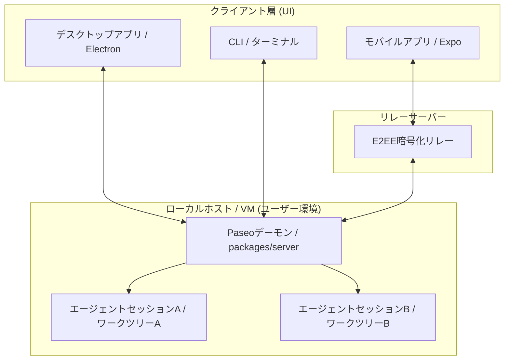

# **Paseo 調査レポート**

## **1. 基本情報**

* **ツール名**: Paseo
* **ツールの読み方**: パセオ
* **開発元**: Paseo
* **公式サイト**: [https://paseo.sh/](https://paseo.sh/)
* **関連リンク**:
  * GitHub: [https://github.com/getpaseo/paseo](https://github.com/getpaseo/paseo)
* **カテゴリ**: 汎用AIエージェント
* **概要**: デスクトップ、モバイル、CLIから多様なコーディングエージェントを統合して操作できるオープンソースのAIエージェントオーケストレーター。

## **2. 目的と主な利用シーン**

* **解決する課題**: 様々なAIコーディングエージェントの乱立とプラットフォームの制約を解消し、一元管理する
* **想定利用者**: 開発者、AIを活用するエンジニア
* **利用シーン**:
  * PCから離れた出先（スマートフォン）からのエージェント進捗確認・操作
  * 複数のプロバイダのエージェントの同時利用
  * ターミナルやIDEを跨いだ開発作業

## **3. 主要機能**

* **マルチプラットフォーム対応**: モバイル、デスクトップ（Mac, Windows, Linux）、CLI、Webアプリで利用可能
* **複数プロバイダ統合**: Claude Code, Codex, Cursor, OpenCode, Pi などをサポート
* **分割パネル表示**: エージェントチャット、ブラウザ、ターミナル、差分表示を同じワークスペース内で同時に開いて確認・操作できる機能
* **音声制御**: ローカルで動作する音声入力とテキスト読み上げによるコントロール
* **セキュアなリモート接続**: エンドツーエンド暗号化（E2EE）リレーによる、外部からの安全なローカルエージェントへのアクセス
* **自動ポート管理とプレビュー**: エージェントが立ち上げる開発サーバーのポート競合を回避
* **スクリプト・自動化連携**: CLIコマンドからエージェントのタスク実行、ループ、スケジュール実行などをスクリプト化可能

## **4. 動作原理・システム構成**

Paseoはローカルファーストな設計思想に基づき、Dockerに類似したクライアント・サーバー構成（Daemonアーキテクチャ）を採用しています。

* **アーキテクチャ**: ローカルファーストなクライアント・サーバー（Daemon）構成
  ユーザーにおけるローカル環境やリモートサーバー（VM）上で「Paseo Daemon（`packages/server`）」を起動し、それをコントロールプレーンとして動作させます。各種クライアント（デスクトップアプリ、モバイルアプリ、CLI、Webアプリ）はWebSocketを介してDaemonへ接続し、操作を行います。
* **主要コンポーネントとデータフロー**:
  * **Paseo Daemon**: エージェントセッションにおけるプロセス制御、ライフサイクル管理、WebSocket API提供、開発サーバー用ルーティングを担当。
  * **Clients (Desktop / Mobile / CLI / Web)**: ユーザーインターフェースを提供。WebSocket通信を介してDaemonへ指示を送信し、実行出力をリアルタイムで受信・表示します。
  * **E2EE Relay**: 外出先におけるモバイルデバイス等からローカルやVM上のDaemonへ安全に接続するため、エンドツーエンド暗号化（E2EE）されたリレー接続を確立します。
  * **Git Worktrees**: エージェントごとに独立した作業ディレクトリ（worktree）を自動構築し、ファイルやプロセス隔離（Worktree Isolation）を行います。
* **特筆すべき要素技術**:
  * **プロセス隔離 (Worktree Isolation)**: 各エージェントタスクをGitにおける個別のworktreeに割り当てることで、他作業やポート競合を完全に防ぎます。リポジトリルートにある `paseo.json` へ設定した `setup` / `teardown` スクリプトで環境構築を自動化します。
  * **自動ポート割り当てとプレビュー**: 各ワークツリー上における開発サーバーに対してユニークなローカルドメイン（例：`web--feature-x.localhost:6767`）を動的に割り当て、ポート衝突を防ぎつつ動作確認を行えるようにします。
  * **Orchestration Skills**: `/paseo-handoff` や `/paseo-loop` 等のビルトインスキルを使用し、エージェント間でコンテキストを共有しながらタスク引き継ぎやループ検証を行います。



## **5. 開始手順・セットアップ**

* **前提条件**:
  * CLI実行可能な環境
* **インストール/導入**:

  ```bash
  npm install -g @getpaseo/cli && paseo
  ```

* **初期設定**:
  * 利用したいAIエージェントのプロバイダ（Claude, Codex等）と連携（APIキー設定など）
* **クイックスタート**:
  * `paseo run "タスクの内容"` を実行するか、GUIからワークスペースを作成してプロンプトを入力

## **6. 特徴・強み (Pros)**

* 各ツールのCLIなどをラップせずに独立したプロセスとして起動するため、連携ツールの仕様変更に強い
* 完全無料でオープンソースであり、セルフホストが可能
* モバイルアプリの完成度が高く、出先からでも本格的なコーディング作業の指示・レビューが可能

## **7. 弱み・注意点 (Cons)**

* 外部プロバイダに依存するため、利用するAIエージェント自体のAPIコストは別途発生する
* 日本語対応状況：UIは日本語対応済み (2026-06-26に追加)

## **8. 料金プラン**

| プラン名 | 料金 | 主な特徴 |
|---------|------|---------|
| **無料プラン** | 無料 | オープンソースでありソフトウェアの利用自体は無料 |

* **課金体系**: ツール自体は無料。利用する各AIモデル（Claude, Codexなど）のAPI利用料が各プロバイダに依存して発生する
* **無料トライアル**: なし（完全無料）

## **9. 導入実績・事例**

* **導入企業**: 公開事例なし。ただし、開発者の間で「モバイルから操作できるオーケストレーター」として評価されている
* **導入事例**: SNSでモバイルから操作する事例などが報告されている
* **対象業界**: ソフトウェア開発全般

## **10. サポート体制**

* **ドキュメント**: 公式サイトにて提供 (https://paseo.sh/docs)
* **コミュニティ**: Discord, Reddit, GitHub Issues
* **公式サポート**: コミュニティベースのサポートが中心

## **11. エコシステムと連携**

### **11.1 API・外部サービス連携**

* **API**: CLIを通じた自動化連携機能を提供
* **外部サービス連携**: Claude Code, Codex, Cursor, OpenCode, Pi などの外部AIエージェント

### **11.2 技術スタックとの相性**

| 技術スタック | 相性 | メリット・推奨理由 | 懸念点・注意点 |
|:---|:---:|:---|:---|
| **CLI環境** | ◎ | コマンドラインからの完全操作が可能 | 特になし |
| **各種IDE** | ◯ | エディタから直接ワークスペースを開く機能連携 | 特になし |

## **12. セキュリティとコンプライアンス**

* **認証**: デーモン接続時のパスワード認証対応
* **データ管理**: ソースコードはローカルマシンから外部に送信されない（AIへのプロンプト送信は各プロバイダに依存）。リモート接続にはエンドツーエンド暗号化（E2EE）リレーを採用
* **準拠規格**: 公式サイトで公開されていない。

## **13. 操作性 (UI/UX) と学習コスト**

* **UI/UX**: キーボードファーストで設計されており、コマンドパレットやショートカットで全操作が可能。モバイル版もデスクトップと同等の機能を持つレスポンシブなデザイン
* **学習コスト**: 既に個別のCLI型AIエージェント（Claude Code等）に慣れている場合は学習コストは極めて低い

## **14. ベストプラクティス**

* **効果的な活用法 (Modern Practices)**:
  * CLIからのスケジュール実行や、バックグラウンドでのエージェントの監視用途としての活用
* **陥りやすい罠 (Antipatterns)**:
  * 依存するCLIツール（npm等）のパスがPaseoの実行環境（デーモン）から見えない状態で起動するとエラーになるため、環境変数の設定に注意が必要

## **15. ユーザーの声（レビュー分析）**

* **調査対象**: X(Twitter)のレビュー（公式サイトより）
* **総合評価**: 評価の登録なし
* **ポジティブな評価**:
  * 「オープンソースで全OS対応、モバイルの体験が素晴らしい」
  * 「出先からスマホでエージェントの進捗を管理できるのが非常に便利」
* **ネガティブな評価 / 改善要望**:
  * 明確なネガティブな評価は見当たらない
* **特徴的なユースケース**:
  * スマホからPC上のエージェントに指示を出し、外出先でレビューとマージまで完結させる使い方

## **16. 直近半年のアップデート情報**

* **2026-07-08**: ブラウザ操作（スナップショット、信頼された入力、タブ制御など）をエージェントが実行可能に
* **2026-06-23**: The PR panel now has a refresh button and clearer loading states
* **2026-06-21**: Added Ultracode for Claude
* **2026-06-18**: Simplify workspace model
* **2026-06-12**: Attach pull request comments, reviews, threads, and failed check logs to chat from the PR panel
* **2026-06-08**: Open multiple desktop windows

(出典: [製品アップデート情報](https://paseo.sh/changelog))

## **17. 類似ツールとの比較**

### **17.1 機能比較表 (星取表)**

| 機能カテゴリ | 機能項目 | 本ツール | Claude Code | Cursor | Codex cloud |
|:---:|:---|:---:|:---:|:---:|:---:|
| **基本機能** | マルチプラットフォーム | ◎<br><small>全OS・モバイル・Web</small> | ×<br><small>CLI・IDEのみ</small> | ◎<br><small>各種OS</small> | ◯<br><small>Desktop/IDE/Cloud</small> |
| **カテゴリ特定** | オーケストレーション | ◎<br><small>一元管理</small> | ×<br><small>単体</small> | ×<br><small>単体</small> | ×<br><small>単体</small> |
| **エンタープライズ** | 日本語対応 | ◯<br><small>UI対応</small> | ◯<br><small>プロンプト等</small> | ◯<br><small>部分対応</small> | ◯<br><small>プロンプト等</small> |
| **非機能要件** | オープンソース | ◎<br><small>完全OSS</small> | ×<br><small>クローズド</small> | ×<br><small>クローズド</small> | ×<br><small>クローズド</small> |

### **17.2 詳細比較**

| ツール名 | 特徴 | 強み | 弱み | 選択肢となるケース |
|---------|------|------|------|------------------|
| **本ツール** | 一元管理・マルチ環境 | 複数プロバイダ統合、モバイルからの管理、E2EEリレー | 各AI自体の設定は必要 | 様々なAIエージェントを使い分けたい、外出先から作業したい場合 |
| **Claude Code** | Anthropic専用 | 高い推論能力 | モデルが固定 | Anthropicモデルに特化して利用したい場合 |
| **Cursor** | IDE統合 | エディタ連携が深い | モバイル非対応 | 単一のIDE内でコード補完・生成を完結させたい場合 |
| **Codex cloud** | Desktop/Remote/Cloud対応 | ローカルリソースを消費しない | クレジット消費が激しい | 長時間かかる重いタスクをバックグラウンドに丸投げしたい場合 |

## **18. 総評**

* **総合的な評価**:
  多様なAIエージェントをシームレスに操作できる強力なオーケストレーター
* **推奨されるチームやプロジェクト**:
  複数のAIモデルやエージェントを使い分ける開発者、モバイルからも開発にアクセスしたいエンジニア
* **選択時のポイント**:
  単一のIDEに縛られず、環境を跨いでAIを活用したい場合に最適
