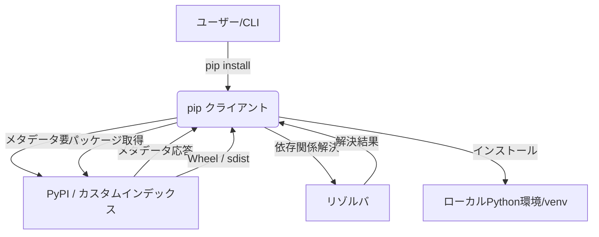

# **pip 調査レポート**

## **1. 基本情報**

* **ツール名**: pip
* **ツールの読み方**: ピップ
* **開発元**: The pip developers (Python Packaging Authority)
* **公式サイト**: [https://pip.pypa.io/](https://pip.pypa.io/)
* **関連リンク**:
  * GitHub: [https://github.com/pypa/pip](https://github.com/pypa/pip)
  * PyPI: [https://pypi.org/project/pip/](https://pypi.org/project/pip/)
* **カテゴリ**: パッケージ管理
* **概要**: pipは、Pythonのパッケージインストーラーです。Python Package Index (PyPI) やその他のインデックスからパッケージをインストール・管理するために使用されます。

## **2. 目的と主な利用シーン**

* **解決する課題**: Pythonプロジェクトにおけるサードパーティライブラリや依存関係のインストール、バージョン管理、アンインストールを簡素化・標準化する。
* **想定利用者**: Pythonを使用するすべてのソフトウェアエンジニア、データサイエンティスト、システム管理者。
* **利用シーン**:
  * 新規プロジェクトにおける必要なライブラリの一括インストール（`requirements.txt`を利用）。
  * CI/CDパイプラインでの自動化された環境構築。
  * Pythonアプリケーションの配布および実行環境のセットアップ。

## **3. 主要機能**

* **パッケージのインストール**: PyPI、ローカルアーカイブ、VCS（Gitなど）からパッケージをインストール可能。
* **依存関係の解決**: パッケージが依存する他のパッケージを再帰的に解決し、適切なバージョンをインストール。
* **requirements.txtのサポート**: プロジェクトの依存パッケージをファイルに記述し、一括でインストールおよび管理。
* **パッケージのアンインストール**: インストール済みパッケージを安全に削除（`pip uninstall`）。
* **パッケージの一覧表示**: 現在の環境にインストールされているパッケージとバージョンの一覧を表示（`pip list`、`pip freeze`）。
* **ハッシュチェック**: ダウンロードしたパッケージのハッシュを検証し、セキュリティを確保（`--require-hashes`）。
* **キャッシュ管理**: ダウンロードしたパッケージをキャッシュし、次回以降のインストールを高速化（`pip cache`）。

## **4. 動作原理・システム構成**

* **アーキテクチャ**: ローカルクライアント型のパッケージ管理システム
* **主要コンポーネントとデータフロー**:
  * PyPI（Python Package Index）やその他のパッケージインデックスからパッケージのメタデータと実体（Wheelやソースコード）をダウンロードする。
  * `pip` クライアントがローカルのPython環境（システム全体や `venv` などの仮想環境）において、依存関係を解決してインストールを行う。
* **特筆すべき要素技術**:
  * **PEP準拠**: PEP 517、PEP 518等のビルドシステムや、PEP 440（バージョン指定）、PEP 503（Simple Repository API）など、Python Packagingの標準仕様に深く準拠。
  * **依存関係リゾルバ**: 複雑なパッケージの依存関係ツリーを解析し、競合がない最適なバージョンを算出する（2020年の新リゾルバ導入により大幅に強化）。
  * **Wheel形式**: 事前コンパイル済みのバイナリ配布フォーマット（`.whl`）を優先的に利用し、インストールを高速化。



## **5. 開始手順・セットアップ**

* **前提条件**:
  * Pythonがインストールされていること。Python 3.4以降には標準でpipが同梱されています。
  * アカウント作成は不要です。
* **インストール/導入**:

  ```bash
  # Python 3環境でのpipのアップグレード
  python -m pip install --upgrade pip
  ```

* **初期設定**:
  * 特別な設定は不要です。必要に応じて `pip.conf` (Linux/macOS) または `pip.ini` (Windows) でリポジトリやプロキシなどを設定可能です。
* **クイックスタート**:
  * `pip install requests` などでパッケージのインストールが行えます。

## **6. 特徴・強み (Pros)**

* Pythonの公式推奨ツールであり、エコシステム全体でデファクトスタンダードとして利用されている。
* `requirements.txt` を用いたシンプルで直感的な依存関係管理。
* 豊富なコマンドオプションによる柔軟な環境制御（プロキシ設定、証明書指定、キャッシュ制御など）。
* オープンソースであり、PyPA (Python Packaging Authority) によって活発にメンテナンスされている。

## **7. 弱み・注意点 (Cons)**

* 複雑な依存関係の競合（Dependency Hell）が発生した場合、解決に手動での介入が必要になることがある（新しいリゾルバで改善されつつある）。
* ロックファイルの標準機能が弱く（`pip freeze`は正確だが、他のツールのような詳細な`lock`ファイル管理は発展途上）、厳密な再現性を求める場合は`pip-tools`や`uv`、`Poetry`などの併用が推奨される。
* UI・ドキュメントは主に英語であるが、一般的な開発者ツールであり学習コストは低い。日本語での情報もコミュニティから豊富に提供されている。

## **8. 料金プラン**

| プラン名 | 料金 | 主な特徴 |
|---------|------|---------|
| **無料プラン** | 無料 | オープンソース（MIT License）で全機能を利用可能 |

* **課金体系**: 該当なし
* **無料トライアル**: 該当なし

## **9. 導入実績・事例**

* **導入企業**: Google、Meta、AWS、Netflixなど、Pythonを利用する世界中のほぼすべての企業。
* **導入事例**: Pythonを利用するシステム開発、データ分析、機械学習プロジェクトの基盤構築に標準採用。
* **対象業界**: 業界を問わず、Pythonが採用されているすべての領域。

## **10. サポート体制**

* **ドキュメント**: 公式ドキュメント（[https://pip.pypa.io/](https://pip.pypa.io/)）が非常に充実しており、チュートリアルからリファレンスまで網羅。
* **コミュニティ**: GitHubのIssueトラッカー、Pythonコミュニティのフォーラム（Discourse）、IRCチャンネル（#pypa）などで活発な議論が行われている。
* **公式サポート**: オープンソースプロジェクトのため、企業向けのSLA付き公式サポートはなし。

## **11. エコシステムと連携**

### **11.1 API・外部サービス連携**

* **API**: パッケージのメタデータ取得やインストールをPythonスクリプト内から実行することは可能だが、公式にはCLIからの利用が推奨されている。
* **外部サービス連携**: PyPIをはじめとする各種パッケージインデックス（Artifactory, Nexus等）、GitHub Actions、GitLab CI、CircleCIなどの各種CI/CDツール。

### **11.2 技術スタックとの相性**

| 技術スタック | 相性 | メリット・推奨理由 | 懸念点・注意点 |
|:---|:---:|:---|:---|
| **Python (venv)** | ◎ | 標準の仮想環境と完全に統合されている | 特になし |
| **Docker** | ◎ | コンテナ内での依存関係インストールに標準的に使用される | キャッシュの肥大化を防ぐため `--no-cache-dir` の指定が推奨される |
| **CI/CD (GitHub Actions等)** | ◎ | Python環境のセットアップで標準サポート | 依存関係の解決時間短縮のためキャッシュの活用が鍵 |

## **12. セキュリティとコンプライアンス**

* **認証**: PyPIへの公開時などはトークン認証等を利用。インストール時には `--trusted-host` 等で証明書の制御が可能。
* **データ管理**: ダウンロードしたパッケージのキャッシュをローカルに保存。
* **準拠規格**: 該当なし。ただし、HTTPS通信を基本とし、ハッシュ検証機能（`--require-hashes`）によりサプライチェーン攻撃への耐性を高められる。

## **13. 操作性 (UI/UX) と学習コスト**

* **UI/UX**: シンプルで直感的なCLIインターフェース。進捗バー（Richライブラリによる）や、エラー時の詳細なメッセージ出力が提供されている。
* **学習コスト**: 非常に低い。`pip install` や `pip list` など基本的なコマンドはすぐに習得可能。高度なオプションの利用にはドキュメントの参照が必要。

## **14. ベストプラクティス**

* **効果的な活用法 (Modern Practices)**:
  * `requirements.txt` を用いた依存関係の明示と共有。
  * プロジェクトごとに仮想環境（`venv`など）を作成し、グローバルなPython環境を汚染しないようにする。
  * セキュリティ強化のため、ハッシュ値を含めた要件定義ファイルを利用する。
* **陥りやすい罠 (Antipatterns)**:
  * `sudo pip install` によるシステム全体へのインストール（OSのパッケージマネージャと競合しシステムを破壊する恐れがある。外部管理環境ではPEP 668により制限される傾向にある）。
  * `requirements.txt` にバージョンを指定せず運用し、将来のビルドで互換性が壊れる問題（常にバージョンをピン留めすることが推奨される）。

## **15. ユーザーの声（レビュー分析）**

* **調査対象**: GitHub、X (Twitter)、StackOverflow
* **総合評価**: SaaSレビューサイトには登録がないが、開発者からの信頼は絶大。
* **ポジティブな評価**:
  * 「Pythonを使っていれば必ず使うツール。安定しており信頼性が高い。」
  * 「使い方が簡単で、ドキュメントも分かりやすい。」
  * 「エラーメッセージが改善され、依存関係の競合原因が分かりやすくなった。」
* **ネガティブな評価 / 改善要望**:
  * 「複雑な依存関係がある場合、解決に時間がかかる、あるいは失敗することがある。」
  * 「より高度なロックファイル管理が標準で欲しい。」
* **特徴的なユースケース**:
  * CI/CD環境において `--no-cache-dir` を使用してDockerイメージサイズを最小限に抑えつつ依存パッケージをインストールする。

## **16. 直近半年のアップデート情報**

* **2026-08-04**: バージョン 26.2.1 リリース。ビルド時の依存関係における `keyring` のインポートプロバイダーの使用を再許可するバグ修正を実施。
* **2026-07-29**: バージョン 26.2 リリース。Python 3.15のサポート宣言、`--only-deps` フラグの追加、`--use-feature=venv-isolation` によるビルド時のサブプロセス分離の実験的サポート、キャッシュ管理の改善など。
* **2026-05-31**: バージョン 26.1.2 リリース。エントリーポイントにおけるパスの解決不具合の修正や、二重スラッシュが含まれるパスでのインストールエラーの修正。
* **2026-05-04**: バージョン 26.1.1 リリース。パッケージアンインストール時に空のディレクトリが残る問題および `.py` ファイル削除時に隣接する `__pycache__` ディレクトリが削除されない問題の修正。
* **2026-04-26**: バージョン 26.1 リリース。Python 3.9のサポート終了、`pylock.toml` の実験的サポート（`-r pylock.toml`）、依存関係解決や巨大な依存関係ツリーでのメモリ使用量の最適化。
* **2026-02-04**: バージョン 26.0.1 リリース。要件ファイルがオプションを含む場合の `--pre` の動作修正など。
* **2026-01-30**: バージョン 26.0 リリース。`--use-feature inprocess-build-deps` オプションの追加、PEP 723 に準拠したインラインスクリプトメタデータのインストールサポート、コマンドラインヘルプのカラー表示対応など。

(出典: [製品アップデート情報](https://pip.pypa.io/en/stable/news/))

## **17. 類似ツールとの比較**

### **17.1 機能比較表 (星取表)**

| 機能カテゴリ | 機能項目 | 本ツール | uv | npm |
|:---:|:---|:---:|:---:|:---:|
| **基本機能** | パッケージインストール | ◎<br><small>Pythonの標準ツール</small> | ◎<br><small>Rust実装で超高速</small> | ◎<br><small>Node.js標準、エコシステム最大</small> |
| **依存関係管理** | ロックファイル | △<br><small>要pip-tools等（pylock.toml開発中）</small> | ◎<br><small>高速なロック生成</small> | ◎<br><small>package-lock.jsonで標準対応</small> |
| **環境管理** | 仮想環境管理 | △<br><small>venvと組み合わせる</small> | ◯<br><small>統合管理機能あり</small> | ◯<br><small>ローカルディレクトリ(node_modules)完結</small> |
| **非機能要件** | インストール速度 | ◯<br><small>標準的</small> | ◎<br><small>圧倒的に高速</small> | ◯<br><small>標準的（CIでの最適化あり）</small> |

### **17.2 詳細比較**

| ツール名 | 特徴 | 強み | 弱み | 選択肢となるケース |
|---------|------|------|------|------------------|
| **本ツール** | Pythonの標準パッケージマネージャ | 最も普及しており、ドキュメント・知見が豊富 | 依存解決速度やロック機能に弱み | Pythonを利用するほぼすべてのプロジェクトの基盤として |
| **uv** | Rust製の超高速Pythonパッケージマネージャ | pip互換のインターフェースを持ちつつ、劇的に高速 | 新しいツールのため一部の高度なユースケースで未対応がある | 大規模プロジェクトやCI/CDでの実行時間短縮が至上命題の環境 |
| **npm** | Node.jsの標準パッケージマネージャ | エコシステムが巨大で、フロントエンドからバックエンドまで網羅 | Pythonには非対応。依存関係ツリーが深くなりがち | Node.jsやフロントエンドを中心としたJavaScript開発を行う場合 |

## **18. 総評**

* **総合的な評価**:
  pipはPythonエコシステムの根幹を支える最も重要なツールの一つである。パッケージのインストールや管理という基本的な目的において、非常に高い信頼性と安定性を誇る。近年は依存関係リゾルバの改良も進められており、標準ツールとしての完成度は高い。
* **推奨されるチームやプロジェクト**:
  Pythonを利用するあらゆるチームやプロジェクト。特に、標準的な構成を好むプロジェクトや、依存関係が比較的シンプルな場合に最適。
* **選択時のポイント**:
  パッケージ管理の速度改善や、より厳密なロックファイル管理が求められる場合は、`uv` や `Poetry` などのモダンなツールの導入を検討する価値があるが、それらの基盤としてもpipの知識は不可欠である。依存関係解決の速さやプロジェクトの複雑さに応じて他ツールと使い分けるのが良い。
