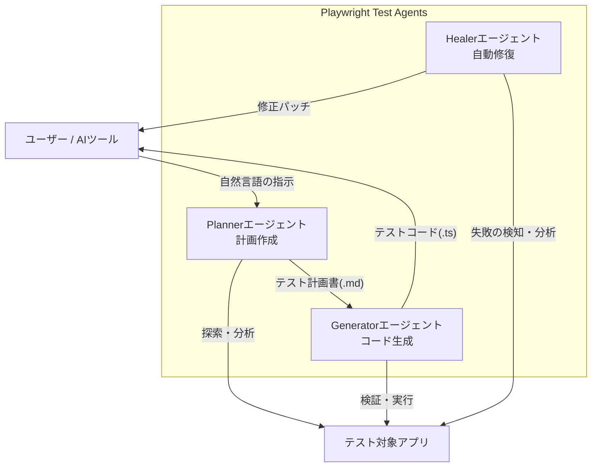

# **Playwright Test Agents 調査レポート**

## **1. 基本情報**

* **ツール名**: Playwright Test Agents
* **ツールの読み方**: プレイライト テスト エージェント
* **開発元**: Microsoft
* **公式サイト**: [https://playwright.dev/docs/test-agents](https://playwright.dev/docs/test-agents)
* **関連リンク**:
  * GitHub: [https://github.com/microsoft/playwright](https://github.com/microsoft/playwright)
  * CodeWiki: [https://codewiki.google/github.com/microsoft/playwright](https://codewiki.google/github.com/microsoft/playwright)
  * ドキュメント: [https://playwright.dev/docs/test-agents](https://playwright.dev/docs/test-agents)
* **カテゴリ**: テスト/QA
* **概要**: Playwright Test Agentsは、Playwrightフレームワークに統合された自律型AIエージェント群です。「Planner（計画）」、「Generator（生成）」、「Healer（修復）」の3つのエージェントが連携し、自然言語による指示からテスト計画を作成し、Playwrightテストコードを自動生成し、失敗したテストを自動的に修復します。

## **2. 目的と主な利用シーン**

* **解決する課題**: E2Eテストの作成にかかる時間的コストの削減、メンテナンスの負荷軽減、テストカバレッジの向上。
* **想定利用者**: QAエンジニア、テスト自動化エンジニア、Web開発者。
* **利用シーン**:
  * 新規機能のテストケース作成（自然言語での指示）
  * 既存アプリケーションの探索的テストとテスト計画の立案
  * UI変更により壊れたテストの自動修復
  * 回帰テストの自動生成

## **3. 主要機能**

Playwright Test Agentsは、以下の主要な機能とエージェントで構成されています。これらは独立して使用することも、チェーンして使用することも可能です。

* **🎭 Planner (計画エージェント)**:
  * アプリケーションを探索し、ユーザーフローに基づいたMarkdown形式のテスト計画（`specs/*.md`）を作成します。
  * 入力：自然言語でのリクエスト（例：「ゲストチェックアウトの計画を作成して」）、シードテスト（初期設定用）。
  * 出力：人間が読める形式のテスト計画書。
* **🎭 Generator (生成エージェント)**:
  * Markdownのテスト計画を読み込み、実行可能なPlaywrightテストコード（`tests/*.spec.ts`）を生成します。
  * 実際のブラウザ操作を行いながらセレクタやアサーションを検証・生成します。
* **🎭 Healer (修復エージェント)**:
  * テストが失敗した際に、失敗したステップをリプレイし、現在のUIを検査します。
  * ロケータの更新や待機処理の調整など、テストをパスさせるための修正パッチを提案します。
* **Agentic Loop**:
  * 上記エージェントを連携させ、継続的にテストを作成・実行・修正するループを構築できます。
* **Agentic Video Receipts (動画証跡)**:
  * コーディングエージェントがタスク完了後に、詳細なアノテーション付きの検証動画を証跡として作成できます。
* **ツール連携**:
  * VS Code, Claude Code, OpenCode などのAIツールを通じてこれらのエージェントを操作・指令できます。またCLI (`playwright-cli`) からのデバッグやトレース分析にも対応しています。

## **4. 動作原理・システム構成**

Playwright Test Agentsは、Playwrightの強力なブラウザ自動化基盤上に構築されたAIエージェントシステムです。

* **アーキテクチャ**: ローカルファーストのクライアント・サーバー型（PlaywrightブラウザエンジンとAIエージェントの連携）。
* **主要コンポーネントとデータフロー**:
  * 自然言語の指示を受け取ったエージェントが、対象のWebアプリケーションを操作。
  * ブラウザのDOMツリーやアクセシビリティツリーを抽出し、LLMに渡して現状を認識。
  * 状態に応じた次のアクション（計画作成、コード生成、修復パッチ作成）を自律的に決定・実行。
* **特筆すべき要素技術**:
  * **playwright-cli**: コーディングエージェントに適したトークン効率の良いCLI操作モード。
  * **Agentic Video Receipts**: 操作の過程をアノテーション付き動画として記録する仕組み。



## **5. 開始手順・セットアップ**

* **前提条件**:
  * Playwrightのインストール済みプロジェクト
  * VS Code v1.105以上（VS Codeで使用する場合）
* **インストール/導入**:

  ```bash
  # エージェント定義をプロジェクトに追加
  npx playwright init-agents --loop=vscode
  # または Claude Code用
  npx playwright init-agents --loop=claude
  ```

* **初期設定**:
  * 生成された `.github/` フォルダ内のエージェント定義を使用します。
* **クイックスタート**:
  * VS Codeのチャット機能やClaude Codeなどから、「Plannerエージェントを使ってログイン機能のテスト計画を作って」のように指示します。

## **6. 特徴・強み (Pros)**

* **包括的なワークフロー**: 単なるコード生成だけでなく、計画（Plan）から生成（Generate）、維持・修復（Heal）までをカバーしており、テスト自動化のライフサイクル全体を支援します。
* **人間が読めるテスト計画**: 中間生成物としてMarkdown形式のテスト計画を出力するため、人間が内容をレビュー・修正しやすく、ブラックボックス化を防げます。
* **強力な自己修復 (Self-Healing)**: 失敗時のUI状態を分析して修正案を出すため、UI変更に強い堅牢なテスト維持が可能です。
* **既存エコシステムとの統合**: Playwrightの標準機能として提供されるため、追加のライセンス費用なしで利用でき、既存のPlaywrightテスト資産とシームレスに統合されます。

## **7. 弱み・注意点 (Cons)**

* **複雑なSPAへの対応**: 非常に複雑なシングルページアプリケーション（SPA）などでは、エージェントが迷走したり、意図しない操作を行ったりする場合があり、まだ発展途上の側面があります。
* **環境依存**: VS Codeの特定バージョン以上が必要など、フル機能を利用するための環境要件があります。
* **完全な自律ではない**: 「オートパイロット」として完全に放置できるレベルではなく、生成された計画やコードに対する人間によるレビューと修正が依然として必要です。

## **8. 料金プラン**

Playwrightの一部として提供されるため、Playwright同様にオープンソース（Apache 2.0）であり、無料です。

| プラン名 | 料金 | 主な特徴 |
|---------|------|---------|
| **オープンソース** | 無料 | 全機能を無料で利用可能 |

* **課金体系**: なし（使用するLLM/AIツールの利用料は別途かかる場合があります。例：Claude API、GitHub Copilot等）

## **9. 導入実績・事例**

* **導入企業**: Microsoft社内、およびPlaywrightを採用している先進的な開発チームでの試験導入が進んでいます。
* **導入事例**: 新規プロジェクトの初期テスト構築（スキャフォールディング）や、オンボーディング時のアプリケーション理解に活用されています。

## **10. サポート体制**

* **ドキュメント**: 公式ドキュメントの「Test Agents」セクションにて詳細な解説が提供されています。
* **コミュニティ**: PlaywrightのDiscordサーバーやGitHub Discussionsで情報交換が行われています。
* **公式サポート**: GitHub Issuesを通じたバグ報告・機能要望が可能です。

## **11. エコシステムと連携**

### **11.1 API・外部サービス連携**

* **AIツール連携**: VS Code (GitHub Copilot), Claude Code, OpenCode と連携し、チャットインターフェースからエージェントを駆動できます。
* **CI/CD連携**: 生成されたテストは通常のPlaywrightテストと同様に、GitHub ActionsなどのCI/CDパイプラインで実行可能です。

### **11.2 技術スタックとの相性**

| 技術スタック | 相性 | メリット・推奨理由 | 懸念点・注意点 |
|:---|:---:|:---|:---|
| **VS Code** | ◎ | 公式推奨環境であり、最もスムーズな体験が可能。 | v1.105以上が必要。 |
| **Claude Code** | ◯ | CLIベースでの強力なエージェント操作が可能。 | APIコストに注意。 |

## **12. セキュリティとコンプライアンス**

* **認証**: エージェント自体は認証を持ちませんが、テスト対象アプリへのログイン情報などは通常のPlaywrightテスト同様に管理する必要があります（`.env`等）。
* **データ管理**: テストコードや計画書はローカルリポジトリに保存されるため、自社の管理下でセキュアに運用可能です。
* **準拠規格**: Playwright本体に準じます。

## **13. 操作性 (UI/UX) と学習コスト**

* **UI/UX**: VS Codeのチャットインターフェースなどを通じて自然言語で対話的に操作できるため、直感的です。
* **学習コスト**: Playwrightの基本知識は必要ですが、テストコードを自分で書くよりも低い学習コストでテスト作成を開始できます。ただし、エージェントの特性（癖）を理解する慣れは必要です。

## **14. ベストプラクティス**

* **シードテストの活用**: アプリケーションの初期状態（ログイン、データセットアップなど）を定義した「シードテスト（seed.spec.ts）」を用意し、Plannerに渡すことで、前提条件を正しく理解させることができます。
* **計画のレビュー**: Plannerが生成したMarkdownのテスト計画を必ず人間がレビューし、意図しないシナリオや不足している観点がないか確認してからGeneratorに渡すようにします。
* **スモールスタート**: 最初は単純なフロー（ログイン、検索など）から始め、徐々に複雑なシナリオに適用範囲を広げていくことが推奨されます。

## **15. ユーザーの声（レビュー分析）**

* **調査対象**: Reddit, Ministry of Testing, Tech Blogs
* **総合評価**: 期待値は高いが、まだ発展途上の「アクセラレータ」としての評価。
* **ポジティブな評価**:
  * 「テスト作成の時間を大幅に短縮できる『アクセラレータ』としては優秀。」
  * 「全く自動化がない状態からスタートする際の足掛かりとして非常に便利。」
  * 「Healerがセレクタの変更を検知して直してくれる機能は、メンテナンス地獄からの解放を予感させる。」
* **ネガティブな評価 / 改善要望**:
  * 「完全な『オートパイロット』ではない。複雑なSPAでは迷子になることがある。」
  * 「生成されたコードの品質は高いが、それでも人間によるレビューと修正は必須。」
  * 「まだ実験的な要素が強く、既存の大規模なテストスイートを置き換えるものではない。」

## **16. 直近半年のアップデート情報**

* **2026-04-01 (v1.59.0)**: Agentic video receipts（エージェントが検証内容の動画証跡とアノテーションを作成する機能）、CLI debugger for agents (`--debug=cli`)、CLI trace analysis for agents を導入。
* **2026-01-23 (v1.58.0)**: `playwright-cli` を導入し、コーディングエージェントに適したトークン効率の良いCLIモードを追加。
* **2025-10-09**: VS Code v1.105のリリースに伴い、VS Code上でのエージェント体験が正式にサポートされた。
* **2025-10-06 (v1.56.0)**: Playwright Agents機能（Planner, Generator, Healer）が導入され、AIを活用したテスト計画・生成・修復が可能になった。

(出典: [Playwright Release Notes](https://github.com/microsoft/playwright/releases))

## **17. 類似ツールとの比較**

### **17.1 機能比較表 (星取表)**

| 機能カテゴリ | 機能項目 | Playwright Test Agents | Autify | mabl | MagicPod |
|:---:|:---|:---:|:---:|:---:|:---:|
| **自動生成** | テスト生成 | ◎<br><small>計画からコード生成</small> | ◎<br><small>Genesisで自動化</small> | ◯<br><small>AIサポート</small> | △<br><small>AIテスト生成あり</small> |
| **メンテナンス** | 自動修復 (Heal) | ◎<br><small>Healerエージェント</small> | ◎<br><small>高精度</small> | ◎<br><small>高精度</small> | ◎<br><small>高精度</small> |
| **コスト** | 料金 | ◎<br><small>無料 (OSS)</small> | △<br><small>有料 (個別見積)</small> | △<br><small>有料 (SaaS)</small> | ◯<br><small>料金が明確</small> |
| **自由度** | コード編集 | ◎<br><small>完全なコードベース</small> | △<br><small>JSステップ等で拡張</small> | △<br><small>スニペット等</small> | △<br><small>複雑なロジックは苦手</small> |
| **環境** | 実行環境 | ◎<br><small>ローカル/CIどこでも</small> | ◯<br><small>クラウド実行主体</small> | ◯<br><small>localhost接続対応等</small> | ◎<br><small>モバイル実機に強い</small> |
| **証跡** | 動画証跡 | ◎<br><small>Agentic video receipts</small> | ◯<br><small>実行動画記録</small> | ◯<br><small>実行動画記録</small> | ◯<br><small>実行動画記録</small> |

### **17.2 詳細比較**

| ツール名 | 特徴 | 強み | 弱み | 選択肢となるケース |
|---------|------|------|------|------------------|
| **Playwright Test Agents** | コードベースのOSSツール。AIエージェントがテストコードを生成・管理。 | 無料、フルコードの柔軟性、ローカル実行、CLI/エージェントフレンドリー。 | 環境構築が必要。完全なノーコードではない。 | エンジニア主導で、コストを抑えつつ柔軟なテスト自動化を構築したい場合や、AIコーディングエージェントと連携したい場合。 |
| **Autify** | テスト設計・実行・マネージドまで包括的に支援する次世代QAプラットフォーム。 | テスト設計のAI自動化(Genesis)、AI+プロによる運用代行(Coworker)、非エンジニア向けUI。 | 料金が個別見積もりで不透明。APIテスト等が簡易的。 | QAチーム主導で、素早く自動化を立ち上げたい場合やQA業務全体をアウトソースしたい場合。 |
| **mabl** | ローコードテスト自動化プラットフォーム。 | 高機能な統合環境。ビジュアルテストなども統合。localhostテストにも対応。 | 比較的高価格。機能が多く学習に少し時間が必要。 | エンタープライズ規模で包括的な品質管理を行いたい場合。 |
| **MagicPod** | モバイルアプリテストに強く、コストパフォーマンスに優れた国産ツール。 | モバイル実機対応、手厚い日本語サポート、料金が明確で始めやすい。 | マネージド機能はなし。複雑なロジックの記述が苦手。 | モバイルアプリのテストが必須、またはコストを抑えてノーコード自動化から小さく始めたい場合。 |

## **18. 総評**

* **総合的な評価**:
  Playwright Test Agentsは、既存の強力なPlaywrightフレームワークに「自律性」という新たなレイヤーを追加する画期的な機能です。商用のAIテストツールに匹敵する機能をオープンソースで提供しており、エンジニアにとって非常に魅力的な選択肢となります。
* **推奨されるチームやプロジェクト**:
  既にPlaywrightを使用している、またはこれから導入を検討しているチーム。コードベースでのテスト管理を好みつつ、AIによる効率化の恩恵を受けたいプロジェクト。
* **選択時のポイント**:
  完全なノーコードツール（Autify/mabl等）と比較すると、多少の技術的知識（環境構築やコードレビュー）は求められますが、その分柔軟性とコストパフォーマンスに優れています。「AIに全て任せる」のではなく「AIをパートナーとしてテストを共創する」スタイルに適しています。
