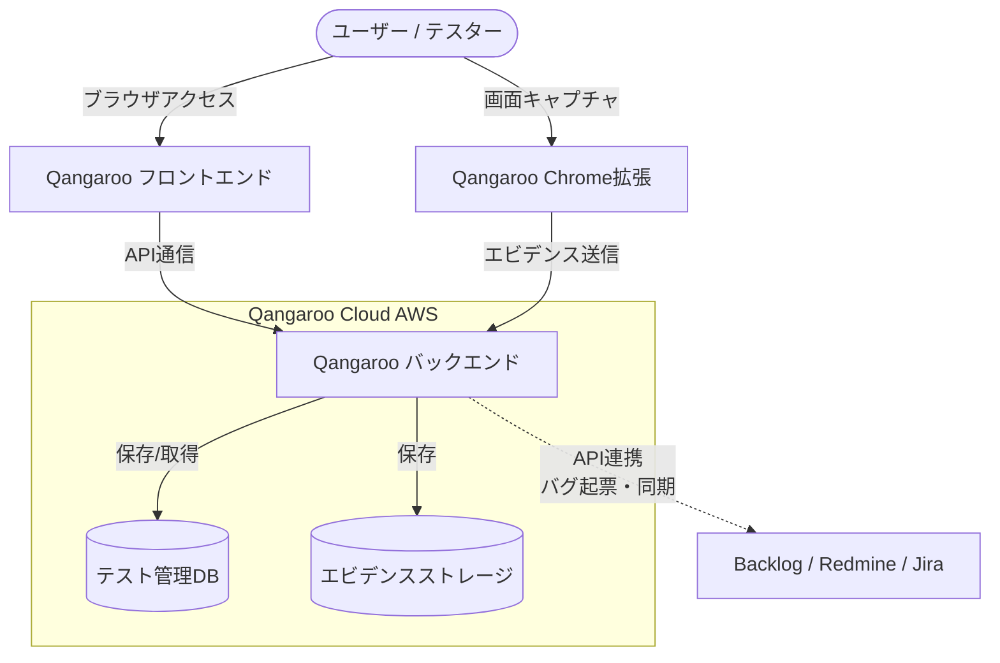

# **Qangaroo 調査レポート**

## **1. 基本情報**

* **ツール名**: Qangaroo
* **ツールの読み方**: カンガルー
* **開発元**: 株式会社テクノデジタル (TECHNO DIGITAL)
* **公式サイト**: [https://qangaroo.jp/](https://qangaroo.jp/)
* **関連リンク**:
  * ドキュメント: [https://qangaroo.jp/support/](https://qangaroo.jp/support/)
  * レビューサイト: G2、Capterra、ITreviewにレビューの登録なし。
* **カテゴリ**: テスト管理
* **概要**: Excelで行われている煩雑なテスト管理をクラウド上で効率化するためのツール。Excelライクなインターフェースを持ち、テストケースの作成から実行、進捗管理までを一元管理できる。国産ツールであり、日本語サポートも充実している。

## **2. 目的と主な利用シーン**

* **解決する課題**:
  * Excelでのテスト管理による「先祖返り」や「どれが最新かわからない」問題の解消
  * テスト進捗のリアルタイム可視化
  * バグ報告の手間の削減（BTS連携による自動起票）
* **想定利用者**:
  * QA（品質保証）チーム
  * ソフトウェア開発エンジニア
  * Webディレクター
* **利用シーン**:
  * **Webサイト/アプリの受入テスト**: クライアントやQAチームがテストを実施し、バグ報告を行う。
  * **リグレッションテスト**: 過去のテストケースを資産として管理し、繰り返し実行する。
  * **多人数でのテスト実施**: リアルタイムに進捗が共有されるため、大規模なテスト実施時の進捗管理に利用。

## **3. 主要機能**

* **Excelライクな編集**: Webブラウザ上で、Excelのようにセルへの入力、コピー＆ペーストなどが可能。既存のExcelテスト仕様書からの移行もスムーズ。
* **テスト実行と進捗管理**: テストケースごとに「OK/NG」を判定し、リアルタイムで全体の進捗率をグラフ化（バグ曲線など）。
* **BTS連携**: Backlog, Redmine, Jiraと連携し、テスト実行時に発見したバグをQangarooから直接起票できる。ステータスの同期も可能。
* **エビデンス管理**: テスト結果にスクリーンショットや動画をドラッグ＆ドロップで添付可能。Chrome拡張機能を使えば、ブラウザ上の操作をキャプチャして直接アップロードできる。
* **レポート出力**: テスト結果をExcel形式でエクスポートし、納品物として利用可能。
* **権限管理**: 「管理者」「テスト編集者」「テスト実行者」「閲覧者」など、メンバーごとに権限を設定可能。

## **4. 動作原理・システム構成**

* **アーキテクチャ**: クラウド完結型SaaS（Webアプリケーション）
* **主要コンポーネントとデータフロー**:
  * ユーザーはWebブラウザ（Google Chrome等）を介してフロントエンドにアクセスし、テストケースの作成や実行結果の入力を行う。
  * テストデータ、エビデンス（画像・動画）はクラウド上（AWSインフラ）に保存される。
  * 連携設定を行うことで、テスト実行時にバグを検出した場合、API経由でBacklog、Redmine、JiraなどのBTS（バグトラッキングシステム）へ自動的にチケットが起票される。
* **特筆すべき要素技術**:
  * Chrome拡張機能を利用して、ブラウザ上の操作画面をキャプチャし、API経由でエビデンスとして直接テスト結果にアップロードする機能を持つ。



## **5. 開始手順・セットアップ**

* **前提条件**:
  * Webブラウザ（Google Chrome推奨）
  * アカウント登録（メールアドレス）
* **インストール/導入**:

  ```bash
  # クラウド（SaaS）のためインストール不要。
  # 公式サイトの「無料で試してみる」からアカウント作成。
  ```

* **初期設定**:
  * プロジェクトの作成
  * メンバーの招待と権限設定
  * BTS連携設定（APIキー等の登録）
* **クイックスタート**:
  1. プロジェクトを作成する。
  2. 「テストフォルダ」を作成し、その中に「テストシート」を作成する。
  3. テストシートにテストケース（手順、期待値）を入力する。
  4. 「テスト実行」モードに切り替え、OK/NGを入力する。

## **6. 特徴・強み (Pros)**

* **学習コストの低さ**: UIがExcelに非常に近いため、Excelでテスト管理をしていたチームであれば、トレーニングなしですぐに使い始められる。
* **強力なBTS連携**: 日本で利用者の多いBacklogやRedmineに加え、Jiraとも連携しており、バグ報告の二重入力を防げる。
* **コストパフォーマンス**: フリープランが充実しており、小規模チームであれば無料で使い続けられる。有料プランもリーズナブル。

## **7. 弱み・注意点 (Cons)**

* **新規申し込みの受付終了**: 2026年9月1日をもって新規アカウントの開設およびお申し込み受付が終了したため、これから新しく導入を検討するチームは利用できない。
* **高度な自動化機能**: SeleniumやAppiumなどのテスト自動化ツールとの連携機能は標準では強調されておらず、手動テスト管理に特化している側面が強い。
* **モバイルアプリ未提供**: スマートフォンアプリのテストを行う際も、PCブラウザで管理画面を開くか、PCを見ながらテストする必要がある。
* **大規模時のパフォーマンス**: 数万件を超えるような極めて大規模なテストケースを扱う場合のパフォーマンスについては、検証が必要。

## **8. 料金プラン**

| プラン名 | 料金 (税込) | 主な特徴 |
|---------|------|---------|
| **フリープラン** | 無料 | 1ユーザー、300テストケース、ストレージ50MB。 |
| **ライトプラン** | ¥980/月 | 3ユーザー(最大20)、1,000テストケース、ストレージ500MB。 |
| **スタンダードプラン** | ¥5,000/月 | 5ユーザー(最大50)、30,000テストケース、ストレージ5GB。 |
| **エンタープライズ** | 要問い合わせ | ユーザー無制限、テストケース無制限、ストレージ無制限。 |

* **課金体系**: 基本料金＋追加ユーザー料金（¥250/ユーザー/月）。
* **無料トライアル**: フリープランにより、期間無制限で試用可能。

## **9. 導入実績・事例**

* **導入企業**: フォーバルテレコムなど。
* **導入事例**: 海外の協力会社によるテスト管理を行い、システムの品質確保に注力した事例などが公開されている。
* **対象業界**: 通信、SIer、Web制作など。

## **10. サポート体制**

* **ドキュメント**: 「Qangaroo はじめてガイド」や機能別のヘルプページが充実している。
* **コミュニティ**: ユーザーフォーラム等は確認できず。
* **公式サポート**: 問い合わせフォームからのメールサポートに対応。

## **11. エコシステムと連携**

### **11.1 API・外部サービス連携**

* **API**: 個人用APIキーの発行が可能であり、外部システムとの連携が可能。
* **外部サービス連携**:
  * **BTS**: Backlog, Redmine, Jira
  * **その他**: Slack（通知連携などは要確認だが、BTS経由での連携が主）

### **11.2 技術スタックとの相性**

| 技術スタック | 相性 | メリット・推奨理由 | 懸念点・注意点 |
|:---|:---:|:---|:---|
| **手動テスト全般** | ◎ | 技術スタックを問わず、あらゆるWeb/アプリの手動テスト管理に最適。 | 特になし |
| **Excel** | ◎ | インポート/エクスポート機能が充実しており、親和性が高い。 | 特になし |
| **Selenium/Playwright** | △ | 自動テスト結果の自動取り込み用APIなどは要確認。 | 手動テスト管理が主眼のため。 |

## **12. セキュリティとコンプライアンス**

* **認証**: ID/パスワード認証。権限設定によるアクセス制御が可能。
* **データ管理**: AWS (Amazon Web Services) 上で運用されており、信頼性の高いインフラを利用している。
* **準拠規格**: 公式サイト上でISO等の取得情報は明記されていない（運営会社の株式会社テクノデジタルとしての取得状況は要確認）。

## **13. 操作性 (UI/UX) と学習コスト**

* **UI/UX**: 「Excelライク」を徹底しており、スプレッドシート形式での入力が中心。直感的で迷わないデザイン。
* **学習コスト**: 極めて低い。Excelが使える人であれば、数分で操作を理解できる。

## **14. ベストプラクティス**

* **効果的な活用法 (Modern Practices)**:
  * **テスト資産の再利用**: プロジェクト終了後もテストケースをアーカイブまたはコピーし、次回の開発時のリグレッションテスト用として活用する。
  * **Chrome拡張機能の活用**: エビデンス取得の手間を省くため、Webアプリのテスト時は必ず拡張機能を使用する。
  * **BTS連携の徹底**: バグ報告は必ずQangaroo経由で行い、テスト結果とバグチケットの紐付けを完全にする。
* **陥りやすい罠 (Antipatterns)**:
  * **テストケースの粒度がバラバラ**: Excel同様、自由に入力できるため、担当者によって記述の粒度が異なると管理しづらくなる。命名規則などを決めておくべき。
  * **BTSとの同期忘れ**: Qangaroo側でバグステータスの同期を行わないと、修正済みかどうかがわからない。定期的な同期操作が必要。

## **15. ユーザーの声（レビュー分析）**

* **調査対象**: 公式サイトの導入事例、Web上のブログ記事等（G2などの主要レビューサイトへの登録なし）
* **総合評価**: N/A
* **ポジティブな評価**:
  * 「Excelでの管理限界を感じて導入したが、スムーズに移行できた」
  * 「Backlogとの連携が便利で、開発者へのフィードバックが速くなった」
  * 「無料プランでも十分使える機能があり、スモールスタートしやすい」
* **ネガティブな評価 / 改善要望**:
  * 「大規模なプロジェクトだと動作が重くなることがある」
  * 「モバイルでの表示や操作性がPCに比べると劣る」
* **特徴的なユースケース**:
  * オフショア開発における、海外テストチームとの進捗共有ツールとしての利用。

## **16. 直近半年のアップデート情報**

* **2026-08-20**: 【重要】テスト管理ツール「Qangaroo」新規お申し込み受付終了のお知らせ（2026年9月1日をもって新規受付終了、既存ユーザーは継続利用可能）。
* **2026-03-23**: メンテナンスのお知らせ。
* **2026-01-21**: メンテナンスの実施（システム安定性の向上）。
* **2025-03-17**: メンテナンスの実施。
* **2025-01-15**: メンテナンスの実施。
* **2024-04-16**: 緊急メンテナンスの実施。

(出典: [Qangaroo ニュース](https://qangaroo.jp/news/))

## **17. 類似ツールとの比較**

### **17.1 機能比較表 (星取表)**

| 機能カテゴリ | 機能項目 | 本ツール (Qangaroo) | TestRail | QualityForward | Qase |
|:---:|:---|:---:|:---:|:---:|:---:|
| **基本機能** | テストケース管理 | ◎<br><small>Excelライク</small> | ◎<br><small>高機能</small> | ◎<br><small>Excelライク</small> | ◎<br><small>モダン・AI搭載</small> |
| **連携** | BTS連携 | ◎<br><small>Backlog/Jira/Redmine</small> | ◎<br><small>主要ツール網羅</small> | ◎<br><small>Jira/Redmine</small> | ◎<br><small>Jira等多数連携</small> |
| **操作性** | UI/UX | ◎<br><small>直感的・シンプル</small> | ◯<br><small>多機能ゆえに複雑</small> | ◎<br><small>スプレッドシート型</small> | ◎<br><small>高速・モダン</small> |
| **コスト** | 無料プラン | ◎<br><small>永続利用可</small> | ×<br><small>トライアルのみ</small> | ◎<br><small>小規模チーム向け</small> | ◎<br><small>小規模チーム向け</small> |
| **サポート** | 日本語対応 | ◎<br><small>国産・完全対応</small> | △<br><small>代理店経由</small> | ◎<br><small>国産・完全対応</small> | ×<br><small>英語のみ</small> |

### **17.2 詳細比較**

| ツール名 | 特徴 | 強み | 弱み | 選択肢となるケース |
|---------|------|------|------|------------------|
| **本ツール (Qangaroo)** | Excelライクなクラウドツール | 導入のしやすさ、低コスト、強力なBTS連携 | 新規導入不可（2026年9月以降）、自動化連携が少なめ | （既存ユーザー）Excel管理からの脱却、コストを抑えたい場合 |
| **TestRail** | 世界的なスタンダード | 非常に豊富な機能、高度なレポート、自動テスト連携 | 日本語情報の少なさ、コストが高い | 大規模組織、自動テストとの統合を重視する場合 |
| **QualityForward** | 国産の高機能ツール | Excelからの移行が容易、強力なサポート、日本語対応 | Qangarooよりはコストがかかる場合がある | 複数のプロジェクトを横断して管理したい場合、サポート重視の日本企業 |
| **Qase** | AIを活用したモダンツール | AI機能(AIDEN)搭載、動作が高速で直感的 | 日本語対応がない（英語のみ） | 英語UIに抵抗がなく、最新のAI機能やモダンなUIを求めるチーム |

## **18. 総評**

* **総合的な評価**:
  Qangarooは、「Excel管理からの脱却」を第一歩とするチームにとって、最もハードルの低い選択肢でした。機能過多にならず、現場が必要とする「テストケース作成・実行・バグ報告」のサイクルを効率化することに特化しており、特に日本の開発現場でシェアの高いBacklogやRedmineとの連携が強力でした。しかし、**2026年9月1日をもって新規申し込みの受付が終了したため、これから新しくテスト管理ツールを探している組織は利用できません**。
* **推奨されるチームやプロジェクト**:
  * すでにQangarooを導入済みのチーム（既存ユーザーは継続利用可能）。
* **選択時のポイント**:
  * Qangarooの新規導入ができないため、Excelライクな操作感を求めており日本語サポートが必要な場合は**QualityForward**が有力な代替候補となります。
  * より高度なテスト管理やグローバルな標準機能、自動化（CI/CD）連携を求める場合は、**TestRail**や**Qase**を検討すべきです。
