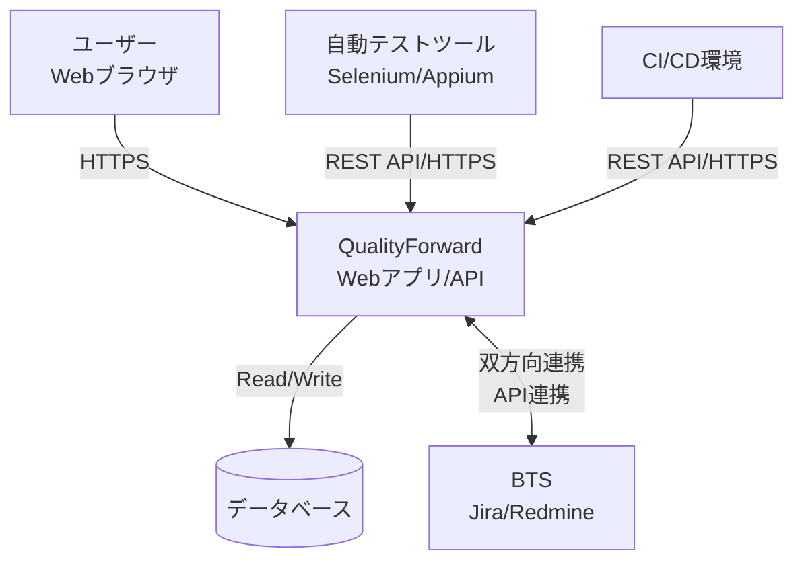

# **QualityForward 調査レポート**

## **1. 基本情報**

* **ツール名**: QualityForward
* **ツールの読み方**: クオリティフォワード
* **開発元**: 株式会社ベリサーブ
* **公式サイト**: [https://www.veriserve.co.jp/helloqualityworld/service/qualityforward/](https://www.veriserve.co.jp/helloqualityworld/service/qualityforward/)
* **関連リンク**:
  * ドキュメント: [https://qualityforward.zendesk.com/hc/ja](https://qualityforward.zendesk.com/hc/ja)
  * レビューサイト: [ITreview](https://www.itreview.jp/products/qualityforward/reviews)
* **カテゴリ**: テスト管理
* **概要**: 開発スピードと品質の向上を支援するクラウド型テスト管理ツール。Excelやスプレッドシートで行われていた非効率なテスト管理を刷新し、リアルタイムな進捗把握と品質分析を可能にする。

## **2. 目的と主な利用シーン**

* **解決する課題**:
  * Excelでのテスト管理によるファイルの先祖返りや集計の煩雑さ
  * テスト進捗のブラックボックス化
  * テスト資産の属人化と再利用性の低さ
* **想定利用者**: QAエンジニア、テスト管理者、開発リーダー
* **利用シーン**:
  * 複数人での同時テスト実行と進捗のリアルタイム管理
  * 過去のテストケースを流用したリグレッションテストの実施
  * BTSと連携したバグ管理と品質分析

## **3. 主要機能**

* **リアルタイムレポート**: ダッシュボードや収束曲線（信頼度成長曲線）で、テスト進捗や品質状況をリアルタイムに可視化。
* **ExcelライクなUI**: 現場で使い慣れたスプレッドシート形式のインターフェースで、違和感なくテスト実行や編集が可能。
* **テスト資産の再利用**: テストケースの複製やバージョン管理ができ、過去のテスト結果に基づいた再テストの抽出も容易。
* **BTS連携**: JiraやRedmineと連携し、テスト失敗時に自動でバグチケットを起票したり、相互リンクを作成可能。
* **マルチサイクル管理**: 1つのテストケースに対して、複数の環境（OS、ブラウザなど）やサイクルでのテスト結果を記録可能。
* **自動テスト連携**: Web APIを使用して自動テストの結果を取り込み、手動テストと一元管理が可能。
* **チームWiki**: プロジェクト内のナレッジやノウハウを共有するためのWiki機能。

## **4. 動作原理・システム構成**

* **アーキテクチャ**: クラウド完結型SaaS（マルチテナント構成）
* **主要コンポーネントとデータフロー**:
  * ユーザーはWebブラウザ（クライアント）からインターネット経由でQualityForwardのWebアプリケーションサーバーにアクセスする。
  * テスト結果やプロジェクトデータはクラウド上のデータベースに保存される。
  * 外部のBTS（JiraやRedmine）とはAPI経由で双方向連携を行い、テスト失敗時にバグチケットを自動起票したり、相互にステータスを同期する。
  * CI/CDツールや自動テストツール（Selenium/Appium等）からは、Web APIを利用してテスト結果を直接QualityForwardに送信・統合管理が可能。

## **5. 開始手順・セットアップ**

* **前提条件**:
  * Webブラウザ（Google Chrome推奨）
  * ベリサーブID（無料）の登録
* **インストール/導入**:
  * SaaS版のためインストール不要。公式サイトからアカウント登録を行う。
* **初期設定**:
  1. プロジェクトの作成
  2. メンバーの招待
  3. テストスイート（テストケース集）の作成またはExcelインポート
* **クイックスタート**:
  * ダッシュボードから「新しいプロジェクト」を作成し、チュートリアルに従ってサンプルデータをインポートすることで、すぐに機能を体験可能。

## **6. 特徴・強み (Pros)**

* **圧倒的な導入のしやすさ**: Excelに近い操作感とExcelファイルのインポート機能により、既存の業務フローからの移行コストが非常に低い。
* **国産ツールならではの安心感**: UIやドキュメントが完全日本語対応しており、サポートも手厚い。
* **強力な可視化機能**: 集計作業なしで自動的に生成されるレポート（収束曲線など）により、マネージャーの管理工数を大幅に削減できる。
* **無料プランの充実**: 小規模チームであれば無料で使い続けることができ、スモールスタートに最適。

## **7. 弱み・注意点 (Cons)**

* **階層構造の制約**: プロジェクトやテストスイートの階層構造が比較的フラットで、大規模かつ複雑な製品構成の場合、管理に工夫が必要な場合がある。
* **装飾機能の限界**: Excelのようにセルごとの色変えや文字装飾を自由に行うことはできず、視認性の向上には限界がある。
* **モバイルアプリ未提供**: 基本的にPCブラウザでの利用が前提となっており、ネイティブアプリ版は提供されていない。
* **一部機能の専門性**: 収束曲線などの分析機能は強力だが、活用にはある程度のテスト管理の知識が必要となる場合がある。

## **8. 料金プラン**

| プラン名 | 料金 | 主な特徴 |
|---------|------|---------|
| **フリープラン** | 無料 | 4ユーザーまで、テスト結果3,000件まで、ストレージ5GB |
| **ビジネスプラン** | 10,000円/月 (税抜) | 5ユーザー含む(追加1,500円/人)、閲覧専用ユーザー100名無料、テスト結果無制限、ストレージ100GB |
| **エンタープライズ** | 要問い合わせ | オンプレミス版など、個別要件に対応 |

* **課金体系**: ユーザー数課金（ビジネスプランの場合、6人目以降に追加料金）
* **無料トライアル**: ビジネスプランのトライアルが可能（期間は要問い合わせ、通常1ヶ月程度）

## **9. 導入実績・事例**

* **導入企業**: トヨタ自動車、任天堂、デンソー、ナビタイムジャパン、スパイダープラス、マネーフォワードなど（公式サイト掲載企業より推測含む）
* **導入事例**:
  * **自動車メーカー**: テスト結果の集計の手間を削減し、品質分析を強化。
  * **地図ナビアプリ開発**: OEMや仕向地ごとのテスト実施状況を一元管理。
  * **会計クラウドサービス**: リグレッションテストの準備を効率化し、テスト項目の精度を向上。
* **対象業界**: 自動車、ゲーム、Webサービス、SaaSベンダーなど多岐にわたる。

## **10. サポート体制**

* **ドキュメント**: 公式Zendeskに詳細なマニュアル、FAQ、チュートリアルが用意されている。
* **コミュニティ**: ユーザー会などのイベントが定期的に開催されている（HQW! イベントなど）。
* **公式サポート**: 問い合わせフォームからのメールサポートに対応。国産ベンダーのため日本語でのスムーズな対応が可能。

## **11. エコシステムと連携**

### **11.1 API・外部サービス連携**

* **API**: Web API (REST API) が提供されており、テスト結果の登録や情報の取得が可能。自動テスト連携に利用される。
* **外部サービス連携**:
  * **Jira / Redmine**: 双方向連携により、テスト管理と課題管理をシームレスに接続。
  * **Slack / Teams**: 通知連携（Webhook利用などで実現可能）。

### **11.2 技術スタックとの相性**

| 技術スタック | 相性 | メリット・推奨理由 | 懸念点・注意点 |
|:---|:---:|:---|:---|
| **Selenium / Appium** | ◯ | API経由で結果を取り込み、予実管理が可能 | 実装にはスクリプトの作成が必要 |
| **JUnit / RSpec** | ◯ | CIパイプラインからAPIを叩くことで連携可能 | 標準プラグインはなくAPI利用が前提 |
| **Jira** | ◎ | 標準機能として強力な連携を提供 | クラウド版/オンプレ版での設定差異に注意 |
| **Redmine** | ◎ | 日本で人気の高いRedmineともスムーズに連携 | バージョン互換性の確認が必要 |

## **12. セキュリティとコンプライアンス**

* **認証**: ユーザーID/パスワード認証。IPアドレス制限などのオプションも存在する場合あり。
* **データ管理**: AWS等の信頼性の高いクラウド基盤を利用。通信の暗号化(SSL/TLS)。
* **準拠規格**: 経済産業省「クラウドサービスレベルのチェックリスト」に基づくチェックシートを公開。セキュリティ評価プラットフォーム「Assured」による評価を取得可能。

## **13. 操作性 (UI/UX) と学習コスト**

* **UI/UX**: スプレッドシート（表計算ソフト）を模したUIを採用しており、エンジニアだけでなく非エンジニアでも直感的に操作できる。ドラッグ＆ドロップやショートカットキーも一部対応。
* **学習コスト**: Excelでのテスト管理経験があれば、ほぼ学習なしで移行可能。独自の概念（テストスイート、サイクルなど）の理解には少々の時間を要するが、全体的に低い。

## **14. ベストプラクティス**

* **効果的な活用法 (Modern Practices)**:
  * **テスト資産のライブラリ化**: テストケースを機能ごとに整理し、リリースの内容に合わせて必要なケースを「テストサイクル」として切り出して実行する運用が推奨される。
  * **自動テストとのハイブリッド管理**: 単体・結合レベルの自動テスト結果もAPIで取り込み、品質全体をQualityForward上で可視化する。
* **陥りやすい罠 (Antipatterns)**:
  * **Excelの完全再現を目指す**: 色分けや結合セルなど、Excelならではの見た目にこだわりすぎると、ツールの良さを活かせない。データとしての管理にシフトすべき。
  * **巨大なテストスイート**: 1つのファイル（スイート）に数万件のケースを入れると動作が重くなる可能性があるため、適切な単位で分割する。

## **15. ユーザーの声（レビュー分析）**

* **調査対象**: ITreview (2025年1月時点のレビュー含む)
* **総合評価**: 4.0/5.0 (ITreview)
* **ポジティブな評価**:
  * 「何をやったか、どういう結果になったかが見える化できる。定例会を省略できるほど進捗管理が楽になった。」
  * 「Excelライクなので初見でも操作に迷うことが少ない。集計にかける工数が削減された。」
  * 「サポートの対応が早く、機能追加の頻度も高い。」
* **ネガティブな評価 / 改善要望**:
  * 「文字色変更など装飾手段がなく、Excelと比較すると不便に感じる部分がある。」
  * 「テストスイート等の階層構造が1階層しか作れず、製品が多いと平たく見えてしまう。」
  * 「テスト管理の知識がないユーザーには少々オーバースペックに感じる機能もある。」
* **特徴的なユースケース**:
  * テスト要求ツリー機能を使って、要件定義書からテスト項目を作成し、漏れを防止した事例。

## **16. 直近半年のアップデート情報**

* **2026-08-31**: 公式サイトのニュースやリリースノートにて、直近半年におけるQualityForward固有の製品機能アップデート情報は確認できなかった。（ただし、同社提供のテスト要求ツリー機能など関連ソリューションとの連携や機能追加は継続的に行われていると推測される）

(出典: [公式サイト ニュース](https://www.veriserve.co.jp/helloqualityworld/news/))

## **17. 類似ツールとの比較**

### **17.1 機能比較表 (星取表)**

| 機能カテゴリ | 機能項目 | QualityForward | TestRail | Qase | Qangaroo |
|:---:|:---|:---:|:---:|:---:|:---:|
| **基本機能** | テストケース管理 | ◎ <small>Excelライクで使いやすい</small> | ◎ <small>構造化管理・AI生成(v10.2)</small> | ◎ <small>直感的なUI・AIテスト生成</small> | ◯ <small>基本的な管理</small> |
| **可視化** | 進捗レポート | ◎ <small>リアルタイム・収束曲線</small> | ◎ <small>豊富なレポート</small> | ◎ <small>ダッシュボード・MCP 2.0連携</small> | ◯ <small>基本的なレポート</small> |
| **連携** | BTS連携 | ◎ <small>Jira/Redmineに強み</small> | ◎ <small>Jira Issue Connect等</small> | ◎ <small>Discord, Jira等豊富</small> | ◯ <small>Redmine連携等</small> |
| **非機能要件** | 日本語対応 | ◎ <small>完全対応・サポート有</small> | ◯ <small>日本語化可だが英語ベース</small> | △ <small>基本英語</small> | ◎ <small>完全対応だが新規受付終了</small> |

### **17.2 詳細比較**

| ツール名 | 特徴 | 強み | 弱み | 選択肢となるケース |
|---------|------|------|------|------------------|
| **QualityForward** | 日本発のクラウド型ツール | Excelからの移行が容易、強力な日本向けサポート、Redmine等との親和性 | テスト生成AI等の先進機能の導入は海外製に比べると控えめ | 日本の組織で、Excel管理からの脱却を図りたい、日本語サポートを重視する場合 |
| **TestRail** | 世界的なシェアを持つ標準ツール | AIテスト生成機能(TestRail 10.2)やJiraとの強力連携など多機能 | コストがやや高め、設定項目が多く学習が必要 | グローバルチームや、高度なカスタマイズとAI支援が必要な場合 |
| **Qase** | モダンで急成長中のテスト管理 | Qase AIやMCP 2.0(2026年7月)による強力なAI連携、洗練されたUI | 完全な日本語対応ではない | AIを活用した自動・手動テストの統合管理を行いたいモダンな開発チーム |
| **Qangaroo** | 国産テスト管理ツール | 日本語完全対応、使いやすいUI | 2026年9月に新規受付終了 | （新規導入の選択肢としては非推奨、既存利用者の移行先としてQualityForwardなどが候補に） |

## **18. 総評**

* **総合的な評価**:
  * QualityForwardは、Excelでのテスト管理に限界を感じているが、いきなり高機能な海外製ツールを導入するのはハードルが高いと感じている組織にとって、**最適な「架け橋」かつ「ゴール」**となり得るツールである。
  * 操作性の良さと導入のしやすさは特筆すべき点であり、現場の抵抗感を最小限に抑えながら、管理レベルを大きく引き上げることができる。
* **推奨されるチームやプロジェクト**:
  * Excelやスプレッドシートでの管理に疲弊しているチーム。
  * 専任のQAエンジニアがおらず、開発者やPMがテスト管理を兼務している組織。
  * 日本語でのサポートやドキュメントを重視する国内プロジェクト。
* **選択時のポイント**:
  * 「Excelの操作感」を維持しつつ管理を効率化したいならQualityForward一択。
  * 世界中のあらゆるツールと連携し、グローバル標準のプロセスを構築したいならTestRailなども比較検討に値する。
