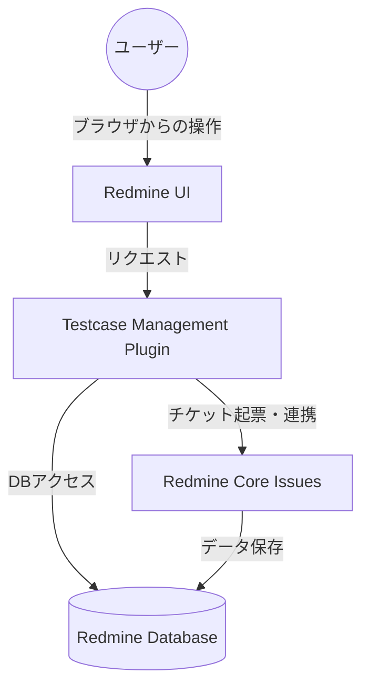

# **Testcase Management 調査レポート**

## **1. 基本情報**

* **ツール名**: Testcase Management
* **ツールの読み方**: テストケースマネジメント
* **開発元**: 株式会社セナネットワークス (Sena Networks Inc.)
* **公式サイト**: [https://www.sena-networks.co.jp/service/testcase_management_details](https://www.sena-networks.co.jp/service/testcase_management_details)
* **関連リンク**:
  * GitHub: [https://gitlab.com/redmine-plugin-testcase-management/redmine-plugin-testcase-management](https://gitlab.com/redmine-plugin-testcase-management/redmine-plugin-testcase-management)
  * ドキュメント: [https://www.sena-networks.co.jp/service/testcase_management_details](https://www.sena-networks.co.jp/service/testcase_management_details)
* **カテゴリ**: テスト管理
* **概要**: Testcase Managementは、Redmineにテスト管理機能を追加するための無料プラグインです。Excelなどで行われている煩雑なテスト管理をRedmine上に一元化し、QA（品質保証）担当者と開発チーム間のコミュニケーションを円滑にします。

## **2. 目的と主な利用シーン**

* **解決する課題**:
  * Excelによるテスト管理の属人化と版数管理の煩雑さ
  * テスト実行結果とバグチケットの紐付けの手間
  * テスト進捗状況の可視化不足
* **想定利用者**: Redmineを利用している開発チーム、QAエンジニア、プロジェクトマネージャー。
* **利用シーン**:
  * **テスト計画**: Redmine上でテストケースを作成・管理。
  * **テスト実行**: テスト担当者がRedmine上で結果（OK/NG）を入力。
  * **バグ報告**: テストNG時に、その場からバグ修正用のチケットを起票。

## **3. 主要機能**

* **テスト項目管理**: テストケースの作成、編集、管理をRedmine上で行えます。ファイル添付も可能です。
* **テスト項目検索**: 登録されたテスト項目を検索し、必要な情報を素早く見つけることができます。
* **プロジェクト連携**: 各プロジェクトと紐付けてテストを管理でき、Redmineのプロジェクト管理機能とシームレスに統合されます。
* **インポート・エクスポート**: CSV形式などでのテストケースの一括インポートおよびエクスポートに対応し、Excel資産の移行やバックアップが容易です。
* **統計表示**: テストの実行状況や結果を集計し、進捗を可視化します。
* **チケット起票連携**: テスト実行時にNGとなった項目から、ワンクリックでバグ修正依頼のチケットを作成できます。

## **4. 動作原理・システム構成**

* **アーキテクチャ**: ローカル（オンプレミス）またはクラウド上のRedmineサーバーに組み込んで動作するプラグインアーキテクチャ
* **主要コンポーネントとデータフロー**:
  * Redmineのコアシステムに統合され、テストケースデータや実行結果はRedmineのデータベース（PostgreSQL, MySQL, MariaDB等）に保存される。
  * フロントエンドもRedmineのUIと統合されており、サーバーサイドレンダリングによって画面が生成される。
* **特筆すべき要素技術**:
  * Ruby on RailsによるRedmineプラグインAPIの利用
  * ActiveRecordを通じたデータアクセスとマイグレーション



## **5. 開始手順・セットアップ**

* **前提条件**:
  * Redmine 4.1以降 (5系にも対応)
  * データベース: PostgreSQL(12以降), MySQL 8以降, MariaDB 10.2以降
* **インストール/導入**:

  ```bash
  # 一般的なプラグインインストール手順
  bundle install
  bundle exec rake redmine:plugins:migrate RAILS_ENV=production
  ```

* **初期設定**:
  * Redmineの管理画面からプラグインの設定を確認・有効化します。
  * プロジェクトごとのモジュール設定で「Testcase Management」を有効にします。
* **クイックスタート**:
  * 各プロジェクトの「Testcase Management」タブからテストケースの登録と実行を開始します。

## **6. 特徴・強み (Pros)**

* **Redmine完全統合**: 普段使用しているRedmineの中でテスト管理が完結するため、新しいツールの学習コストが低く、情報の分断を防げます。
* **無料**: ライセンス費用がかからないため、予算の限られたプロジェクトでも導入しやすいです。
* **コミュニケーション効率化**: テスト結果から直接チケットを起票できるため、QAと開発者の間の情報の受け渡しがスムーズになります。

## **7. 弱み・注意点 (Cons)**

* **機能のシンプルさ**: 専用の商用テスト管理ツール（TestRailやQuality Trackerなど）と比較すると、分析機能やカスタマイズ性は限定的です。
* **情報の少なさ**: GitLabでのリポジトリは存在するものの、詳細な技術情報やトラブルシューティング情報は公式への問い合わせが必要になる場合があります。
* **サポートの手薄さ**: 日本語対応は標準で行われていますが、サポートや詳細マニュアルは問い合わせ（有償サポート等）ベースとなります。

## **8. 料金プラン**

| プラン名 | 料金 | 主な特徴 |
|---------|------|---------|
| **無料プラグイン** | 無料 | ライセンス費用無料、全ての基本機能を利用可能 |
| **サポートサービス** | 360,000円(税抜)〜 | 時間制のサポートサービス。導入アップデートや技術サポート |

* **課金体系**: サポートサービスは時間制（インシデント数）
* **無料トライアル**: プラグイン自体が無料のためトライアルの概念なし

## **9. 導入実績・事例**

* **導入企業**: 公開事例なし。ただし、Redmineを利用する開発会社やシステムインテグレーターでの利用が想定されます。
* **導入事例**: 公開事例なし。
* **対象業界**: Webシステム開発、アプリ開発など、Redmineが普及しているソフトウェア開発業界。

## **10. サポート体制**

* **ドキュメント**: 公式サイトに基本的な機能紹介があります。詳細なマニュアルはプラグインに同梱されているか、サポート契約での提供となります。
* **コミュニティ**: 公式なコミュニティは見当たらず。
* **公式サポート**: セナネットワークスの公式サイトより問い合わせ（サポートサービス）が可能です。

## **11. エコシステムと連携**

### **11.1 API・外部サービス連携**

* **API**: Redmine自体のAPIを利用できる可能性がありますが、このプラグイン専用のAPIについては明記されていません。
* **外部サービス連携**: 基本的にRedmineのエコシステム内で動作します。

### **11.2 技術スタックとの相性**

| 技術スタック | 相性 | メリット・推奨理由 | 懸念点・注意点 |
|:---|:---:|:---|:---|
| **Redmine** | ◎ | Redmine専用プラグインであるため、親和性は最高です。 | バージョン互換性の確認が必要。 |
| **Excel** | ◯ | インポート機能により、Excelからの移行が可能です。 | フォーマットの調整が必要になる場合があります。 |

## **12. セキュリティとコンプライアンス**

* **認証**: Redmineの認証基盤を利用します。LDAP連携や2段階認証など、Redmine側の設定に依存します。
* **データ管理**: Redmineのデータベースに保存されるため、自社サーバー（オンプレミス）でデータを管理でき、セキュリティポリシーに合わせやすいです。
* **準拠規格**: 公式サイトでは公開されていない。個別の問い合わせが必要。

## **13. 操作性 (UI/UX) と学習コスト**

* **UI/UX**: Redmineの標準的なUIに準拠しているため、Redmineユーザーであれば違和感なく操作できます。
* **学習コスト**: 機能がシンプルであるため、導入教育のコストは低く抑えられます。

## **14. ベストプラクティス**

* **効果的な活用法 (Modern Practices)**:
  * **Excelからの脱却**: 共有フォルダにあるExcelファイルでの管理をやめ、すべてのテストケースをRedmineに集約することで、最新版管理のトラブルをなくす。
  * **チケット連携の徹底**: テストNG時は必ず連携機能を使ってチケット化し、トレーサビリティを確保する。
* **陥りやすい罠 (Antipatterns)**:
  * Redmineのバージョンアップ時にプラグインの互換性確認を怠り、動作しなくなる（特にメジャーバージョンアップ時）。

## **15. ユーザーの声（レビュー分析）**

* **調査対象**: 公式サイトおよび一般的なRedmineプラグインの評判
* **総合評価**: G2やCapterraでのレビュー登録なし。
* **ポジティブな評価**:
  * 「無料でここまでできるのはありがたい」
  * 「Redmineの画面で完結するのが良い」
  * 「QAと開発チームの垣根を越えるスマートなテスト管理ができる」（公式サイトより引用）
* **ネガティブな評価 / 改善要望**:
  * 「ダウンロードリンクがわかりにくい（問い合わせが必要）」
* **特徴的なユースケース**:
  * Excelシートを使ったテスト管理や外部ツールの連携など、煩雑な作業負担を削減する目的で利用。

## **16. 直近半年のアップデート情報**

* **2025-12-10**: Redmine 6.1環境におけるCIワークフローの追加・対応
* **2025-12-09**: テスト実行における `default_timezone` の後方互換性追加とZeitwerkシャドウイングの修正
* **2025-12-03**: Redmine 6.0環境への対応、SQLite/PostgreSQL環境差分におけるNULLソート処理の修正など
* **2025-12-02**: Redmine 5.1環境向け設定の更新と、テスト実行一覧の検索パラメータ不具合修正

(出典: [GitLab コミット履歴](https://gitlab.com/redmine-plugin-testcase-management/redmine-plugin-testcase-management/-/commits/main) など)

## **17. 類似ツールとの比較**

### **17.1 機能比較表 (星取表)**

| 機能カテゴリ | 機能項目 | Testcase Management | Quality Tracker | TestRail | Kiwi TCMS |
|:---:|:---|:---:|:---:|:---:|:---:|
| **基本機能** | テスト管理 | ◯<br><small>Redmine内で完結</small> | ◎<br><small>高度なEVM予実管理</small> | ◎<br><small>専用UIで非常に豊富</small> | ◯<br><small>OSSで一通り網羅</small> |
| **連携** | BTS統合 | ◎<br><small>Redmine完全統合</small> | ◯<br><small>Redmine/Jira等と連携可</small> | ◎<br><small>広範なツール群と連携可</small> | ◯<br><small>Jira/GitHub等と連携可</small> |
| **コスト** | 無料利用 | ◎<br><small>プラグイン無料</small> | ×<br><small>有料のみ</small> | ×<br><small>有料のみ</small> | ◎<br><small>完全無料(OSS)</small> |
| **導入** | オンプレミス | ◎<br><small>Redmine依存(可能)</small> | ×<br><small>SaaSのみ</small> | ◯<br><small>エンタープライズ版等で可</small> | ◎<br><small>自身でホスト可能</small> |

### **17.2 詳細比較**

| ツール名 | 特徴 | 強み | 弱み | 選択肢となるケース |
|---------|------|------|------|------------------|
| **Testcase Management** | Redmineプラグイン | 無料、Redmineへの完全統合によるシームレスな体験 | 専用ツールに比べ機能がシンプル、サポートが限定的 | 既にRedmineを利用しており、追加コストなしでテスト管理を統合したい場合。 |
| **Quality Tracker** | EVM進捗管理(SaaS) | 定量的な進捗・品質管理(EVM)が強力 | SaaS限定で、独立したツールとして導入コストがかかる | 日本企業向けの高度な予実管理や品質可視化が必要な場合。 |
| **TestRail** | テスト管理のデファクト | 豊富な機能、使いやすいUI、多数の連携先 | ライセンス費用が発生する | 独立した使いやすい本格的なテスト管理専用ツールを求めている場合。 |
| **Kiwi TCMS** | オープンソースTCMS | 無料(OSS)、活発な開発、各種トラッカーと連携可能 | 自身でサーバーをホスト・維持する手間がある | 独立したテスト管理システムをOSSでコストを抑えて構築したい場合。 |

## **18. 総評**

* **総合的な評価**:
  Testcase Managementは、Redmineを利用している組織にとって非常に魅力的な無料の拡張機能です。「Excel管理からの脱却」という第一歩を踏み出すのに最適なツールであり、必要な機能はシンプルにまとめられています。高度な分析機能はありませんが、日々のテスト実行とバグ管理を統合するには十分な機能を持っています。
* **推奨されるチームやプロジェクト**:
  * 既にRedmineを課題管理に使用しているチーム。
  * テスト管理ツールのライセンス費用を捻出できないプロジェクト。
  * シンプルなテストプロセスで運用している小〜中規模のチーム。
* **選択時のポイント**:
  まずはこの無料プラグインでテスト管理のシステム化を試し、機能不足を感じるようになったら専用の商用ツールを検討するという「スモールスタート」に適しています。
