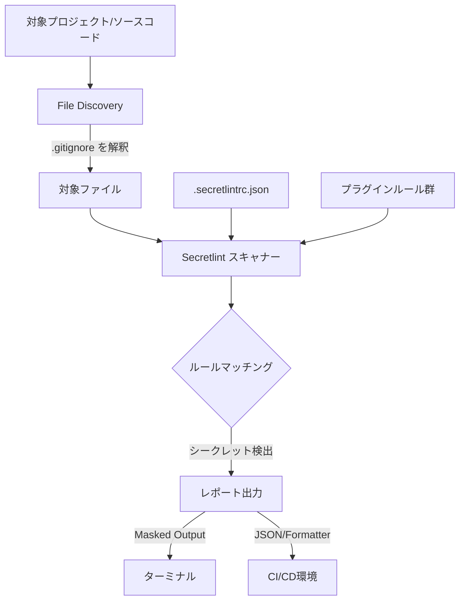

# **Secretlint 調査レポート**

## **1. 基本情報**

* **ツール名**: Secretlint
* **ツールの読み方**: シークレットリント
* **開発元**: azu
* **公式サイト**: [https://github.com/secretlint/secretlint](https://github.com/secretlint/secretlint)
* **関連リンク**:
  * GitHub: [https://github.com/secretlint/secretlint](https://github.com/secretlint/secretlint)
* **カテゴリ**: セキュリティ
* **概要**: Secretlintは、認証情報やシークレットデータが誤ってGitリポジトリにコミットされるのを防ぐためのリンターツールである。プラガブルなアーキテクチャを採用しており、プロジェクトごとに柔軟なルール設定が可能。

## **2. 目的と主な利用シーン**

* **解決する課題**: クラウドサービスのAPIキーやパスワードなどの機密情報をソースコードにハードコーディングし、誤ってパブリックまたは社内リポジトリにコミットしてしまう問題（シークレットの漏洩）。
* **想定利用者**: ソフトウェアエンジニア、DevOpsエンジニア、セキュリティエンジニア。
* **利用シーン**:
  * **ローカルでのコミット前チェック**: Huskyやlint-stagedなどと連携し、`pre-commit`フックとして動作させてシークレットの混入を防ぐ。
  * **CIパイプラインでの自動検証**: GitHub ActionsやMega-LinterなどのCIサービス上で実行し、プルリクエストにシークレットが含まれていないかを検証する。
  * **ブラウザ拡張機能での漏洩防止**: Secretlint WebExtensionを用いて、ブラウザのリクエスト・レスポンスに含まれるシークレットを検出する。

## **3. 主要機能**

* **スキャナー (Scanner)**: プロジェクト内のファイルからクレデンシャルを検出し、レポートを出力する。デフォルトでログ内のシークレット値をマスクする機能を持つ。
* **プロジェクトフレンドリー**: グローバルインストールではなく、プロジェクト単位でインストール・設定を管理できるように設計されており、CIサービスとの統合も容易。
* **プレコミットフック**: gitのフックに組み込むことで、クレデンシャルファイルのコミットを未然に防ぐ。
* **.gitignoreの解釈による効率的なスキャン**: ファイル探索時に `.gitignore` をデフォルトで解釈し、不要なファイルやビルドアーティファクトをスキャン対象から自動的に除外する。
* **プラガブル (Pluggable)**: 独自のカスタムルールの作成や、柔軟な設定（`.secretlintrc.json`）が可能。
* **ルールとしてのドキュメント化**: 各ルールには、「なぜそれがシークレットとして検出されたか」の理由がドキュメントとして記述されており、ターミナルの出力からクリックして直接参照できる。
* **多数のサービス向けルールプリセット**: AWS、GCP、GitHub、Slack、Stripe、OpenAI、Vercel、Dockerなど、多様なサービスに対応したルールが提供されている。

## **4. 動作原理・システム構成**

* **アーキテクチャ**: ローカル（CLIツール）およびCI/CD環境で動作するスタンドアロンなリンターアーキテクチャ
* **主要コンポーネントとデータフロー**:
  1. **ファイル探索**: 指定されたパスやグロブから対象ファイルを収集（v13以降はデフォルトで `.gitignore` のルールを解釈し、不要なファイルを除外する）。
  2. **パース処理**: 収集されたファイルの内容を読み込む。
  3. **ルールマッチング**: 設定ファイル (`.secretlintrc.json`) に基づき、有効化されたプラグインルール群（オプトイン方式）を実行。正規表現などを活用してシークレットを検出。
  4. **出力・レポート**: 検出されたシークレット情報について、ターミナル出力（デフォルトでは値をマスク）や各種フォーマット（例: JSON, GitHub Actionsのアノテーション）でエラーレポートを出力。



* **特筆すべき要素技術**:
  * **プラガブルなルール機構**: textlintと同様のアーキテクチャを持ち、各サービス向けの検出ルールを独立したnpmパッケージ（プラグイン）として管理。
  * **オプトイン方式**: 自動的にすべてをスキャンするのではなく、ユーザーが明示的にルールを設定する思想で誤検知を低減。

## **5. 開始手順・セットアップ**

* **前提条件**:
  * Node.js環境（Node.js 22以上）、またはDocker環境。アカウント登録は不要。
* **インストール/導入**:
  Node.jsを使用する場合、以下のコマンドでインストールする。

  ```bash
  npm install secretlint @secretlint/secretlint-rule-preset-recommend --save-dev
  ```

  Dockerを使用する場合は以下のコマンドでスキャン可能（インストール不要）。

  ```bash
  docker run -v `pwd`:`pwd` -w `pwd` --rm -it secretlint/secretlint secretlint "**/*"
  ```

* **初期設定**:
  プロジェクトのルートで以下のコマンドを実行し、設定ファイル（`.secretlintrc.json`）を生成する。

  ```bash
  npx secretlint --init
  ```

* **クイックスタート**:
  すべてのファイルに対してLintを実行する。

  ```bash
  npx secretlint "**/*"
  ```

## **6. 特徴・強み (Pros)**

* **オプトイン方式による誤検知の削減**: 全てのルールを強制適用するのではなく、必要なルールを選択するオプトイン方式を採用することで、プロジェクトの文脈に合わない不要な誤検知（フォールス・ポジティブ）を抑えることができる。
* **プロジェクト単位での独立した設定**: `git-secrets`などのツールがグローバルインストールを主とするのに対し、Secretlintはプロジェクトの`package.json`で管理でき、プロジェクトごとのカスタマイズが容易。
* **直感的なファイルマッチング**: glob形式のパス指定でも、ディスク上に実在するファイルパスであればリテラルとして扱うことで、フレームワーク固有のパス（例: SvelteKitやNext.jsの括弧付きルーティングなど）のスキャンが容易。
* **分かりやすいドキュメントとエラー表示**: Lintのエラーメッセージからドキュメントへジャンプできるため、開発者が「なぜエラーになったのか」を理解しやすい。

## **7. 弱み・注意点 (Cons)**

* **Node.js依存**: Node.jsのエコシステム上に構築されているため、Node.jsを全く使わないプロジェクト（GoやPython専用プロジェクトなど）では、実行環境を用意するかDockerイメージ、もしくは単一実行バイナリを使用する必要がある。
* **自動修正は非対応**: 基本的にリンターとして機能し、検出は行うが、漏洩したキーの自動リボークなどの修復機能は持たない（シークレットファイルのマスクはサポートしている）。
* **日本語対応**: エラーメッセージやCLIは主に英語で提供されている。

## **8. 料金プラン**

| プラン名 | 料金 | 主な特徴 |
|---------|------|---------|
| **オープンソース（無料）** | 無料 | MITライセンスの下で全ての機能が無料で利用可能 |

* **課金体系**: 完全無料（オープンソース）
* **無料トライアル**: なし（常に無料）

## **9. 導入実績・事例**

* **導入企業**: 個人開発からエンタープライズのオープンソースプロジェクトまで幅広く導入されている。
* **対象業界**: 業界を問わず、ソフトウェア開発を行う全てのチームで利用可能。

## **10. サポート体制**

* **ドキュメント**: GitHubリポジトリ内にREADMEおよび[ドキュメント（構成方法、ルールの作り方等）](https://github.com/secretlint/secretlint/tree/master/docs)が整備されている。
* **コミュニティ**: GitHubのIssueやDiscussionsを通じたオープンソースコミュニティによるサポートが中心。
* **公式サポート**: 企業向けのSLAを伴う公式サポート窓口は提供されていない。

## **11. エコシステムと連携**

### **11.1 API・外部サービス連携**

* **API**: プログラムからSecretlintを利用できるAPIは主にNode.js向けにパッケージとして提供されている。
* **外部サービス連携**:
  * CI/CDツール: GitHub Actions、Mega-Linter
  * Gitフック管理ツール: Husky、lint-staged、pre-commit

### **11.2 技術スタックとの相性**

| 技術スタック | 相性 | メリット・推奨理由 | 懸念点・注意点 |
|:---|:---:|:---|:---|
| **Node.js / npm** | ◎ | npmパッケージとして簡単にインストール・実行可能。エコシステムに最適化されている。 | 特になし |
| **Docker** | ◎ | 公式Dockerイメージが提供されており、環境依存なく実行可能。 | Dockerの起動オーバーヘッドが多少ある |
| **GitHub Actions** | ◎ | `--format github`オプションでプルリクエストへのインラインアノテーションに対応。 | 特になし |

## **12. セキュリティとコンプライアンス**

* **認証**: ツール自体はローカルまたはCI環境で動作するため、外部サービスへの認証は不要。
* **データ管理**: ソースコードはローカルおよび実行環境（CI等）内でスキャンされ、シークレットのデータが外部サーバーに送信されることはない。
* **準拠規格**: オープンソースソフトウェアであり、特定のセキュリティ認証規格（SOC2等）を取得しているわけではない。

## **13. 操作性 (UI/UX) と学習コスト**

* **UI/UX**: CLIベースのツール。ターミナル上でシークレットをマスクしてエラーを表示し、該当するルールのドキュメントURLをクリック可能なリンクとして出力する開発者フレンドリーな設計。
* **学習コスト**: Node.js開発者であれば設定は数分で完了する。カスタムルールの作成にはJavaScriptの知識が必要だが、プリセットルールを利用するだけであれば非常に低い学習コストで導入できる。

## **14. ベストプラクティス**

* **効果的な活用法 (Modern Practices)**:
  * `Husky`と`lint-staged`を組み合わせて、コミットされる変更ファイルのみを対象にSecretlintを実行する。これによりスキャン時間を短縮し、開発者の負担を軽減する。
  * CI（GitHub Actions等）でプルリクエスト時にスキャンを実行し、`--format github`を用いてアノテーションを表示させる。
* **陥りやすい罠 (Antipatterns)**:
  * テスト用にダミーのクレデンシャルを含める場合、`.secretlintignore`で除外するか、コメント（`// secretlint-disable`）を用いて特定の行やブロックを除外しないと、常にエラーとなりCIがブロックされてしまう。

## **15. ユーザーの声（レビュー分析）**

* **調査対象**: GitHubのStar数やX(Twitter)などでの技術的評判。
* **ポジティブな評価**:
  * プロジェクトごとに設定ファイル（`.secretlintrc.json`）を置けるため、プロジェクトごとに柔軟に無視ルールなどを設定できる点が使いやすい。
  * ESLintやtextlintのような使い慣れたプラガブルな設定体系であるため、フロントエンド・Node.jsエンジニアにとって導入が極めて自然。
* **ネガティブな評価 / 改善要望**:
  * PythonやGoなどのプロジェクトで導入する場合に、Node.js環境を要求されるのが手間に感じるケースがある（これに対してはDocker版や単一バイナリが提供されている）。
* **特徴的なユースケース**:
  * VercelやDatabricks、Notionなどの特有のサービストークンの漏洩を防ぐために、最新のプリセットルールを活用する事例。

## **16. 直近半年のアップデート情報**

* **2026-08-27 (v13.0.5)**: プロファイラー機能の修正など、パフォーマンスとCI関連のアップデート。
* **2026-07-22 (v13.0.4)**: CLIでパイプ出力が終了前にフラッシュされない問題の修正。
* **2026-07-21 (v13.0.3)**: データベース接続文字列に関連するバグ修正など。
* **2026-05-04 (v13.0.0)**: ファイル探索時にデフォルトで `.gitignore` を解釈するよう変更。ディスク上に存在するglob形式のパスをリテラルとして扱うよう仕様変更。Tailscale、Stripe、Cloudflareのルールを `preset-recommend` へ追加。
* **2026-04-21 (v12.2.0)**: Cloudflare APIトークンの検出ルールを追加。
* **2026-04-20 (v12.1.0)**: `secretlint-rule-pattern` にパターンごとの `allows` 設定を追加。
* **2026-04-19 (v12.0.0)**: Node.js 22以上の要求。`recommend`プリセットへGroq, Hugging Face, Notion, GitLab, Grafana, HashiCorp Vault, Vercel, Databricks, Docker, Figmaのルールを追加。

(出典: [GitHub Releases](https://github.com/secretlint/secretlint/releases))

## **17. 類似ツールとの比較**

### **17.1 機能比較表 (星取表)**

| 機能カテゴリ | 機能項目 | Secretlint | Gitleaks | git-secrets | GitHub Secret Scanning |
|:---:|:---|:---:|:---:|:---:|:---:|
| **基本機能** | シークレットスキャン | ◎<br><small>詳細なルール体系</small> | ◎<br><small>高速なGo実装</small> | ◯<br><small>AWS特化</small> | ◎<br><small>GitHubネイティブ</small> |
| **設定・管理** | プロジェクト単位の設定 | ◎<br><small>.secretlintrc</small> | ◯<br><small>.gitleaks.toml</small> | △<br><small>グローバル設定が主</small> | ◯<br><small>リポジトリ/Org単位設定</small> |
| **拡張性** | カスタムルールの作成 | ◎<br><small>Node.jsで作成可能</small> | ◯<br><small>TOMLで正規表現定義</small> | ◯<br><small>正規表現ベース</small> | ◯<br><small>Enterpriseで独自パターン定義可</small> |
| **思想** | 検知アプローチ | ◎<br><small>オプトイン方式</small> | ◯<br><small>広範なデフォルトルール</small> | △<br><small>AWS特化寄り</small> | ◎<br><small>プッシュ保護と自動リボーク連携</small> |

### **17.2 詳細比較**

| ツール名 | 特徴 | 強み | 弱み | 選択肢となるケース |
|---------|------|------|------|------------------|
| **Secretlint** | プラガブルでNode.js親和性の高いリンター | プロジェクトごとの柔軟な設定、オプトインで誤検知が少ない | Node.jsの実行環境が必要 | フロントエンド・Node.jsプロジェクトや、設定をプロジェクト内で完結させたい場合 |
| **Gitleaks** | Go製の高速なシークレットスキャナー | 非常に高速で過去のコミット履歴も強力にスキャン可能 | 正規表現による誤検知が発生しやすい場合がある | 大規模な履歴を持つリポジトリの全体スキャンや、CIでの高速なスキャンが求められる場合 |
| **git-secrets** | AWS Labs製のGitフックツール | AWSクレデンシャルの検知に特化し、導入がシンプル | プロジェクトごとの個別設定が難しく、グローバル設定に依存しがち | 全社的にAWSクレデンシャルの漏洩を防止するための基本対策として導入する場合 |
| **GitHub Secret Scanning** | GitHubに組み込まれたネイティブ機能 | プッシュ保護、パートナー企業との連携による漏洩トークンの自動無効化 | GitHub外（GitLabなど）では利用不可 | GitHubをメインで利用しており、サーバーサイドでの強力な防止・事後対応が必要な場合 |

## **18. 総評**

* **総合的な評価**:
  Secretlintは、シークレットスキャンツールにおいて「プロジェクト単位での管理」と「誤検知の削減」に重きを置いた優れたツールである。Node.jsのエコシステムと強力に統合されており、フロントエンドやバックエンド（Node.js）のプロジェクトにおいて、他のLintツール（ESLint等）と同様の感覚で容易に導入できる。ルールの豊富さや、エラー時のドキュメントの充実度も高く、開発者体験に優れている。
* **推奨されるチームやプロジェクト**:
  * Node.jsを主言語とするプロジェクトや、すでにHuskyやlint-stagedを用いてコミット前フックを運用しているチーム。
  * プロジェクトごとに利用している外部サービスが異なり、柔軟なルール設定を行いたいチーム。
* **選択時のポイント**:
  過去のコミット履歴全体を数秒で高速にスキャンしたい場合は`Gitleaks`などのGo製ツールが適しているが、これからコードを書く日々の開発ワークフロー（Pre-commitやPRレビュー）にシークレット防止機構を自然に組み込みたい場合、Secretlintは非常に強力な選択肢となる。
