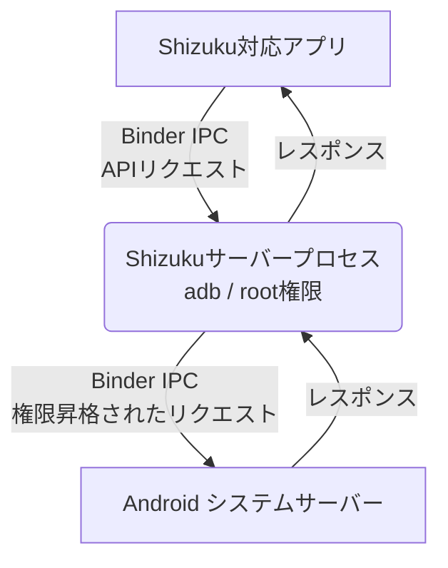

# **Shizuku 調査レポート**

## **1. 基本情報**

* **ツール名**: Shizuku
* **ツールの読み方**: シズク
* **開発元**: RikkaApps
* **公式サイト**: [https://shizuku.rikka.app/](https://shizuku.rikka.app/)
* **関連リンク**:
  * GitHub: [https://github.com/RikkaApps/Shizuku](https://github.com/RikkaApps/Shizuku)
  * ドキュメント: [https://shizuku.rikka.app/guide/setup.html](https://shizuku.rikka.app/guide/setup.html)
* **カテゴリ**: 開発者ツール
* **概要**: 一般のAndroidアプリが、本来はシステムアプリやroot権限が必要なシステムAPIを、直接かつ安全に呼び出せるようにするツール。adbやroot権限を利用して専用のサーバープロセスを立ち上げ、Binder IPCを介してアプリとシステムサーバー間を仲介する。

## **2. 目的と主な利用シーン**

* **解決する課題**: 従来、権限の必要な操作を行うために`su`シェルを経由してコマンドを実行していたことによる「処理速度の遅さ（複数プロセスの生成）」「テキスト解析の不安定さ」「実行可能なコマンドの制限」を解決する。
* **想定利用者**: Androidのカスタマイズや高度な機能を利用したい一般ユーザー、およびroot不要でシステムAPIを利用するアプリの開発者。
* **利用シーン**:
  * パッケージの有効化/無効化（`pm enable/disable`相当）を行うアプリの利用。
  * システム設定の変更や隠しAPIの呼び出しが必要なアプリの動作サポート。
  * root権限がない環境（adbのみの環境）での高度なデバイス管理。

## **3. 主要機能**

* **API仲介機能**: Shizukuサーバーを介して、一般アプリがシステムAPI（システム権限やadb権限）を直接呼び出せるようにする。
* **複数起動方式**: root権限による直接起動、PC接続によるadb起動、Android 11以降のワイヤレスデバッグ機能を利用した単体起動に対応。
* **高速な処理**: コマンドのたびに別プロセスを起動する従来のsuシェル方式と比較し、Binder IPCを用いることで極めて高速に動作する。
* **広範な互換性**: Android 6.0以上をサポートし、多種多様なシステムAPIへのアクセスを提供する（一部Androidバージョンの制限あり）。
* **開発者向けSDK**: 開発者が自身のアプリにShizukuサポートを簡単に組み込めるよう、APIとサンプルコードを提供している。

## **4. 動作原理・システム構成**

* **アーキテクチャ**: ローカルクライアント・サーバー構成（Binder IPC経由）
* **主要コンポーネントとデータフロー**:
  * **Shizukuサーバープロセス**: ユーザーがrootまたはadb（ワイヤレスデバッグ含む）経由で起動するバックグラウンドプロセス。
  * **アプリプロセス**: Shizukuを利用する一般アプリ。起動時にShizukuサーバーへのBinderを受け取る。
  * **システムサーバー**: Android OSの中核。
  * **データフロー**: アプリはShizukuサーバーに対してリクエストを送信し、Shizukuサーバーが中間者（ミドルマン）としてシステムサーバーへリクエストを転送し、結果をアプリに返す。これにより、アプリはシステムAPIを直接使用しているのと同じように動作する。
* **特筆すべき要素技術**:
  * **Binder IPC**: Android標準のプロセス間通信。これによりシステムサーバーはクライアントのuidとpidを把握し権限チェックを行う。ShizukuはBinderを利用して効率的にプロセス間通信を行う。
  * **app_process**: Shizukuサーバー（Javaプロセス）の起動に用いられる仕組み。

## **5. 開始手順・セットアップ**

* **前提条件**:
  * Androidデバイス（Android 6.0以降推奨）
  * アカウント作成やクレジットカード登録は不要。
* **インストール/導入**:
  * Google Play、GitHub Releases、Coolapk、F-Droid (IzzyOnDroid) からShizukuアプリをインストール。
* **初期設定**:
  * 起動方法は環境に応じて3種類存在する。
* **クイックスタート**:
  * **ワイヤレスデバッグによる起動 (Android 11+)**:
    1. 「開発者向けオプション」と「ワイヤレスデバッグ」を有効化する。
    2. Shizukuアプリからペアリングを開始し、「ペアリングコードによるデバイスのペア設定」を選択。
    3. 通知にペアリングコードを入力し、Shizukuを起動する。
  * **PC接続によるadb起動 (Android 10以下でrootなし)**:
    1. PCにSDK Platform Tools (adb) をインストール。
    2. AndroidデバイスでUSBデバッグを有効化し、PCと接続。
    3. ターミナルから以下のコマンドを実行する（v11.2.0以降の場合）:
       `adb shell sh /sdcard/Android/data/moe.shizuku.privileged.api/start.sh`
  * **rootによる起動**: デバイスがroot化されている場合、Shizukuアプリ内から直接起動。

## **6. 特徴・強み (Pros)**

* root権限を取得しなくても、ワイヤレスデバッグやadbを利用してシステム権限相当の機能を利用できる。
* 従来のシェルコマンド実行（`su`）方式と比較して、プロセスの生成オーバーヘッドがなく、非常に高速かつ安定して動作する。
* 開発者にとって、システムAPIを直接呼び出すのとほぼ同じコードで実装できるため、アプリの開発・対応が容易である。

## **7. 弱み・注意点 (Cons)**

* Androidの仕様上、ワイヤレスデバッグやadb経由で起動した場合、デバイスを再起動するたびにShizukuの起動手順をやり直す必要がある。
* MIUI (Xiaomi)、ColorOS (OPPO/OnePlus)、EMUI (Huawei) など、メーカー独自のOSカスタマイズによってバックグラウンド実行や権限管理が制限されることがあり、個別の設定変更が必要になる場合がある。
* adb権限には制限があり、Androidのバージョンによって許可される操作が異なる。

## **8. 料金プラン**

| プラン名 | 料金 | 主な特徴 |
|---------|------|---------|
| **無料プラン** | 無料 | すべての機能が利用可能 |

* **課金体系**: 完全無料
* **無料トライアル**: なし（全機能無料のため）

## **9. 導入実績・事例**

* **導入企業**: オープンソースの個人向けツールであるため、企業単位での導入実績は公開されていない。
* **導入事例**: IceBox、App Ops、Swift Backup、SAI (Split APKs Installer) など、システムレベルの操作を必要とする多数のサードパーティ製Androidアプリで、root権限の代替手段として公式にサポート・推奨されている。
* **対象業界**: 一般のAndroidカスタマイズユーザー、Androidアプリ開発者。

## **10. サポート体制**

* **ドキュメント**: [ユーザーマニュアル](https://shizuku.rikka.app/guide/setup.html)や開発者向けガイドが公式サイトに詳細に記載されており、日本語にも対応している。
* **コミュニティ**: GitHub上のIssuesやDiscussionsでユーザー間および開発者とのやり取りが行われている。
* **公式サポート**: オープンソースプロジェクトのため、商用の公式サポート窓口（電話やチャット）は存在しない。GitHub上での報告が基本となる。

## **11. エコシステムと連携**

### **11.1 API・外部サービス連携**

* **API**: 開発者向けにShizuku API（[GitHubリポジトリ](https://github.com/RikkaApps/Shizuku-API)）が公開されており、アプリに組み込むことでShizukuサーバーと通信できる。
* **外部サービス連携**: 単体で動作するツールの性質上、外部SaaSサービスとの標準連携はない。他のAndroidアプリとの連携が主となる。

### **11.2 技術スタックとの相性**

| 技術スタック | 相性 | メリット・推奨理由 | 懸念点・注意点 |
|:---|:---:|:---|:---|
| **Android (Java/Kotlin)** | ◎ | 公式SDK（Shizuku-API）が提供されており、シームレスに組み込み可能 | 特になし |

## **12. セキュリティとコンプライアンス**

* **認証**: デバイス上のプロセスであるため、特定のクラウドアカウント認証などはない。adb接続時のデバイス認証や、ワイヤレスデバッグのペアリングコードによる認証に依存する。
* **データ管理**: データはデバイス内に留まり、外部サーバーへの送信は行われない。
* **準拠規格**: オープンソースプロジェクトであり、特定のセキュリティ認証（ISO27001など）は取得していないが、コードは公開・監査可能である。

## **13. 操作性 (UI/UX) と学習コスト**

* **UI/UX**: シンプルなマテリアルデザインのUIを備え、ステータス（起動中か否か）が一目でわかるようになっている。ワイヤレスデバッグのペアリング手順なども画面内で丁寧にガイドされる。
* **学習コスト**: 一般ユーザーにとっては「ワイヤレスデバッグ」「adb」といった概念の理解が必要であり、初期導入のハードルはやや高い。しかし、公式サイトのステップバイステップのガイドに従えば設定可能。開発者にとっては、提供されるAPIを利用するだけであり、Android標準APIと似ているため学習コストは低い。

## **14. ベストプラクティス**

* **効果的な活用法 (Modern Practices)**:
  * Android 11以降のデバイスでは、PCが不要な「ワイヤレスデバッグ」を利用した起動が推奨される。
  * アプリ開発者は、フォールバックとしてroot権限にも対応させつつ、Shizukuを主要な権限取得手段としてサポートすることが推奨される。
* **陥りやすい罠 (Antipatterns)**:
  * タスクキラーやOSの強力なバッテリー最適化機能によってShizukuがバックグラウンドでキルされると動作しなくなる。Shizukuアプリをバッテリー最適化の対象外に設定する必要がある。
  * メーカー独自OS（MIUIなど）のセキュリティ設定（「USBデバッグ（セキュリティ設定）」など）を有効にし忘れると、権限エラーで正常に動作しない。

## **15. ユーザーの声（レビュー分析）**

* **調査対象**: Google Play, GitHub Issues, X (Twitter)
* **総合評価**: 4.4/5.0 (Google Play)
* **ポジティブな評価**:
  * 「root化せずに強力なシステムツール（App Opsなど）が使えるのは画期的。」
  * 「ワイヤレスデバッグでPCなしで起動できるようになったのは非常に便利。」
  * 「バッテリーへの影響も少なく、動作が非常に速い。」
* **ネガティブな評価 / 改善要望**:
  * 「端末を再起動するたびに有効化し直さなければならないのが面倒。」
  * 「Xiaomiなどの一部の端末では、開発者オプションの設定が複雑で初心者がつまずきやすい。」
  * 「Androidアップデート後に一時的に動作しなくなることがある。」
* **特徴的なユースケース**:
  * キャリアアプリやプリインストールアプリなど、通常は無効化できない不要なアプリを凍結（無効化）するためのツールと組み合わせての使用。

## **16. 直近半年のアップデート情報**

* **2025-05-25**: v13.6.0リリース。Android 16 QPR1をサポート。Android 13以上で信頼されたWLANに接続した際の、root不要での自動起動をサポート。
* **2024-03-10**: v13.5.4リリース。Android 14 QPR3 beta 2に対応。
* **2023-11-26**: v13.5.3リリース。Android 14 QPR2に対応。
* **2023-09-24**: v13.5.2リリース。ColorOS (Oppo & OnePlus) のAndroid 14に対応。
* **2023-08-03**: v13.5.1リリース。`addUserService`の複数回呼び出し時の動作修正や予測型「戻る」ジェスチャー（Predictive back gesture）への対応。

(出典: [GitHub Releases](https://github.com/RikkaApps/Shizuku/releases))

## **17. 類似ツールとの比較**

### **17.1 機能比較表 (星取表)**

| 機能カテゴリ | 機能項目 | Shizuku | Magisk / KernelSU (root) |
|:---:|:---|:---:|:---:|
| **基本機能** | システムAPIアクセス | ◎ <small>高速・セキュア</small> | ◯ <small>suコマンド経由、遅い</small> |
| **カテゴリ特定** | root権限不要 | ◎ <small>adb権限で動作可能</small> | × <small>デバイスのroot化が必須</small> |
| **システム管理** | 再起動時の永続化 | △ <small>adb起動は都度操作が必要(一部自動化あり)</small> | ◎ <small>恒久的に有効</small> |
| **非機能要件** | セキュリティリスク | ◎ <small>システム改変を行わない</small> | △ <small>システムを改変するためリスクが高い</small> |

### **17.2 詳細比較**

| ツール名 | 特徴 | 強み | 弱み | 選択肢となるケース |
|---------|------|------|------|------------------|
| **Shizuku** | Binder IPCを利用したAPI仲介ツール | root不要で高速・安全にシステム機能を使える | 再起動のたびに起動操作が必要（adbの場合） | デバイスの保証を維持したまま、あるいはセキュリティリスクを冒さずに高度なアプリを利用したい場合 |
| **Magisk / KernelSU (root)** | デバイスを完全に制御するrootソリューション | あらゆる制限を回避し、システムの完全な書き換えが可能 | 導入ハードルが高く、保証の無効化や一部アプリ（銀行系など）の動作拒否リスクがある | カーネルレベルの改造や、システムファイルの直接編集など、Shizukuのadb権限では不可能な深いカスタマイズを行いたい場合 |

## **18. 総評**

* **総合的な評価**:
  * Shizukuは、Androidエコシステムにおいてroot化の必要性を大幅に減らした非常に画期的で優れたツールである。従来は非効率だったシェルコマンドによる権限昇格を、AndroidネイティブのBinder IPCを利用することでエレガントに解決している点が高く評価できる。
* **推奨されるチームやプロジェクト**:
  * Androidデバイスを高度にカスタマイズしたいが、root化のリスクは避けたいすべてのAndroidユーザー。また、システム権限を必要とするAndroidアプリの開発者。
* **選択時のポイント**:
  * デバイス再起動時の再有効化の手間を受け入れられるかが唯一の懸念点である。しかし、Android 11以降のワイヤレスデバッグ機能や、v13.6.0で追加された信頼されたWLANでの自動起動機能により、その手間も大幅に軽減されており、現状ではシステムカスタマイズ系アプリを利用するためのデファクトスタンダードとなっている。
