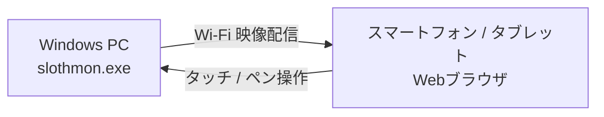

# **SlothMon 調査レポート**

## **1. 基本情報**

* **ツール名**: SlothMon
* **ツールの読み方**: スロースモン
* **開発元**: 空河豚
* **公式サイト**: [https://kuuhugu.github.io/SlothMon/](https://kuuhugu.github.io/SlothMon/)
* **関連リンク**:
  * ドキュメント: [https://kuuhugu.github.io/SlothMon/](https://kuuhugu.github.io/SlothMon/)
* **カテゴリ**: ユーティリティ
* **概要**: SlothMonは、Windows PCに仮想ディスプレイを作成し、Wi-Fi経由でスマートフォンやタブレットのブラウザに画面を映し出すツールである。スマホ側のアプリインストールは不要で、QRコードを読み取るだけで即座にサブ画面として利用できる。

## **2. 目的と主な利用シーン**

* **解決する課題**: PCの作業領域不足を解消し、手持ちのスマートフォンやタブレットを簡単に追加ディスプレイとして活用したいという課題。
* **想定利用者**: Windowsユーザー、デュアルディスプレイ環境が必要なクリエイターやビジネスパーソン。
* **利用シーン**:
  * ブラウザやチャットツール、資料画面をスマホ側に表示させてPCの作業効率を向上。
  * タブレットを縦置きにして、縦長の資料やタイムラインを確認。
  * タッチやペン操作を活用してPCのマウス操作を直感的に行う。

## **3. 主要機能**

* **仮想ディスプレイ作成**: 単なるミラーリングではなく、独立した拡張ディスプレイをWindowsに追加する機能。
* **QRコード接続**: PC画面に表示されるQRコードをスマホのブラウザで読み取るだけで接続できる機能。
* **画面サイズ自動調整**: 接続したスマホやタブレットの画面アスペクト比に合わせて解像度を自動で調整し、黒帯を出さずに全画面表示する機能。
* **タッチ・ペン操作対応**: スマホ画面のタップやドラッグをPCのマウス操作として反映。ペン描画はローカル処理で先行描画され、遅延の少ないスムーズな書き心地を実現。
* **縦横表示の切り替え**: 仮想ディスプレイの表示を縦長・横長に切り替え可能。
* **アクセス制御**: QRコードに接続キーを含めることで、同じWi-Fi上の他端末からの不正なアクセスを防止する機能。

## **4. 動作原理・システム構成**

* **アーキテクチャ**: ローカルネットワーク完結型のクライアント・サーバー構成
* **主要コンポーネントとデータフロー**:
  * Windows PC上で動作する `slothmon.exe` が仮想ディスプレイを作成し、Webサーバーとして機能する。
  * スマートフォンやタブレットのWebブラウザがWi-Fi経由でPCにアクセスし、映像を受信して表示する。
  * クライアント（ブラウザ）から入力されたタッチやペン操作がPC側に送信され、マウス操作として反映される。
* **特筆すべき要素技術**:
  * **MttVDD**: 仮想ディスプレイドライバー（MIT License）を利用して拡張ディスプレイを実現。
  * **Microsoft Edge WebView2**: Windowsの標準コンポーネントを利用。
  * 外部サーバーとの通信は一切行わず、ローカルネットワーク内のみで完結するためセキュアである。



## **5. 開始手順・セットアップ**

* **前提条件**:
  * OS: Windows 11（64bit）
  * ランタイム: Microsoft Edge WebView2 ランタイム（Windows 11は標準搭載）
  * ネットワーク: PCとスマホが同じローカルネットワーク（Wi-Fi）に接続されていること
  * 権限: 初回のみ管理者権限（ドライバーの導入用）
* **インストール/導入**:

  ```bash
  # ZIPファイルをダウンロードして展開
  # slothmon.exe と driver フォルダを同じ階層に配置
  ```

* **初期設定**:
  * 特になし（外部通信を行わないためアカウント登録やAPIキーは不要）。
* **クイックスタート**:
  1. `slothmon.exe` をダブルクリックで起動。
  2. 初回起動時のユーザーアカウント制御（UAC）で「はい」を選択。
  3. ウィンドウに表示されたQRコードをスマホのカメラで読み取り、ブラウザで開く。
  4. 映像が表示されたら、スマホの画面を1回タップする（画面の自動消灯を防止するため）。

## **6. 特徴・強み (Pros)**

* アプリのインストールが不要で、ブラウザのみで完結する手軽さ。
* 外部サーバーを経由しないローカルネットワーク完結型による低遅延とセキュリティの高さ。
* 個人・法人を問わず完全無料で利用可能であり、商用利用も許可されている。
* 画面の自動サイズ調整機能により、デバイスに最適な解像度で表示可能。

## **7. 弱み・注意点 (Cons)**

* 現時点ではWindows 11 (64bit) 版のみの提供であり、Macなど他のOSでは利用できない。
* ペン操作はマウス操作として処理されるため、筆圧や傾き検知には非対応（対応は検討中）。
* ゲスト用Wi-Fiなど、端末同士の通信が禁止されているネットワーク環境では利用できない。

## **8. 料金プラン**

| プラン名 | 料金 | 主な特徴 |
|---------|------|---------|
| **無料プラン** | 無料 | すべての機能を無制限で利用可能 |

* **課金体系**: 完全無料
* **無料トライアル**: なし（すべて無料のため）

## **9. 導入実績・事例**

* **導入企業**: 2026年10月に公開されたばかりのツールのため、具体的な導入企業名の公開事例はない。
* **導入事例**: 公開事例なし。ただし、個人開発者やリモートワーカーの間で手軽なサブディスプレイ化ツールとして注目されている。
* **対象業界**: 業界を問わず、Windows PCを利用するすべてのユーザー。

## **10. サポート体制**

* **ドキュメント**: 公式サイトに使用方法、動作環境、よくある質問（FAQ）が詳細に記載されている。
* **コミュニティ**: 公式のユーザーフォーラムやSlack等のコミュニティは現在のところ存在しない。
* **公式サポート**: 個人開発ツールのため、専用の公式サポート窓口は設けられていない。

## **11. エコシステムと連携**

### **11.1 API・外部サービス連携**

* **API**: 公開されているAPIはない。
* **外部サービス連携**: 他の外部サービスと直接連携する機能はない。独立した仮想ディスプレイツールとして機能する。

### **11.2 技術スタックとの相性**

| 技術スタック | 相性 | メリット・推奨理由 | 懸念点・注意点 |
|:---|:---:|:---|:---|
| **Windows 11** | ◎ | ネイティブ動作、WebView2標準搭載 | 特になし |
| **macOS** | × | 非対応 | 利用不可 |
| **iOS / Android ブラウザ** | ◎ | アプリ不要でブラウザから即座に利用可能 | 機種ごとの挙動差に注意が必要 |

## **12. セキュリティとコンプライアンス**

* **認証**: QRコードに含まれる接続キーにより認証を行い、同一Wi-Fi上の他端末からの不正アクセスを防止。
* **データ管理**: 通信はすべてPCとスマホ間のローカルネットワーク内で完結し、外部サーバーを経由しない。
* **準拠規格**: 個人開発ツールであり、特定のセキュリティ規格（ISO27001など）の取得は公表されていない。

## **13. 操作性 (UI/UX) と学習コスト**

* **UI/UX**: PC側でQRコードを表示し、スマホで読み取るだけという極めて直感的なUI設計。
* **学習コスト**: 設定画面や複雑な操作は不要であり、マニュアルを見なくても直感的に利用を開始できる。学習コストは非常に低い。

## **14. ベストプラクティス**

* **効果的な活用法 (Modern Practices)**:
  * チャットツール（Slack等）や資料をスマホ側に常時表示させ、PCのメイン画面を広く使う。
  * タブレットを縦置きにし、縦長のブラウジングやタイムライン確認専用のディスプレイとして活用する。
* **陥りやすい罠 (Antipatterns)**:
  * 端末同士の通信が制限されている公共のWi-FiやゲストWi-Fiで接続を試みること（接続不可）。
  * Windowsファイアウォールでブロックされていることに気づかず接続できない状態に陥ること（初回起動時の確認で許可が必要）。

## **15. ユーザーの声（レビュー分析）**

* **調査対象**: 新規公開ツールの開発者サイト、SNSなど
* **総合評価**: 新規ツールのためG2等のレビューサイトの評価スコアはなし。
* **ポジティブな評価**:
  * スマホ側のアプリインストールが一切不要で、QRコードを読み取るだけで即座にサブ画面として使える点が便利。
  * アプリ不要でブラウザから利用できるため、管理権限のない会社のスマホでも利用しやすい。
* **ネガティブな評価 / 改善要望**:
  * 現状はMacに非対応なため、Macユーザーも利用できるようになってほしい。
  * ペンの筆圧・傾きには対応していないため、クリエイティブ用途での本格的なペンタブレットとしての利用には限界がある。
* **特徴的なユースケース**:
  * 余っている古いスマホやタブレットを、ケーブルレスで手軽に再活用するケース。

## **16. 直近半年のアップデート情報**

* **2026-10-03**: v0.7.0リリース。最初の公開版。仮想ディスプレイ作成、QRコード接続、画面サイズ自動調整、タッチ・ペン操作対応を実装。

(出典: [公式サイト リリース履歴](https://kuuhugu.github.io/SlothMon/#releases))

## **17. 類似ツールとの比較**

### **17.1 機能比較表 (星取表)**

| 機能カテゴリ | 機能項目 | 本ツール (SlothMon) | Duet Display | spacedesk |
|:---:|:---|:---:|:---:|:---:|
| **基本機能** | サブディスプレイ化 | ◎<br><small>アプリ不要で接続可能</small> | ◯<br><small>アプリインストール必須</small> | ◯<br><small>アプリインストール必須</small> |
| **カテゴリ特定** | 接続方法 | ◎<br><small>Wi-Fi経由・QRコード</small> | ◯<br><small>有線/無線（有料）</small> | ◯<br><small>Wi-Fi経由</small> |
| **エンタープライズ** | Mac対応 | ×<br><small>Windowsのみ</small> | ◎<br><small>対応済</small> | ×<br><small>Windowsのみ（サーバー側）</small> |
| **非機能要件** | 価格 | ◎<br><small>完全無料</small> | △<br><small>有料プラン中心</small> | ◯<br><small>個人利用は無料</small> |

### **17.2 詳細比較**

| ツール名 | 特徴 | 強み | 弱み | 選択肢となるケース |
|---------|------|------|------|------------------|
| **本ツール** | ブラウザ完結のサブディスプレイ | クライアントアプリ不要、完全無料 | Mac非対応、筆圧検知非対応 | 手軽に完全無料でスマホをサブディスプレイ化したい場合 |
| **Duet Display** | 有名な有線/無線ディスプレイ化アプリ | 高速・低遅延、Mac/Windows両対応 | 基本的に有料、クライアントアプリが必要 | 本格的で安定した遅延のない環境を求める場合 |
| **spacedesk** | 無料で使えるネットワークディスプレイツール | 個人利用無料、多機能 | クライアントアプリが必要 | アプリをインストールして細かい設定を行いたい場合 |

## **18. 総評**

* **総合的な評価**:
  * SlothMonは、クライアント側のアプリインストールを不要とし、QRコードを読み取るだけで手軽にサブディスプレイ化を実現した画期的なツールである。ローカルネットワーク内で完結するためセキュリティ上の懸念が少なく、遅延の少ないタッチ・ペン操作に対応している点も高く評価できる。完全無料であることも大きな魅力である。
* **推奨されるチームやプロジェクト**:
  * 余っているスマートフォンやタブレットを有効活用したい個人ユーザー。
  * リモートワーク等で一時的に作業領域を広げたいビジネスパーソン。
* **選択時のポイント**:
  * アプリのインストールに制限がある端末をサブディスプレイとして利用したい場合や、コストをかけずに手軽にデュアルディスプレイ環境を構築したい場合に最適な選択肢となる。ただし、Macユーザーや本格的なペン入力（筆圧検知）を求めるユーザーには他のツールを検討する必要がある。
