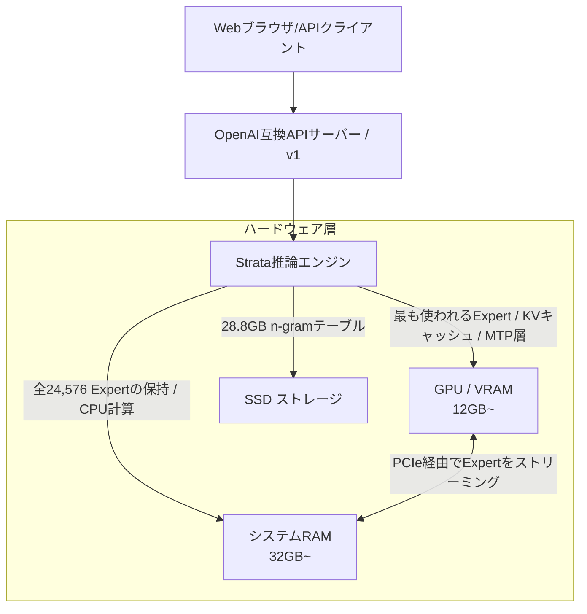

# **Strata 調査レポート**

## **1. 基本情報**

* **ツール名**: Strata
* **ツールの読み方**: ストラタ
* **開発元**: Niko1221
* **公式サイト**: [https://github.com/Niko1221/Strata](https://github.com/Niko1221/Strata)
* **関連リンク**:
  * GitHub: [https://github.com/Niko1221/Strata](https://github.com/Niko1221/Strata)
* **カテゴリ**: ローカルAI実行環境
* **概要**: 125BパラメータのAIモデル（Qwen3.8-Flash-Next）を、通常サーバーが必要な規模でありながら、12GB以上のVRAMを持つNVIDIA/AMDのゲーミングPC上でローカルに実行できる無料かつオープンソースのツール。

## **2. 目的と主な利用シーン**

* **解決する課題**: 超大規模モデル（125Bパラメータなど）を実行するためには高価なGPUサーバーが必要という問題を、VRAM・RAM・SSDに処理を分散させる独自のアーキテクチャにより解決する。
* **想定利用者**: AI開発者、ローカルでプライバシーを保ったまま強力なAIを使いたいソフトウェアエンジニア、コーディングエージェントのユーザー。
* **利用シーン**:
  * **コーディング支援**: AIコーディングアシスタント（Claude Code, Cursorなど）のバックエンドAPIとしての利用。
  * **ローカルチャット**: プライバシーを完全に確保した上での、高性能AIとのチャットやコード生成。
  * **画像認識**: GPUまたはCPUを用いた画像エンコーダーによるマルチモーダルタスクの実行。

## **3. 主要機能**

* **大規模モデルのローカル実行**: 125Bパラメータのモデル（Qwen3.8-Flash-Nextなど）を12GB以上のVRAMで動作可能。
* **マルチGPUサポート**: 2〜3枚のグラフィックカードでモデルを共有して処理を分散可能。
* **OpenAI互換APIサーバー**: 他のアプリやコーディングエージェント（Cursor等）から`http://127.0.0.1:8080/v1`として直接接続可能。
* **MCPサーバー対応**: AIツールからStrata自体のインストール・起動・停止を操作可能なMCP (Model Context Protocol) サーバー機能。
* **マルチモーダル（画像認識）対応**: VRAMまたはCPUを利用した画像読み込み（Vision）機能。
* **Web UI**: ブラウザからアクセス可能なチャット画面、モニタリング画面（GPU/CPU/RAM使用量）、設定画面を内蔵。
* **推論（Thinking）レベル調整**: off, low, medium, high の4段階でAIの推論リソースを調整可能。

## **4. 動作原理・システム構成**

* **アーキテクチャ**: ローカルファーストのクライアント・サーバー構成（VRAM / RAM / SSDの階層型メモリ分散アーキテクチャ）
* **主要コンポーネントとデータフロー**:
  * **GPU (VRAM)**: Attention、DeltaNet mixers、ルーター、よく使われる専門家（Expert）、MTPドラフトレイヤー、KVキャッシュの一部などを保持する。
  * **RAM**: モデルの全24,576個の専門家（Expert）を保持し、GPUに載らない計算をCPUが同時に処理する。
  * **SSD**: 28.8GBのn-gramテーブルを配置し、トークン生成時に必要に応じてOSキャッシュ経由で読み込む。
* **特筆すべき要素技術**:
  * **Guess and Check (推論と検証)**: 小さなヘルパーモデルが次の数単語を推測し、大きなモデルが一度にチェックすることで、出力速度を1.6〜1.8倍に向上させている。
  * **プロンプトのチャンク処理**: 長いテキストは最大8,192トークンのチャンクで処理され、1000トークン/秒以上の速度で高速に読み込む。



## **5. 開始手順・セットアップ**

* **前提条件**:
  * Windows 10/11 または Linux
  * NVIDIA (RTX 20~50シリーズ) または AMD (RX 7900 XT, 6800等) のグラフィックカード（VRAM 12GB以上）
  * RAM 32GB以上、空き容量80GB以上のSSD（NVMe推奨）
  * アカウント作成やクレジットカード登録は不要。
* **インストール/導入**:

  ```bash
  # Linuxの場合
  git clone https://github.com/Niko1221/Strata.git
  cd Strata
  ./setup.sh

  # Windowsの場合はダウンロード後、 START-HERE.bat をダブルクリック
  ```

* **初期設定**:
  * インストーラーがGPUを自動検出し、推奨モデルサイズやコンテキスト長、画像認識の有無を尋ねてくるので、基本的にはEnterキーで推奨設定を選択する。
* **クイックスタート**:
  * セットアップ完了後、自動的にモデル（約70GB）がダウンロードされ、サーバーが起動する。ブラウザで `http://127.0.0.1:8080` にアクセスするとチャットを利用可能。

## **6. 特徴・強み (Pros)**

* コンシューマー向けのゲーミングPC（12GB VRAM〜）で、125Bパラメータという超大規模モデルを実用的な速度（50〜90トークン/秒）で動かせる圧倒的な技術的優位性。
* RAM、VRAM、SSDの3階層にモデルを分散させる高度なアーキテクチャにより、限られたVRAMを最大限に活用できる。
* OpenAI互換APIとAnthropic互換APIを備えており、CursorやClaude Codeなど既存のAIツール・エディタのバックエンドとしてシームレスに連携可能。
* インストーラーがハードウェアを自動判別し、最適な設定を提案してくれるため、複雑な環境構築が不要。

## **7. 弱み・注意点 (Cons)**

* 初回起動時や大規模なコンテキスト読み込み時にRAMへ数十GBをロードするため、PCの動作が1〜3分間重くなる・応答しなくなることがある。
* 快適な動作には32GB以上の大容量RAMと高速なSSDが必須であり、一般的なPCよりも要求スペックが高い。
* モデルデータ（約70GB）のダウンロードに時間と大容量のストレージを要する。
* インストーラーやUIの日本語対応は完全ではないが、実行されるQwenモデル自体は日本語の入出力に標準で対応している。

## **8. 料金プラン**

| プラン名 | 料金 | 主な特徴 |
|---------|------|---------|
| **オープンソース** | 無料 | MITライセンス。すべての機能をローカルで無制限に利用可能。 |

* **課金体系**: 完全無料。ユーザー自身のハードウェアリソースと電気代のみ。
* **無料トライアル**: なし（完全無料のため）

## **9. 導入実績・事例**

* **導入企業**: 個人開発・コミュニティ主導のオープンソースプロジェクトのため、特定の企業導入事例は公式には記載されていない。
* **導入事例**: 主にAI研究者や、ローカルで高性能なコーディングAIを利用したい個人のソフトウェアエンジニアによる利用がGitHub等で報告されている。
* **対象業界**: ソフトウェア開発、AI研究、機密性が重視されるデータ分析など。

## **10. サポート体制**

* **ドキュメント**: GitHubのREADMEおよび `docs/` ディレクトリ内に、詳細なインストールガイド、アーキテクチャ解説、トラブルシューティングが完備されている。
* **コミュニティ**: GitHub Issuesやコミュニティベンチマークを活用したユーザー間の情報交換、バグ報告が活発に行われている。
* **公式サポート**: コミュニティベースのサポートのみ。商用の公式サポート窓口は存在しない。

## **11. エコシステムと連携**

### **11.1 API・外部サービス連携**

* **API**: OpenAI互換のAPI（`http://127.0.0.1:8080/v1`）およびAnthropic互換のAPIエンドポイントを提供。
* **外部サービス連携**: Claude Code、Cursor、Codex、GitHub Copilot などの主要なAIコーディングアシスタントと標準で連携可能。

### **11.2 技術スタックとの相性**

| 技術スタック | 相性 | メリット・推奨理由 | 懸念点・注意点 |
|:---|:---:|:---|:---|
| **Cursor / などのAIエディタ** | ◎ | OpenAI互換APIのベースURLを変更するだけで直接利用可能 | 特になし |
| **Claude Code** | ◎ | Anthropic互換エンドポイントがあり、環境変数の設定だけで連携可能 | 特になし |
| **LangChain / LlamaIndex** | ◯ | OpenAIクライアント経由で統合可能 | ツールの使用時に特殊なシステムプロンプトの調整が必要な場合がある |
| **MCP (Model Context Protocol)** | ◎ | ツール側からStrataを制御できるサーバーを内蔵 | クライアントアプリ側がMCPに対応している必要がある |

## **12. セキュリティとコンプライアンス**

* **認証**: デフォルトではローカルホスト（`127.0.0.1`）からのアクセスのみ許可。外部ネットワークに公開する場合はAPIキー認証を設定可能。
* **データ管理**: すべてのデータ（プロンプト、ファイル、チャット履歴）はユーザーのローカルPC上にのみ保存され、外部サーバーには一切送信されない。
* **準拠規格**: クラウドサービスではないため認証取得等の対象外だが、データを外部に出さないため究極のプライバシー保護を実現できる。

## **13. 操作性 (UI/UX) と学習コスト**

* **UI/UX**: ブラウザからアクセス可能なシンプルなWeb UI（チャット、システムモニター、設定タブ）を内蔵しており、直感的にリソース消費量を確認しながら利用できる。
* **学習コスト**: コマンド一発で自動セットアップされるため、環境構築のハードルは非常に低い。既存のAIツールのバックエンドとして指定する設定だけ理解すればすぐに使いこなせる。

## **14. ベストプラクティス**

* **効果的な活用法 (Modern Practices)**:
  * RAM容量に応じた最適なモデルの選択（32GBならCoder版、64GB以上ならIQ3_S等の高精度版）が推奨される。
  * コーディングエージェント（CursorやClaude Codeなど）のバックエンドとして常駐させ、機密コードをクラウドに送信せずにローカルAIに処理させる。
* **陥りやすい罠 (Antipatterns)**:
  * HDDへのインストール（SSDでない場合、モデルの読み込みが極端に遅くなり実用性に欠ける）。
  * セットアップ時の初回起動でPCがフリーズしたように見えて強制終了してしまうこと（RAMやVRAMへ数十GBをロード中であるため、数分待機するのが正しい運用）。

## **15. ユーザーの声（レビュー分析）**

* **調査対象**: GitHubのコミュニティベンチマーク、Issues
* **総合評価**: レビューサイト（G2等）には未登録だが、コミュニティでの関心・評価は非常に高い。
* **ポジティブな評価**:
  * 125Bクラスの超巨大モデルが個人のゲーミングPCでこれほど高速に動くのは魔法のようだ。
  * セットアップスクリプトがハードウェアを自動判別し、最適な設定を見つけてくれるため非常に楽である。
* **ネガティブな評価 / 改善要望**:
  * 初回ロード時のPCのフリーズ（高負荷）が少し怖く感じた。
  * 32GB RAMでも動作するが、ブラウザなど他の重いアプリを立ち上げているとメモリ不足で強制終了することがある。
* **特徴的なユースケース**:
  * 企業内の機密コードやプライベートなプロジェクトのコードを外部に出さずに、ローカルでClaude 3.5 SonnetクラスのAIを用いてコードレビューや自動生成を行うケース。

## **16. 直近半年のアップデート情報**

* **2026-09-30**: RTX 5090やCore Ultra 9などの最新ハードウェアでのコミュニティベンチマーク（130Kコンテキスト等）の結果共有および最適化。
* **2026-09-29**: エンジンの速度改善およびリソースモニターの強化、構造化出力（JSON形式）のバリデーションの改善、MTPドラフト処理の最適化。
* **2026-09-15**: CUDAカーネルのメモリロード周りの最適化、Out of Memory（OOM）エラー関連のバグ修正。
* **2026-09-01**: Visionエンコーダーの統合強化、CPU/GPUでの画像処理の安定性向上および処理速度の改善。

(出典: [GitHub Repository / Releases & Commits](https://github.com/Niko1221/Strata))

## **17. 類似ツールとの比較**

### **17.1 機能比較表 (星取表)**

| 機能カテゴリ | 機能項目 | Strata | Ollama | LM Studio | vLLM |
|:---:|:---|:---:|:---:|:---:|:---:|
| **基本機能** | 大規模モデル実行 | ◎<br><small>125Bクラスを12GB VRAMで実行可能</small> | ◯<br><small>VRAM容量に強く依存</small> | ◯<br><small>VRAM容量に強く依存</small> | ◯<br><small>サーバー向け</small> |
| **カテゴリ特定** | VRAM/RAM分散処理 | ◎<br><small>高度な3階層メモリ管理</small> | ◯<br><small>基本的なオフロード機能</small> | ◯<br><small>基本的なオフロード機能</small> | △<br><small>基本的にVRAM重視</small> |
| **エンタープライズ** | API互換性 | ◎<br><small>OpenAI/Anthropic互換</small> | ◯<br><small>OpenAI互換提供</small> | ◯<br><small>OpenAI互換提供</small> | ◎<br><small>OpenAI互換提供</small> |
| **非機能要件** | 導入の容易さ | ◎<br><small>スクリプト一発で全自動</small> | ◎<br><small>コマンド一発で簡単</small> | ◎<br><small>GUIベースで直感的</small> | △<br><small>環境構築がやや複雑</small> |

### **17.2 詳細比較**

| ツール名 | 特徴 | 強み | 弱み | 選択肢となるケース |
|---------|------|------|------|------------------|
| **Strata** | 超大規模モデルの分散ローカル実行に特化 | 限られたVRAM(12GB)で125Bモデルを高速動作可能 | 対応モデルがQwen3.8Flash等の一部に限定される | ゲーミングPCで最高峰の大規模モデルを動かしたい場合 |
| **Ollama** | 汎用的なローカルLLMランタイム | 多種多様なモデルを簡単に切り替えて利用可能 | 巨大モデルの実行には大量のVRAMが要求される | 7B〜70Bクラスの多様なモデルを手軽に試したい場合 |
| **LM Studio** | GUIベースのローカルLLMツール | 使いやすいUI、HuggingFaceからの簡単なモデル検索 | Strataのような高度な3階層メモリ分散機能はない | GUIで視覚的にモデルを管理・利用したい場合 |
| **vLLM** | スループット重視の推論サーバー | 高いスループット、PagedAttention等の最新技術 | 基本的にLinux/サーバー環境向け、高VRAM要求 | 本格的なサーバー環境で高トラフィックを捌く場合 |

## **18. 総評**

* **総合的な評価**:
  * Strataは、個人所有のゲーミングPC（12GB VRAM以上）で、従来は数百GBのVRAMを持つクラウドサーバーでしか動かなかった125Bパラメータの超大規模モデルを実用的な速度で実行可能にする、非常に革新的なツールである。VRAM、RAM、SSDの特性を最大限に活かした階層型の分散処理アーキテクチャが秀逸。
* **推奨されるチームやプロジェクト**:
  * 機密データを扱うためクラウドAIが使えない企業の開発チーム。
  * プライバシーを確保しつつ、ローカル環境で強力なAIコーディングアシスタントを活用したい個人のソフトウェアエンジニアやAIリサーチャー。
* **選択時のポイント**:
  * 様々な小〜中規模モデルを頻繁に切り替えて使いたい場合はOllamaやLM Studioが適している。しかし、限られたハードウェアリソース（12GB〜24GBのVRAM）で最高峰クラスの巨大モデルのパワーを引き出したい場合は、Strataが現状最も強力な選択肢となる。
