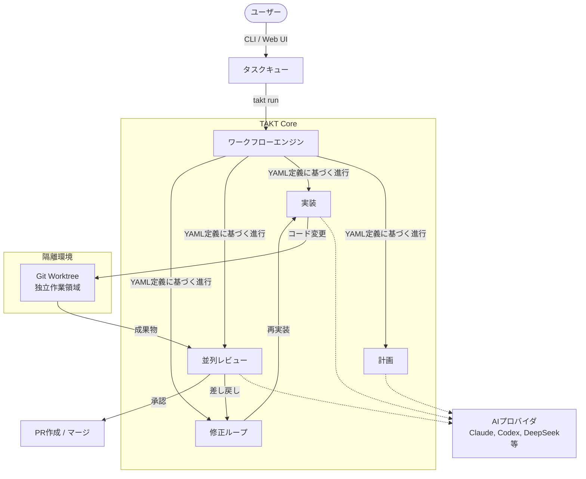

# **TAKT 調査レポート**

## **1. 基本情報**

* **ツール名**: TAKT
* **ツールの読み方**: タクト
* **開発元**: nrslib
* **公式サイト**: [https://github.com/nrslib/takt](https://github.com/nrslib/takt)
* **関連リンク**:
  * GitHub: [https://github.com/nrslib/takt](https://github.com/nrslib/takt)
* **カテゴリ**: 自律型AIエージェント
* **概要**: TAKT (TAKT Agent Koordination Topology) は、Claude Code、Codex、OpenCode、Cursor、GitHub Copilot CLIなどのAIコーディングエージェントを束ね、構造化されたレビューサイクルやマネージドプロンプト、ガードレールを提供するツール。

## **2. 目的と主な利用シーン**

* **解決する課題**: AIエージェントにコードを書かせる際、品質のばらつきやアーキテクチャ・セキュリティの考慮漏れが発生する問題を、構造化されたレビューサイクルによって防ぐ。
* **想定利用者**: 開発者、エンジニアリングチーム
* **利用シーン**:
  * AIエージェントにタスクを依頼し、設計、実装、テスト、レビューまでを一貫して自動化・管理する
  * GitHub Issueからのタスクのキューイングと、独立したWorktree環境での実行
  * プロジェクト固有のナレッジやコーディングポリシーをAIエージェントに適用する

## **3. 主要機能**

* **ワークフロー定義**: YAMLファイルを使用して、エージェントのペルソナ、権限、ルールの進行を宣言的に定義。
* **分離実行 (Worktree isolation)**: タスクの実行やPR作成を分離されたWorktree環境で行い、現在の作業ブランチを汚染しない。
* **マルチエージェント・オーケストレーション**: 異なるペルソナ（プランナー、コーダー、アーキテクト、レビュワーなど）を持つ複数のエージェントを協調動作させる。
* **Faceted Prompting**: プロンプトをペルソナ、ポリシー、ナレッジ、インストラクションといった独立したファセットとして管理・構成できる。
* **並列レビューと修正ループ**: 複数の専門的視点（セキュリティ、QAなど）による並列レビューを行い、問題を指摘された場合は自動的に修正ループを回す。
* **CLIおよびCI/CD統合**: コマンドラインからの対話的実行に加え、パイプラインモードやGitHub Actionsを通じたCI/CD環境での実行をサポート。
* **外部パッケージシステム**: `takt repertoire` コマンドを使用して、GitHubから外部のTAKTパッケージ（Repertoire）をインストールして利用可能。

## **4. 動作原理・システム構成**

* **アーキテクチャ**: ローカルファーストのCLI/Webツールアーキテクチャ。エージェントプロセスを隔離されたGit Worktree環境で実行し、安全性を確保。
* **主要コンポーネントとデータフロー**:
  * ユーザーからのタスク指示はCLIまたはWeb UI（`takt ui`）を通じて受け付けられ、タスクキューに登録される。
  * `takt run`コマンドによってキューからタスクが取り出され、分離されたGit Worktree環境（`.takt`ディレクトリ下など）で実行される。
  * YAMLワークフローに基づいて、異なる役割（プランナー、コーダー、レビュワーなど）を持つAIエージェント（Claude Code、Cursor、DeepSeek Harnessなど）が連携してコードの生成とレビューを行う。
  * 各ステップでコード変更、並列レビュー、および修正がループして行われ、品質基準を満たした段階でPR（Pull Request）が作成されるか、元のブランチに反映される。
* **特筆すべき要素技術**:
  * **Git Worktree Isolation**: 現在の作業ブランチを汚染せず、別環境でタスクを安全に実行・検証する仕組み。
  * **Faceted Prompting**: プロンプトをペルソナ、ポリシー、ナレッジ、インストラクションの独立したファセット（部品）として管理。
  * **Formal Specification**: 要件定義時にQuintやAlloyを用いた形式仕様を生成し、ロジックを検証する機能。



## **5. 開始手順・セットアップ**

* **前提条件**:
  * Node.js環境（npm等）
  * サポート対象のプロバイダCLI（Claude Code, Codex, OpenCode, Cursor Agent, GitHub Copilot CLIのいずれか）または対応するAPIキー
* **インストール/導入**:

  ```bash
  npm install -g takt
  ```

* **初期設定**:
  * APIキー等の設定は `~/.takt/config.yaml` または環境変数で行う。
  * 設定例:

    ```yaml
    provider: claude
    model: sonnet
    language: ja
    ```

* **クイックスタート**:
  * コマンドラインで `takt` を実行し、ワークフローを選択。
  * 「Add user authentication with JWT」等のタスクを指示し、`Queue as task` を選んでキューに追加。
  * `takt run` でキューに追加されたタスクを実行。

## **6. 特徴・強み (Pros)**

* **品質担保の組み込み**: アーキテクチャレビュー、セキュリティレビュー、アンチパターン検出などが最初から組み込まれており、初日から一定品質のコードを出力可能。
* **再現性と共有性**: ワークフローがYAMLで宣言されるため結果が安定し、チームメンバー間で同じ品質プロセスを共有できる。
* **実用性重視**: デモ目的ではなく、日々の開発タスクのキューイング、独立環境での実行、完了時のPR作成といった実務フローに統合されている。

## **7. 弱み・注意点 (Cons)**

* **初期学習コスト**: ワークフロー、ペルソナ、ファセットなどの独自の概念を理解する必要がある。
* **依存環境**: 基盤となる各AIプロバイダ（Claude、OpenAI等）へのAPIアクセス権またはCLIの事前設定が必要。
* 日本語対応の状況など、利用上の制約: 公式ドキュメントは日本語も提供されており、実行時言語設定 (`language: ja`) もサポートしているため、日本語での利用における制約は少ない。

## **8. 料金プラン**

| プラン名 | 料金 | 主な特徴 |
|---------|------|---------|
| **無料プラン（オープンソース）** | 無料 | GitHub上で公開されており、誰でも利用可能。別途各AIプロバイダの利用料は必要。 |

* **課金体系**: オープンソースでありツール自体は無料。基盤のAIプロバイダ（Claude、OpenAI等）のAPI利用料やサブスクリプション費用が別途かかる。
* **無料トライアル**: なし

## **9. 導入実績・事例**

* **導入企業**: オープンソースプロジェクトであり、公開事例なし。
* **導入事例**: TAKT自身がTAKTを使って開発されている（ドッグフーディング）。
* **対象業界**: ソフトウェア開発全般

## **10. サポート体制**

* **ドキュメント**: GitHubリポジトリ内に構成ガイド、CLIリファレンスなどの英語・日本語ドキュメントが存在する。
* **コミュニティ**: Discordコミュニティが提供されている。
* **公式サポート**: GitHub Issuesでのバグ報告や機能要望。エンタープライズ向けの有償サポート等についての記載はない。

## **11. エコシステムと連携**

### **11.1 API・外部サービス連携**

* **API**: プログラムからの利用に向けた `PieceEngine` などのAPIが公開されている。
* **外部サービス連携**: GitHub CLI (gh)、GitLab CLI (glab) と連携し、Issueの取得やPR/MRの自動作成が可能。Slack Webhookを使用した通知機能も提供。

### **11.2 技術スタックとの相性**

| 技術スタック | 相性 | メリット・推奨理由 | 懸念点・注意点 |
|:---|:---:|:---|:---|
| **AI エージェント CLI** | ◎ | Claude Code、Cursor、GitHub Copilot CLIなどのツールを直接オーケストレート可能 | プロバイダ仕様の変更に影響される可能性 |
| **Node.js** | ◎ | ツール自体がNode.jsで構築されており、npmでインストール | 特になし |
| **CI/CD (GitHub Actions)** | ◎ | `nrslib/takt-action` を提供しており、CI環境への組み込みが容易 | 特になし |

## **12. セキュリティとコンプライアンス**

* **認証**: OAuthおよびAPIキーを用いた基盤プロバイダの認証に依存。設定は環境変数やローカルのconfigで行う。
* **データ管理**: 作業はローカル環境（Worktree）で完結する。各種イベントやログもローカルの `.takt` ディレクトリ内に保存。
* **準拠規格**: 公式サイトで公開されていない。問い合わせが必要。

## **13. 操作性 (UI/UX) と学習コスト**

* **UI/UX**: コマンドラインインターフェース(CLI)を提供。対話型プロンプトによるタスク管理、キューへの追加、レビュー状況の表示など、CUI上での開発体験に優れている。
* **学習コスト**: YAMLファイルによるワークフロー定義や、プロンプトの部品化（Faceted Prompting）といった独自概念を理解するまでの学習が必要。

## **14. ベストプラクティス**

* **効果的な活用法 (Modern Practices)**:
  * 既存のリポジトリに `.takt/config.yaml` を配置し、プロジェクトごとのルール（コーディング規約やナレッジ）をファセットとして設定することで、エージェント出力の質を向上させる。
  * タスクを `takt add #ISSUE_ID` でGitHubのIssueから直接キューイングし、バッチで `takt run` により実行させる。
* **陥りやすい罠 (Antipatterns)**:
  * カスタムエージェント作成時に、プロバイダ固有のモデル設定をエージェント定義ファイルに直書きすること（プロバイダ解決ロジックに統一することが推奨される）。
  * 実行コンテキストである `.takt` や `~/.takt` の設定ファイルを不用意に共有し、意図しない設定でエージェントを動作させてしまうこと。

## **15. ユーザーの声（レビュー分析）**

* **調査対象**: G2、Capterra、ITreviewにレビューの登録なし。（GitHub Star数: 900以上）
* **総合評価**: 不明
* **ポジティブな評価**:
  * G2等にレビューがないため不明。
* **ネガティブな評価 / 改善要望**:
  * G2等にレビューがないため不明。
* **特徴的なユースケース**:
  * G2等にレビューがないため不明。

## **16. 直近半年のアップデート情報**

* **2026-08-27**: (v0.63.0) 形式仕様（Formal Specification）としてQuintおよびAlloyによる動作・要件検証サポートを追加。また、実験的機能としてローカルWeb UI（`takt ui`）を追加し、タスクナビゲーションや実行グラフの可視化に対応。
* **2026-08-25**: (v0.62.0) インタラクティブモードでの設定変更コマンド（`/workflow`, `/model`等）追加。また、非推奨だった`quiet`, `passthrough`モードを削除。
* **2026-08-23**: (v0.61.0) Inkベースの会話型TUI（ターミナルUI）を導入し、Shift+Enterなど柔軟な操作に対応。
* **2026-08-18**: (v0.60.0) 公式DeepSeek Harness SDKプロバイダを追加（`deepseek-harness`）。また失敗したタスクからの自動プルリクエスト作成やインストラクト修正機能を追加。
* **2026-04-09**: Claude Headlessプロバイダのサポート追加。ヘッドレスモードにおけるthinkingストリーム表示対応。タスクの強制失敗アクション（Mark as failed）追加。
* **2026-04-03**: プロバイダのネイティブ構造化出力（Structured Output）のサポート。設定値の出所追跡（Traced Config）機能の導入。ワークフローYAMLのキー名の刷新。
* **2026-03-26**: コードを変更せずにモジュール境界やカバレッジギャップを列挙する監査ピースの追加。
* **2026-03-22**: GitLab VCSプロバイダーの追加（Issue取得、マージリクエスト作成等に対応）。
* **2026-03-09**: カスタムのピースやファセットをCodexスキルとしてエクスポートする `takt export-codex` コマンドを追加。
* **2026-03-05**: 実行ごとのトークン使用量を記録するイベントログ機能、トレースレポート自動生成機能の追加。
* **2026-02-28**: Cursor Agent CLI プロバイダーを追加。
* **2026-02-26**: Terraform/AWSによるIaC開発用ピースの追加。
* **2026-02-22**: Repertoireパッケージシステム（`takt repertoire` コマンド）を追加し、外部TAKTパッケージのインポート・管理をサポート。
* **2026-02-19**: ローカルでレビュー品質指標を収集するAnalyticsモジュールと `takt metrics review` コマンドを追加。Faceted Promptingモジュールの独立化。

(出典: [CHANGELOG.md](https://github.com/nrslib/takt/blob/main/CHANGELOG.md))

## **17. 類似ツールとの比較**

### **17.1 機能比較表 (星取表)**

| 機能カテゴリ | 機能項目 | 本ツール | Claude Code | Cursor | OpenHands |
|:---:|:---|:---:|:---:|:---:|:---:|
| **基本機能** | 自律型コーディング | ◯<br><small>複数プロバイダに対応</small> | ◎<br><small>Claudeモデルの高度な推論による自律探索(Agentic Search)など</small> | ◯<br><small>Composer等のAgent機能として提供</small> | ◯<br><small>オープンソースのAI開発エージェント</small> |
| **カテゴリ特定** | ワークフロー制御 | ◎<br><small>YAMLによる宣言的な多段プロセス定義</small> | ×<br><small>非対応</small> | ×<br><small>非対応</small> | △<br><small>エージェントのスキル拡張に依存</small> |
| **カテゴリ特定** | 並列レビュー | ◎<br><small>複数の専門エージェントによる同時レビュー</small> | ×<br><small>単一エージェント。独立したレビューフェーズはない</small> | ◯<br><small>Multi-Agent機能として並行比較が可能</small> | ×<br><small>単一エージェント</small> |
| **非機能要件** | 日本語対応 | ◎<br><small>日本語ドキュメント・設定あり</small> | ◯<br><small>プロンプト入力のみ</small> | ◯<br><small>一部UI等</small> | ◯<br><small>コミュニティ対応</small> |

### **17.2 詳細比較**

| ツール名 | 特徴 | 強み | 弱み | 選択肢となるケース |
|---------|------|------|------|------------------|
| **本ツール** | AIエージェント群を統合管理するオーケストレータ | YAMLで柔軟なワークフロー定義が可能。並列レビューや修正ループによる品質担保に優れる。 | 自らがAIモデルを提供するわけではなく、基盤プロバイダが必要。設定がやや複雑。 | 品質基準を設けてAIに自動でコードを生成・レビューさせたい場合。複数エージェントを組み合わせたい場合。 |
| **Claude Code** | Anthropic公式の自律型CLIツール等 | Claudeモデルの高性能な推論とコンテキスト理解（Agentic SearchやPlan Mode）を活かした強力な解決能力。MCP連携に優れる。 | 独自のワークフローや複数エージェントによる並列・多段階の厳密なプロセス強制機能はない。 | 単発のタスク解決や、シンプルで強力なコーディングアシスタントが必要な場合。 |
| **Cursor** | AI機能がネイティブ統合されたコードエディタ | エディタ画面と一体化したUX。ComposerやMulti-Agentによる強力なプロジェクト編集機能。 | IDEに縛られる。TAKTのようなCI連携や厳密なレビュープロセスの強制は難しい。 | 開発者がリアルタイムにコードを書きながらAIの支援を受けたい場合。 |
| **OpenHands** | オープンソースの自律型AIソフトウェアエンジニア | 様々なLLMを選択可能で、サンドボックス（Docker隔離環境）で動作する強力な自律型エージェント。 | 複数ペルソナによる並列レビューなどのプロセス管理機能は弱い。 | フルスクラッチに近い状態からAIにプロジェクト全体を構築・解決させたい場合。 |

## **18. 総評**

* **総合的な評価**:
  TAKTは、単なるAIコーディングアシスタントの枠を超え、AIエージェントの行動を制御・管理するためのオーケストレーションツールです。特に、YAMLによるプロセス定義や、複数の専門ペルソナ（プランナー、コーダー、レビュワー等）を協調させる並列レビュー機能は非常に強力であり、AIに書かせたコードの品質を一定以上に保つ仕組みがシステムレベルで備わっている点が高く評価できます。
* **推奨されるチームやプロジェクト**:
  * AI支援ツールを導入しつつも、コード品質（アーキテクチャ、セキュリティ等）の担保に課題を感じているチーム。
  * プロジェクト固有のコーディング規約やドメイン知識をAIエージェントに厳格に守らせたいプロジェクト。
* **選択時のポイント**:
  * 個人が自由にAIの支援を受けながら書く場合はCursorのようなエディタ型が適していますが、チーム開発において「AIによるコード生成・テスト・レビューの自動化パイプライン」を構築し、一定の品質基準（ガードレール）をシステム的に担保したい場合にTAKTは最適な選択肢となります。
