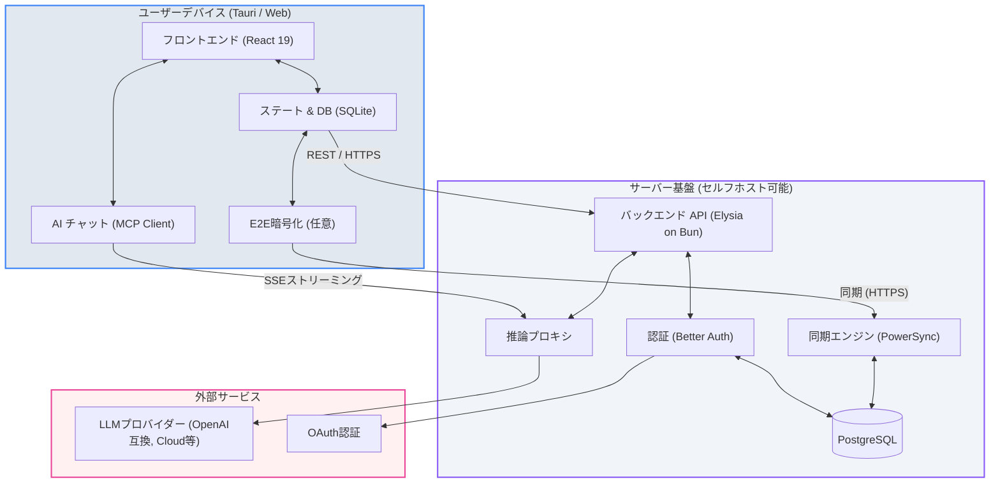

# **Thunderbolt 調査レポート**

## **1. 基本情報**

* **ツール名**: Thunderbolt
* **ツールの読み方**: サンダーボルト
* **開発元**: Mozilla (thunderbird)
* **公式サイト**: [https://thunderbolt.io/](https://thunderbolt.io/)
* **関連リンク**:
  * GitHub: [https://github.com/thunderbird/thunderbolt](https://github.com/thunderbird/thunderbolt)
  * ドキュメント: [https://github.com/thunderbird/thunderbolt/blob/main/docs/faq.md](https://github.com/thunderbird/thunderbolt/blob/main/docs/faq.md)
* **カテゴリ**: LLMプラットフォーム
* **概要**: オープンソース、クロスプラットフォーム対応で拡張性の高いAIクライアント。クラウドAPIだけでなく、ローカルやオンプレミスのモデルを柔軟に選択でき、ベンダーロックインを排除してデータの所有権を維持できる。

## **2. 目的と主な利用シーン**

* **解決する課題**: 特定のAIプロバイダー（OpenAIやAnthropicなど）に依存することによるベンダーロックインや、データプライバシーに関する懸念の解消。
* **想定利用者**: プライバシーを重視する開発者、オンプレミスでのAI導入を検討している企業、エンタープライズ。
* **利用シーン**:
  * ローカルのLLM（Ollamaやllama.cppなど）と組み合わせてセキュアなチャット環境を構築する。
  * クラウド上の複数の最先端モデル（Frontier models）を同じUIから切り替えて使用する。
  * 企業内ネットワークで自社ホスティングしたモデルにアクセスするためのクライアントとして利用する。

## **3. 主要機能**

* **マルチプラットフォーム対応**: Web、iOS、Android、Mac、Linux、Windowsのすべての主要デスクトップおよびモバイルプラットフォームで利用可能。
* **モデルの柔軟な選択**: OpenAI互換のAPIエンドポイントを追加することで、クラウド上の最先端モデルから、ローカル、オンプレミスのモデルまで自由に接続可能。
* **オープンソース**: コードベースが公開されており、監査や自社向けのカスタマイズが容易。
* **エンタープライズ対応**: サポートやFDE（フルディスク暗号化）など、企業向けの機能とサポート体制を提供。
* **認証・検索の統合（オプション）**: 完全なオフラインファーストを目指しつつ、現在は認証や検索機能と統合されており、必要に応じて検索機能を無効化することも可能。
* **ツール・エージェント連携 (MCP/ACP)**: Model Context Protocol (MCP)サーバーやAgent Client Protocol (ACP)をサポートし、システムデータや自律型エージェントとのシームレスな統合が可能。
* **RAGオーケストレーション**: deepsetの「Haystack」とネイティブに統合し、エンタープライズ環境でのRAG（検索拡張生成）や複雑なバックエンドオーケストレーションを構築可能。

## **4. 動作原理・システム構成**

* **アーキテクチャ**: ローカルファーストを原則としつつ、クラウド・オンプレミスサーバーと同期可能なハイブリッド構成。
* **主要コンポーネントとデータフロー**:
  * **クライアント (Tauri Shell)**: React 19、Vite、Radix UIで構築され、Tauriを通じてデスクトップ（macOS, Windows, Linux）およびモバイル（iOS, Android）のネイティブアプリとして動作する。
  * **ステート管理・ローカルDB**: 状態管理にZustandとTanStack Queryを使用し、ローカルのSQLite（ブラウザではWA-SQLite、TauriではネイティブSQLite）に保存される。オフラインでも動作する。
  * **バックエンド (Elysia on Bun)**: 高速なBunランタイム上のElysiaでAPIサーバーを構築。Drizzle ORMを介してPostgreSQLと通信する。Docker等でのセルフホストが可能。
  * **同期エンジン (PowerSync)**: ローカルのSQLiteとサーバーのPostgreSQL間のデータ同期を担う。
  * **推論プロキシ (Inference Proxy)**: LLM（Anthropic, OpenAI, Mistral, 任意のOpenAI互換エンドポイント等）へのリクエストをルーティングし、レート制限などを管理する。
* **特筆すべき要素技術**:
  * **E2E暗号化 (エンドツーエンド暗号化)**: オプションで有効化可能。データはデバイス上で暗号化されてからサーバー（PostgreSQL）に保存され、サーバー側では復号できない。
  * **Web Worker / OPFS**: Webブラウザ環境ではSharedWorkerを用いて同期や暗号化処理を実行する。
  * **Tauri 2**: 単一のReactコードベースからデスクトップとモバイルの全主要OS向けにアプリを出力している。



## **5. 開始手順・セットアップ**

* **前提条件**:
  * Docker（バックエンドをセルフホストする場合）
  * バックエンドを提供する推論エンドポイント（Ollama、llama.cpp、またはOpenAI互換のAPI）
* **インストール/導入**:

  ```bash
  # バックエンドのDocker Composeデプロイの例（リポジトリのdeployディレクトリを参照）
  git clone https://github.com/thunderbird/thunderbolt.git
  cd thunderbolt/deploy
  # docker-compose等を使用して起動
  ```

* **初期設定**:
  * アプリ内の設定画面から、利用したいモデルプロバイダー（Ollama等のローカルエンドポイントや、OpenAI互換のAPIキー）を追加する。
* **クイックスタート**:
  * Ollamaをローカルで起動し、Thunderboltからエンドポイントとして指定するだけで、すぐにAIとのチャットを開始できる。

## **6. 特徴・強み (Pros)**

* プロバイダーに縛られないため、最新のモデルが登場した際にすぐに切り替えることができる。
* ローカルモデルを使用すれば、データが外部に送信されず、完全にプライベートな環境を保つことができる。
* デスクトップとモバイルの両方で一貫したUI/UXを提供する。
* deepset（Haystackプラットフォーム）とのパートナーシップにより、エンタープライズ向けの完全なソブリンAIスタックを構築でき、フロントエンドからインフラストラクチャまで一貫した制御が可能。

## **7. 弱み・注意点 (Cons)**

* まだ早期の活発な開発段階であり、完全なオフラインファースト化など一部の機能は未完成である。
* 自身でモデルプロバイダー（Ollamaや各種APIキーなど）を用意する必要があるため、非エンジニアにとっては最初のセットアップに少しハードルがある。
* 日本語に特化したサポートやドキュメントはまだ限られている。

## **8. 料金プラン**

| プラン名 | 料金 | 主な特徴 |
|---------|------|---------|
| **オープンソース (セルフホスト)** | 無料 | 全ての基本機能、自分でのホスティングと運用 |

* **課金体系**: クライアント自体はオープンソースで無料。使用するモデル（API）の利用料は各プロバイダーに依存する。エンタープライズサポートは個別問い合わせとなる。
* **無料トライアル**: オープンソースのため、無制限に無料で利用・検証可能。

## **9. 導入実績・事例**

* **導入企業**: エンタープライズ向けのプロダクション準備中であり、具体的な企業名は公開されていない。
* **対象業界**: 厳格なデータ管理とプライバシーが求められる業界（医療、金融、政府機関など）や、独自のAIモデルを構築しているテック企業。

## **10. サポート体制**

* **ドキュメント**: GitHubリポジトリ内にFAQ、開発ガイド、アーキテクチャなどのドキュメントが整備されている。
* **コミュニティ**: GitHubのIssueを通じてバグ報告や機能要望が可能。
* **公式サポート**: エンタープライズ向けのサポートが提供予定。

## **11. エコシステムと連携**

### **11.1 API・外部サービス連携**

* **API**: 任意のOpenAI互換APIエンドポイントと連携可能。
* **外部サービス連携**:
  * ローカルのOllamaやllama.cppといった推論エンジンとの連携。
  * **MCP (Model Context Protocol)** サーバーや **ACP (Agent Client Protocol)** をサポートし、外部システムデータやエージェントと直接統合可能。
  * **deepset (Haystack)** との連携により、高度なRAGアプリケーションやオーケストレーションシステムを接続可能。

### **11.2 技術スタックとの相性**

| 技術スタック | 相性 | メリット・推奨理由 | 懸念点・注意点 |
|:---|:---:|:---|:---|
| **Ollama** | ◎ | 最も推奨されるローカル推論エンジンの一つ | 推論を実行するためのマシンスペックが必要 |
| **llama.cpp** | ◎ | 軽量で高速なローカル推論エンジン | セットアップに多少の技術的知識が必要 |

## **12. セキュリティとコンプライアンス**

* **認証**: サードパーティまたは自前ホストの認証機構（Better Auth、OIDCなど）を利用可能。デバイス単位のアクセス制御が可能。
* **データ管理**:
  * ローカルモデル使用時はデータはデバイス内またはオンプレミスサーバー内に留まり、クラウドへ送信されない。
  * **E2E暗号化 (End-to-End Encryption)**: オプションで有効化でき、同期時にデバイスから離れるデータはすべて暗号化され、サーバー管理者であっても閲覧できない。
* **準拠規格**: 現在セキュリティ監査を実施中。

## **13. 操作性 (UI/UX) と学習コスト**

* **UI/UX**: モダンでクリーンなチャットインターフェースを提供し、プラットフォーム間で一貫した操作感を実現している。
* **学習コスト**: モデルの追加やAPIキーの設定など、初期のセットアップには一定の理解が必要だが、日常の利用は一般的なチャットAIクライアントと同様で容易。

## **14. ベストプラクティス**

* **効果的な活用法 (Modern Practices)**:
  * 機密情報を扱う業務ではOllamaを使用したローカルモデルを選択し、一般的なリサーチではクラウドの最新モデルに切り替えるなど、タスクに応じてモデルを使い分ける。
* **陥りやすい罠 (Antipatterns)**:
  * デフォルトの設定のまま使用し、意図せずクラウドのモデルに機密データを送信してしまう設定ミス。

## **15. ユーザーの声（レビュー分析）**

* **調査対象**: GitHubのスター数やSNSでの反応
* **総合評価**: GitHubで1.1k以上のスターを獲得し、プライバシー重視のユーザーから注目を集めている。
* **ポジティブな評価**:
  * Mozilla（Thunderbirdチーム）が開発を支援していることへの信頼感。
  * ベンダーロックインを避けるアプローチがオープンソースコミュニティで高く評価されている。
* **ネガティブな評価 / 改善要望**:
  * まだ開発初期段階であり、機能不足やバグへの指摘がある。
  * 推論サーバーが内蔵されていないため、設定が面倒だという声もある。

## **16. 直近半年のアップデート情報**

* **2026-09-10**: v0.1.133をリリース。MCPツールディスカバリ失敗による送信ブロックの修正やGLMモデルの更新を実施。
* **2026-04-16**: deepset (Haystackプラットフォーム) との提携を発表。フロントエンドのThunderboltとインフラ層のHaystackを接続し、エンタープライズ向けの完全なソブリンAIスタックの提供を開始。
* **2026-04**: セキュリティ監査の実施とエンタープライズ向けのプロダクション準備を進行中。（公式サイトおよびGitHub READMEより）

(出典: [Thunderbolt Releases](https://github.com/thunderbird/thunderbolt/releases) / [公式ブログ](https://www.thunderbolt.io/blog) )

## **17. 類似ツールとの比較**

### **17.1 機能比較表 (星取表)**

| 機能カテゴリ | 機能項目 | Thunderbolt | Ollama | LM Studio |
|:---:|:---|:---:|:---:|:---:|
| **基本機能** | チャットUI | ◎<br><small>マルチプラットフォームで洗練されたUI</small> | ×<br><small>バックエンド(CLI)がメイン</small> | ◎<br><small>洗練されたUIを提供</small> |
| **拡張機能** | エージェント機能 | ◎<br><small>MCP・ACPサポート</small> | ◯<br><small>launchコマンド連携</small> | ◎<br><small>Bionicエージェント内蔵</small> |
| **モデル管理** | モデルのダウンロード・管理 | △<br><small>外部プロバイダーに依存</small> | ◎<br><small>CLIから簡単に管理可能</small> | ◎<br><small>GUIからHuggingFaceのモデルを検索・DL可能</small> |
| **拡張性** | クラウドAPI連携 | ◎<br><small>OpenAI互換API等に広く対応</small> | ×<br><small>ローカル実行に特化</small> | ◎<br><small>LM Link / Secure Cloud連携</small> |

### **17.2 詳細比較**

| ツール名 | 特徴 | 強み | 弱み | 選択肢となるケース |
|---------|------|------|------|------------------|
| **Thunderbolt** | 汎用AIクライアント | ローカルからクラウドまであらゆるモデルと接続可能。OSSベースでデータ主権を維持できる。 | 推論エンジン自体は持たないためセットアップが必要。 | エンタープライズやチームで、特定のモデルに縛られず安全にAIを統括・運用したい場合。 |
| **Ollama** | ローカル推論エンジン | コマンド一つで様々なローカルモデルを起動可能。 | 公式のGUIが存在せず、CLI操作が中心。 | スクリプト連携やAPIサーバー構築、またはThunderboltのバックエンドとして利用する場合。 |
| **LM Studio** | オールインワンデスクトップアプリ | BionicエージェントやGUIでモデルの検索、実行が完結する。 | クローズドソースであり、OSSへのこだわる場合は不向き。 | ローカルで手軽にAI環境を構築したい場合や、エージェント機能をGUIで使いたい場合。 |

## **18. 総評**

* **総合的な評価**:
  * オープンソースとデータプライバシーの重要性が高まる中で、非常にタイムリーで価値のあるプロジェクト。Mozilla（Thunderbirdチーム）の支援を受けていることも大きな強みである。
* **推奨されるチームやプロジェクト**:
  * 従業員にセキュアなAI環境を提供したい企業や、特定のプロバイダーに依存したくない開発チームに最適。
* **選択時のポイント**:
  * すぐに使えるオールインワンのツールを求める場合はLM Studioが適しているが、長期的なカスタマイズ性やオープンなエコシステムを重視する場合はThunderboltが強力な選択肢となる。
