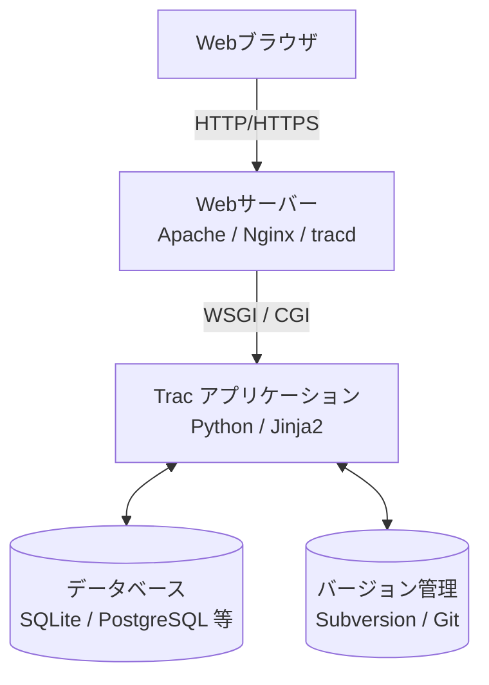

# **Trac 調査レポート**

## **1. 基本情報**

* **ツール名**: Trac
* **ツールの読み方**: トラック
* **開発元**: Edgewall Software
* **公式サイト**: [https://trac.edgewall.org/](https://trac.edgewall.org/)
* **関連リンク**:
  * GitHub: [https://github.com/edgewall/trac](https://github.com/edgewall/trac)
  * ドキュメント: [https://trac.edgewall.org/wiki/TracGuide](https://trac.edgewall.org/wiki/TracGuide)
* **カテゴリ**: プロジェクト管理
* **概要**: Tracは、Wikiと課題追跡システム（ITS）を統合した、Webベースのソフトウェアプロジェクト管理ツールです。SubversionやGitなどのバージョン管理システムとの連携機能も備えており、開発プロセスの情報を一元管理することを目指しています。ミニマルなアプローチを採用し、開発チームの邪魔にならないように設計されています。

## **2. 目的と主な利用シーン**

* **解決する課題**: プロジェクトの情報（仕様、タスク、バグ、ソースコードの変更）が散在するのを防ぎ、Wikiを中心としたリンク構造で情報を有機的に結びつけること。
* **想定利用者**: ソフトウェア開発チーム、特にPythonを使用しているチームや、シンプルさを好むエンジニア主体のチーム。
* **利用シーン**:
  * バグの報告、修正状況の追跡などのバグトラッキング
  * プロジェクトの仕様書や議事録をWikiで管理し、チケットとリンクさせるナレッジ管理
  * ロードマップ機能を使用し、マイルストーンごとの進捗を確認するリリース管理

## **3. 主要機能**

* **Wiki**: 強力なWiki構文（TracLinks）を持ち、チケット、チェンジセット、ファイルなどを相互にリンク可能。
* **チケットシステム**: バグ、タスク、機能要望などをチケットとして管理。ワークフローのカスタマイズも可能。
* **タイムライン**: プロジェクトの全てのアクティビティ（チケット更新、コミット、Wiki編集など）を時系列で表示。
* **ロードマップ**: マイルストーンごとのチケット消化状況をプログレスバーで視覚化。
* **バージョン管理ブラウザ**: SubversionやGitのリポジトリをWebブラウザ上で閲覧、差分確認が可能。
* **レポート**: SQLクエリを用いた柔軟なレポート作成機能。


## **4. 動作原理・システム構成**

* **アーキテクチャ**: クライアント・サーバー型（Webベース）、オンプレミス（自社サーバーホスティング）を前提としたモノリシックなPythonアプリケーション。
* **主要コンポーネントとデータフロー**:
  * **Webブラウザ (クライアント)**: ユーザーインターフェースとして機能し、HTTP/HTTPS経由でWebサーバーにアクセスする。
  * **Webサーバー**: Apache, Nginx, または付属のスタンドアロンサーバー(`tracd`)などがクライアントからのリクエストを受け付ける。
  * **Trac アプリケーション**: WSGI/CGI等を通じてWebサーバーからリクエストを受け取り、Pythonベースのバックエンドで処理を行う（テンプレートエンジンはJinja2）。
  * **データベース**: チケット情報、Wikiデータ、設定などを保存する（SQLite, PostgreSQL, MySQL/MariaDBなど）。
  * **SCM (Source Code Management)**: SubversionやGitなどのリポジトリと直接連携し、ソースコードの変更履歴を読み取る。



* **特筆すべき要素技術**:
  * **TracLinks**: Wiki、チケット、ソースコード（チェンジセット）をシームレスに相互リンクする仕組み。独自のマークアップパーサーにより実現されている。
  * **コンポーネント・アーキテクチャ**: Trac自体が強力なプラグインシステムを持っており、内部機能の多くもコンポーネントとして実装されている。これにより、高い拡張性を確保している。

## **5. 開始手順・セットアップ**

* **前提条件**:
  * Python 3.5以上
  * データベース（SQLite, PostgreSQL, MySQL/MariaDB）
  * Webサーバー（Apache httpd, Nginx等）またはスタンドアロンサーバー（tracd）
* **インストール/導入**:

  ```bash
  # pipを使用したインストール例
  pip install Trac
  ```

* **初期設定**:
  * 環境の初期化と管理者権限の設定などを `trac-admin` コマンドで行う。
* **クイックスタート**:
  * 開発用スタンドアロンサーバーの起動 `tracd --port 8000 /path/to/myproject`

## **6. 特徴・強み (Pros)**

* 情報の統合性（「TracLinks」により、Wiki、チケット、コミットログが密接にリンクし、情報のトレーサビリティが高い）
* 軽量・シンプル（必要最小限の機能からスタートでき、プラグインで必要な機能だけを追加していくスタイル）
* Python製（Pythonのエコシステムと親和性が高く、Python開発者にとって内部構造の理解や拡張が容易）

## **7. 弱み・注意点 (Cons)**

* モダンなSPAツールに慣れたユーザーには、ページ遷移を伴う操作やUIが古臭く感じられる。
* SaaS版は一般的でなく、自前でのサーバー構築・運用が必要。
* カンバンボードなどの現代的なアジャイル管理機能は、標準では搭載されておらず、プラグイン導入が必要。
* 日本語対応はコミュニティによって行われているが、一部英語のままの箇所もある。

## **8. 料金プラン**

| プラン名 | 料金 | 主な特徴 |
|---------|------|---------|
| **OSS版** | 無料 | 全機能利用可能。自前でのホスティングが必要。 |

* **課金体系**: なし。
* **無料トライアル**: なし（常に無料）。

## **9. 導入実績・事例**

* **導入企業**: NASA (Jet Propulsion Laboratory), WordPress (過去に利用), Django (過去に利用)
* **導入事例**: 大規模な分散開発環境において、チケット管理とWikiを統合するために利用されるケースが多い。
* **対象業界**: ソフトウェア開発、研究機関

## **10. サポート体制**

* **ドキュメント**: 公式Wiki（TracGuide）に詳細なインストールガイド、ユーザーガイドがある。
* **コミュニティ**: メーリングリストやIRCチャンネル、公式のチケットシステム（Trac自体で管理されている）で開発が行われている。
* **公式サポート**: Edgewall Softwareによる商用サポートは明示されていないが、コミュニティベースのサポートが中心。

## **11. エコシステムと連携**

### **11.1 API・外部サービス連携**

* **API**: XML-RPCプラグインを導入することで、外部からチケット操作などが可能。標準ではPython APIによるプラグイン開発が主。
* **外部サービス連携**: JenkinsなどのCIツールとの連携プラグインが存在する。Slack通知などもプラグインで対応可能。

### **11.2 技術スタックとの相性**

| 技術スタック | 相性 | メリット・推奨理由 | 懸念点・注意点 |
|:---|:---:|:---|:---|
| **Python** | ◎ | Trac自体がPython製であり、拡張開発が容易。 | 特になし |
| **Subversion** | ◎ | 歴史的にSVNとの連携が強力で、安定している。 | SVN自体の利用が減っている |
| **Git** | ◯ | Git連携も標準対応している。 | 大規模リポジトリでのパフォーマンス調整が必要な場合も |

## **12. セキュリティとコンプライアンス**

* **認証**: Basic認証、Digest認証などWebサーバーの認証機能を利用。プラグインでLDAP連携なども可能。
* **データ管理**: データは自社サーバー内のDBとファイルシステムに保存されるため、自社のセキュリティポリシーに合わせて管理可能。
* **準拠規格**: 特定の認証取得はなし。OSSとしてコードが公開されており、監査可能。

## **13. 操作性 (UI/UX) と学習コスト**

* **UI/UX**: シンプルなHTMLベースのUI。直感的ではあるが、ドラッグ＆ドロップなどのリッチな操作は標準では少ない。
* **学習コスト**: Wiki記法（TracWiki）を覚える必要があるが、機能がシンプルなため、基本的な使い方の習得は早い。管理者としての学習コストはやや高い（コマンドライン操作など）。

## **14. ベストプラクティス**

* **効果的な活用法 (Modern Practices)**:
  * プロジェクトのハブとしてWikiを整備し、そこからチケットやリポジトリへの動線を設計する。
  * コミットメッセージに `refs #123` のように記述し、チケットとコード変更を自動的にリンクさせる。
* **陥りやすい罠 (Antipatterns)**:
  * 互換性の問題やパフォーマンス低下を招くため、本当に必要なものだけを厳選する。
  * テンプレートエンジン（Jinja2）を使った大幅なUI変更は、メンテナンスコストを増大させる。

## **15. ユーザーの声（レビュー分析）**

* **調査対象**: G2, Capterra, 技術ブログ
* **総合評価**: 3.8/5.0 (推定)
* **ポジティブな評価**:
  * 「シンプルで動作が軽い。Python環境があればすぐに動かせる。」
  * 「Wikiとチケットのリンク機能が非常に便利。ドキュメント管理とタスク管理が一体化できる。」
* **ネガティブな評価 / 改善要望**:
  * 「見た目が古く、非エンジニアにはとっつきにくい。」
  * 「インストールの手順が面倒。Dockerイメージも公式にはない（コミュニティ版はある）。」
  * 「検索機能が少し弱い。」
* **特徴的なユースケース**:
  * 小規模な社内ツール開発や、研究室でのプロジェクト管理など、エンジニアだけのチームでの利用。

## **16. 直近半年のアップデート情報**

* **2026-08-27**: 1.6-stableブランチにてPygment 2.21対応などのメンテナンスコミットを実施 (1.6.1dev / 1.7.1dev)
* **2023-09-24**: Python 3への完全対応や、テンプレートエンジンとしてJinja2を全面的に採用したTrac 1.6 リリース
* **2023-08-11**: 1.4系のメンテナンスリリースであるTrac 1.4.4 リリース

(出典: [GitHub リリース・コミット履歴](https://github.com/edgewall/trac/commits) / [Trac 1.6 Release Notes](https://trac.edgewall.org/wiki/TracDev/ReleaseNotes/1.6))

## **17. 類似ツールとの比較**

### **17.1 機能比較表 (星取表)**

| 機能カテゴリ | 機能項目 | 本ツール | Redmine | Jira |
|:---:|:---|:---:|:---:|:---:|
| **基本機能** | チケット管理 | ◯<br><small>シンプル</small> | ◯<br><small>標準的</small> | ◎<br><small>極めて多機能</small> |
| **情報共有** | Wiki連携 | ◎<br><small>強力な統合</small> | ◯<br><small>標準搭載</small> | ◯<br><small>Confluence連携</small> |
| **開発連携** | SCMブラウザ | ◎<br><small>標準搭載</small> | ◎<br><small>標準搭載</small> | ◯<br><small>Bitbucket/Git等連携</small> |
| **拡張性** | プラグイン | ◯<br><small>Pythonで作成</small> | ◎<br><small>Rubyで作成、多数</small> | ◎<br><small>巨大なエコシステム</small> |
| **AI機能** | AI支援 | ×<br><small>なし</small> | ×<br><small>標準機能なし</small> | ◎<br><small>Rovo AI連携等</small> |
| **コスト** | 無料利用 | ◎<br><small>完全無料</small> | ◎<br><small>完全無料</small> | △<br><small>$8.15/月〜</small> |

### **17.2 詳細比較**

| ツール名 | 特徴 | 強み | 弱み | 選択肢となるケース |
|---------|------|------|------|------------------|
| **本ツール** | ミニマルな統合ツール | ・Wikiとチケットの強力なリンク<br>・Python製で軽量 | ・UIが古い<br>・セットアップが手間 | Python開発チーム、シンプルさを重視する小規模チーム。 |
| **Redmine** | オープンソースの定番 | ・完全無料<br>・高いカスタマイズ性<br>・データ管理の自由度 | ・Ruby環境が必要<br>・運用保守の手間、UIが古い | 自社サーバーでの運用が必須、またはコストを最優先し、技術リソースがある場合。 |
| **Jira** | 業界標準SaaS | ・圧倒的な機能数とカスタマイズ性<br>・Rovo AI等の先進機能<br>・巨大なエコシステム | ・複雑さ、学習コスト<br>・コストが高くなりがち($8.15/月〜) | 本格的なアジャイル開発を行うチーム、大規模組織。 |

## **18. 総評**

* **総合的な評価**:
  * Tracは、プロジェクト管理ツールの草分け的存在であり、その「Wikiとチケットの統合」というコンセプトは現在でも色褪せていません。Python 3対応のバージョン1.6により、現代の環境でも問題なく動作します。ただし、UIの古さや構築の手間は否めず、誰にでも勧められるツールではありません。
* **推奨されるチームやプロジェクト**:
  * Pythonをメイン言語とする開発チーム。
  * 複雑な機能よりも、シンプルさと情報のリンク性を重視するチーム。
  * 自前でサーバーを管理・カスタマイズする技術力があるチーム。
* **選択時のポイント**:
  * 「情報の整理整頓」を重視し、Wikiを書きながら開発を進めるスタイルには最適です。逆に、カンバンボードでタスクをパパッと動かしたい、といったモダンなUI/UXを求める場合は、JiraやTrelloなどが適しています。
