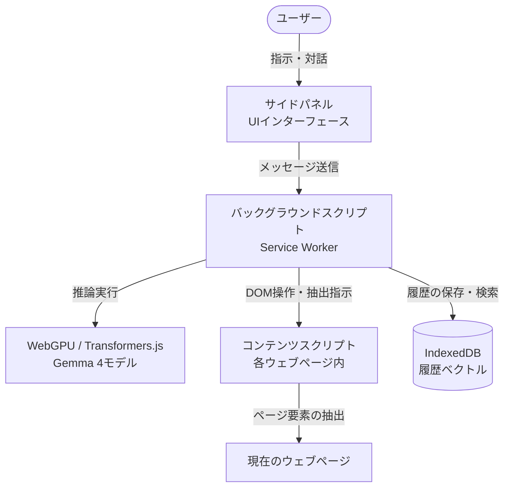

# **Transformers.js Gemma 4 Browser Assistant 調査レポート**

## **1. 基本情報**

* **ツール名**: Transformers.js Gemma 4 Browser Assistant
* **ツールの読み方**: トランスフォーマージェイエス・ジェンマ・フォー・ブラウザ・アシスタント
* **開発元**: Nico Martin
* **公式サイト**: [https://chromewebstore.google.com/detail/transformersjs-gemma-4-br/dhaknnnkcdkjhcclchmnfdhddoehoool](https://chromewebstore.google.com/detail/transformersjs-gemma-4-br/dhaknnnkcdkjhcclchmnfdhddoehoool)
* **関連リンク**:
  * GitHub: [https://github.com/nico-martin/gemma4-browser-extension](https://github.com/nico-martin/gemma4-browser-extension)
* **カテゴリ**: AIブラウザ拡張機能
* **概要**: Transformers.jsとGemma 4を使い、WebGPUを通じてブラウザ上で完全にローカル動作するChrome拡張機能のAIアシスタント。データが外部サーバーに送信されることはなく、プライバシーを確保しながら高度な機能を利用できます。

## **2. 目的と主な利用シーン**

* **解決する課題**: クラウドベースのAIアシスタントに伴うプライバシーの懸念を払拭しつつ、ブラウザ操作の自動化やウェブサイトとの対話を実現する。
* **想定利用者**: 開発者、プライバシー意識の高いユーザー、ローカルAI愛好家
* **利用シーン**:
  * 開いている大量のタブの整理・検索・管理。
  * 現在閲覧しているウェブページに関する質問応答（RAG）。
  * 過去の閲覧履歴からのセマンティック検索。

## **3. 主要機能**

* **Tab Management（タブ管理）**: 自然言語による指示で、開いているタブの取得、特定のタブへの移動、URLを開く、タブを閉じるなどの操作が可能です。
* **Website Interaction (RAG)（ウェブサイトとの対話）**: 現在のウェブページから関連情報を検索・抽出。見出し、段落、リスト等の構造化コンテンツを抽出し、all-MiniLM-L6-v2で埋め込みを生成することでセマンティックな検索を実現します。
* **Highlight Website Element（要素ハイライト）**: AIエージェントが、ページ内の特定の要素を視覚的にハイライトし、該当箇所へスクロールしてユーザーに提示します。
* **History Vector Database（履歴ベクトルデータベース）**: 閲覧履歴（タイトル、説明、URL）のベクトル埋め込みをIndexedDBに保存し、キーワードの一致ではなく自然言語によるセマンティック検索を可能にします。
* **On-device AI（オンデバイスAI）**: Transformers.jsとWebGPUを活用し、`onnx-community/gemma-4-E2B-it-ONNX`モデルなどを完全にローカル（ブラウザ内）で実行します。

## **4. 動作原理・システム構成**

* **アーキテクチャ**: ローカルファーストのブラウザ拡張機能（Service Worker、Side Panel、Content Scriptの分離設計）
* **主要コンポーネントとデータフロー**:
  * モデルのロードと推論は、すべてバックグラウンドスクリプト（Service Worker）で一元的に行われます。
  * ユーザーはサイドパネルのUIから指示を出し、バックグラウンドスクリプトと非同期通信を行います。
  * 現在のウェブページのDOM情報抽出やハイライトは、タブごとのコンテンツスクリプトが担当し、バックグラウンドスクリプトにデータを渡します。
* **特筆すべき要素技術**:
  * **Transformers.js & WebGPU**: ブラウザ内でモデルを高速に実行するための基盤技術。
  * **IndexedDB**: 閲覧履歴のベクトルデータベース保存に利用。



## **5. 開始手順・セットアップ**

* **前提条件**:
  * WebGPUをサポートするChromeブラウザ（Chrome 113以降）。
  * WebGPU機能に対応したモダンなGPU。
* **インストール/導入（拡張機能として）**:
  1. Chrome Web Storeから「Transformers.js Gemma 4 Browser Assistant」をインストール。
  2. 拡張機能のアイコンをクリックしてサイドパネルを開く。
  3. 初回使用時はモデルのダウンロードが自動的に行われます（1回のみ）。
* **ソースからのビルド**:

  ```bash
  # リポジトリのクローンとインストール
  git clone https://github.com/nico-martin/gemma4-browser-extension.git
  cd gemma4-browser-extension
  pnpm install

  # ビルド
  pnpm run build
  ```

  その後、Chromeの拡張機能ページ（chrome://extensions/）でデベロッパーモードを有効にし、`dist`フォルダを「パッケージ化されていない拡張機能を読み込む」で読み込みます。

## **6. 特徴・強み (Pros)**

* **究極のプライバシー**: すべての処理がデバイス上で完結するため、検索クエリやウェブページの内容、履歴などが外部サーバーへ送信されることはありません。
* **高速かつ独立した推論**: 拡張機能のバックグラウンドワーカー（Service Worker）でモデルを1回ロードするだけで、すべてのタブやサイドパネルから効率的にリソースを共有できます。
* **AIによるDOM直接操作（RAG）**: 閲覧中のページ内容を理解し、該当箇所をハイライトする機能など、ブラウザアシスタントならではの深い統合が実現されています。

## **7. 弱み・注意点 (Cons)**

* **要求スペックの高さ**: WebGPUとML推論に対応するため、比較的高性能なGPUを搭載したPCでの利用が必須となります。
* **初期ダウンロードのサイズ**: 使用するモデル（Gemma 4 E2Bなど）のデータサイズが数GBに及ぶため、初回利用時には大容量のダウンロードと待機時間が必要です。
* **日本語対応**: 基本的な動作は可能ですが、英語中心のプロンプト・モデル設計となっているため、日本語での複雑なやり取りでは精度が落ちる可能性があります。

## **8. 料金プラン**

| プラン名 | 料金 | 主な特徴 |
|---------|------|---------|
| **オープンソース (MIT / Apache)** | 無料 | GitHubで公開されており、利用料やAPIコストなしで無制限に使用可能。 |

* **課金体系**: 完全無料
* **無料トライアル**: なし（すべて無料）

## **9. 導入実績・事例**

* **導入企業**: 個人開発のオープンソースプロジェクトであり、特定企業の公式導入事例は公開されていません。
* **導入事例**: 主にGitHub上で開発者・AI愛好家向けに利用・フォーク（40フォーク、318スター）されています。
* **対象業界**: ソフトウェア開発、研究、プライバシーを重視する個人ユーザー。

## **10. サポート体制**

* **ドキュメント**: GitHubリポジトリのREADMEが公式ドキュメントとして機能し、アーキテクチャや機能が詳細に解説されています。
* **コミュニティ**: GitHubのIssueを通じた問題報告や議論が中心です。
* **公式サポート**: 個人のオープンソースプロジェクトのため、SLAを伴う公式サポートはありません。

## **11. エコシステムと連携**

### **11.1 API・外部サービス連携**

* **API**: 外部のAPIサーバー（OpenAIやAnthropicなど）には依存しません。
* **外部サービス連携**: Hugging FaceのモデルリポジトリからONNX形式のモデル（`onnx-community/gemma-4-E2B-it-ONNX`）をダウンロードして使用します。

### **11.2 技術スタックとの相性**

| 技術スタック | 相性 | メリット・推奨理由 | 懸念点・注意点 |
|:---|:---:|:---|:---|
| **Transformers.js** | ◎ | ブラウザ上でHugging Faceのモデルを直接実行できる | 初回ロード時のサイズが大きい |
| **WebGPU** | ◎ | クライアント側での高速なML推論を可能にする | 対応ブラウザ・ハードウェアに制限がある |
| **React** | ◎ | サイドパネルなどのUIコンポーネントの構築に使用 | 特になし |

## **12. セキュリティとコンプライアンス**

* **認証**: 外部APIを利用しないため、アカウント作成やAPIキー、認証プロセスは不要です。
* **データ管理**: インデックス化された履歴やモデルのキャッシュデータはすべてローカル（IndexedDB等）に保存されます。
* **準拠規格**: ローカル完結型であるため、データが外部に送信されずGDPRなどのデータ保護規制に対しても安全な構成と言えます。

## **13. 操作性 (UI/UX) と学習コスト**

* **UI/UX**: Chromeのサイドパネルに常駐するチャットインターフェースを採用。ウェブページを見ながら対話でき、タブを切り替えても会話のコンテキストが失われない優れたUXを提供します。
* **学習コスト**: 一般的なチャットAIボットと同様に自然言語で操作できるため、ユーザーの学習コストは低いです。

## **14. ベストプラクティス**

* **効果的な活用法 (Modern Practices)**:
  * 複雑な調べ物をする際、複数タブを開いた状態で「現在のタブの情報を要約して」や「〇〇についてのタブを探して」と指示し、ブラウジングを効率化する。
  * 履歴ベクトル検索を使い、「先週見たAIのニュース記事」のような曖昧な記憶から目的のページを探し出す。
* **陥りやすい罠 (Antipatterns)**:
  * バックグラウンドで重い処理を行うため、ノートPCのバッテリー駆動時に長時間使用するとバッテリー消費が激しくなる点に注意。

## **15. ユーザーの声（レビュー分析）**

* **調査対象**: Chrome Web StoreおよびGitHub
* **総合評価**: Chrome Web Storeではユーザー数100名程度でまだレビューがありませんが、GitHubでは300以上のスターを獲得しています。
* **ポジティブな評価**:
  * 外部サーバーを一切使わずにブラウザだけで完結するアーキテクチャの秀逸さ。
  * Transformers.jsを用いたService Worker、Side Panel、Content Scriptの分離設計が拡張機能開発の模範となる点。
* **ネガティブな評価 / 改善要望**:
  * 初回のモデルダウンロードに時間がかかる。
  * GPUによっては動作が重い、あるいはメモリ不足でクラッシュする場合がある。
* **特徴的なユースケース**:
  * Transformers.jsをブラウザ拡張に組み込む際の設計リファレンスとして、多くの開発者に参照されています。

## **16. 直近半年のアップデート情報**

* **2026-08-13**: ライセンス（MIT）が明示的に追加されました。
* **2026-04-24**: チャットテンプレートの修正および transformers.js v4.2.0 への再対応を実施。
* **2026-04-23**: バージョン 0.2.0 をリリース（transformers.js v4.2.0に対応）。

(出典: [GitHub Commits](https://github.com/nico-martin/gemma4-browser-extension/commits/main) )

## **17. 類似ツールとの比較**

### **17.1 機能比較表 (星取表)**

| 機能カテゴリ | 機能項目 | 本ツール | PageAgent | Claude for Chrome |
|:---:|:---|:---:|:---:|:---:|
| **基本機能** | 推論の実行場所 | ◎<br><small>ローカル (ブラウザ内)</small> | △<br><small>外部API呼び出し</small> | △<br><small>外部API/クラウド</small> |
| **プライバシー** | データの外部送信 | ◎<br><small>一切なし</small> | ◯<br><small>プロキシ等を介す</small> | △<br><small>クラウドに送信</small> |
| **システム要件** | ハードウェア依存 | △<br><small>モダンGPU必須</small> | ◎<br><small>環境に依存しない</small> | ◎<br><small>環境に依存しない</small> |
| **機能性** | 最新機能・特徴 | ◯<br><small>RAGや履歴検索</small> | ◎<br><small>v1.10.0 (MCP対応)</small> | ◎<br><small>Auto mode搭載・GA</small> |

### **17.2 詳細比較**

| ツール名 | 特徴 | 強み | 弱み | 選択肢となるケース |
|---------|------|------|------|------------------|
| **Transformers.js Gemma 4 Browser Assistant** | 完全ローカル動作のAIブラウザ拡張機能 | プライバシーが保たれ、履歴のセマンティック検索やタブ操作が可能。 | 初回モデルダウンロードサイズが大きく、GPU性能に依存する。 | プライバシーを極度に重視し、強力なPC環境を持っている場合。 |
| **PageAgent** | Webページ内に組み込むJavaScript GUIエージェント | バックエンド不要で、どのようなサイトにも組み込める。MCPにも対応(v1.10.0)。 | 対象がそのページに限定される。APIコストがかかる。 | 既存のWebアプリやSaaSにAIアシスタント機能を提供したい場合。 |
| **Claude for Chrome** | Anthropic公式のブラウザ拡張 | Auto modeによる自律動作や強力なクラウドLLMを使い、高い推論能力を誇る。 | すべての情報がクラウドに送信される。 | 複雑なタスクや高品質な文章作成を行いたい場合。 |

## **18. 総評**

* **総合的な評価**:
  Transformers.js Gemma 4 Browser Assistantは、WebGPUとTransformers.jsを活用してブラウザ内で直接LLM（Gemma 4）を動作させる、技術的に非常に意欲的な拡張機能です。完全なプライバシー保護とローカル完結型の処理を実現しており、今後のWeb AIアプリケーションの可能性を示す優れたリファレンス実装でもあります。
* **推奨されるチームやプロジェクト**:
  ローカルLLMに関心のある開発者、データを外部に送信できない厳格なセキュリティ要件を持つ環境、およびTransformers.jsを活用したブラウザ拡張の開発を検討しているチーム。
* **選択時のポイント**:
  利用には高性能なGPUと初回の大容量ダウンロードが必要なため、一般的なユーザー向けというよりは、技術的なメリット（特にプライバシーとオフライン動作）を重視するユーザーや開発者向けの選択肢となります。
