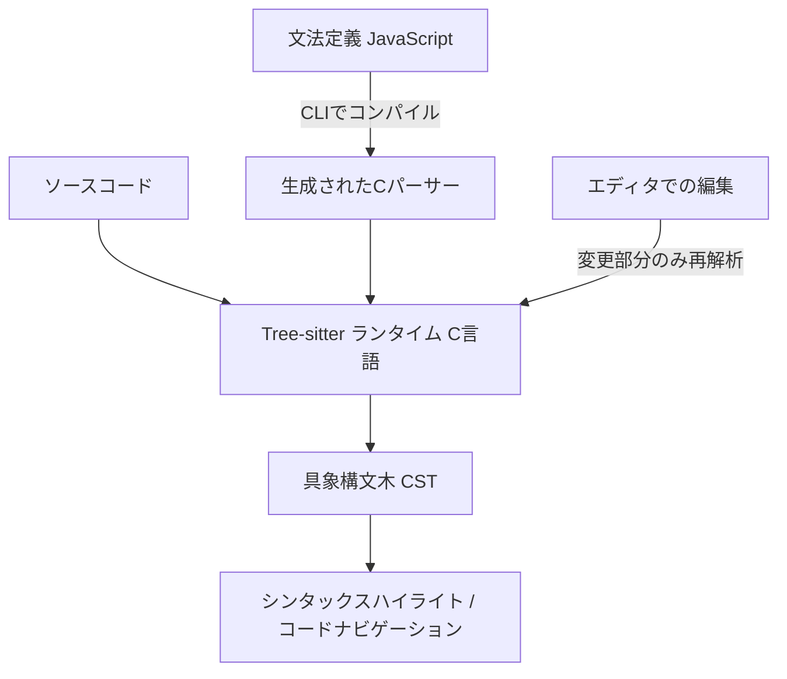

# **Tree-sitter 調査レポート**

## **1. 基本情報**

* **ツール名**: Tree-sitter
* **ツールの読み方**: ツリーシッター
* **開発元**: Tree-sitter Contributors
* **公式サイト**: [https://tree-sitter.github.io/tree-sitter/](https://tree-sitter.github.io/tree-sitter/)
* **関連リンク**:
  * GitHub: [https://github.com/tree-sitter/tree-sitter](https://github.com/tree-sitter/tree-sitter)
* **カテゴリ**: IDE/エディタ
* **概要**: Tree-sitterは、プログラミングツールのためのパーサージェネレーターツールおよびインクリメンタル構文解析ライブラリである。ソースファイルの具象構文木（CST）を構築し、ファイルが編集されるたびに高速に構文木を更新することができる。

## **2. 目的と主な利用シーン**

* **解決する課題**: テキストエディタやIDEにおけるリアルタイムな構文ハイライト、コードナビゲーション、静的解析のための高速な構文解析。
* **想定利用者**: エディタ開発者、静的解析ツール開発者、プログラミング言語のツールの開発者
* **利用シーン**:
  * テキストエディタでのキーストロークごとの高速な構文ハイライト
  * コードフォーマッターやリンターにおけるASTの構築
  * コードナビゲーション（シンボルの定義へのジャンプなど）のための解析

## **3. 主要機能**

* **インクリメンタル構文解析**: ファイルの編集箇所のみを再解析し、キーストロークごとに構文木を高速に更新する。
* **汎用性**: C、Rust、Python、JavaScriptなど、あらゆるプログラミング言語をパース可能。
* **堅牢なエラーリカバリ**: 構文エラーが存在する場合でも、可能な限り有用な構文木を構築し続ける。
* **依存関係のないCライブラリ**: ランタイムライブラリは純粋なC言語で書かれており、任意のアプリケーションに容易に組み込むことができる。
* **S式ベースのクエリ言語**: パースされた構文木から特定のパターンを検索するための強力なクエリ言語をサポート。

## **4. 動作原理・システム構成**

* **アーキテクチャ**: ローカル動作のCライブラリ
* **主要コンポーネントとデータフロー**:
  * パーサージェネレータ（CLI）が、文法定義（JavaScript）からC言語のパーサーコードを生成する。
  * ランタイムライブラリがソースコードを読み込み、具象構文木（CST）を生成する。ファイル編集時は、変更差分のみを計算してCSTを更新する。
* **構成図**:



* **特筆すべき要素技術**:
  * **GLR構文解析 (Generalized LR parsing)**: 曖昧な文法を扱うことができる拡張されたLR構文解析アルゴリズムを使用。
  * **純粋なCライブラリ**: 依存関係がないため、Wasmへのコンパイルや他言語からのFFIによる呼び出しが容易。

## **5. 開始手順・セットアップ**

* **前提条件**:
  * Node.js（文法を生成する場合）
  * Cコンパイラ
* **インストール/導入**:

  ```bash
  # CLIツールのインストール
  npm install -g tree-sitter-cli
  ```

* **初期設定**:
  * `tree-sitter init` コマンドで新しいパーサープロジェクトを初期化する。
* **クイックスタート**:
  * `grammar.js` に文法を定義し、`tree-sitter generate` でCコードを生成、`tree-sitter test` でテストを実行する。

## **6. 特徴・強み (Pros)**

* **圧倒的なパフォーマンス**: キーストロークごとに解析を行ってもエディタの動作を妨げない速度。
* **広範な言語サポート**: すでに多くのプログラミング言語向けのパーサーがコミュニティによって開発・維持されている。
* **多様なバインディング**: Rust, Python, Go, JavaScript, Wasmなど、多数の言語バインディングが存在する。

## **7. 弱み・注意点 (Cons)**

* **文法の作成コスト**: 新しい言語のパーサーをゼロから作成する場合、構文解析の知識とGLRの特性を理解する必要がある。
* **コンパイル依存**: パーサー自体がCのコードとして生成されるため、利用する環境に応じてコンパイル環境（ネイティブまたはWasm）が必要。

## **8. 料金プラン**

| プラン名 | 料金 | 主な特徴 |
|---------|------|---------|
| **オープンソース** | 無料 | MITライセンスで提供され、すべての機能を無料で利用可能。 |

* **課金体系**: 完全無料
* **無料トライアル**: なし

## **9. 導入実績・事例**

* **導入企業**: GitHub, Neovim, Zed, Emacsなど。
* **導入事例**:
  * GitHubでは、コードのシンタックスハイライトやコードナビゲーションにTree-sitterを利用している。
  * NeovimやHelix, Zedといったモダンなテキストエディタで、標準の構文解析エンジンとして組み込まれている。
* **対象業界**: ソフトウェア開発、ツール開発

## **10. サポート体制**

* **ドキュメント**: [公式ドキュメント](https://tree-sitter.github.io/tree-sitter/)
* **コミュニティ**: GitHubリポジトリのDiscussionsやIssue
* **公式サポート**: オープンソースコミュニティによるサポート

## **11. エコシステムと連携**

### **11.1 API・外部サービス連携**

* **API**: C APIをベースに、RustやPythonなどの各言語向けAPIが提供されている。
* **外部サービス連携**: 各種テキストエディタ（Neovim, Emacs, VSCode拡張など）との連携。

### **11.2 技術スタックとの相性**

| 技術スタック | 相性 | メリット・推奨理由 | 懸念点・注意点 |
|:---|:---:|:---|:---|
| **C / C++** | ◎ | ランタイムがCで書かれているためネイティブに組み込み可能。 | 特になし |
| **Rust** | ◎ | 公式のRustバインディングがあり、エコシステムと親和性が高い。 | 特になし |
| **WebAssembly** | ◯ | CからWasmにコンパイルしてブラウザ内で利用可能。 | ビルドパイプラインの設定が必要。 |

## **12. セキュリティとコンプライアンス**

* **認証**: 該当なし（ローカルライブラリのため）
* **データ管理**: アプリケーション内で完結し、外部にデータを送信しない。
* **準拠規格**: 公式サイトで公開されていない。

## **13. 操作性 (UI/UX) と学習コスト**

* **UI/UX**: CLIツールとして提供される。エディタに組み込まれた場合はユーザーに見えないバックエンドとして動作する。
* **学習コスト**: 既存の言語パーサーを利用するだけなら容易だが、独自の文法を定義する場合はASTやパーサージェネレータの知識が必要となり学習コストは高い。

## **14. ベストプラクティス**

* **効果的な活用法 (Modern Practices)**:
  * Tree-sitterのクエリ言語を活用して、リファクタリングやコードフォーマットのルールを定義する。
* **陥りやすい罠 (Antipatterns)**:
  * 複雑すぎる文法ルールを定義してしまい、生成されるCコードが肥大化したりパフォーマンスが低下したりすること。

## **15. ユーザーの声（レビュー分析）**

* **調査対象**: GitHub (26,800+ stars)
* **総合評価**: 非常に高く、デファクトスタンダードの地位を確立しつつある。
* **ポジティブな評価**:
  * エディタのシンタックスハイライトが劇的に改善した。
  * 依存関係がなく、どの言語からも簡単に呼び出せるのが素晴らしい。
* **ネガティブな評価 / 改善要望**:
  * 文法の作成デバッグが難しい場合がある。
* **特徴的なユースケース**:
  * 静的解析ツールやリンターでのASTの取得。

## **16. 直近半年のアップデート情報**

* **2026-09-08**: nightly (開発版アップデート)
* **2026-08-30**: v0.27.0 - v0.27の開発に向けた対応やCLIのドキュメント更新などを実施。
* **2026-08-23**: v0.26.13 - クエリ内で `MISSING` ノードを正しく識別する修正など、クエリ関連のバグ修正を実施。
* **2026-08-08**: v0.26.12 - 大文字・小文字を区別しないパターンの自己展開や、クエリのゼロマッチ量指定子の境界に関する修正を実施。
* **2026-07-12**: v0.26.11 - wasmtimeのZigマニフェストのWindowsハッシュの修正や、CLI・生成機能のバグ修正を実施。

(出典: [製品アップデート情報](https://github.com/tree-sitter/tree-sitter/releases))

## **17. 類似ツールとの比較**

### **17.1 機能比較表 (星取表)**

| 機能カテゴリ | 機能項目 | Tree-sitter | ESLint | Biome |
|:---:|:---|:---:|:---:|:---:|
| **基本機能** | インクリメンタル構文解析 | ◎ | - | ◯ |
| **汎用性** | 対応言語数 | ◎<br><small>コミュニティにより多数</small> | ◎<br><small>多数のJS系パーサに対応</small> | △<br><small>JS/TS周りに特化</small> |
| **パフォーマンス** | キーストロークごとの解析 | ◎<br><small>エディタ向けに最適化</small> | △<br><small>JS実装のためオーバーヘッドあり</small> | ◎<br><small>高速なRust実装</small> |
| **非機能要件** | 依存関係 | ◎<br><small>純粋なC言語</small> | ◯<br><small>Node.js環境</small> | ◯<br><small>Rust製バイナリ</small> |

### **17.2 詳細比較**

| ツール名 | 特徴 | 強み | 弱み | 選択肢となるケース |
|---------|------|------|------|------------------|
| **Tree-sitter** | インクリメンタルパーサー | 高速、多言語バインディング | 独自文法作成の学習コスト | エディタ連携や高速なAST解析が必要な場合 |
| **ESLint** | JS/TSのデファクトリンター | プラグインエコシステムが非常に豊富 | パフォーマンス面で課題あり | 既存のJS/TS資産を活用したい場合 |
| **Biome** | Webフロントエンド向けツール | 高速なフォーマッタ・リンタ | 汎用パーサーではない | JS/TSプロジェクトの品質管理を行う場合 |

## **18. 総評**

* **総合的な評価**:
  * Tree-sitterは、現代のテキストエディタやIDEにおいて、正確かつ高速な構文解析を実現するためのデファクトスタンダードとなっている強力なツールである。
* **推奨されるチームやプロジェクト**:
  * コードエディタ、フォーマッタ、リンターなどのプログラミングツールを開発するチーム。
* **選択時のポイント**:
  * 実行速度やインクリメンタルな解析が重要視されるユースケースにおいて、他のツールを凌駕する性能を発揮する。
