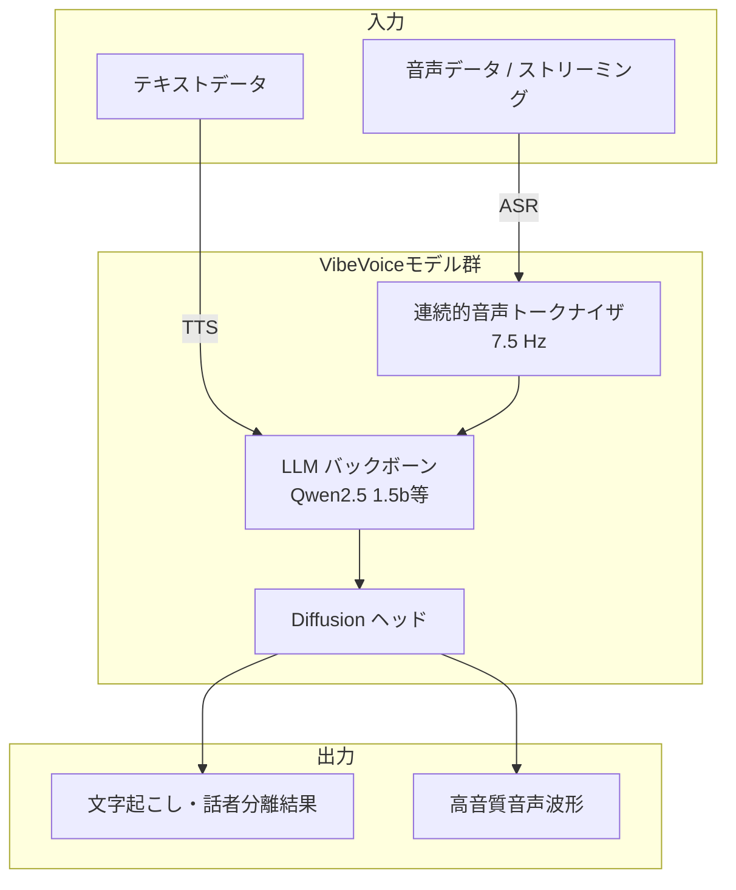

# **VibeVoice 調査レポート**

## **1. 基本情報**

* **ツール名**: VibeVoice
* **ツールの読み方**: バイブボイス
* **開発元**: Microsoft
* **公式サイト**: [https://microsoft.github.io/VibeVoice/](https://microsoft.github.io/VibeVoice/)
* **関連リンク**:
  * GitHub: [https://github.com/microsoft/VibeVoice](https://github.com/microsoft/VibeVoice)
* **カテゴリ**: AI開発ライブラリ
* **概要**: VibeVoiceは、Microsoftがオープンソースで提供する最先端の音声AIモデルファミリである。自動音声認識（ASR）および音声合成（TTS）のモデルが含まれ、長時間のコンテキスト維持やリアルタイム処理に特化している。

## **2. 目的と主な利用シーン**

* **解決する課題**: 従来の音声モデルが抱えていた、音声を短く分割することによる文脈の喪失や、長時間の音声処理における計算効率の課題を解決する。
* **想定利用者**: 音声AIを活用する開発者、AI研究者、次世代の音声対話システムを構築するエンジニア。
* **利用シーン**:
  * ポッドキャストや会議など、長時間の音声データの文字起こしや話者分離（Diarization）
  * 複数人が参加する長時間の対話音声の自動生成
  * ストリーミング入力に対応したリアルタイムの音声対話アプリケーション開発

## **3. 主要機能**

* **VibeVoice-ASR**: 最長60分の長尺音声を一度に処理し、「誰が(Who)・いつ(When)・何を(What)話したか」を含む構造化された文字起こしを生成。
* **カスタムホットワード対応**: ASR処理において、専門用語や特定の名称をプロンプトとして与えることで、特定ドメインでの認識精度を向上させる機能。
* **VibeVoice-TTS**: 最大4人の話者が参加する、最長90分の自然な長尺対話音声を一度に合成。
* **多言語対応**: ASRモデルは50以上の言語にネイティブ対応し、TTSモデルも英語、中国語をはじめとする多言語（日本語を含む実験的話者もサポート）に対応。
* **VibeVoice-Streaming**: ストリーミングテキスト入力に対応し、約300ミリ秒の初期遅延（first audible latency）で音声を生成するリアルタイム軽量TTS（0.5Bパラメータ）。

## **4. 動作原理・システム構成**

* **アーキテクチャ**: ローカルファーストで動作する高度な音声AIモデル群。Hugging FaceのTransformersライブラリやvLLMエコシステムと連携するクライアント・サーバー構成での展開も可能。
* **主要コンポーネントとデータフロー**:
  * **入力**: 音声データ（ASR用）またはテキストデータ（TTS用）。ストリーミング対応モデルでは逐次データを受信。
  * **処理**: LLM（Large Language Model）を利用したnext-token diffusionフレームワークにより処理。超低フレームレート（7.5 Hz）の連続的な音声トークナイザ（Acoustic/Semantic）を使用。
  * **出力**: 構造化された文字起こしテキスト（ASR）または音声波形データ（TTS）。
* **特筆すべき要素技術**:
  * **超低フレームレートトークナイザ**: 音声の忠実度を保ちながら長尺シーケンスの計算効率を大幅に向上。
  * **next-token diffusionフレームワーク**: LLMを利用してコンテキストとダイアログフローを把握し、Diffusionヘッドが高忠実度の音響詳細を生成。
  * **Heterogeneous Quantization**: VibeVoice-ASR-BitNetにおいて、I8_S + I2_Sの量子化を用いてモデルを1.58 GBまで圧縮しCPUでのリアルタイム推論を実現。



## **5. 開始手順・セットアップ**

* **前提条件**:
  * Python環境およびPyTorchのインストール
  * Hugging Faceからのモデルダウンロード環境
* **インストール/導入**:
  リポジトリをクローンし、依存関係をインストールする。

  ```bash
  git clone https://github.com/microsoft/VibeVoice
  cd VibeVoice
  pip install -e .
  ```

* **初期設定**:
  Transformersライブラリを通じてモデルをロードし、スクリプトを実行する。
* **クイックスタート**:
  提供されているJupyter Notebook（Colab）やGradioプレイグラウンドを利用して、すぐに推論を試すことが可能。

## **6. 特徴・強み (Pros)**

* **超低フレームレート（7.5 Hz）トークナイザ**: 連続的な音声トークナイザを利用し、音声の忠実度を保ちながら長尺シーケンスの計算効率を大幅に向上させている。
* **高度なコンテキスト理解**: LLM（Large Language Model）を利用したnext-token diffusionフレームワークにより、長時間の対話フローや文脈を一貫して維持できる。
* **OSSとしての透明性とエコシステム連携**: 全モデルの重みがHugging Faceで公開されており、ファインチューニングのコードやvLLMによる高速推論がサポートされている。

## **7. 弱み・注意点 (Cons)**

* **商用利用への制限（推奨）**: 開発元は、モデルを実環境や商用アプリケーションに展開する前にさらなるテストを推奨しており、基本的には研究開発用途（R&D）を想定している。
* **モデルのハルシネーションリスク**: ベースモデル（Qwen2.5 1.5bなど）に依存するため、出力に予期しないバイアスや不正確さが含まれる可能性がある。
* **悪用のリスク**: 高品質な音声合成能力を持つため、ディープフェイクやなりすましなどの悪用リスクに対する配慮と適切な使用が必要。

## **8. 料金プラン**

| プラン名 | 料金 | 主な特徴 |
|---------|------|---------|
| **オープンソース** | 無料 | GitHubおよびHugging Faceにて無償で提供（MITライセンス） |

* **課金体系**: 無料のオープンソースソフトウェア。インフラや推論実行環境（クラウドなど）のコストは利用者負担。
* **無料トライアル**: オープンソースのため制限なし。

## **9. 導入実績・事例**

* **導入企業**: 一般公開の商用導入事例は現時点で明記されていない。
* **導入事例**: 主に研究機関や開発者コミュニティにおいて、音声AI研究のベースラインモデルや実験として利用されている。
* **対象業界**: AI研究、ソフトウェア開発、メディア・ポッドキャスト制作支援。

## **10. サポート体制**

* **ドキュメント**: GitHubリポジトリ内にモデルごとの詳細なMarkdownドキュメントとテクニカルレポート（PDF）が提供されている。
* **コミュニティ**: GitHub IssuesおよびDiscussions、Hugging Faceのモデルページでのコミュニティ対話が活発。
* **公式サポート**: オープンソースプロジェクトのため、Microsoftからのエンタープライズレベルの個別サポートは提供されていない。

## **11. エコシステムと連携**

### **10.1 API・外部サービス連携**

* **API**: 開発者自身がPythonスクリプトやHugging FaceのAPIを通じてローカルまたはクラウド上で推論APIを構築可能。
* **外部サービス連携**: Hugging FaceのTransformersライブラリ、Gradio（デモ用）、vLLM（推論最適化）などと標準で連携可能。

### **10.2 技術スタックとの相性**

| 技術スタック | 相性 | メリット・推奨理由 | 懸念点・注意点 |
|:---|:---:|:---|:---|
| **Python / PyTorch** | ◎ | ネイティブな環境であり、公式コードもPyTorchベース | 特になし |
| **Hugging Face Transformers** | ◎ | VibeVoice-ASRが公式統合されており、導入が容易 | 特になし |
| **vLLM** | ◯ | VibeVoice-ASRの推論高速化をサポート | VibeVoice全体の完全なサポート状況は要確認 |

## **12. セキュリティとコンプライアンス**

* **認証**: オープンソースのモデル自体には認証機能は含まれない（デプロイメント環境に依存）。
* **データ管理**: 推論はローカルまたは自己管理のクラウド環境で行うため、データはユーザー自身で管理可能。
* **準拠規格**: 特定のコンプライアンス認証は提供されないが、責任あるAI（Responsible AI）のガイドラインに従って開発・公開が行われている（不適切利用への懸念から一部コードが非公開化された経緯もある）。

## **13. 操作性 (UI/UX) と学習コスト**

* **UI/UX**: モデルそのものはCLIおよびコードベースでの操作となるが、Gradioを用いたPlaygroundが提供されており、ブラウザからの直感的なテストが可能。
* **学習コスト**: PyTorchやHugging Faceの知識がある開発者であれば容易に導入できるが、高度なファインチューニングや本番環境へのデプロイには機械学習の専門知識が求められる。

## **14. ベストプラクティス**

* **効果的な活用法 (Modern Practices)**:
  * vLLMを活用してASR推論の速度とスループットを最適化する。
  * 専門分野の文字起こしを行う際、事前に独自のホットワードリスト（Customized Hotwords）を設定して精度を高める。
* **陥りやすい罠 (Antipatterns)**:
  * 生成されたコンテンツ（音声合成や文字起こし）の正確性を無条件に信じて商用利用すること。事実確認やAI生成であることの明示が必要。
  * ライセンスおよび倫理ガイドラインに反する用途（ディープフェイク等）での使用。

## **15. ユーザーの声（レビュー分析）**

* **調査対象**: GitHub (Star History, Issues), X(Twitter)
* **総合評価**: GitHubで40,000以上のStarを獲得しており、オープンソースコミュニティから極めて高い注目を集めている。
* **ポジティブな評価**:
  * 60分以上の長時間の音声データをチャンク分割せずに一括で処理できる革新性。
  * ASRと話者分離（Diarization）を同時に高精度で行える利便性。
  * ストリーミング音声合成のレイテンシの低さと品質の高さ。
* **ネガティブな評価 / 改善要望**:
  * VibeVoice-TTSのコードが責任あるAIの観点から非公開になったことへの一部コミュニティからの落胆の声。
  * メモリ使用量が大きく、ローカル環境での実行には一定のGPUリソースが必要な点。
* **特徴的なユースケース**:
  * 議事録の完全自動化（話者の特定からタイムスタンプ、内容の文字起こしまでを単一モデルで処理）。

## **16. 直近半年のアップデート情報**

* **2026-09-03**: VibeVoice-ASR-Streamingがリリース。カスタマイズ可能なホットワードと10言語のサポートを備え、音声の到着に合わせて「誰が何を言ったか」を継続的に書き起こすストリーミング対応のASRモデル。
* **2026-07-23**: VibeVoice-ASR-BitNetがリリース。VibeVoice-ASR用のエッジCPU推論エンジンであり、モデルを1.58 GBに圧縮し、GPU不要でCPU上でリアルタイム推論（RTF < 1）が可能。
* **2026-03-12**: VibeVoice-ASRがAzure AI Foundry Labsに統合。
* **2026-03-06**: VibeVoice-ASRがHugging Face Transformersライブラリに統合され、より簡単な導入が可能に。
* **2026-01-21**: VibeVoice-ASRが公開。60分の長尺音声対応、多言語対応、ファインチューニング用コードおよびvLLMサポートが追加。
* **2025-12-16**: VibeVoice-Realtime-0.5Bに実験的な多言語（日本語含む9言語）および11種類の英語スタイル音声が追加。
* **2025-12-03**: VibeVoice-Realtime-0.5B（ストリーミング対応リアルタイムTTS）がオープンソース化。

(出典: [GitHubリポジトリ (microsoft/VibeVoice)](https://github.com/microsoft/VibeVoice))

## **17. 類似ツールとの比較**

### **17.1 機能比較表 (星取表)**

| 機能カテゴリ | 機能項目 | 本ツール (VibeVoice) | ElevenLabs | Aqua Voice | Irodori-TTS |
|:---:|:---|:---:|:---:|:---:|:---:|
| **基本機能** | 長尺音声の処理・合成 | ◎<br><small>ASRで最大60分、TTSで最大90分に対応</small> | ◯<br><small>高品質だが極端な長尺は分割が必要</small> | ◯<br><small>画面文脈を考慮した入力に特化</small> | △<br><small>短文合成が中心</small> |
| **基本機能** | ストリーミング処理 | ◎<br><small>ASR/TTSともに低遅延ストリーミング対応</small> | ◎<br><small>APIで低遅延サポート</small> | ◯<br><small>音声入力のリアルタイム反映</small> | ×<br><small>非対応</small> |
| **基本機能** | ASR（音声認識） | ◎<br><small>話者分離やホットワードを含む高精度</small> | ×<br><small>TTS・音声生成特化</small> | ◎<br><small>技術用語に強い高精度認識</small> | ×<br><small>TTS特化</small> |
| **カテゴリ特定**| ボイスクローン | △<br><small>限定的・要追加学習</small> | ◎<br><small>少量の音声で高精度</small> | ×<br><small>非対応</small> | ◯<br><small>ゼロショット対応</small> |
| **開発・連携** | オープンソース | ◎<br><small>MITライセンス等、ローカル実行可能</small> | ×<br><small>SaaS型</small> | ×<br><small>SaaS型</small> | ◎<br><small>オープンソース、ローカル実行可能</small> |

### **17.2 詳細比較**

| ツール名 | 特徴 | 強み | 弱み | 選択肢となるケース |
|---------|------|------|------|------------------|
| **本ツール** | Microsoftによる最先端のOSS音声AI | ASR/TTS両方を提供し長尺処理・ストリーミングに極めて強い | エンドユーザー向けのUIはなく、環境構築の知識が必要 | 最新のAIモデルを組み込んで自社プロダクトや研究開発を行いたい場合。 |
| **ElevenLabs** | 総合AIメディア生成PF | 商用レベルの圧倒的な音声品質、感情表現、音楽生成 | 従量課金コストの管理が必要 | 最高品質の音声が必要な場合や、アプリへの組み込みを行う場合。 |
| **Aqua Voice** | 技術用語に強い音声入力エディタ連携ツール | 「Avalon」モデルによるAI・開発用語の圧倒的な認識精度と画面コンテキストの理解 | ASR特化であり汎用的な音声合成(TTS)は非対応 | CursorなどのAIコードエディタを利用しており、プロンプト入力速度を上げたい場合。 |
| **Irodori-TTS** | キャラクター音声合成（日本語特化） | 絵文字・キャプションによる感情制御とOSSでのローカル実行 | 漢字の読みに課題 | プライバシーを重視し、ローカルで完全に自律する日本語の音声エージェントを開発したい場合。 |

## **18. 総評**

* **総合的な評価**:
  VibeVoiceは、音声AI領域における技術的なブレイクスルーをオープンソースとして提供する非常に強力なモデルファミリである。特に、音声認識（ASR）と音声合成（TTS）のいずれにおいても「数十分単位の長尺データ」を一貫して処理できる点は、従来のチャンク分割アプローチに対する大きな優位性と言える。
* **推奨されるチームやプロジェクト**:
  音声AIの研究開発を行うR&Dチーム、自社環境に高度な議事録作成システムや対話エージェントを構築したい開発者・エンジニアリングチーム。
* **選択時のポイント**:
  すぐに本番環境で安定稼働するSaaSソリューション（ElevenLabs等）を求める場合は他ツールが適しているが、自社でのカスタマイズ性、OSSの利点、および長尺データの文脈を完全に保持した分析や合成を重視する場合は、VibeVoiceが極めて有力な基盤となる。
