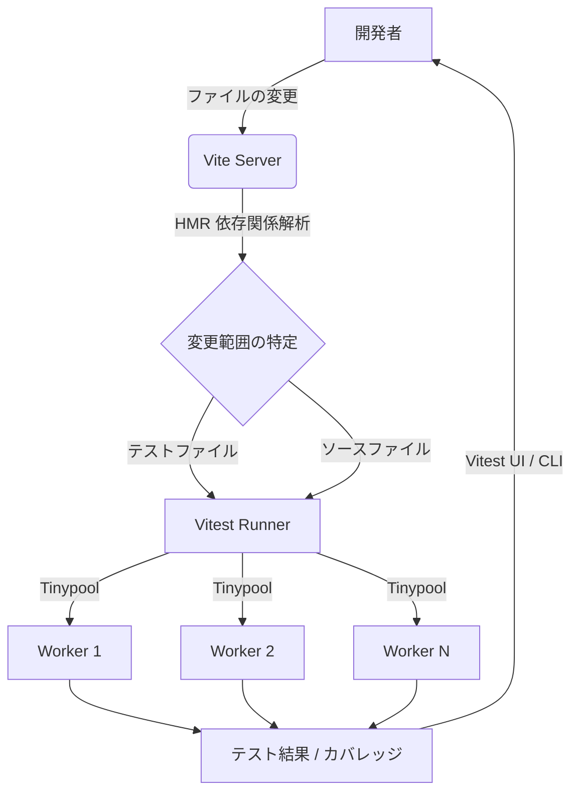

# **Vitest 調査レポート**

## **1. 基本情報**

* **ツール名**: Vitest
* **ツールの読み方**: ヴィーテスト / ヴァイテスト
* **開発元**: VoidZero Inc. / Vitest Contributors
* **公式サイト**: [https://vitest.dev/](https://vitest.dev/)
* **関連リンク**:
  * GitHub: [https://github.com/vitest-dev/vitest](https://github.com/vitest-dev/vitest)
  * CodeWiki: [https://codewiki.google/github.com/vitest-dev/vitest](https://codewiki.google/github.com/vitest-dev/vitest)
  * DeepWiki: [https://deepwiki.com/vitest-dev/vitest](https://deepwiki.com/vitest-dev/vitest)
  * ドキュメント: [https://vitest.dev/guide/](https://vitest.dev/guide/)
* **カテゴリ**: テスト/QA
* **概要**: Viteをベースとした次世代のJavaScript/TypeScriptテスティングフレームワーク。高速なHMR（Hot Module Replacement）とViteの設定共有を特徴とし、開発者に即座にフィードバックを提供する。

## **2. 目的と主な利用シーン**

* **解決する課題**:
  * 従来のテストランナー（Jest等）の起動・実行速度の遅さ
  * ビルド設定（Vite）とテスト設定の重複管理の手間
  * TypeScriptやESMの複雑な設定
* **想定利用者**:
  * React, Vue, Svelteなどを使用するフロントエンド開発者
  * Viteを使用しているプロジェクトチーム
  * 高速なTDD（テスト駆動開発）サイクルを求めるエンジニア
* **利用シーン**:
  * Webアプリケーションの単体テスト（Unit Test）
  * コンポーネントテスト（Browser Mode利用）
  * バックエンドロジックのテスト（Node.js環境）

## **3. 主要機能**

* **Viteネイティブ**: `vite.config.ts` の設定（プラグイン、エイリアス等）をそのままテストでも利用可能。
* **Jest互換API**: `describe`, `it`, `expect` など、Jestと同じAPIを提供し、学習コストを低減。
* **スマートWatchモード**: 依存関係を解析し、変更に関連するテストのみを高速に再実行。
* **In-source Testing**: ソースコードファイル内に直接テストブロックを記述可能（Rustのテスト機能に着想）。
* **Browser Mode**: ヘッドレスブラウザではなく、実際のブラウザ環境でコンポーネントテストを実行可能。
* **Vitest UI**: ブラウザベースのGUIでテスト結果、ログ、コンソールの出力を視覚的に確認・デバッグ。
* **スナップショットテスト**: Jest互換のスナップショット機能をサポート。
* **ネイティブコードカバレッジ**: v8またはistanbulを使用した高速なカバレッジ計測。
* **Typecheck**: テスト実行と同時にTypeScriptの型チェックを行う機能。
* **Workspaceサポート**: モノレポ構成での複数プロジェクトの一括テスト実行。

## **4. 動作原理・システム構成**

* **アーキテクチャ**: Viteのモジュール解決およびHMR（Hot Module Replacement）機構の上に構築された、ローカル完結型のテストフレームワーク。
* **主要コンポーネントとデータフロー**:
  * **Vite Server**: 開発時と同様に、ソースコードや設定ファイル（`vite.config.ts`）を読み込み、モジュールをオンデマンドでトランスパイル・提供する。
  * **Vitest Runner**: Viteサーバーから提供された変換済みのコードを受け取り、Node.jsのWorker Threadsやブラウザ環境上でテストファイルを実行する。
  * **HMR監視**: ファイルの変更を検知すると、Viteの依存関係グラフ（Module Graph）を使用して影響範囲を即座に計算し、関係するテストのみを高速に再実行する。
* **特筆すべき要素技術**:
  * **Worker Threads/Tinypool**: テストの並行実行を最適化し、マルチスレッドでの高速処理を実現。
  * **Tinyspy / @vitest/expect**: Jest互換の軽量なモックおよびアサーションライブラリを内蔵。



## **5. 開始手順・セットアップ**

* **前提条件**:
  * Node.js (v18以降推奨)
  * パッケージマネージャ (npm, yarn, pnpm, bun)
* **インストール/導入**:

  ```bash
  # npmの場合
  npm install -D vitest
  ```

* **初期設定**:
  `package.json` にスクリプトを追加するだけで動作します。

  ```json
  {
    "scripts": {
      "test": "vitest"
    }
  }
  ```

* **クイックスタート**:
  テストファイル（例: `sum.test.ts`）を作成し、実行します。

  ```ts
  import { expect, test } from 'vitest'
  test('1 + 1', () => {
    expect(1 + 1).toBe(2)
  })
  ```

  ```bash
  npm test
  ```

## **6. 特徴・強み (Pros)**

* **圧倒的な速度**: ViteのHMR技術を応用し、変更検知からテスト再実行までが非常に高速。
* **設定の簡素化**: Viteプロジェクトであれば追加設定ほぼゼロで動作し、トランスパイラの二重管理が不要。
* **最新標準への対応**: ESM（ECMAScript Modules）、TypeScript、JSX/TSXをネイティブサポートしており、babel設定などが不要。
* **オールインワン**: アサーション、モック、カバレッジ、スナップショットなどが標準で組み込まれている。

## **7. 弱み・注意点 (Cons)**

* **Jest独自の機能**: Jestの一部の高度な機能や特定のプラグインエコシステムとは完全な互換性がない場合がある。
* **大規模プロジェクトのメモリ**: 非常に大規模なプロジェクトでは、すべてのテストを一度に実行する際にメモリ消費量が増加する傾向がある。
* **日本語ドキュメント**: 公式ドキュメントの日本語翻訳は進行中だが、最新情報は英語が主となる。

## **8. 料金プラン**

Vitestは完全なオープンソースソフトウェア（MITライセンス）であり、無料で使用できます。

| プラン名 | 料金 | 主な特徴 |
|---------|------|---------|
| **OSS** | 無料 | 全機能を利用可能。商用利用も可。 |

* **課金体系**: なし
* **無料トライアル**: なし（常に無料）

## **9. 導入実績・事例**

* **導入企業**: 海外・国内の多くのテック企業（具体的な企業名は公式サイトのSponsorsやUsersを参照だが、Nuxt, Vueなど主要OSSでの採用が目立つ）。
* **導入事例**:
  * **Vue.js / Nuxt**: 公式の推奨テスティングフレームワークとして採用。
  * **Viteエコシステム**: Viteを使用する多くのライブラリやフレームワークで標準採用。
* **対象業界**: Web開発全般、特にモダンなフロントエンド開発を行う企業。

## **10. サポート体制**

* **ドキュメント**: 公式ドキュメント（[vitest.dev](https://vitest.dev/)）が非常に充実しており、ガイド、APIリファレンス、設定例が網羅されている。
* **コミュニティ**: GitHub DiscussionsやDiscordサーバーが活発で、開発者同士の助け合いやコアチームとの交流が行われている。
* **公式サポート**: 商用サポート窓口はないが、OSSコミュニティベースでのサポートが手厚い。GitHub Issuesでのバグ報告への対応も迅速。

## **11. エコシステムと連携**

### **11.1 API・外部サービス連携**

* **API**: プログラムからVitestを実行・制御するためのNode.js APIを提供。
* **外部サービス連携**:
  * **GitHub Actions**: CI連携が容易。
  * **VS Code**: 公式拡張機能により、エディタ内でのテスト実行、デバッグ、ガターへの結果表示が可能。
  * **IntelliJ IDEA**: 公式プラグインでサポート。

### **11.2 技術スタックとの相性**

| 技術スタック | 相性 | メリット・推奨理由 | 懸念点・注意点 |
|:---|:---:|:---|:---|
| **Vite** | ◎ | 設定共有が可能でベストマッチ | 特になし |
| **React** | ◎ | 高速なHMRとコンポーネントテストが可能 | Create React App (Webpack) からの移行は設定変更が必要 |
| **Vue** | ◎ | 公式が推奨しており、親和性が非常に高い | 特になし |
| **Svelte** | ◎ | SvelteKitで標準的に採用されている | 特になし |
| **Webpack** | △ | VitestはVite前提のため、Webpack設定は流用不可 | ビルドとテストで設定が二重になる可能性 |

## **12. セキュリティとコンプライアンス**

* **認証**: ローカル開発ツールのため、ユーザー認証機能はなし。
* **データ管理**: テストコードと結果はローカルまたはCI環境内で完結し、外部サーバーへのデータ送信は（設定しない限り）行わない。
* **準拠規格**: 特に該当なし（開発ツールのため）。MITライセンスに基づくOSSコンプライアンスに準拠。

## **13. 操作性 (UI/UX) と学習コスト**

* **UI/UX**: CLIの出力は見やすくカラーリングされている。**Vitest UI** を使用すると、ブラウザ上でテスト結果をグラフやリストで視覚的に確認でき、DX（開発者体験）が非常に高い。
* **学習コスト**: JestのAPIと高い互換性があるため、Jest経験者であれば学習コストはほぼゼロ。新規学習者でもドキュメントが親切で習得しやすい。

## **14. ベストプラクティス**

* **効果的な活用法 (Modern Practices)**:
  * `vite.config.ts` に `test` プロパティを追加して設定を一元管理する。
  * **In-source Testing** を活用し、実装ファイルの末尾に簡単な単体テストを記述して、テストファイル作成の手間を省く（小規模なロジック向け）。
  * CI環境では `--run` フラグを使用してWatchモードを無効化し、確実に終了させる。
* **陥りやすい罠 (Antipatterns)**:
  * Jest用のグローバル設定や変換プラグインを無理にVitestで使おうとする（Vitest標準の機能やViteプラグインで代替すべき）。
  * ブラウザAPIに強く依存するコードを `environment: node` でテストしようとして失敗する（`jsdom` や `happy-dom`、あるいはBrowser Modeを使用する）。

## **15. ユーザーの声（レビュー分析）**

* **調査対象**: GitHub, X(Twitter), 技術ブログ (G2等のBtoBレビューサイトには登録が少ないOSSツールのため)
* **総合評価**: 開発者コミュニティから極めて高い評価を得ている。GitHubスター数は非常に多く、満足度が高い。
* **ポジティブな評価**:
  * 「Jestから移行したらテスト実行時間が半分以下になった」
  * 「設定ファイルが `vite.config.ts` 一つで済むのが最高」
  * 「Watchモードの反応が爆速で開発リズムが崩れない」
* **ネガティブな評価 / 改善要望**:
  * 「まだ実験的な機能（Browser Modeなど）の仕様変更がたまにある」
  * 「Jestの一部のマイナーな機能が使えず、ワークアラウンドが必要だった」
* **特徴的なユースケース**:
  * 新規のReact/Vueプロジェクトではデフォルトで採用されるケースが増加。
  * モノレポ構成での大規模なマイクロフロントエンド開発での採用。

## **16. 直近半年のアップデート情報**

(出典: [GitHub Releases](https://github.com/vitest-dev/vitest/releases))

* **2026-09-30 (v5.0.3)**: 最新のパッチリリース。
* **2026-09-03 (v5.0.0)**: v5系の正式メジャーリリース。`loupe.inspect` から pretty-format への置き換えをはじめ、Node.js 22 および Vite 6.4 への要求アップデート、`expect` パッケージのインライン化など、多数の破壊的変更・パフォーマンス改善を実施。
* **2026-04-23 (v5.0.0-beta.1)**: `loupe.inspect` から pretty-format への置き換えや、Browser Mode の iframe スケール調整などの破壊的変更を含むメジャーアップデートのベータ版。
* **2026-04-21 (v4.1.5)**: Istanbul カバレッジでの `instrumenter` オプションの実験的サポート、HTMLレポーターのプロジェクトカラーラベル修正などのバグ修正。
* **2026-04-09 (v4.1.4)**: `toMatchInlineSnapshot` のフォーマット修正や Browser Mode における WebSocket 再接続時のエラー修正などのバグ修正。
* **2026-02-02 (v4.1.0-beta.3)**: `aroundEach`, `aroundAll` フックの実装。実験的機能の安定化。

## **17. 類似ツールとの比較**

### **17.1 機能比較表 (星取表)**

| 機能カテゴリ | 機能項目 | Vitest | Playwright | Cypress |
|:---:|:---|:---:|:---:|:---:|
| **テスト対象** | 主要なテスト層 | ◎<br><small>ユニット・コンポーネントテスト</small> | ◯<br><small>E2Eテスト</small> | ◯<br><small>E2E・コンポーネントテスト</small> |
| **パフォーマンス** | 実行速度 | ◎<br><small>Viteベースで非常に高速</small> | ◯<br><small>複数ブラウザの並列実行に強い</small> | △<br><small>ブラウザ起動オーバーヘッドあり</small> |
| **DX** | Watchモード・デバッグ | ◎<br><small>高速なHMRとVitest UI</small> | ◎<br><small>Playwright Inspector等強力なツール</small> | ◎<br><small>インタラクティブなGUIランナー</small> |
| **設定** | 設定の容易さ | ◎<br><small>Viteと設定を完全共有</small> | ◯<br><small>標準的</small> | ◯<br><small>標準的</small> |
| **機能** | 実際のブラウザでのテスト | ◯<br><small>Browser Modeで対応（安定化）</small> | ◎<br><small>全主要ブラウザ対応の高度なE2E</small> | ◎<br><small>実際のブラウザ環境でテスト</small> |

### **17.2 詳細比較**

| ツール名 | 特徴 | 強み | 弱み | 選択肢となるケース |
|---------|------|------|------|------------------|
| **Vitest** | Viteネイティブの高速ユニットテストランナー | 圧倒的な速度、Viteとの設定共有、Jest互換API | Webpack環境などVite以外ではメリットが薄れる | Viteを使用しているプロジェクトでのユニットテスト、高速なTDDサイクルが求められる場合 |
| **Playwright** | クロスブラウザ対応の次世代E2Eテストフレームワーク | WebKit等の全主要ブラウザに対応、強力な自動待機機能とデバッグツール | E2E中心のためユニットテストとしての利用は限定的 | 複雑なWebアプリにおける複数ブラウザでの本格的なE2Eテストが必要な場合 |
| **Cypress** | 開発者体験に優れるE2Eおよびコンポーネントテスト自動化ツール | インタラクティブなGUIによる直感的なデバッグ、AI機能でのテスト作成支援 | テストの並列実行は有料SaaSプランに依存しがち | 開発者がフロントエンドのE2Eテストを手軽に書きながらインタラクティブにデバッグしたい場合 |

## **18. 総評**

* **総合的な評価**:
  Vitestは、Viteエコシステムの拡大とともに、フロントエンド開発における**事実上の標準（デファクトスタンダード）**になりつつあります。その速度と設定の容易さは、開発者の生産性を大きく向上させます。特にv4系での安定性向上により、エンタープライズ採用への障壁も低くなっています。
* **推奨されるチームやプロジェクト**:
  * Vite, Nuxt, Next.jsなどを利用しているモダンなWeb開発チーム。
  * テストの実行待ち時間を短縮し、開発サイクルを高速化したいプロジェクト。
* **選択時のポイント**:
  * ビルドツールにViteを使用しているか？（YesならVitest一択）
  * Jestの特定の複雑な機能に強く依存していないか？（移行コストの確認）
