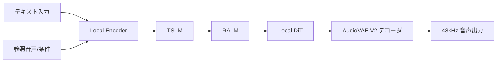

# **VoxCPM 調査レポート**

## **1. 基本情報**

* **ツール名**: VoxCPM
* **ツールの読み方**: ボックスシーピーエム
* **開発元**: OpenBMB
* **公式サイト**: [https://github.com/OpenBMB/VoxCPM](https://github.com/OpenBMB/VoxCPM)
* **関連リンク**:
  * GitHub: [https://github.com/OpenBMB/VoxCPM](https://github.com/OpenBMB/VoxCPM)
  * ドキュメント: [https://voxcpm.readthedocs.io/en/latest/](https://voxcpm.readthedocs.io/en/latest/)
* **カテゴリ**: 生成AI / 機械学習
* **概要**: VoxCPMは、多言語音声生成、クリエイティブな音声デザイン、高品質な音声クローニングを実現するトークナイザーフリーのTTS（Text-to-Speech）システムです。エンドツーエンドの拡散自己回帰アーキテクチャにより、連続的な音声表現を直接生成します。

## **2. 目的と主な利用シーン**

* **解決する課題**: 離散的なトークン化による音声の不自然さを解消し、高品質で表現力豊かな多言語音声合成を実現します。
* **想定利用者**: 開発者、AIリサーチャー、コンテンツクリエイター
* **利用シーン**:
  * 多言語に対応した音声コンテンツの自動生成
  * 自然言語による説明（プロンプト）からのオリジナル音声（キャラクターボイスなど）の作成
  * 短い参照音声を用いた特定の人物の音声クローニング

## **3. 主要機能**

* **多言語対応 (30言語)**: 30の言語に対応し、言語タグなしで入力テキストから直接音声を合成します。日本語（方言含む）にも対応しています。
* **Voice Design**: 自然言語の説明（性別、年齢、トーン、感情、ペースなど）を入力するだけで、参照音声なしで新しい声を作成します。
* **Controllable Voice Cloning**: 短い参照音声から声をクローニングし、感情やペース、表現をコントロールしながら合成します。
* **Ultimate Cloning**: 参照音声とそのトランスクリプトを提供することで、声質、リズム、感情などの細かいニュアンスまで忠実に再現します。
* **48kHz 高音質出力**: 16kHzの参照音声を基に、48kHzのスタジオ品質の音声を直接出力します。外部のアップサンプラーは不要です。
* **Context-Aware Synthesis**: テキスト内容から自動的に適切なプロソディ（韻律）や表現力を推論します。
* **リアルタイムストリーミング**: Nano-VLLMを利用することで、NVIDIA RTX 4090でRTFを約0.13まで最適化し、ストリーミング生成が可能です。

## **4. 動作原理・システム構成**

* **アーキテクチャ**: トークナイザーフリーの拡散自己回帰TTS（Text-to-Speech）システム。AudioVAE V2の潜在空間で直接動作する4ステージパイプライン。
* **主要コンポーネントとデータフロー**:
  * **LocEnc (Local Encoder)**: テキスト表現と条件をエンコード
  * **TSLM (Text-to-Semantic Language Model)**: 韻律や意味的な情報をモデル化
  * **RALM (Residual Acoustic Language Model)**: 音声の残差情報を生成
  * **LocDiT (Local Diffusion Transformer)**: 最終的な音声表現を精緻化
* **特筆すべき要素技術**:
  * **AudioVAE V2**: 非対称エンコード/デコード設計により、16kHzの参照音声から直接48kHzのスタジオ品質音声を出力（外部アップサンプラー不要）



## **5. 開始手順・セットアップ**

* **前提条件**:
  * Python ≥ 3.10 (<3.13)
  * PyTorch ≥ 2.5.0
  * CUDA ≥ 12.0
* **インストール/導入**:

  ```bash
  pip install voxcpm
  ```

* **クイックスタート**:

  ```python
  from voxcpm import VoxCPM
  import soundfile as sf

  model = VoxCPM.from_pretrained(
      "openbmb/VoxCPM2",
      load_denoiser=False,
  )

  wav = model.generate(
      text="VoxCPM2 is the current recommended release for realistic multilingual speech synthesis.",
      cfg_value=2.0,
      inference_timesteps=10,
  )
  sf.write("demo.wav", wav, model.tts_model.sample_rate)
  print("saved: demo.wav")
  ```

## **6. 特徴・強み (Pros)**

* 30もの言語をシームレスに処理し、翻訳や複数モデルの使い分けが不要。
* 音声データを用意できなくても、自然言語のプロンプトだけで新しい音声をデザイン可能。
* Apache-2.0ライセンスで完全にオープンソース化されており、商用利用も無料で可能。
* 少ない音声データ（5〜10分）でのファインチューニング（LoRA含む）をサポート。

## **7. 弱み・注意点 (Cons)**

* 非常にリアルな音声クローニングが可能なため、なりすましや詐欺などの悪用リスクがあり、利用には倫理的な配慮が必要。
* Voice DesignやControllable Voice Cloningの生成結果が実行ごとにばらつくことがあり、望む結果を得るために数回の再生成が必要な場合がある。
* 推奨環境としてCUDA対応のGPUが必要であり、環境構築のハードルがある。

## **8. 料金プラン**

| プラン名 | 料金 | 主な特徴 |
|---------|------|---------|
| **オープンソース (Apache-2.0)** | 無料 | 全機能が利用可能。商用利用も許可されている。自社環境でのホスティングが必要。 |

* **課金体系**: なし (OSS)
* **無料トライアル**: オープンソースのため常時無料

## **9. 導入実績・事例**

* **導入企業**: 公開事例なし。
* **導入事例**: 最新の研究や個人・企業の開発プロジェクトで利用されています。
* **対象業界**: AI技術、エンターテイメント、ソフトウェア開発

## **10. サポート体制**

* **ドキュメント**: 詳細な公式ドキュメント、Quick Start、Usage Guideが提供されています。
* **コミュニティ**: GitHubのIssue、Discord、Feishuグループなどでのコミュニティサポートが活発です。
* **公式サポート**: オープンソースプロジェクトのため、企業向けの専用公式サポートの記載はありません。

## **11. エコシステムと連携**

### **11.1 API・外部サービス連携**

* **API**: Python APIおよびCLIを通じた連携が可能です。また、Nano-vLLMと組み合わせることでFastAPIベースのHTTPサーバーとして利用可能です。
* **外部サービス連携**: ComfyUIのノード拡張（ComfyUI-VoxCPM）などがコミュニティによって開発されています。

### **11.2 技術スタックとの相性**

| 技術スタック | 相性 | メリット・推奨理由 | 懸念点・注意点 |
|:---|:---:|:---|:---|
| **Python** | ◎ | 公式のPythonライブラリが提供されている | 特になし |
| **Nano-vLLM** | ◎ | 高スループットな推論サーバーとして公式に連携手順がある | 設定が必要 |
| **Rust** | ◯ | コミュニティによる再実装(voxcpm_rs)がある | 公式サポートではない |

## **12. セキュリティとコンプライアンス**

* **認証**: オープンソースソフトウェアのため、ツール自体に認証機能は組み込まれていません。デプロイメント環境で実装する必要があります。
* **データ管理**: セルフホスト型のため、データはユーザー自身の環境に保存されます。
* **準拠規格**: 該当なし。

## **13. 操作性 (UI/UX) と学習コスト**

* **UI/UX**: コマンドラインやPythonコードでの操作が基本ですが、ローカルで起動できるWeb UIデモも提供されています。
* **学習コスト**: PyTorchや機械学習モデルの扱いに慣れているエンジニアであれば、公式の豊富なドキュメントやサンプルを利用して容易に導入できます。

## **14. ベストプラクティス**

* **効果的な活用法 (Modern Practices)**:
  * 大規模な本番環境へのデプロイには、Nano-vLLMを使用した高スループットサーバーの構築が推奨されます。
  * 特定のドメインや話者に適応させる場合、パラメータ効率の良いLoRAファインチューニングの利用が推奨されます。
* **陥りやすい罠 (Antipatterns)**:
  * 生成結果の安定性を考慮せず、一度の生成で本番利用すること。必要に応じて複数回生成し、最適なものを選択することが推奨されます。

## **15. ユーザーの声（レビュー分析）**

* **調査対象**: GitHub (Trending, Stars)
* **総合評価**: GitHubで約7.9k Starsを獲得し、Hugging FaceやGitHubのTrending 1位を獲得するなど、開発者コミュニティから非常に高い評価を受けています。
* **ポジティブな評価**:
  * 「Voice Designの機能が革新的で使いやすい」
  * 「多言語の対応範囲が広く、出力される音声の品質（48kHz）が素晴らしい」
* **ネガティブな評価 / 改善要望**:
  * 「生成結果にばらつきがあるため、より一貫した出力ができるようにしてほしい」
* **特徴的なユースケース**:
  * オープンソースの利点を活かし、ComfyUIなどのワークフローツールへの組み込みが行われています。

## **16. 直近半年のアップデート情報**

* **2026-04-08**: VoxCPM2をリリース。パラメータ数が2Bとなり、30言語に対応、Voice Designや48kHz出力機能が追加されました。
* **2025-12**: VoxCPM1.5をリリース。SFTとLoRAファインチューニングをサポートしました。
* **2025-09**: VoxCPM-0.5Bモデルとテクニカルレポートを公開しました。

(出典: [Releases · OpenBMB/VoxCPM](https://github.com/OpenBMB/VoxCPM/releases))

## **17. 類似ツールとの比較**

### **17.1 機能比較表 (星取表)**

| 機能カテゴリ | 機能項目 | 本ツール | VibeVoice | Irodori-TTS | ElevenLabs |
|:---:|:---|:---:|:---:|:---:|:---:|
| **基本機能** | Text-to-Speech | ◎<br><small>30言語、タグ不要</small> | ◎<br><small>長尺・多言語対応</small> | ◯<br><small>日本語特化</small> | ◎<br><small>業界最高水準</small> |
| **高度な機能** | Voice Design | ◎<br><small>プロンプトから作成</small> | △<br><small>スタイル指定</small> | ◎<br><small>絵文字・キャプション</small> | ◯<br><small>プロンプトによる指示</small> |
| **高度な機能** | 音声クローニング | ◎<br><small>コントロール可能</small> | ◯<br><small>話者再現可能</small> | ◯<br><small>ゼロショット対応</small> | ◎<br><small>少量の音声で高精度</small> |
| **非機能要件** | オープンソース | ◎<br><small>Apache-2.0</small> | ◎<br><small>MITライセンス</small> | ◎<br><small>MITライセンス</small> | ×<br><small>SaaS</small> |
| **高度な機能** | 48kHz対応 | ◎<br><small>直接出力</small> | - | ◎<br><small>DACVAE</small> | ◯<br><small>Proプラン等で対応</small> |

### **17.2 詳細比較**

| ツール名 | 特徴 | 強み | 弱み | 選択肢となるケース |
|---------|------|------|------|------------------|
| **本ツール (VoxCPM2)** | トークナイザーフリーの拡散自己回帰TTS | プロンプトによるVoice Designと30言語対応、48kHz出力 | 安定性に課題がある場合がある | 多言語で高品質な音声を独自にデザインしたい場合、ローカル環境で高音質出力を求める場合 |
| **VibeVoice** | Microsoftによる最先端のOSS音声AI | 最大90分の長尺音声の処理とASR/TTS両方を提供 | ローカル環境で一定のGPUリソースが必要 | 最新のAIモデルを組み込んで長尺データの文脈を保持した対話エージェント等を開発したい場合 |
| **Irodori-TTS** | 絵文字・キャプションによる感情制御とローカル実行可能なOSS | 絵文字やキャプション(VoiceDesign)によるユニークで細やかな制御、日本語特化 | 現状は日本語入力のみの対応、漢字の読みに課題 | プライバシーを重視し、ローカルで自律する日本語の感情表現豊かな対話型AIエージェントを開発したい場合 |
| **ElevenLabs** | 総合AIメディア生成PF | 商用レベルの圧倒的な音声品質と多機能性、APIの充実 | OSSではないため従量課金コストが発生する | すぐに最高品質の音声を動画やアプリに組み込みたい場合 |

## **18. 総評**

* **総合的な評価**:
  VoxCPMは、最新のVoxCPM2で2Bパラメータに拡張され、30の言語への対応、プロンプトベースの音声デザイン、高品質な48kHz出力など、オープンソースのTTSシステムとしてトップクラスの実力を誇ります。
* **推奨されるチームやプロジェクト**:
  独自の音声キャラクターを生成したいエンターテイメント系のプロジェクトや、多言語での音声コンテンツを大量に生成する必要があるチームに推奨されます。
* **選択時のポイント**:
  他のモデル（Fish Audio S2など）と比較して、Voice Design機能の使いやすさや、リソースと性能のバランス（NVIDIA RTX 4090で実用的なRTFを達成可能）が選択の鍵となります。
